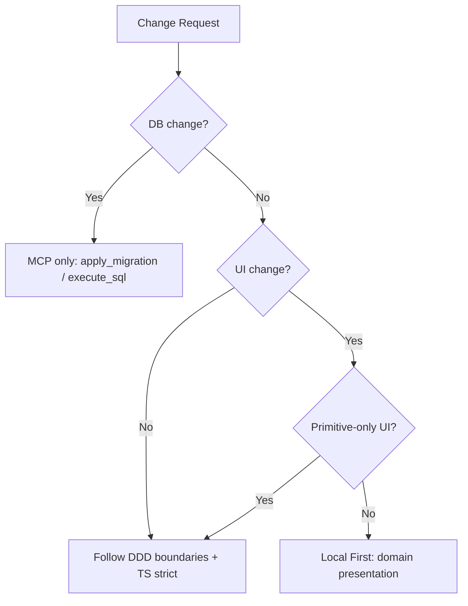
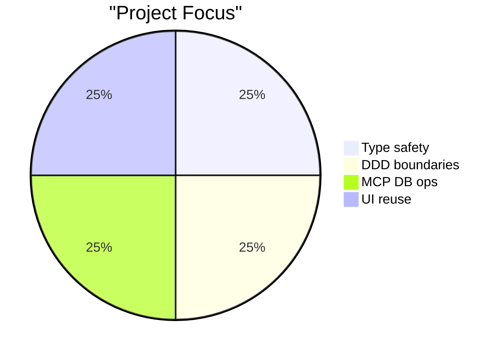
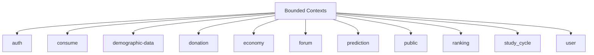
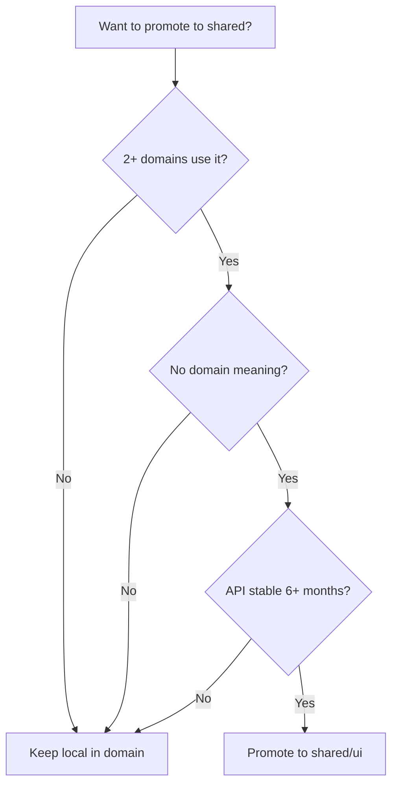
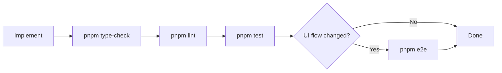
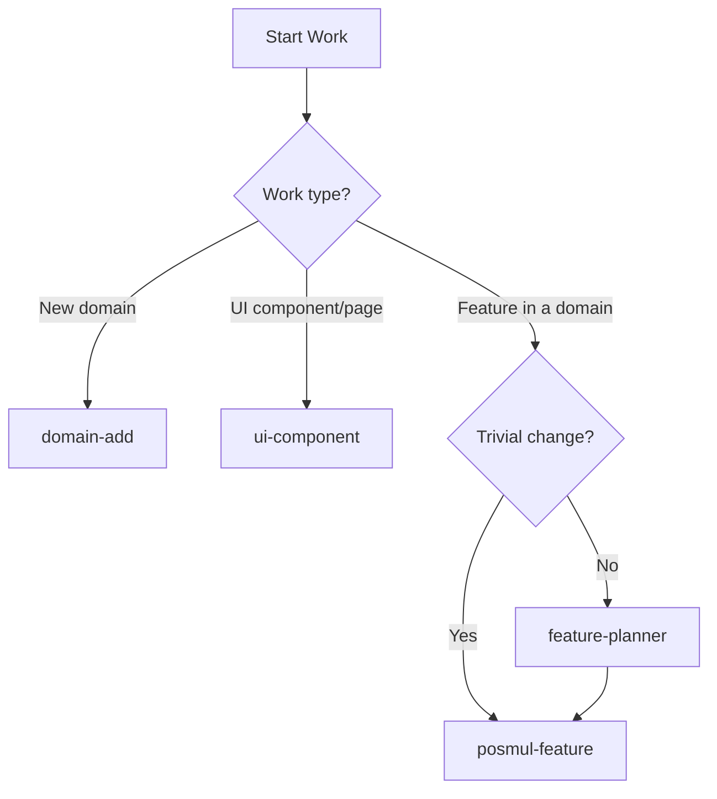
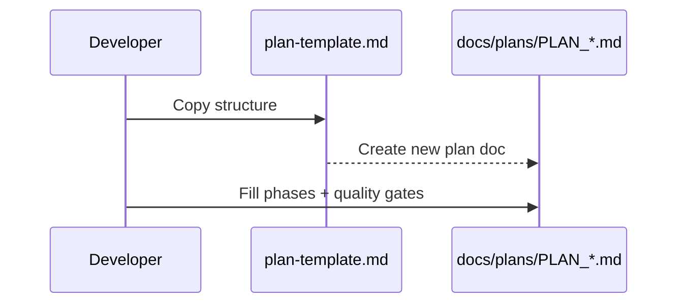

# PosMul 프로젝트 규칙

> AI 및 개발자가 프로젝트를 올바르게 이해하고 일관된 방식으로 개발하기 위한 핵심 규칙

---

## ⚠️ 절대 원칙 (위반 시 코드 거부)

1. **Schema-per-Bounded-Context**: 각 도메인은 독립 DB 스키마 (economy.*, prediction.*, user.* 등)
2. **Supabase CLI 절대 금지(DDL/DML)**: 데이터베이스 **변경**은 MCP 도구만 사용 (예: `mcp_supabase_execute_sql`, `mcp_supabase_apply_migration`)
3. **TypeScript Strict Mode**: any 사용 금지, 모든 타입 명시 필수
4. **한글 우선**: 모든 응답, 주석, 문서는 한국어
5. **UI 개발 원칙(Local First)**: `shared/ui`는 **프리미티브(버튼/인풋/모달 shell/레이아웃 shell)** 중심으로 유지하고, **도메인 조합 UI(카드/섹션/페이지 구성요소)**는 각 `bounded-contexts/{domain}/presentation`에 둔다. (공유 승격은 안정성/변경주기 기준 충족 시에만)



## 🚫 금지사항

- ❌ Supabase CLI 사용 (supabase db push, migrate 등)
- ❌ TypeScript any 타입
- ❌ 도메인 간 직접 의존 (반드시 이벤트 또는 Application Layer 경유)
- ❌ Infrastructure 코드를 Domain에 import
- ❌ public 스키마와 domain 스키마 혼용


## 📊 프로젝트 현황 (2025-12-25)

- **Monorepo**: pnpm 10.12.4 + Turborepo 2.0.4
- **주요 앱**: posmul-web (Next.js 15.3.4 + React 19)
- **타입 시스템**: TypeScript strict 활성 (root tsconfig 기준)
- **빌드/테스트 지표**: 정량 수치는 로컬/CI에서 최신 측정 후 갱신 권장



---

## 1. 아키텍처 원칙

### 1.1 DDD (Domain-Driven Design)

**핵심 원칙**
- Schema-per-Bounded-Context: 각 도메인은 독립 DB 스키마
- Ubiquitous Language: 도메인 전문가와 개발자 간 동일 용어
- Bounded Context 격리: 각 컨텍스트 독립 진화

**Bounded Contexts (코드 기준 11개)**

> 기준: `apps/posmul-web/src/bounded-contexts/` 디렉토리

```
auth
consume
demographic-data
donation
economy
forum
prediction
public
ranking
study_cycle
user
```



**도메인 계층**
```
Domain → Application → Infrastructure → Presentation
```

**핵심 패턴**
- Aggregate Root, Value Object, Domain Events, Repository Pattern

### 1.2 Clean Architecture

**의존성 규칙**
```
Infrastructure → Application → Domain
Presentation  → Application → Domain
```

**계층별 책임**
- Domain: 비즈니스 로직, 외부 의존성 제로
- Application: Use Cases, DTO 변환
- Infrastructure: 외부 시스템 연동 (Supabase, MCP)
- Presentation: UI, API Routes

**Port & Adapter**
- Port: Domain 인터페이스
- Adapter: Infrastructure 구현

---

## 2. 프로젝트 구조

### Monorepo
```
posmul/
├── apps/posmul-web/
│   ├── src/
│   │   ├── app/                    # Next.js App Router
│   │   ├── bounded-contexts/       # DDD Contexts
│   │   ├── shared/                 # 공유 코드
│   │   └── lib/                    # 라이브러리 설정
│   └── tests/                      # E2E
├── packages/auth-economy-sdk/       # 통합 SDK
└── docs/                           # 문서
```

### Bounded Context 구조
```
prediction/
├── domain/         # entities, value-objects, repositories(interface)
├── application/    # use-cases, dto
├── infrastructure/ # repositories(impl), adapters
└── presentation/   # components, hooks
```

---

## 3. 기술 스택

**Frontend**: Next.js 15.3.4, React 19.0.0, TypeScript 5.4.5 (Strict), Tailwind CSS 3.4.16, Zustand 5.0.6, Zod 3.25.67

**Backend**: Supabase (PostgreSQL 17.4.1), MCP

**개발 도구**: pnpm 10.12.4, Turborepo 2.0.4, Jest 29.7.0, Playwright 1.44.0

---

## 4. Database 스키마

### DDD 스키마
```sql
-- 각 Context는 독립 스키마
economy.*        (12개 테이블)
prediction.*     (5개 테이블)
investment.*     (4개 테이블)
forum.*          (7개 테이블)
donation.*       (4개 테이블)
user.*           (5개 테이블)
public.*         (공용 테이블)
```

### 핵심 테이블
```sql
-- user_profiles
id, username, pmp_balance, pmc_balance

-- user_economic_balances
pmp_available, pmp_locked, pmc_available, pmc_locked

-- 모든 테이블 RLS 활성화 필수
```

---

## 5. 코딩 규칙

### 5.1 TypeScript

**Strict Mode 필수**
```json
{ "strict": true, "noImplicitAny": true }
```

**타입 정의**
```typescript
// ✅ Good
function calc(a: number): number { return a * 2; }

// ❌ Bad
function calc(a: any): any { return a * 2; }
```

**Branded Types**
```typescript
type UserId = string & { readonly brand: unique symbol };
```

**Result Pattern**
```typescript
type Result<T, E = Error> = 
  | { success: true; data: T }
  | { success: false; error: E };
```

### 5.2 DDD

**Entity (불변)**
```typescript
class Prediction {
  private constructor(
    private readonly _id: PredictionId,
    private _status: PredictionStatus
  ) {}

  get id() { return this._id; }
  
  settle(won: boolean): Prediction {
    return new Prediction(this._id, won ? 'WON' : 'LOST');
  }

  static create(id: PredictionId): Prediction {
    return new Prediction(id, 'PENDING');
  }
}
```

**Value Object**
```typescript
class PMP {
  private constructor(private readonly value: number) {
    if (value < 0) throw new Error('Invalid');
  }
  static create(v: number) { return new PMP(v); }
  getValue() { return this.value; }
  add(other: PMP) { return new PMP(this.value + other.value); }
}
```

**Repository**
```typescript
// Port (Domain)
interface IPredictionRepository {
  save(p: Prediction): Promise<Result<void>>;
  findById(id: PredictionId): Promise<Result<Prediction | null>>;
}

// Adapter (Infrastructure)
class MCPPredictionRepository implements IPredictionRepository {
  async save(p: Prediction): Promise<Result<void>> {
    // MCP 구현
  }
}
```

### 5.3 네이밍

```
PascalCase: 컴포넌트, 클래스, 타입 (UserProfile.tsx)
camelCase: 함수, 변수 (formatCurrency.ts)
kebab-case: 폴더 (use-cases/)
UPPER_SNAKE_CASE: 상수 (MAX_PMP_AMOUNT)
```

### 5.4 Import 순서

```typescript
// 1. React/Next
import { useState } from 'react';
// 2. 외부 라이브러리
import { z } from 'zod';
// 3. 내부 모듈 (@)
import { Button } from '@/shared/components';
// 4. 상대 경로
import { Card } from './Card';
```

### 5.5 컴포넌트 구조

```typescript
import { useState } from 'react';
import type { FC } from 'react';

interface Props {
  title: string;
}

export const Card: FC<Props> = ({ title }) => {
  const [state, setState] = useState();
  
  const handleClick = () => {};
  
  return <div onClick={handleClick}>{title}</div>;
};
```

---

## 5.6 UI 승격 체크리스트 (Domain → Shared)

> 원칙: **Local First(전략 B)**. 도메인 조합 UI는 기본적으로 도메인에 둔다.
> 아래 체크리스트를 통과한 경우에만 `shared/ui`로 “승격(promote)”한다.



**필수(모두 Yes)**
- [ ] 2개 이상의 도메인에서 실제 사용 중이다(예정/추측 제외)
- [ ] 도메인 의미(정책/예측/기부 등)가 props/텍스트/구조에 섞여 있지 않다
- [ ] 변경 주기(cadence)가 도메인에 종속되지 않는다
- [ ] API(props)가 충분히 안정적이다(최소 6주~수개월 변경이 없었거나, 변경이 아주 드물다)
- [ ] 접근성/상태처리/에러처리 등 공통 품질 요건을 만족한다

**권장(가능하면 Yes)**
- [ ] 도메인별 커스터마이징은 `variant`/`className` 정도로 해결 가능하다
- [ ] 승격 시 중복 제거 효과가 확실하다(코드 2곳 이상 제거)
- [ ] 승격 후에도 도메인 팀이 변경을 부담 없이 수용할 수 있다

---

## 6. 개발 워크플로우

**초기 설정**
```powershell
pnpm install
pnpm generate-types
pnpm build
```

**개발**
```powershell
pnpm dev                          # 전체(turbo dev)
pnpm dev:web                      # 웹만(Next dev :3000)
```

**빌드 & 테스트**
```powershell
pnpm build
pnpm test
pnpm type-check
```

**코드 품질**
```powershell
pnpm format
pnpm lint
pnpm -F @posmul/posmul-web lint:fix
```



---

## 7. MCP 활용

**Supabase MCP**
- SQL 실행(DML): `mcp_supabase_execute_sql`
- 마이그레이션(DDL): `mcp_supabase_apply_migration`
- 타입 생성: `mcp_supabase_generate_typescript_types`
- 보안/성능 검사: `mcp_supabase_get_advisors`

> 참고: 에이전트/런타임 환경에 따라 MCP 함수 prefix가 다를 수 있으나(예: 도구 레지스트리), **프로젝트 코드에서 사용하는 명칭은 `mcp_supabase_*`를 표준**으로 합니다.

**원칙**
- Supabase CLI 사용 금지, MCP 도구만 사용
- 스키마 변경 시 자동 타입 업데이트
- 매 변경 후 보안 advisor 실행

**타입 생성**
```powershell
pnpm generate-types
```

### ⚠️ 현행 불일치(정리 필요)

- 규칙은 “Supabase CLI 절대 금지”지만, 현재 타입 생성 플로우 중 일부는 외부 자동화에서 **read-only 타입 생성**을 위해 CLI 호출을 포함할 수 있습니다.
- 원칙은 유지하되, 팀 합의로 아래처럼 운영을 명시합니다.

**운영 원칙(권장)**
- ✅ DB 스키마/데이터 변경: MCP만 허용
- ✅ 타입 생성: `pnpm generate-types`만 사용(내부 구현 변경 여부는 규칙 위반으로 보지 않도록 합의 필요)
- ❌ 개발자가 직접 Supabase CLI로 DB를 변경하는 행위는 금지

---

## 8. 경제 시스템 (PMP/PMC)

### PMP (Point Major Policy)
- **용도**: 전국 단위 정책 예측
- **획득**: 예측 참여, 포럼 기여
- **사용**: 예측 게임 배팅

**흐름**
```
획득 → pmp_available += amount
사용 → pmp_available -= amount, pmp_locked += amount
성공 → pmp_locked → pmc_available (변환)
실패 → pmp_locked → 소각
```

### PMC (Point Minor Community)
- **용도**: 지역 단위 커뮤니티 활동
- **획득**: 예측 성공, MoneyWave
- **사용**: 지역 기부, 로컬 투자

### MoneyWave (3단계)
```
Wave 1: 전체 활성 사용자 - 균등 분배
Wave 2: 활동 사용자 - 활동 점수 비례
Wave 3: 핵심 기여자 - 기여도 점수 비례
```


---

## 9. Workflows & Templates (필수 사용)

> 새 기능/도메인/컴포넌트 작업은 아래 워크플로우/템플릿을 **반드시** 사용합니다.

### 9.1 Workflows

- `c:\G\.agent\workflows\domain-add.md`: 새 Bounded Context 추가
- `c:\G\.agent\workflows\feature-planner.md`: **계획(Plan)** 수립용 (Phase/Quality Gates/승인)
- `c:\G\.agent\workflows\posmul-feature.md`: **구현(Implement)** 실행용 (DDD 레이어별 작업 순서)
- `c:\G\.agent\workflows\ui-component.md`: UI 컴포넌트 개발(공용 vs 도메인 구분)

> 정리: `feature-planner`와 `posmul-feature`는 역할이 다릅니다.
> - `feature-planner`: “무엇을 어떤 단계로 만들지”를 문서로 합의/관리
> - `posmul-feature`: “합의된 계획을 DDD 구조로 어떻게 구현할지” 실행 체크리스트



### 9.2 Templates

- `c:\G\.agent\templates\plan-template.ko.md`: Implementation Plan 생성용 템플릿(한국어 우선)
- `c:\G\.agent\templates\plan-template.md`: (레거시) 영어 템플릿. 특별한 이유가 없으면 ko 템플릿 사용

**권장 산출물 경로**
- `posmul/docs/plans/PLAN_<feature-name>.md` (없으면 생성)



---

## 10. 현재 규칙의 미흡/개선 포인트(내가 보기엔)

1. **승격 체크리스트 부재**: 도메인 컴포넌트를 shared로 “승격(promote)”할 때의 기준(안정성/변경주기/2+ 도메인 공통성)을 체크리스트로 문서화 필요.
2. **타입 생성 플로우 문서 불일치**: “MCP-only” 원칙과 실제 타입 생성 스크립트의 구현(외부 자동화/CLI 의존)이 혼재되어 있어, 팀 합의된 단일 경로로 정리 필요.
3. **상대경로 import 난립**: shared→도메인 이동 시 경로 수정 비용이 커지므로, 가능하면 alias 사용 규칙/리팩터 가이드 보강 필요.
---

## 부록

### 주요 명령어
```powershell
pnpm install              # 의존성
pnpm dev                 # 개발
pnpm build               # 빌드
pnpm test                # 테스트
pnpm type-check          # 타입체크
pnpm lint                # 린트
pnpm generate-types      # DB 타입
pnpm format              # 포맷팅
```

### 환경 변수
```bash
NEXT_PUBLIC_SUPABASE_URL=https://xxx.supabase.co
NEXT_PUBLIC_SUPABASE_ANON_KEY=eyJ...
SUPABASE_SERVICE_ROLE_KEY=eyJ...
SUPABASE_PROJECT_ID=xxx
```

---


**버전**: 1.1 | **업데이트**: 2025-12-24
