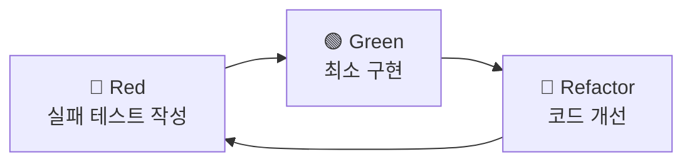

# TDD 개발 규칙 (PosMul)

> Red → Green → Refactor 사이클 기반 테스트 주도 개발

---

## 핵심 원칙

### 1. Red-Green-Refactor 사이클



### 2. 계층별 테스트 전략

| 계층 | 테스트 유형 | 커버리지 목표 |
|------|------------|--------------|
| **Domain** | 단위 테스트 | 80%+ |
| **Application** | 유스케이스 테스트 | 70%+ |
| **Infrastructure** | 통합 테스트 | 60%+ |
| **Presentation** | 컴포넌트 테스트 | 선택 |

### 3. 테스트 파일 위치

```
bounded-contexts/{domain}/
├── domain/
│   └── entities/
│       └── __tests__/     ← Domain 테스트
├── application/
│   └── use-cases/
│       └── __tests__/     ← Application 테스트
└── infrastructure/
    └── repositories/
        └── __tests__/     ← Infrastructure 테스트
```

---

## 테스트 작성 규칙

### 네이밍
```typescript
// 파일: {대상}.test.ts
// describe: 테스트 대상
// it: 한글로 기대 동작 설명
describe("PredictionGame Aggregate", () => {
  it("올바른 데이터로 예측 게임을 생성할 수 있다", () => {
    // Given - When - Then
  });
});
```

### Given-When-Then 패턴
```typescript
it("게임을 활성화할 수 있다", () => {
  // Given (준비)
  const game = createTestGame();
  
  // When (실행)
  const result = game.activate();
  
  // Then (검증)
  expect(result.success).toBe(true);
  expect(game.getStatus()).toBe("ACTIVE");
});
```

---

## 명령어

```powershell
# 전체 테스트
pnpm test

# 특정 도메인만
pnpm -F @posmul/posmul-web test -- --testPathPattern="prediction"

# Watch 모드
pnpm -F @posmul/posmul-web test -- --watch

# 커버리지
pnpm -F @posmul/posmul-web test -- --coverage
```

---

## 커밋 규칙

```
test(domain): 예측 게임 생성 테스트 추가   ← 테스트 먼저
feat(domain): 예측 게임 생성 구현          ← 구현 후
refactor(domain): 예측 게임 코드 정리      ← 리팩터링
```

---

**버전**: 1.0 | **업데이트**: 2026-01-12
