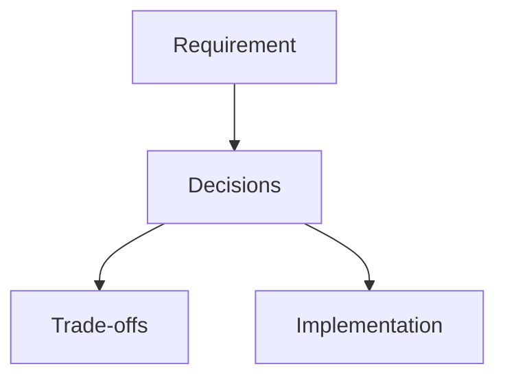
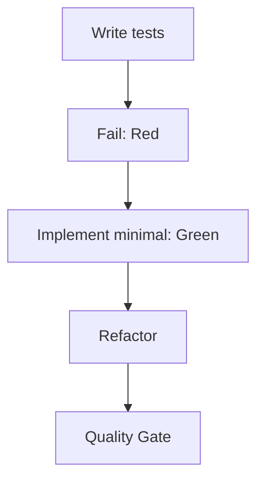
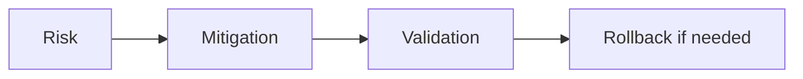

# Implementation Plan: [Feature Name]

**상태**: 🔄 진행 중
**시작일**: YYYY-MM-DD
**마지막 업데이트**: YYYY-MM-DD
**예상 완료**: YYYY-MM-DD

---

**⚠️ 중요 지침(Phase 완료마다 필수)**
1. ✅ 완료한 작업 체크박스 체크
2. 🧪 Quality Gate 커맨드 실행
3. ⚠️ 모든 게이트 통과 확인
4. 📅 "마지막 업데이트" 갱신
5. 📝 Notes에 학습/의사결정 기록
6. ➡️ 그 다음 Phase로 진행

⛔ 실패한 체크가 있으면 다음 Phase로 넘어가지 말 것

---

## 📋 개요

### 기능 설명
[왜 필요한지 / 무엇을 하는지]

### 성공 기준
- [ ] Criterion 1
- [ ] Criterion 2
- [ ] Criterion 3

### 사용자 영향
[사용자에게 어떤 변화가 생기는지]

---

## 🏗️ 아키텍처/설계 결정

| Decision | Rationale | Trade-offs |
|----------|-----------|------------|
| [Decision 1] | [이유] | [포기/리스크] |
| [Decision 2] | [이유] | [포기/리스크] |

---

## 📦 의존성

### 시작 전 필수
- [ ] Dependency 1: [설명]
- [ ] Dependency 2: [설명]

### 외부 라이브러리
- Package 1: X.Y.Z
- Package 2: X.Y.Z

---

## 🧪 테스트 전략

- 원칙: **TDD**(테스트 먼저)
- 목표: 핵심 비즈니스 로직은 Unit 테스트 중심으로 방어

---

## 🚀 구현 Phase

### Phase 1: [Foundation]
**목표**: [이 Phase에서 동작해야 하는 것]
**예상 시간**: X hours
**상태**: ⏳ 대기 | 🔄 진행 | ✅ 완료

#### Tasks
- [ ] 🔴 RED: 실패하는 테스트 작성
- [ ] 🟢 GREEN: 테스트 통과 최소 구현
- [ ] 🔵 REFACTOR: 구조 개선(테스트 유지)

#### Quality Gate ✋
- [ ] `pnpm type-check` 통과
- [ ] `pnpm lint` 통과(있다면)
- [ ] 관련 테스트 통과

---

### Phase 2: [Core]
(필요한 만큼 추가)

---

## 🧭 리스크/롤백

| Risk | Probability | Impact | Mitigation | Rollback |
|------|-------------|--------|------------|----------|
| [Risk 1] | Low/Med/High | Low/Med/High | [대응] | [되돌리기] |

---

## 📝 Notes
- YYYY-MM-DD: [결정/학습 내용]
