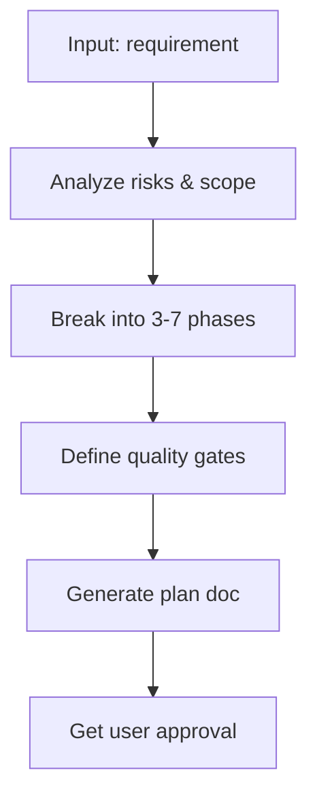
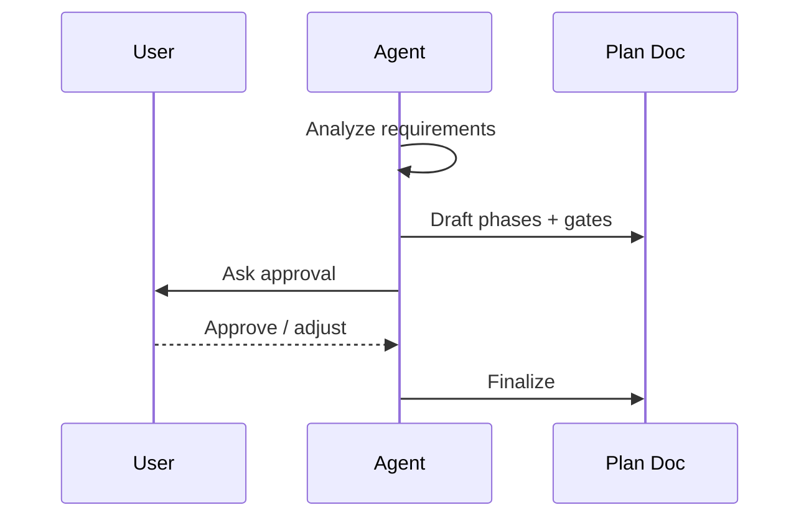

# Feature Planner (한국어 우선)



## 목적
다음 원칙을 만족하는 **단계(Phase) 기반 계획서**를 만든다.
- 각 Phase는 “돌아가는 상태(runnable)”의 결과물을 낸다
- Quality Gate로 다음 Phase 진행을 강제한다
- 구현 전 사용자 승인(Approval)을 받는다
- 체크박스로 진행 상황을 추적한다
- Phase당 1~4시간을 넘기지 않는다



## 워크플로우

### Step 1: 요구사항 분석
1. 관련 파일을 읽고 현재 구조를 파악한다
2. 의존성/연동 지점을 식별한다
3. 복잡도/리스크를 평가한다
4. 범위를 분류한다 (Small/Medium/Large)

### Step 2: Phase 분해 (TDD 통합)
기능을 3~7개의 Phase로 쪼개며, 각 Phase는 아래를 만족한다.
- **Test-First**: 구현 전에 테스트를 먼저 쓴다
- 동작하는 결과물을 낸다
- 1~4시간 내 완료 가능한 크기
- Red-Green-Refactor 사이클
- 커버리지/체크리스트 등 측정 가능 기준
- 독립 롤백 가능
- 명확한 성공 기준

**Phase Structure**:
- Phase Name: Clear deliverable
- Goal: What working functionality this produces
- **Test Strategy**: What test types, coverage target, test scenarios
- Tasks (ordered by TDD workflow):
  1. **RED Tasks**: Write failing tests first
  2. **GREEN Tasks**: Implement minimal code to make tests pass
  3. **REFACTOR Tasks**: Improve code quality while tests stay green
- Quality Gate: TDD compliance + validation criteria
- Dependencies: What must exist before starting
- **Coverage Target**: Specific percentage or checklist for this phase

### Step 3: 계획서 문서 생성
기본 템플릿으로 아래를 생성한다.
- 기본: `.agent/templates/plan-template.ko.md`
- 산출물: `posmul/docs/plans/PLAN_<feature-name>.md`

Include:
- Overview and objectives
- Architecture decisions with rationale
- Complete phase breakdown with checkboxes
- Quality gate checklists
- Risk assessment table
- Rollback strategy per phase
- Progress tracking section
- Notes & learnings area

### Step 4: 사용자 승인
**중요**: 구현 전, 계획서(Phase/게이트/리스크)가 합리적인지 사용자 확인을 받는다.

Ask:
- "Does this phase breakdown make sense for your project?"
- "Any concerns about the proposed approach?"
- "Should I proceed with creating the plan document?"

Only create plan document after user confirms approval.

### Step 5: 문서 생성
1. `posmul/docs/plans/`가 없으면 만든다
2. 체크박스는 미체크 상태로 둔다
3. 헤더에 Quality Gate 준수 지침을 넣는다
4. 문서 위치와 다음 액션을 안내한다

## Quality Gate Standards

Each phase MUST validate these items before proceeding to next phase:

**Build & Compilation**:
- [ ] Project builds/compiles without errors
- [ ] No syntax errors

**Test-Driven Development (TDD)**:
- [ ] Tests written BEFORE production code
- [ ] Red-Green-Refactor cycle followed
- [ ] Unit tests: ≥80% coverage for business logic
- [ ] Integration tests: Critical user flows validated
- [ ] Test suite runs in acceptable time (<5 minutes)

**Testing**:
- [ ] All existing tests pass
- [ ] New tests added for new functionality
- [ ] Test coverage maintained or improved

**Code Quality**:
- [ ] Linting passes with no errors
- [ ] Type checking passes (if applicable)
- [ ] Code formatting consistent

**Functionality**:
- [ ] Manual testing confirms feature works
- [ ] No regressions in existing functionality
- [ ] Edge cases tested

**Security & Performance**:
- [ ] No new security vulnerabilities
- [ ] No performance degradation
- [ ] Resource usage acceptable

**Documentation**:
- [ ] Code comments updated
- [ ] Documentation reflects changes

## Progress Tracking Protocol

Add this to plan document header:

```markdown
**CRITICAL INSTRUCTIONS**: After completing each phase:
1. ✅ Check off completed task checkboxes
2. 🧪 Run all quality gate validation commands
3. ⚠️ Verify ALL quality gate items pass
4. 📅 Update "Last Updated" date
5. 📝 Document learnings in Notes section
6. ➡️ Only then proceed to next phase

⛔ DO NOT skip quality gates or proceed with failing checks
```

## Phase Sizing Guidelines

**Small Scope** (2-3 phases, 3-6 hours total):
- Single component or simple feature
- Minimal dependencies
- Clear requirements
- Example: Add dark mode toggle, create new form component

**Medium Scope** (4-5 phases, 8-15 hours total):
- Multiple components or moderate feature
- Some integration complexity
- Database changes or API work
- Example: User authentication system, search functionality

**Large Scope** (6-7 phases, 15-25 hours total):
- Complex feature spanning multiple areas
- Significant architectural impact
- Multiple integrations
- Example: AI-powered search with embeddings, real-time collaboration

## Risk Assessment

Identify and document:
- **Technical Risks**: API changes, performance issues, data migration
- **Dependency Risks**: External library updates, third-party service availability
- **Timeline Risks**: Complexity unknowns, blocking dependencies
- **Quality Risks**: Test coverage gaps, regression potential

For each risk, specify:
- Probability: Low/Medium/High
- Impact: Low/Medium/High
- Mitigation Strategy: Specific action steps

## Rollback Strategy

For each phase, document how to revert changes if issues arise.
Consider:
- What code changes need to be undone
- Database migrations to reverse (if applicable)
- Configuration changes to restore
- Dependencies to remove

## Test Specification Guidelines

### Test-First Development Workflow

**For Each Feature Component**:
1. **Specify Test Cases** (before writing ANY code)
   - What inputs will be tested?
   - What outputs are expected?
   - What edge cases must be handled?
   - What error conditions should be tested?

2. **Write Tests** (Red Phase)
   - Write tests that WILL fail
   - Verify tests fail for the right reason
   - Run tests to confirm failure
   - Commit failing tests to track TDD compliance

3. **Implement Code** (Green Phase)
   - Write minimal code to make tests pass
   - Run tests frequently (every 2-5 minutes)
   - Stop when all tests pass
   - No additional functionality beyond tests

4. **Refactor** (Blue Phase)
   - Improve code quality while tests remain green
   - Extract duplicated logic
   - Improve naming and structure
   - Run tests after each refactoring step
   - Commit when refactoring complete

### Test Types

**Unit Tests**:
- **Target**: Individual functions, methods, classes
- **Dependencies**: None or mocked/stubbed
- **Speed**: Fast (<100ms per test)
- **Isolation**: Complete isolation from external systems
- **Coverage**: ≥80% of business logic

**Integration Tests**:
- **Target**: Interaction between components/modules
- **Dependencies**: May use real dependencies
- **Speed**: Moderate (<1s per test)
- **Isolation**: Tests component boundaries
- **Coverage**: Critical integration points

**End-to-End (E2E) Tests**:
- **Target**: Complete user workflows
- **Dependencies**: Real or near-real environment
- **Speed**: Slow (seconds to minutes)
- **Isolation**: Full system integration
- **Coverage**: Critical user journeys

### Test Coverage Calculation

**Coverage Thresholds** (adjust for your project):
- **Business Logic**: ≥90% (critical code paths)
- **Data Access Layer**: ≥80% (repositories, DAOs)
- **API/Controller Layer**: ≥70% (endpoints)
- **UI/Presentation**: Integration tests preferred over coverage

**Coverage Commands by Ecosystem**:
```bash
# JavaScript/TypeScript
jest --coverage
nyc report --reporter=html

# Python
pytest --cov=src --cov-report=html
coverage report

# Java
mvn jacoco:report
gradle jacocoTestReport

# Go
go test -cover ./...
go tool cover -html=coverage.out

# .NET
dotnet test /p:CollectCoverage=true /p:CoverageReporter=html
reportgenerator -reports:coverage.xml -targetdir:coverage

# Ruby
bundle exec rspec --coverage
open coverage/index.html

# PHP
phpunit --coverage-html coverage
```

### Common Test Patterns

**Arrange-Act-Assert (AAA) Pattern**:
```
test 'description of behavior':
  // Arrange: Set up test data and dependencies
  input = createTestData()

  // Act: Execute the behavior being tested
  result = systemUnderTest.method(input)

  // Assert: Verify expected outcome
  assert result == expectedOutput
```

**Given-When-Then (BDD Style)**:
```
test 'feature should behave in specific way':
  // Given: Initial context/state
  given userIsLoggedIn()

  // When: Action occurs
  when userClicksButton()

  // Then: Observable outcome
  then shouldSeeConfirmation()
```

**Mocking/Stubbing Dependencies**:
```
test 'component should call dependency':
  // Create mock/stub
  mockService = createMock(ExternalService)
  component = new Component(mockService)

  // Configure mock behavior
  when(mockService.method()).thenReturn(expectedData)

  // Execute and verify
  component.execute()
  verify(mockService.method()).calledOnce()
```

### Test Documentation in Plan

**In each phase, specify**:
1. **Test File Location**: Exact path where tests will be written
2. **Test Scenarios**: List of specific test cases
3. **Expected Failures**: What error should tests show initially?
4. **Coverage Target**: Percentage for this phase
5. **Dependencies to Mock**: What needs mocking/stubbing?
6. **Test Data**: What fixtures/factories are needed?

## Supporting Files Reference
- [plan-template.md](plan-template.md) - Complete plan document template