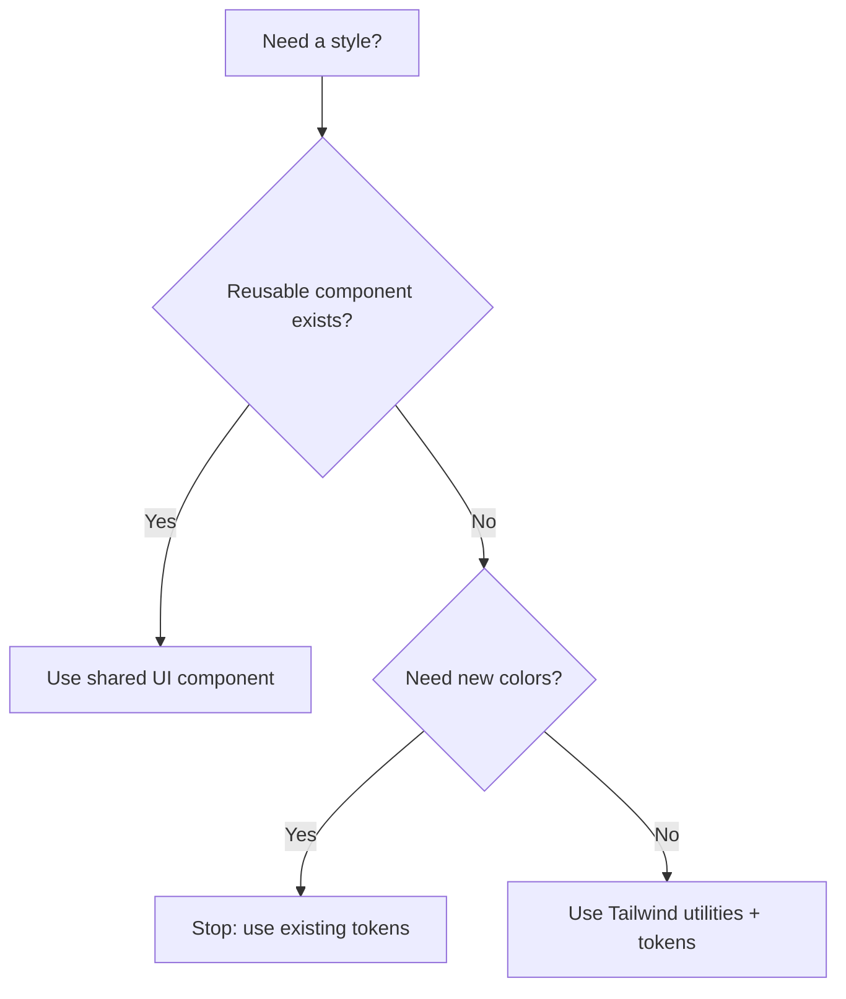

# UI Component Development

## 사용 시기
- 새로운 UI 컴포넌트 생성
- 새 페이지 추가
- 기존 UI 개선

## 워크플로우

### Step 1: 위치 결정

> 원칙: **Local First**. 공유는 ‘원자/껍데기’까지만, 조합 UI는 도메인에 둔다.

```mermaid
flowchart TD
  A[New UI] --> B{Business meaning / domain cadence?}
  B -- Yes --> C[Place in domain\nbounded-contexts/<domain>/presentation/components]
  B -- No --> D{Primitive UI?\nButton/Input/Modal shell/Layout shell}
  D -- Yes --> E[Place in shared/ui]
  D -- No --> F{Stable across 2+ domains\nfor 6+ months?}
  F -- Yes --> G[Consider promote to shared\n(with checklist)]
  F -- No --> C
```

**공용 컴포넌트** (여러 도메인에서 사용):
```
shared/ui/components/
├── feedback/      # Toast, Modal 등
├── forms/         # Input, Button 등
├── layout/        # Navbar, Footer 등
└── charts/        # 차트 프리미티브(축/라벨/컨테이너 등). 도메인 의미가 섞인 차트는 도메인에 둔다.
```

**도메인 컴포넌트** (특정 도메인 전용):
```
bounded-contexts/{domain}/presentation/components/
```

### Step 2: 컴포넌트 구조

```typescript
"use client";

import { useState } from 'react';
import type { FC } from 'react';

interface Props {
  title: string;
  // 모든 props 명시
}

export const ComponentName: FC<Props> = ({ title }) => {
  const [state, setState] = useState();
  
  const handleClick = () => {};
  
  return (
    <div className="...">
      {title}
    </div>
  );
};
```

### Step 3: 스타일링 규칙

**Tailwind CSS 사용**:
- 다크모드: `dark:` prefix
- 반응형: `sm:`, `md:`, `lg:` prefix
- 호버: `hover:` prefix

**색상/토큰 원칙(중요)**
- ❌ hex 색상 하드코딩 금지 (디자인 토큰/테마와 충돌)
- ✅ 프로젝트의 테마 토큰 및 기존 컴포넌트 클래스 우선 사용

**권장 클래스 예시(토큰 기반)**
- 배경/전경: `bg-background text-foreground`
- 강조색: `text-primary-600` / `bg-primary-600`
- 상태색: `text-success-600`, `text-warning-600`, `text-error-600`



### Step 4: 브라우저 테스트

// turbo
1. 개발 서버 확인: `http://localhost:3000`
2. 다크모드 확인
3. 반응형 확인 (모바일/데스크탑)

## 체크리스트

- [ ] Props 인터페이스 정의
- [ ] 컴포넌트 구현
- [ ] 다크모드 스타일 적용
- [ ] 반응형 디자인 적용
- [ ] 타입 체크 통과
- [ ] 브라우저 테스트
