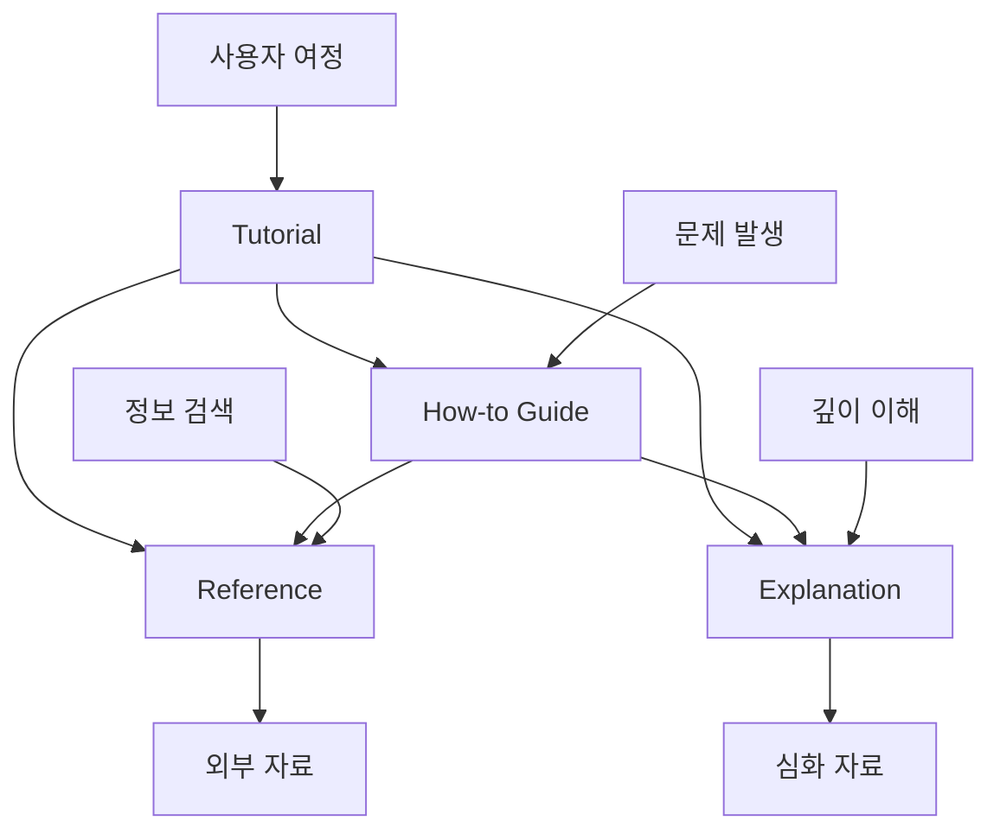
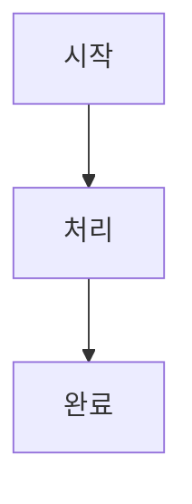
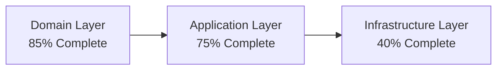
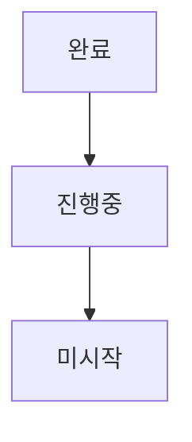
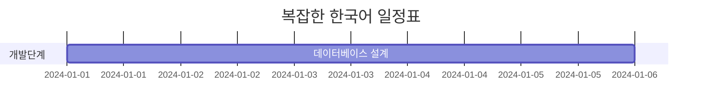
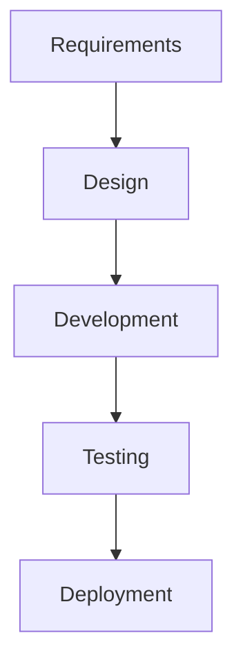
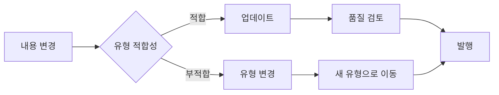
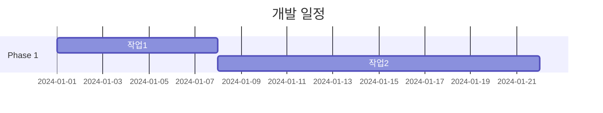

## 🤖 AI 어시스턴트 문서 생성 워크플로우 (필수 준수)

'문서', '보고서', '분석' 등 결과물 작성을 요청받았을 때, AI는 **예외 없이** 다음 절차를 따라야 한다:

1.  사용자의 문서 작성 요청을 인지한다.
2.  "프로젝트 규칙에 따라 Diátaxis 프레임워크를 적용하여 문서를 작성해야 합니다."라고 명확히 밝힌다.
3.  사용자에게 다음 목록에서 생성할 **문서의 유형을 명확하게 선택**하도록 요청한다:
    -   `Tutorial` (튜토리얼)
    -   `How-to Guide` (실무 가이드)
    -   `Reference` (참조 자료)
    -   `Explanation` (개념 설명)
    -   `Analysis Report` (분석 보고서)
    -   `Task List` (작업 목록)
    -   `Project Plan` (프로젝트 계획)
4.  **절대로 유형을 추측하지 않고**, 사용자의 명시적인 확인을 기다린다.
5.  유형이 확정되면, 이 규칙에 명시된 해당 유형의 템플릿과 패턴에 따라 문서 작성을 진행한다.

---

# 📖 Diataxis 문서 시스템 규칙

> **"체계적이고 사용자 중심적인 기술 문서 작성을 위한 종합 가이드"**

## 📁 템플릿 참조

이 규칙과 함께 사용할 수 있는 템플릿들:

- 📚 **Tutorial**: `@docs/diataxis_template/templates/tutorial.md`
- 🔧 **How-to Guide**: `@docs/diataxis_template/templates/how-to-guide.md`
- 📋 **Reference**: `@docs/diataxis_template/templates/reference.md`
- 💡 **Explanation**: `@docs/diataxis_template/templates/explanation.md`

## 📅 날짜 관리 규칙

### 🕐 현재 날짜 및 시간 확인 방법

문서 작성 시 정확한 날짜와 시간이 필요할 때 다음 PowerShell 명령어를 사용하세요.

**기본 형식 (날짜만):**
```powershell
# 현재 날짜 확인 (YYYY-MM-DD 형식)
Get-Date -Format "yyyy-MM-dd"
```

**확장 형식 (시/분/초 포함):**
```powershell
# 현재 날짜 및 시간 확인 (YYYY-MM-DD HH:mm:ss 형식)
Get-Date -Format "yyyy-MM-dd HH:mm:ss"

# 결과 예시: 2025-06-27 14:35:10
```

### 📝 템플릿 사용 방법

1. **템플릿 복사**: 필요한 템플릿을 `docs/diataxis_template/templates/`에서 복사
2. **날짜 확인**: 위의 PowerShell 명령어로 현재 날짜와 시간 확인
3. **날짜 치환**: 템플릿의 `YYYY-MM-DD`를 현재 날짜로 변경
4. **메타데이터 업데이트**: `last_updated`, `analysis_date` 등 날짜 필드 수정

### 🎯 날짜 적용 예시

**Before (템플릿):**
```yaml
---
type: task-list
title: "Domain Task List"
last_updated: "YYYY-MM-DD"
domain: "[domain-name]"
---
```

**After (실제 문서):**
```yaml
---
type: task-list
title: "Donation Task List"
last_updated: "2025-06-27 14:35:10"
domain: "donation"
---
```

### ⚡ 빠른 날짜 및 시간 복사

전체 날짜와 시간을 클립보드에 복사하려면 이 명령어를 사용하세요:
```powershell
# 현재 날짜와 시간을 클립보드에 복사
Get-Date -Format "yyyy-MM-dd HH:mm:ss" | Set-Clipboard

# 이후 Ctrl+V로 붙여넣기 가능
```

## 📂 PosMul 확장 문서 유형

**기본 Diataxis 4가지 외 추가 유형:**

- 📊 **Analysis Report**: `@docs/reports/[domain]-analysis-report.md`
- 📋 **Task List**: `@docs/reports/[domain]-task-list.md`
- 🎯 **Project Plan**: `@docs/reports/[domain]-project-plan.md`

## 🎯 Diataxis 프레임워크 개요

Diataxis는 사용자의 요구사항에 따라 문서를 4가지 유형으로 체계적으로 분류하는 문서화 프레임워크입니다.

### 📊 문서 유형 매트릭스

```mermaid
quadrantChart
    title Diataxis 4가지 문서 유형
    x-axis 실무 중심 --> 이론 중심
    y-axis 학습 지향 --> 실무 지향
    quadrant-1 📋 Reference<br/>(참조자료)
    quadrant-2 💡 Explanation<br/>(개념설명)
    quadrant-3 📚 Tutorial<br/>(튜토리얼)
    quadrant-4 🔧 How-to Guide<br/>(실무가이드)
```

## 🏗️ 문서 유형별 상세 규칙

### 📚 Tutorial (튜토리얼) 규칙

**목적**: 안전한 환경에서의 단계별 학습 경험 제공  
**대상**: 초보자, 처음 접하는 사용자  
**형태**: "학습을 위한 여행"

#### ✅ DO (해야 할 것)

- **학습 중심**: 사용자가 실제로 "할 수 있게" 만들기
- **단계별 진행**: 명확하고 순차적인 단계 제공
- **안전한 환경**: 실패해도 괜찮은 연습 환경 제공
- **구체적 결과**: 각 단계마다 명확한 결과물 제시
- **완전성**: 처음부터 끝까지 완성된 여정 제공

#### ❌ DON'T (하지 말 것)

- **개념 설명 혼합**: 깊이 있는 이론 설명은 Explanation으로 분리
- **문제 해결 초점**: 특정 문제 해결은 How-to Guide로 분리
- **건너뛰기**: 단계를 생략하거나 "당연히 알 것"이라고 가정
- **복잡한 시나리오**: 현실적 복잡성은 나중 단계로 미루기

#### 📝 작성 패턴

```markdown
# [기능] 시작하기

## 학습 목표

- [ ] 목표 1
- [ ] 목표 2

## 준비사항

- 도구 설치
- 권한 확인

## 1단계: [기본 설정] (10분)

### 실습

1. 구체적 행동
2. 예상 결과 확인

## 2단계: [첫 번째 기능] (15분)

### 실습

[단계별 내용]

## 완료 확인

- [ ] 체크리스트
```

---

### 🔧 How-to Guide (실무 가이드) 규칙

**목적**: 구체적 문제 해결을 위한 실무 지향적 지침  
**대상**: 중급 사용자, 문제가 있는 사용자  
**형태**: "레시피"

#### ✅ DO (해야 할 것)

- **문제 해결 초점**: 명확한 문제와 해결책 제시
- **목적 지향적**: 특정 목표 달성에 집중
- **실무적**: 실제 작업 환경 고려
- **선택지 제공**: 여러 해결 방법 제시
- **전제 조건**: 필요한 지식/도구 명시

#### ❌ DON'T (하지 말 것)

- **기초 학습**: 기본 개념 학습은 Tutorial로 분리
- **완전한 설명**: 모든 배경 지식 설명 지양
- **일반적 접근**: 너무 추상적인 설명 피하기
- **이론 중심**: 깊이 있는 이론은 Explanation으로 분리

#### 📝 작성 패턴

```markdown
# How to [구체적 작업]

## 해결할 문제

- 상황 설명
- 달성 목표

## 사전 요구사항

- 필요 지식
- 도구/권한

## 해결 단계

### 방법 1: [빠른 해결]

1. 단계
2. 확인

### 방법 2: [고급 해결]

1. 단계
2. 검증

## 문제 해결

- 자주 발생하는 문제
- 해결 방법
```

---

### 📋 Reference (참조 자료) 규칙

**목적**: 정확한 기술 정보 제공  
**대상**: 숙련된 사용자, 개발자  
**형태**: "사전"

#### ✅ DO (해야 할 것)

- **정확성**: 100% 정확한 정보 제공
- **완전성**: 모든 옵션/매개변수 포함
- **구조화**: 체계적이고 일관된 구조
- **간결성**: 불필요한 설명 제거
- **검색 가능**: 빠른 정보 검색 지원

#### ❌ DON'T (하지 말 것)

- **설명 혼합**: 개념 설명은 Explanation으로 분리
- **예제 과다**: 간단한 예제만 포함
- **주관적 의견**: 객관적 사실만 기술
- **교육적 내용**: 학습 요소는 Tutorial로 분리

#### 📝 작성 패턴

```markdown
# [API/도구] Reference

## 개요

- 버전 정보
- 호환성

## API 엔드포인트

### GET /endpoint

- Parameters
- Response Schema
- Status Codes

## 설정 옵션

| 옵션 | 타입 | 기본값 | 설명 |
| ---- | ---- | ------ | ---- |

## 에러 코드

- CODE_001: 설명
- CODE_002: 설명
```

---

### 💡 Explanation (개념 설명) 규칙

**목적**: 깊이 있는 이해와 컨텍스트 제공  
**대상**: 전문가, 심화 학습자  
**형태**: "토론"

#### ✅ DO (해야 할 것)

- **이해 중심**: 왜, 어떻게, 언제에 대한 답변
- **맥락 제공**: 역사적, 기술적 배경
- **관계 설명**: 다른 개념과의 연관성
- **통찰 제공**: 깊이 있는 분석과 해석
- **토론적**: 다양한 관점 제시

#### ❌ DON'T (하지 말 것)

- **단계별 지침**: 구체적 작업은 Tutorial/How-to로 분리
- **기술 명세**: 상세 스펙은 Reference로 분리
- **표면적 설명**: 깊이 없는 내용 지양
- **편향된 시각**: 균형 잡힌 관점 유지

#### 📝 작성 패턴

```markdown
# [개념] 심화 이해

## 개념 소개

- 정의
- 핵심 질문

## 역사적 배경

- 기원
- 발전 과정

## 핵심 원리

- 작동 메커니즘
- 설계 철학

## 실용적 관점

- 적용 시나리오
- 장단점 분석

## 미래 전망

- 발전 방향
- 예상 변화
```

## 📚 목차 (Table of Contents) 작성 규칙

### 📍 목차 포함 원칙

**모든 Diataxis 템플릿에 목차를 포함해야 합니다.**

#### ✅ 목차 작성 기준

- **포함 대상**: 모든 문서 유형 (Tutorial, How-to, Reference, Explanation, Analysis Report, Task List, Project Plan)
- **위치**: 메타데이터 섹션 직후, 본문 시작 전
- **형식**: `## 📚 목차 (Table of Contents)`
- **구조**: 계층적 링크 구조 (주요 섹션 + 중요 하위 섹션)

#### 📝 목차 작성 패턴

```markdown
## 📚 목차 (Table of Contents)

- @🌟 주요 섹션 1
  - @하위 섹션 1-1
  - @하위 섹션 1-2
- @🔧 주요 섹션 2
- @📊 주요 섹션 3
- @🎯 결론 및 다음 단계
```

#### 🎯 목차 작성 원칙

1. **간결성**: 주요 섹션 위주로 구성 (너무 세분화하지 않기)
2. **일관성**: 이모지와 제목 형식을 원본 헤더와 동일하게 유지
3. **완전성**: 모든 주요 섹션 포함 (단, 3레벨 이하 제목은 선택적)
4. **링크 정확성**: GitHub 마크다운 링크 규칙 준수
   - 공백은 `-`로 변환
   - 특수문자 제거
   - 소문자 변환

#### 📋 문서 유형별 목차 예시

**Tutorial 목차 구조:**
```markdown
- @🎯 학습 목표
- @🛠️ 사전 준비사항
- @📖 단계별 가이드
- @✅ 완료 확인
- @🚀 다음 단계
```

**How-to Guide 목차 구조:**
```markdown
- @🎯 해결할 문제
- @🛠️ 사전 요구사항
- @📖 해결 단계
- @🔍 문제 해결
- @✅ 완료 체크리스트
```

**Analysis Report 목차 구조:**
```markdown
- @📋 Executive Summary
- @🔍 상세 분석
- @📊 정량적 평가
- @🎯 권장사항
- @📈 다음 단계
```

**Task List 목차 구조:**
```markdown
- @🚀 Phase 1: MVP Development Tasks
- @🎯 Task 우선순위 매트릭스
- @🔄 Task Dependencies Graph
- @🎉 MVP 완성 체크리스트
```

#### ⚠️ 목차 작성 시 주의사항

- **링크 깨짐 방지**: 헤더 제목 변경 시 목차 링크도 함께 업데이트
- **적절한 깊이**: 너무 많은 하위 섹션 포함하지 않기 (가독성 저하)
- **이모지 일관성**: 원본 헤더의 이모지와 정확히 일치시키기
- **순서 유지**: 문서 내 실제 섹션 순서와 동일하게 배치

#### 🔍 목차 품질 체크리스트

- [ ] 모든 주요 섹션이 포함되었는가?
- [ ] 링크가 올바르게 작동하는가?
- [ ] 이모지와 제목이 원본과 일치하는가?
- [ ] 적절한 계층 구조를 가지고 있는가?
- [ ] 너무 길거나 짧지 않은가? (5-12개 항목 권장)

---

## 🔄 문서 간 상호 연결 규칙

### 연결 전략



### 🔗 링크 규칙

- **Tutorial → How-to**: "이제 실제 문제를 해결해보세요"
- **Tutorial → Reference**: "더 자세한 옵션은 여기를 참조"
- **Tutorial → Explanation**: "이 개념을 더 깊이 이해하려면"
- **How-to → Reference**: "전체 API 옵션 보기"
- **How-to → Explanation**: "이 방법의 원리 이해하기"
- **Reference → Explanation**: "설계 배경과 철학"

## 📏 품질 기준 및 체크리스트

### 📚 Tutorial 품질 체크리스트

- [ ] **완료 가능성**: 30-60분 내 완료 가능한가?
- [ ] **순차성**: 단계가 논리적 순서인가?
- [ ] **검증성**: 각 단계 결과를 확인할 수 있는가?
- [ ] **안전성**: 실패해도 복구 가능한가?
- [ ] **완전성**: 처음부터 끝까지 완성되는가?

### 🔧 How-to Guide 품질 체크리스트

- [ ] **문제 명확성**: 해결하려는 문제가 명확한가?
- [ ] **목적 지향성**: 특정 목표 달성에 집중하는가?
- [ ] **선택지**: 여러 해결 방법을 제시하는가?
- [ ] **실용성**: 실제 업무에 바로 적용 가능한가?
- [ ] **문제 해결**: 일반적 문제와 해결법 포함?

### 📋 Reference 품질 체크리스트

- [ ] **정확성**: 모든 정보가 100% 정확한가?
- [ ] **완전성**: 누락된 정보가 없는가?
- [ ] **일관성**: 형식과 구조가 일관적인가?
- [ ] **최신성**: 최신 버전 정보인가?
- [ ] **검색성**: 필요한 정보를 빠르게 찾을 수 있는가?

### 💡 Explanation 품질 체크리스트

- [ ] **깊이**: 표면적 설명을 넘어서는가?
- [ ] **맥락**: 충분한 배경 정보를 제공하는가?
- [ ] **균형**: 다양한 관점을 제시하는가?
- [ ] **통찰**: 새로운 이해를 제공하는가?
- [ ] **연결성**: 다른 개념과의 관계를 설명하는가?

## 🎨 시각화 가이드라인

### 📊 Mermaid 다이어그램 사용 지침

### ✅ 권장 사용법

#### 1. **Mermaid 설치 및 버전 호환성**

```bash
# Next.js 15 + React 19 호환 버전
npm install mermaid@latest  # v11.7.0+

# 버전 확인
npm list mermaid
```

**호환성 매트릭스:**

- **Next.js 15 + React 19**: Mermaid v11.x (권장)
- **Next.js 14 + React 18**: Mermaid v10.x
- **Next.js 13 이하**: Mermaid v8.x-v9.x

#### 2. **간단한 구조 선호**



#### 3. **영문 또는 기호 위주 작성**



#### 4. **색상 코딩 활용**



### ❌ 피해야 할 패턴

#### 1. **복잡한 Gantt 차트 (한국어 포함)**



#### 2. **긴 한국어 텍스트**

- 노드 제목에 긴 한국어 텍스트 사용 지양
- 대신 간단한 영문 + 설명을 별도 섹션에 작성

### 🔧 대안 해결책

#### 1. **테이블 형식으로 대체**

복잡한 Gantt 차트 대신:

| 단계  | 작업            | 기간 | 상태      |
| ----- | --------------- | ---- | --------- |
| 1단계 | Database Schema | 2일  | ✅ 완료   |
| 2단계 | Repository 구현 | 3일  | 🔄 진행중 |
| 3단계 | API 개발        | 5일  | ⏳ 대기   |

#### 2. **리스트 형식 활용**

단계별 계획:

1. **🔥 긴급 (1주차)**

   - Database Schema 생성 (2일)
   - Repository 구현 (3일)
   - 기본 API 구현 (2일)

2. **⚡ 높음 (2-3주차)**
   - UI 컴포넌트 개발 (5일)
   - 테스트 작성 (3일)

#### 3. **간단한 플로우차트**



### 💡 **5가지 핵심 원칙**

1. **Mermaid v11.x 사용**: Next.js 15 호환성 보장
2. **한국어 최소화**: 영문 또는 기호 위주
3. **단순한 구조**: 복잡한 다이어그램 지양
4. **대안 활용**: 테이블, 리스트로 정보 전달
5. **색상 활용**: 시각적 구분을 위한 적절한 색상 사용

### 🎯 **권장 다이어그램 유형**

#### ✅ **적극 권장**

- **Flowchart**: 프로세스 흐름
- **Graph**: 관계도, 아키텍처
- **Pie Chart**: 비율 표시
- **Bar Chart**: 비교 데이터

#### ⚠️ **주의해서 사용**

- **Gantt Chart**: 영문 위주, 단순한 것만
- **Timeline**: 한국어 최소화
- **Sequence Diagram**: 복잡하지 않은 것만

#### ❌ **권장하지 않음**

- **복잡한 UML**: 별도 도구 권장 (Draw.io, Lucidchart)
- **한국어 중심 다이어그램**: 렌더링 오류 위험

### 🔍 **문제 해결 가이드**

#### 문제: 다이어그램이 렌더링되지 않음

**해결책:**

1. Mermaid 설치 확인: `npm list mermaid`
2. 버전 호환성 확인: Next.js 15 → Mermaid v11.x
3. 문법 검증: @Mermaid Live Editor 활용

#### 문제: 한국어 텍스트 깨짐

**해결책:**

1. 영문으로 변경
2. 별도 설명 섹션 추가
3. 테이블 형식으로 대체

#### 문제: 복잡한 차트 오류

**해결책:**

1. 단순화
2. 여러 개의 작은 차트로 분할
3. 대안 형식 활용 (테이블, 리스트)

### 📚 **추가 리소스**

- @Mermaid 공식 문서
- @Mermaid Live Editor - 실시간 테스트
- @Next.js 15 + Mermaid 호환성 가이드
- @Mermaid v11 변경사항

## 📁 파일 구조 및 명명 규칙

### 디렉토리 구조

```
docs/
├── tutorials/              # 📚 튜토리얼
│   ├── getting-started.md
│   └── advanced-features.md
├── how-to/                 # 🔧 실무 가이드
│   ├── installation/
│   ├── deployment/
│   └── troubleshooting/
├── reference/              # 📋 참조 자료
│   ├── api/
│   ├── cli/
│   └── configuration/
├── explanation/            # 💡 개념 설명
│   ├── architecture/
│   ├── design-principles/
│   └── best-practices/
├── reports/                # 📊 분석 보고서 & 작업 목록
│   ├── [domain]-analysis-report.md
│   ├── [domain]-task-list.md
│   └── [domain]-project-plan.md
└── index.md               # 메인 랜딩 페이지
```

### 파일 명명 규칙

- **Tutorial**: `getting-started-with-[feature].md`
- **How-to**: `how-to-[specific-task].md`
- **Reference**: `[component]-reference.md`
- **Explanation**: `understanding-[concept].md`
- **Analysis Report**: `[domain]-analysis-report.md`
- **Task List**: `[domain]-task-list.md`
- **Project Plan**: `[domain]-project-plan.md`

## 🏷️ 메타데이터 표준

### YAML Front Matter

#### 기본 Diataxis 문서

```yaml
---
type: tutorial | how-to | reference | explanation
title: "문서 제목"
description: "간단한 설명"
difficulty: beginner | intermediate | advanced
estimated_time: "30분" # tutorial, how-to만
last_updated: "YYYY-MM-DD"
version: "v1.0" # reference만
tags: [tag1, tag2, tag3]
related_docs:
  - "관련-문서-1.md"
  - "관련-문서-2.md"
prerequisites: # tutorial, how-to만
  - "기본 지식 1"
  - "필요 도구 2"
---
```

#### 확장 문서 유형

```yaml
---
# Analysis Report
type: analysis-report
domain: "investment" | "prediction" | "forum" | "donation"
analysis_date: "YYYY-MM-DD"
completion_percentage: 70
priority: high | medium | low
analyst: "분석자명"
reviewers: ["리뷰어1", "리뷰어2"]
next_review_date: "YYYY-MM-DD"
---

---
# Task List
type: task-list
domain: "investment" | "prediction" | "forum" | "donation"
total_tasks: 25
completed_tasks: 5
estimated_duration: "8주"
priority_distribution:
  urgent: 5
  high: 8
  medium: 7
  low: 5
last_updated: "YYYY-MM-DD"
assignees: ["개발자1", "개발자2"]
---

---
# Project Plan
type: project-plan
domain: "investment" | "prediction" | "forum" | "donation"
project_phase: "planning" | "development" | "testing" | "deployment"
timeline: "Q1 2024"
budget: "예산 정보"
stakeholders: ["이해관계자1", "이해관계자2"]
success_metrics: ["지표1", "지표2"]
---
```

## 🔄 문서 생명주기 관리

### 생성 단계

1. **유형 식별**: 사용자 요구사항 → 문서 유형 매핑
2. **템플릿 선택**: 해당 유형 템플릿 사용
3. **초안 작성**: 가이드라인 준수하여 작성
4. **품질 검토**: 체크리스트 확인

### 유지보수 단계



### 성과 측정

- **Tutorial**: 완료율, 시간, 만족도
- **How-to**: 문제 해결률, 사용 빈도
- **Reference**: 조회수, 검색 성공률
- **Explanation**: 읽기 시간, 심화 탐색률

## 🤖 AI 도구 활용 가이드

### Context7 MCP 활용

```bash
# 1. 개념 조사
resolve-library-id: [주제명]
get-library-docs: [라이브러리ID] --topic="[구체적주제]"

# 2. 베스트 프랙티스 검색
get-library-docs: [라이브러리ID] --topic="documentation best practices"
```

### AI 프롬프트 패턴

#### Tutorial 생성용

```
다음을 포함한 [주제] 튜토리얼을 작성해주세요:
- 목표: 초보자가 30분 내에 [기능]을 사용할 수 있게 하기
- 구조: 준비사항 → 3단계 실습 → 완료 확인
- 스타일: 단계별, 실습 중심, 검증 가능
- 결과물: [구체적 결과물]
```

#### How-to 생성용

```
다음 문제 해결을 위한 How-to 가이드 작성:
- 문제: [구체적 문제 상황]
- 대상: [중급 사용자]
- 방법: 2-3가지 해결 방안 제시
- 포함: 문제 진단 → 해결 → 검증
```

## 📊 확장 문서 유형 상세 규칙

### 📊 Analysis Report (분석 보고서) 규칙

**목적**: 도메인/기능의 현재 상태 분석 및 평가  
**대상**: 프로젝트 관리자, 개발팀, 의사결정자  
**형태**: "현황 진단서"

#### ✅ DO (해야 할 것)

- **객관적 분석**: 데이터와 사실 기반 평가
- **구조화된 정보**: 일관된 분석 프레임워크 사용
- **정량적 지표**: 구체적 수치와 완성도 제시
- **시각화 활용**: 차트, 다이어그램으로 이해도 향상
- **실행 가능한 인사이트**: 분석 결과에서 도출된 구체적 제안

#### 📝 작성 패턴

````markdown
---
type: analysis-report
domain: [도메인명]
analysis_date: "YYYY-MM-DD"
completion_percentage: XX%
priority: high | medium | low
---

# [Domain] 도메인 분석 보고서

## 📋 Executive Summary

- **전체 완성도**: XX%
- **핵심 이슈**: [주요 문제점]
- **권장 조치**: [우선순위 액션]

## 🔍 상세 분석

### ✅ 완료 영역 (XX%)

#### [Layer/Component] (완성도: XX%)

- ✅ **[기능 1]**: 상세 설명
- ✅ **[기능 2]**: 상세 설명

### ❌ 미완성 영역 (XX%)

#### [Layer/Component] (완성도: XX%)

- ❌ **[누락 기능]**: 문제점 및 영향도

## 📊 정량적 평가


````

```

## 🎯 권장사항

### 🔥 긴급 (1주차)

- [ ] [구체적 작업]

### ⚡ 높음 (2-3주차)

- [ ] [구체적 작업]

```

### 📋 Task List (작업 목록) 규칙

**목적**: 체계적이고 실행 가능한 작업 계획 제시
**대상**: 개발팀, 프로젝트 매니저
**형태**: "실행 계획서"

#### ✅ DO (해야 할 것)

- **우선순위 기반**: 긴급도와 중요도에 따른 분류
- **구체적 작업**: 모호하지 않은 명확한 액션 아이템
- **완료 기준**: 각 작업의 완료 조건 명시
- **일정 계획**: 현실적인 타임라인 제시
- **체크박스 활용**: 진행상황 추적 가능

#### 📝 작성 패턴

````markdown
---
type: task-list
domain: [도메인명]
total_tasks: XX
estimated_duration: "X주"
priority_distribution:
  urgent: X
  high: X
  medium: X
  low: X
---

# [Domain] 도메인 작업 목록

## 🚀 향후 개발 과제 (우선순위별)

### 🔥 긴급 (1주차)

#### 1. [주요 작업 그룹]

- [ ] **[구체적 작업 1]**
  - 완료 기준: [명확한 기준]
  - 예상 시간: X시간
  - 담당자: [팀/개인]

### ⚡ 높음 (2-3주차)

#### 2. [주요 작업 그룹]

- [ ] **[구체적 작업 2]**

## 🎯 마일스톤

### Phase 1: [단계명] (X주)

- **목표**: [구체적 목표]
- **완료 기준**: [측정 가능한 기준]

## 📊 진행률 추적


````

````

### 🎯 Project Plan (프로젝트 계획) 규칙

**목적**: 장기적 프로젝트 로드맵 및 전략 계획
**대상**: 프로젝트 리더, 아키텍트, 의사결정자
**형태**: "전략 설계서"

#### ✅ DO (해야 할 것)

- **전략적 관점**: 비즈니스 목표와 기술 목표 연계
- **위험 관리**: 잠재적 위험 요소와 대응책
- **리소스 계획**: 인력, 시간, 예산 고려
- **성공 지표**: 측정 가능한 KPI 설정
- **이해관계자 고려**: 다양한 관점 반영

## 🎯 PosMul 프로젝트 특화 규칙

### 경제 시스템 문서화

- **Tutorial**: PMP/PMC 시스템 체험하기
- **How-to**: 특정 경제 문제 해결하기
- **Reference**: API 및 경제 모델 스펙
- **Explanation**: Agency Theory, CAPM 이해하기
- **Analysis Report**: 경제 도메인 구현 현황 분석
- **Task List**: 경제 시스템 개발 작업 목록

### DDD 아키텍처 문서화

- **Tutorial**: Domain 구현해보기
- **How-to**: 특정 패턴 적용하기
- **Reference**: 인터페이스 및 규약
- **Explanation**: Clean Architecture 이해
- **Analysis Report**: 도메인별 구현 현황 분석
- **Task List**: 도메인 개발 작업 계획

### MCP 도구 문서화

- **Tutorial**: Supabase MCP 시작하기
- **How-to**: 특정 MCP 작업 수행하기
- **Reference**: MCP 명령어 레퍼런스
- **Explanation**: MCP 아키텍처 이해
- **Analysis Report**: MCP 연동 현황 분석
- **Task List**: MCP 구현 작업 목록

## 📊 성공 지표 및 KPI

### 문서 품질 지표

```mermaid
pie title 문서 품질 지표
    "정확성" : 30
    "완전성" : 25
    "사용성" : 25
    "최신성" : 20
````

### 사용자 만족도 측정

- **Task Success Rate**: 문서를 통한 작업 성공률
- **Time to Information**: 필요한 정보 찾는 시간
- **User Satisfaction Score**: 5점 척도 만족도
- **Return Rate**: 재방문률

### 문서 효과성 측정

- **Tutorial**: 완료율 85% 이상
- **How-to**: 문제 해결률 90% 이상
- **Reference**: 정확도 99% 이상
- **Explanation**: 이해도 향상 80% 이상

## ⚠️ 주의사항 및 피해야 할 실수

### 공통 실수들

1. **유형 혼합**: 한 문서에 여러 유형 섞지 않기
2. **대상 혼동**: 명확한 대상 독자 설정하기
3. **목적 불분명**: 각 문서의 목적 명확히 하기
4. **업데이트 누락**: 정기적인 업데이트 필수

### 유형별 주의사항

- **Tutorial**: 너무 복잡하거나 현실적이지 않은 예제
- **How-to**: 일반적이거나 학습 요소 포함
- **Reference**: 불완전하거나 부정확한 정보
- **Explanation**: 표면적이거나 편향된 설명

## 🚀 도입 및 운영 가이드

### 단계별 도입

1. **1단계**: 기존 문서 유형 분류
2. **2단계**: 템플릿 적용 및 리팩토링
3. **3단계**: 새 문서 작성 시스템 구축
4. **4단계**: 품질 관리 및 최적화

### 팀 교육

- Diataxis 개념 이해 세션
- 유형별 작성 실습
- 품질 기준 공유
- 정기적 리뷰 및 개선

---

**이 규칙은 PosMul 프로젝트의 문서 품질을 체계적으로 향상시키기 위해 설계되었습니다. 모든 문서 작성 시 이 가이드라인을 참조하여 일관되고 효과적인 문서를 만들어주세요.**
