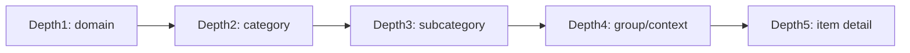

# PosMul Prediction Game - Cursor Rules

You are an expert in TypeScript, Next.js 15 App Router, Domain-Driven Design (DDD), Clean Architecture, and Supabase.

## Project Context

This is PosMul, an AI-era direct democracy platform providing prediction games and local economy integration. The platform implements Agency Theory, CAPM, and behavioral economics theories through code.

**CRITICAL**: This project has a **tightly coupled economy system (PMP/PMC)** that spans across all domains. Use **Shared Kernel** and **Domain Events** patterns for economic integration.

## Development Environment

- **OS**: Windows
- **Shell**: PowerShell (always use PowerShell commands)
- **Path Format**: Windows backslash paths (e.g., `src\bounded-contexts\`)
- **Commands**: Use semicolon (`;`) instead of `&&` for command chaining

## Core Architecture Principles

### DDD + Clean Architecture with Economic Integration

- **Shared Kernel**: Economy domain (PMP/PMC) is shared across all contexts
- **Domain Events**: Use events for cross-domain communication
- **Anti-Corruption Layer**: Protect domain integrity while allowing integration
- Domain layer has NO external dependencies (pure business logic)
- Use Aggregate, Entity, Value Object, Domain Service appropriately
- Repository pattern for data access abstraction

### Dependency Rules (CRITICAL)

```
Presentation → Application → Domain
Infrastructure → Domain (implements interfaces)
Shared Economy Kernel ← All Domains (read-only access)
```

- Domain NEVER depends on external layers
- Application only depends on Domain + Shared Economy Kernel
- Infrastructure implements Domain interfaces
- **All domains can READ from Economy Kernel, but WRITE through Domain Events**

## Economic System Integration Patterns

### 1. Shared Kernel Pattern (Economy Domain)

```typescript
// src/shared/economy-kernel/
export interface PmpAccount {
  userId: UserId;
  balance: number;
  readonly transactions: PmpTransaction[];
}

export interface PmcAccount {
  userId: UserId;
  balance: number;
  readonly transactions: PmcTransaction[];
}

export class EconomyKernel {
  // Read-only access for all domains
  getPmpBalance(userId: UserId): Promise<number>;
  getPmcBalance(userId: UserId): Promise<number>;

  // Write operations through domain events only
  private constructor() {} // Prevent direct instantiation
}
```

### 2. Domain Events for Economic Transactions

```typescript
// Cross-domain economic events
export class PmpEarnedEvent implements DomainEvent {
  constructor(
    public readonly userId: UserId,
    public readonly amount: number,
    public readonly source: "major-league" | "brainstorming" | "debate",
    public readonly sourceId: string,
    public readonly occurredAt: Date = new Date()
  ) {}
}

export class PmcEarnedEvent implements DomainEvent {
  constructor(
    public readonly userId: UserId,
    public readonly amount: number,
    public readonly source:
      | "local-league"
      | "cloud-funding"
      | "prediction-success"
      | "gift-aid",
    public readonly sourceId: string,
    public readonly occurredAt: Date = new Date()
  ) {}
}

export class PmpSpentEvent implements DomainEvent {
  constructor(
    public readonly userId: UserId,
    public readonly amount: number,
    public readonly purpose: "prediction-participation",
    public readonly targetId: string,
    public readonly occurredAt: Date = new Date()
  ) {}
}
```

### 3. Anti-Corruption Layer for Economic Integration

```typescript
// Each domain has its own economic service
export class PredictionEconomicService {
  constructor(
    private readonly economyKernel: EconomyKernel,
    private readonly eventPublisher: IDomainEventPublisher
  ) {}

  async canParticipateInPrediction(
    userId: UserId,
    requiredPmp: number
  ): Promise<boolean> {
    const balance = await this.economyKernel.getPmpBalance(userId);
    return balance >= requiredPmp;
  }

  async participateInPrediction(
    userId: UserId,
    predictionId: PredictionId,
    pmpAmount: number
  ): Promise<Result<void, EconomicError>> {
    // Publish event instead of direct modification
    await this.eventPublisher.publish(
      new PmpSpentEvent(
        userId,
        pmpAmount,
        "prediction-participation",
        predictionId
      )
    );
    return { success: true, data: undefined };
  }
}
```

## File Structure Rules (Updated for Economic Integration)

```
src\
  shared\
    economy-kernel\          # Shared economic domain
      entities\
        pmp-account.entity.ts
        pmc-account.entity.ts
        money-wave.entity.ts
      value-objects\
        economic-types.ts
      services\
        economy-kernel.service.ts
      events\
        economic-events.ts
    events\                  # Cross-domain event system
      domain-events.ts
      event-publisher.ts
  bounded-contexts\
    [context-name]\
      domain\
        entities\
        value-objects\
        repositories\
        services\
          [context]-economic.service.ts  # Economic integration per domain
        events\
      application\
        use-cases\
        services\
        dto\
        event-handlers\      # Handle economic events
      infrastructure\
        repositories\
        external-services\
        event-handlers\      # Infrastructure event handlers
      presentation\
        components\
        hooks\
      context.md
```

## Domain-Specific Economic Integration Rules


---

## 🧭 라우팅 규칙: Depth 5 네비게이션 (중요)

> 후임자/협업자를 위해 **Depth5 구조를 표준 규칙**으로 고정합니다.
> 특히 **Consume / Prediction / Donation**은 “카드 기반 의사결정 UX”를 위해 Depth5를 유지합니다.

### 정의

- **Depth1**: Domain (예: `prediction`, `donation`, `consume`)
- **Depth2**: Category (예: `sports`, `direct`, `major-league`)
- **Depth3**: Subcategory (예: `soccer`, `institute`, `local-league`)
- **Depth4**: Context/Group (예: `epl`, `environment`, `campaign`)
- **Depth5**: Item Detail (개별 카드/아이템)



### 예시 (Prediction 기준)

- `prediction/sports/soccer/epl/[predictionId]`

### 예시 (Donation 권장 구조)

- `donation/direct/[theme]/[regionOrGroup]/[donationId]`
- `donation/institute/[category]/[instituteGroup]/[instituteId]`
- `donation/opinion-leader/[category]/[leaderGroup]/[leaderId]`

### 규칙 (실무 가이드)

- Depth4는 “카드 리스트가 의미를 갖는 묶음”을 표현합니다. (리그/테마/지역/캠페인 등)
- Depth5는 **반드시 디테일 페이지**(개별 카드 상세)로 끝나야 합니다.
- Depth5 slug는 가능하면 **명확한 식별자**(예: DB id 또는 안정적인 slug)를 사용합니다.


### Prediction Domain

```typescript
// Prediction domain economic integration
export class PredictionGame {
  public participateWithPmp(
    userId: UserId,
    prediction: Prediction,
    economicService: PredictionEconomicService
  ): Promise<Result<void, BusinessRuleError>> {
    // 1. Check PMP balance through economic service
    // 2. Create prediction
    // 3. Publish PmpSpentEvent
    // 4. On prediction success, publish PmcEarnedEvent
  }
}
```

### Investment Domain

```typescript
// Investment domain economic integration
export class MajorLeague {
  public completeInvestment(
    userId: UserId,
    investment: Investment
  ): Promise<Result<void, BusinessRuleError>> {
    // Publish PmpEarnedEvent for major league completion
  }
}

export class LocalLeague {
  public completeInvestment(
    userId: UserId,
    investment: Investment
  ): Promise<Result<void, BusinessRuleError>> {
    // Publish PmcEarnedEvent for local league completion
  }
}
```

### Forum Domain

```typescript
// Forum domain economic integration
export class Debate {
  public completeDebate(
    userId: UserId,
    debate: Debate
  ): Promise<Result<void, BusinessRuleError>> {
    // Publish PmpEarnedEvent for debate participation
  }
}

export class Brainstorming {
  public completeBrainstorming(
    userId: UserId,
    session: BrainstormingSession
  ): Promise<Result<void, BusinessRuleError>> {
    // Publish PmpEarnedEvent for brainstorming participation
  }
}
```

### Donation Domain

```typescript
// Donation domain economic integration
export class Donation {
  public makeDonation(
    userId: UserId,
    amount: number,
    target: DonationTarget,
    economicService: DonationEconomicService
  ): Promise<Result<void, BusinessRuleError>> {
    // 1. Check PMC balance
    // 2. Create donation
    // 3. Publish PmcSpentEvent
  }
}
```

## Economic Event Handling Patterns

### Event Handlers in Economy Domain

```typescript
// Economy domain handles all economic events
export class PmpAccountEventHandler {
  async handle(event: PmpEarnedEvent | PmpSpentEvent): Promise<void> {
    // Update PMP account balance
    // Record transaction history
    // Trigger Money Wave if needed
  }
}

export class PmcAccountEventHandler {
  async handle(event: PmcEarnedEvent | PmcSpentEvent): Promise<void> {
    // Update PMC account balance
    // Record transaction history
    // Handle Money Wave redistribution
  }
}
```

### Cross-Domain Event Subscriptions

```typescript
// Each domain subscribes to relevant economic events
export class PredictionEventHandler {
  async handleMoneyWaveDistribution(
    event: MoneyWaveDistributedEvent
  ): Promise<void> {
    // Distribute PMC to prediction game participants
  }
}
```

## TypeScript Standards (Updated)

- Use strict TypeScript configuration
- Prefer `interface` over `type` for object shapes
- Use branded types for domain identifiers:

```typescript
type UserId = string & { readonly brand: unique symbol };
type PredictionId = string & { readonly brand: unique symbol };
type PmpAmount = number & { readonly brand: unique symbol };
type PmcAmount = number & { readonly brand: unique symbol };
```

- Implement Result/Either pattern for error handling:

```typescript
type Result<T, E = Error> =
  | { success: true; data: T }
  | { success: false; error: E };
```

## Naming Conventions

### Files & Directories

- Files: `kebab-case` → `prediction-game.entity.ts`
- Classes: `PascalCase` → `PredictionGame`
- Functions/Variables: `camelCase` → `createPredictionGame`
- Constants: `SCREAMING_SNAKE_CASE` → `MAX_PREDICTIONS_PER_GAME`

### Domain Objects

- Entities: `PredictionGame`, `User`, `Market`
- Value Objects: `PredictionId`, `UserId`, `Email`
- Repositories: `IPredictionGameRepository` (interface), `PredictionGameRepository` (impl)
- Services: `PredictionScoringService`, `MarketDataService`
- Economic Services: `PredictionEconomicService`, `InvestmentEconomicService`

### React Components

- Components: `PredictionCard`, `GameList`, `UserDashboard`
- Hooks: `usePredictionGame`, `useMarketData`, `useEconomicBalance`
- Pages: `page.tsx`, `layout.tsx`

## Code Generation Rules

### When Creating Domain Entities with Economic Integration

```typescript
export class PredictionGame {
  private constructor(
    private readonly id: PredictionGameId,
    private readonly title: string,
    private status: GameStatus,
    private predictions: Prediction[]
  ) {}

  public static create(title: string): Result<PredictionGame, ValidationError> {
    // Domain validation logic
  }

  public addPrediction(
    prediction: Prediction,
    economicService: PredictionEconomicService
  ): Result<void, BusinessRuleError> {
    // Business logic with economic validation
  }
}
```

### When Creating Repository Interfaces

```typescript
// Domain layer - NO implementation details
export interface IPredictionGameRepository {
  save(game: PredictionGame): Promise<Result<void, RepositoryError>>;
  findById(
    id: PredictionGameId
  ): Promise<Result<PredictionGame | null, RepositoryError>>;
  findByStatus(
    status: GameStatus
  ): Promise<Result<PredictionGame[], RepositoryError>>;
}
```

### When Creating Use Cases with Economic Integration

```typescript
// Application layer - orchestrates domain objects + economic kernel
export class CreatePredictionGameUseCase {
  constructor(
    private readonly repository: IPredictionGameRepository,
    private readonly eventPublisher: IDomainEventPublisher,
    private readonly economicService: PredictionEconomicService
  ) {}

  async execute(
    request: CreateGameRequest
  ): Promise<Result<CreateGameResponse, UseCaseError>> {
    // 1. Validate input
    // 2. Check economic prerequisites
    // 3. Create domain object
    // 4. Save via repository
    // 5. Publish domain events (including economic events)
    // 6. Return response
  }
}
```

### When Creating React Components with Economic Data

- Default to Server Components
- Use Client Components only when needed (interactivity, browser APIs)
- Implement proper loading states with Suspense
- Include error boundaries
- **Always display economic balance (PMP/PMC) in relevant components**

```typescript
// Server Component with economic data
export default async function GameList({ userId }: { userId: UserId }) {
  const [games, pmpBalance, pmcBalance] = await Promise.all([
    getGames(),
    getPmpBalance(userId),
    getPmcBalance(userId),
  ]);

  return (
    <div>
      <EconomicBalance pmp={pmpBalance} pmc={pmcBalance} />
      {/* Game list JSX */}
    </div>
  );
}

// Client Component (when needed)
("use client");
export function PredictionForm({ userId }: { userId: UserId }) {
  const { pmpBalance } = useEconomicBalance(userId);
  // Interactive form logic with economic validation
}
```

## Supabase Integration Rules

### Database Schema for Economic Integration

- Use snake_case for database columns
- Map to camelCase in domain objects
- Implement Row Level Security (RLS)
- **Separate tables for economic transactions and domain entities**

```sql
-- Economic tables (shared)
CREATE TABLE pmp_accounts (
  user_id UUID PRIMARY KEY,
  balance DECIMAL(15,2) NOT NULL DEFAULT 0,
  updated_at TIMESTAMPTZ DEFAULT NOW()
);

CREATE TABLE pmc_accounts (
  user_id UUID PRIMARY KEY,
  balance DECIMAL(15,2) NOT NULL DEFAULT 0,
  updated_at TIMESTAMPTZ DEFAULT NOW()
);

CREATE TABLE economic_transactions (
  id UUID PRIMARY KEY,
  user_id UUID NOT NULL,
  transaction_type TEXT NOT NULL, -- 'pmp_earned', 'pmp_spent', 'pmc_earned', 'pmc_spent'
  amount DECIMAL(15,2) NOT NULL,
  source_domain TEXT NOT NULL, -- 'prediction', 'investment', 'forum', 'donation'
  source_id UUID NOT NULL,
  created_at TIMESTAMPTZ DEFAULT NOW()
);

-- Domain-specific tables
CREATE TABLE prediction_games (
  id UUID PRIMARY KEY,
  created_at TIMESTAMPTZ DEFAULT NOW(),
  game_status TEXT NOT NULL,
  required_pmp DECIMAL(15,2) DEFAULT 0
);
```

### Repository Implementation with Economic Integration

```typescript
export class SupabasePredictionGameRepository
  implements IPredictionGameRepository
{
  constructor(private readonly supabase: SupabaseClient) {}

  async save(game: PredictionGame): Promise<Result<void, RepositoryError>> {
    try {
      // Convert domain object to database format
      // Use Supabase client
      // Handle errors appropriately
    } catch (error) {
      return { success: false, error: new RepositoryError("Save failed") };
    }
  }
}
```

## Error Handling Patterns

### Domain Errors

```typescript
export class ValidationError extends Error {
  constructor(message: string, public field: string) {
    super(message);
    this.name = "ValidationError";
  }
}

export class BusinessRuleError extends Error {
  constructor(message: string, public rule: string) {
    super(message);
    this.name = "BusinessRuleError";
  }
}

export class EconomicError extends Error {
  constructor(
    message: string,
    public economicType:
      | "insufficient-pmp"
      | "insufficient-pmc"
      | "invalid-transaction"
  ) {
    super(message);
    this.name = "EconomicError";
  }
}
```

### Application Errors

```typescript
export class UseCaseError extends Error {
  constructor(message: string, public cause?: Error) {
    super(message);
    this.name = "UseCaseError";
  }
}
```

## Next.js 15 App Router Rules

- Use App Router file conventions
- Implement loading.tsx, error.tsx, not-found.tsx
- Leverage Server Actions for mutations
- Use proper caching strategies
- **Always include economic data in page props**

```typescript
// app/predictions/loading.tsx
export default function Loading() {
  return <PredictionsSkeleton />;
}

// app/predictions/error.tsx
("use client");
export default function Error({
  error,
  reset,
}: {
  error: Error & { digest?: string };
  reset: () => void;
}) {
  return <ErrorBoundary error={error} reset={reset} />;
}
```

## PowerShell Commands (ALWAYS USE)

```powershell
# Development
npm run dev
npm test
npm run build

# Multiple commands (use semicolon)
cd src; npm install; npm run dev

# File operations
New-Item -ItemType Directory -Path "src\bounded-contexts\prediction"
```

## Performance & Security

### Performance

- Use React.memo for expensive components
- Implement proper database indexing
- Use dynamic imports for code splitting
- Implement caching strategies
- **Cache economic balance data with proper invalidation**

### Security

- Validate all inputs at API boundaries
- Use Supabase RLS for data access control
- Store sensitive data in environment variables
- Follow OWASP security guidelines
- **Implement economic transaction validation and audit trails**

## Domain-Specific Rules for PosMul

### Economy Domain (Shared Kernel)

- PMP (risk-free asset) and PMC (risky asset) are core value objects
- MoneyWave system handles PMC distribution
- Agency Theory implementation is the core differentiator
- **All economic operations must go through domain events**
- **Never allow direct balance modification outside economy domain**

### Prediction Domain

- PredictionGame is the main aggregate
- Prediction is an entity within the aggregate
- Game lifecycle: Created → Active → Ended → Settled
- **Always check PMP balance before allowing participation**
- **Emit PmcEarnedEvent on successful predictions**

### Investment Domain

- Local League, Major League, Cloud Funding are separate aggregates
- Each has different point earning mechanisms
- **Major League earns PMP, Local League earns PMC**
- **Cloud Funding earns PMC**

### Forum Domain

- **Debate and Brainstorming earn PMP**
- **Quality contributions should be rewarded with economic incentives**

### Donation Domain

- **Uses PMC for donations**
- **Implements Money Wave redistribution logic**

## CRITICAL REMINDERS

1. **NEVER violate Clean Architecture dependency rules**
2. **Domain layer must be pure** - no external dependencies
3. **Use PowerShell commands** - never bash/zsh
4. **Always implement Result pattern** for error handling
5. **Repository interfaces in Domain** - implementations in Infrastructure
6. **Server Components by default** - Client only when needed
7. **Proper error boundaries** and loading states
8. **Supabase RLS** for all data access
9. **🔥 ECONOMIC INTEGRATION IS CRITICAL** - All domains must integrate with PMP/PMC system
10. **Use Domain Events for cross-domain economic transactions**
11. **Shared Economy Kernel for read access, Events for write access**
12. **Always display economic balance in relevant UI components**

When in doubt, ask yourself: "Does this follow DDD principles, Clean Architecture rules, AND properly integrate with the economic system?"
