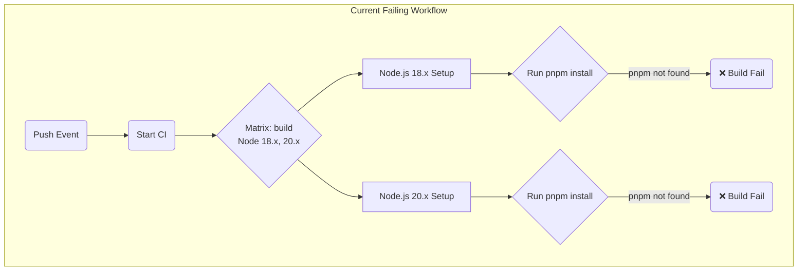
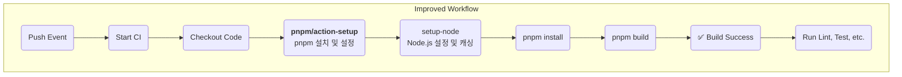
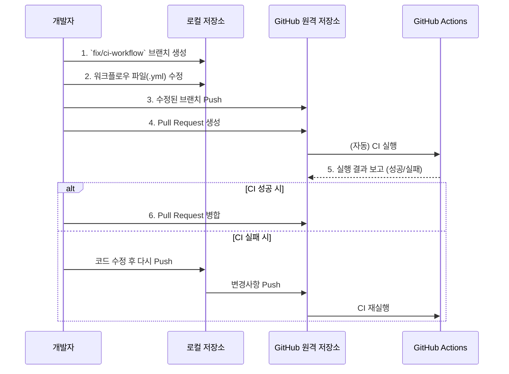
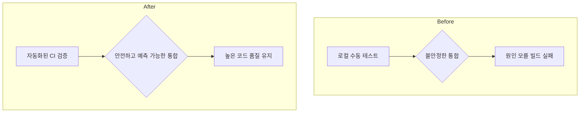

# CI/CD 프로세스 개선 계획 보고서

- **문서 버전**: 1.0
- **작성일**: 2025-07-03
- **작성자**: AI Assistant

---

## 1. 개요

현재 GitHub Actions를 통해 실행되는 CI(지속적 통합) 워크플로우의 `build` 작업이 'pnpm' 실행 파일을 찾지 못하는 문제로 인해 실패하고 있습니다. 이는 CI 실행 환경에 `pnpm`이 올바르게 설치 및 구성되지 않았기 때문입니다.

본 문서는 해당 문제의 원인을 분석하고, `pnpm/action-setup` 액션을 도입하여 워크플로우를 안정화하는 구체적인 개선 계획을 제안합니다. 이를 통해 자동화된 코드 검증 프로세스를 정상화하고, 개발 생산성과 코드 품질을 향상시키는 것을 목표로 합니다.

### **개선 목표 시각화**

```mermaid
graph TD
    A[CI 실패<br/>(pnpm 실행 불가)] -- 개선 계획 적용 --> B[CI 성공<br/>(자동 빌드/테스트)]
    B --> C[안정적인 코드 통합]
    C --> D[개발 생산성 향상]
```

---

## 2. 현상 분석

### 2.1. 문제 현상

GitHub 저장소에 코드를 Push할 때마다 트리거되는 CI 워크플로우에서 아래와 같은 오류가 발생하며 `build (18.x)` 작업이 실패하고 있습니다.

- **오류 메시지**: `Error: Unable to locate executable file: pnpm.`
- **실패 지점**: `Matrix build` 내 Node.js 18.x 버전 빌드 환경
- **영향**: 빌드 실패로 인해 후속 작업인 `lint`, `test`, `e2e` 등이 전혀 실행되지 못하고 전체 워크플로우가 중단됩니다.

### 2.2. 근본 원인

이 문제의 근본 원인은 **로컬 개발 환경과 GitHub Actions CI 실행 환경의 불일치**에 있습니다.

- **로컬 환경**: 개발자의 PC에는 `pnpm`이 정상적으로 설치되어 있어 모든 명령이 잘 동작합니다.
- **CI 환경**: GitHub Actions에서 제공하는 가상 머신에는 기본적으로 `pnpm`이 설치되어 있지 않습니다. 따라서 `setup-node` 액션으로 Node.js만 설정할 경우, `pnpm` 명령어를 찾지 못해 오류가 발생합니다.

### **현재 실패 워크플로우 시각화**



---

## 3. 개선 방안

### 3.1. 해결책: `pnpm/action-setup` 도입

GitHub Actions에서 `pnpm`을 공식적으로 지원하는 `pnpm/action-setup` 액션을 워크플로우에 추가하여 문제를 해결합니다. 이 액션은 CI 환경에 특정 버전의 `pnpm`을 설치하고 PATH에 등록해주는 역할을 합니다.

### 3.2. 워크플로우 파일 수정 예시

`.github/workflows/ci.yml` (또는 해당 워크플로우 파일)의 `build` 작업에 아래와 같이 `pnpm/action-setup` 단계를 추가합니다.

```yaml
# .github/workflows/ci.yml

jobs:
  build:
    runs-on: ubuntu-latest
    strategy:
      matrix:
        node-version: [18.x, 20.x]

    steps:
      - name: Checkout repository
        uses: actions/checkout@v4

      # --- ▼ 개선 영역 시작 ▼ ---
      - name: Set up pnpm
        uses: pnpm/action-setup@v3
        with:
          version: 8 # 또는 프로젝트에서 사용하는 pnpm 버전

      - name: Set up Node.js ${{ matrix.node-version }}
        uses: actions/setup-node@v4
        with:
          node-version: ${{ matrix.node-version }}
          cache: "pnpm" # pnpm을 캐시하여 속도 향상
      # --- ▲ 개선 영역 종료 ▲ ---

      - name: Install dependencies
        run: pnpm install

      - name: Build project
        run: pnpm build
```

### **개선 후 워크플로우 시각화**



---

## 4. 실행 계획

안전하고 체계적인 개선을 위해 아래 5단계에 걸쳐 작업을 진행합니다.

1.  **기능 브랜치 생성**: `main` 브랜치에서 `fix/ci-workflow`와 같은 이름의 새 브랜치를 생성합니다.
2.  **워크플로우 파일 수정**: 생성한 브랜치에서 `.github/workflows/ci.yml` 파일을 찾아 위 개선 방안대로 수정합니다.
3.  **Pull Request(PR) 생성**: 수정된 브랜치를 원격 저장소에 Push하고, `main` 브랜치로 향하는 Pull Request를 생성합니다.
4.  **CI 통과 확인**: PR이 생성되면 CI가 자동으로 실행됩니다. GitHub PR 페이지에서 모든 검사가 성공적으로 통과(초록색 체크 표시)하는지 확인합니다.
5.  **브랜치 병합**: CI 통과가 확인되면, 해당 PR을 `main` 브랜치에 병합하여 개선 작업을 완료합니다.

### **실행 계획 순서도**



---

## 5. 기대 효과

본 개선 계획이 완료되면 다음과 같은 효과를 기대할 수 있습니다.

1.  **CI 프로세스 정상화**: 코드가 Push 될 때마다 빌드, 테스트, 린트가 자동으로 실행되어 코드의 안정성을 조기에 검증할 수 있습니다.
2.  **개발 생산성 향상**: "내 PC에선 됐는데..."와 같은 환경 의존적인 문제를 원천 차단하고, 개발자는 기능 개발에만 집중할 수 있습니다.
3.  **코드 품질 유지**: 모든 변경사항이 일관된 품질 기준 하에 검증되므로, 프로젝트 전체의 코드 품질이 상향 평준화됩니다.
4.  **신속한 피드백 루프**: 코드 변경 후 수 분 내에 잠재적인 문제를 발견하고 수정할 수 있어, 버그가 `main` 브랜치에 유입되는 것을 방지합니다.

### **개선 전후 비교**


