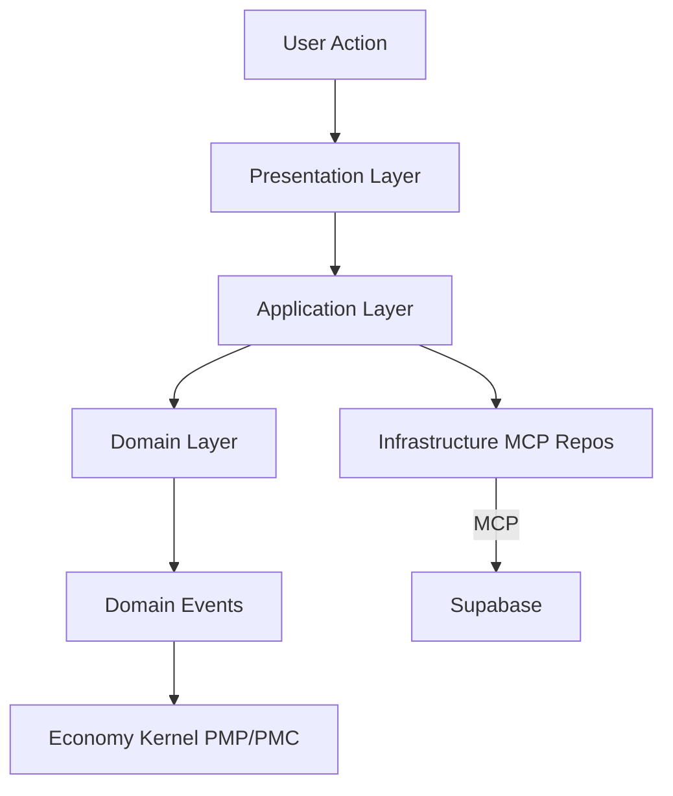
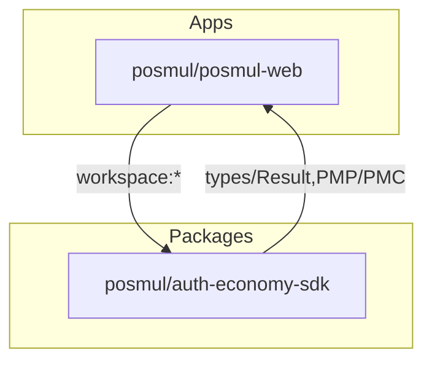
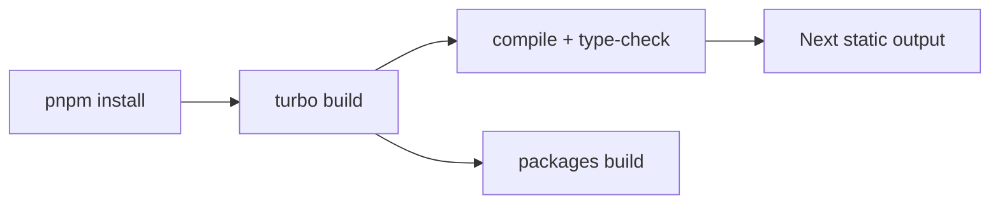
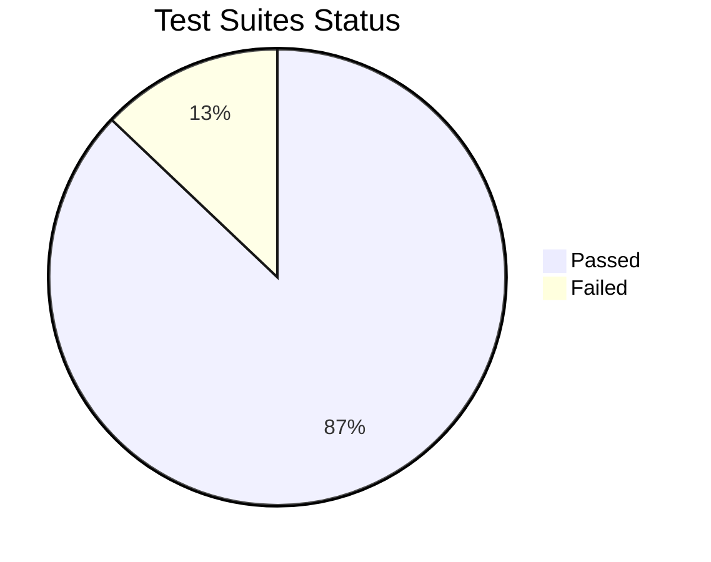
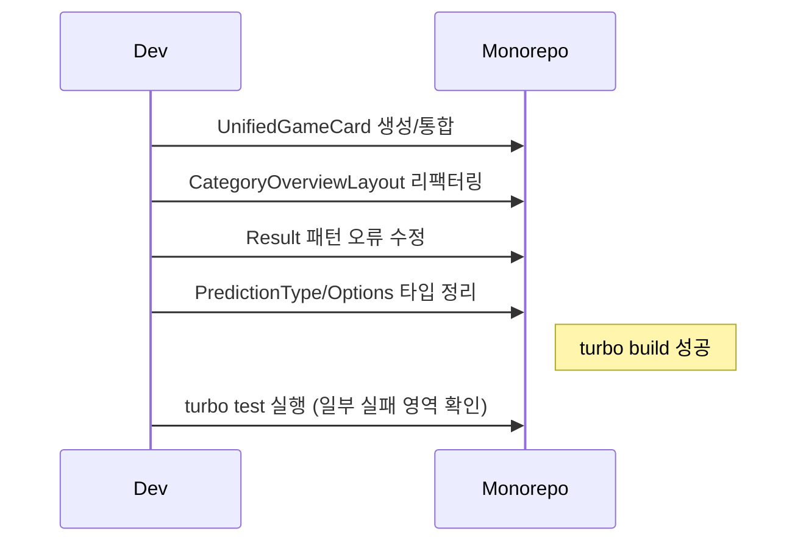
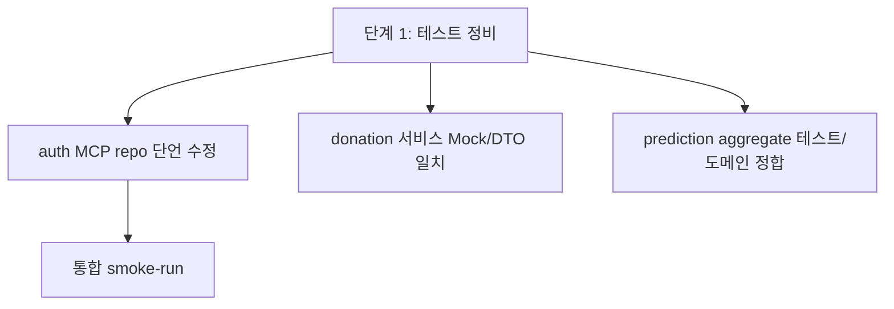

# PosMul Monorepo – Project Briefing (2025-09-10)

본 문서는 현재 작업 환경, 최근 진행상황, 품질 상태, 남은 작업 계획을 한 눈에 파악하기 위한 간략 브리핑입니다.

## 개요

- Monorepo: pnpm + turbo (Windows/PowerShell)
- Web App: Next.js 15.3.4 (App Router, React 19)
- TypeScript: 5.x (strict)
- MCP: Supabase MCP, GitHub MCP (CLI 금지)
- 핵심 패턴: DDD + Clean Architecture + Shared Economy Kernel (PMP/PMC)

## 최근 빌드/테스트 상태

- Build: 성공 (turbo build)
- Test: 일부 실패 (4 suites fail / 27 pass / 총 31 suites)
  - 주요 실패 영역:
    - auth MCP Repository 테스트: 실제 MCP 어댑터 응답 메시지 변화로 단언 실패
    - donation Application Service/UseCase: mock 형태 불일치 및 도메인 객체/DTO 매핑 차이
    - prediction Aggregate: 도메인 API 명세와 테스트 기대치 간 불일치 (id 생성/메서드명)

---

## 시스템 흐름 (요약)



## 모듈 현황 지도



## 빌드 파이프라인 개요



## 테스트 결과 분포(요약)



## 근래 변경점 타임라인



## 단기 개선 계획 (우선순위)



### 우선 해결 이슈 세부

- auth/infrastructure MCPAuthRepository 테스트 실패
  - 현재: 에러 메시지 단언이 실제 MCP 에러 문자열과 불일치
  - 조치: 에러코드/메시지 추상화로 단언을 느슨하게(코드 기준 또는 부분 일치)

- donation/application 서비스/유스케이스 실패
  - 현재: map 함수 대상/Mock 구조, 도메인 객체 getter 기대 불일치
  - 조치: 테스트에서 도메인/DTO 인터페이스 동기화 or 서비스에서 반환 DTO 어댑트 일관화

- prediction/domain aggregate 실패
  - 현재: 생성된 id 기대치 다름, 메서드 존재/명칭 불일치
  - 조치: 테스트 기대치 수정(브랜디드 id/uuid 생성 규칙 반영) 및 공개 메서드 명세 정렬

---

## 품질 게이트 현황

- Build: PASS
- TypeCheck: PASS (빌드 단계에서 검증 완료)
- Unit Tests: FAIL (4 suites)
- Lint: 미실행

## 실행/개발 명령 (PowerShell)

- 전체 개발:

```powershell
pnpm install
turbo dev
```

- 전체 빌드/테스트:

```powershell
turbo build
turbo test
```

- 웹 앱만:

```powershell
pnpm -F @posmul/posmul-web dev
pnpm -F @posmul/posmul-web build
pnpm -F @posmul/posmul-web test
```

## 다음 액션 제안

1. auth MCP repo 테스트: 에러 메시지 단언을 코드 기반으로 변경해 환경 의존 제거
2. donation 서비스/유스케이스: DTO/Mock 스키마 재정렬 및 isFailure/Result 가드 추가
3. prediction aggregate: 공개 API/테스트 기대치 동기화 (uuid/메서드명)
4. 린트/포맷 워크플로우 재가동 (turbo lint)
