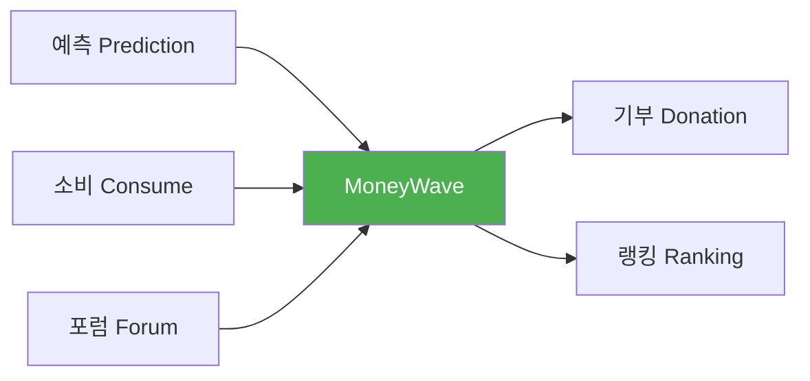
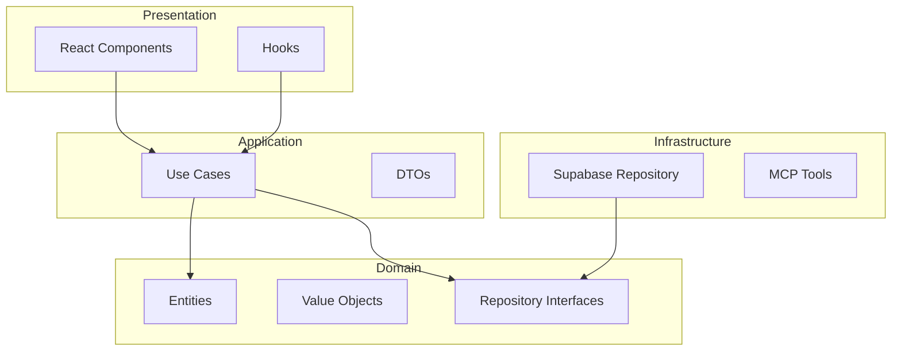
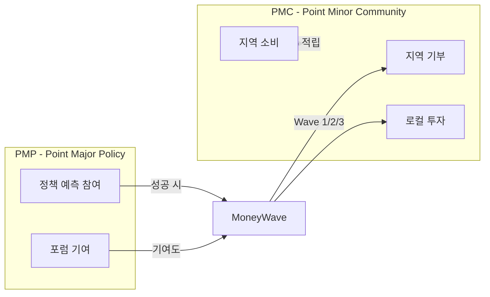

# PosMul: AI 시대 직접 민주주의 플랫폼

<div align="center">


**예측 게임 + 지역 경제 + 기부 시스템을 통한 새로운 민주주의 경험**

[](https://github.com/positivemultiplier/posmul)
[](https://www.typescriptlang.org/)
[](https://nextjs.org/)
[](https://react.dev/)
[](LICENSE)

</div>

---

## 📋 목차

- [프로젝트 개요](#-프로젝트-개요)
- [핵심 기능](#-핵심-기능)
- [기술 스택](#-기술-스택)
- [프로젝트 구조](#-프로젝트-구조)
- [빠른 시작](#-빠른-시작)
- [아키텍처](#-아키텍처)
- [경제 시스템](#-경제-시스템-pmppmc)
- [개발 가이드](#-개발-가이드)
- [기여하기](#-기여하기)

---

## 🎯 프로젝트 개요

**PosMul**(긍정승수)은 시민이 직접 참여하는 AI 시대 직접 민주주의 플랫폼입니다.



### 핵심 가치

| 가치 | 설명 |
|------|------|
| 🗳️ **직접 민주주의** | 시민이 정책 예측에 직접 참여 |
| 💰 **지역 경제 활성화** | PMC를 통한 지역 소비 및 기부 |
| 🤝 **사회적 가치 창출** | 예측 성공 → 기부로 이어지는 선순환 |

---

## 🚀 핵심 기능

### 1. 예측 게임 (Prediction)
- **스포츠**: 축구, 야구, 농구, e스포츠
- **정치**: 선거, 정책 예측
- **엔터테인먼트**: 대중문화 트렌드
- **투자**: 경제 지표 예측

### 2. 소비 시스템 (Consume)
- **TimeConsume**: 광고 시청/설문 참여로 PMP 획득 → Expect에서 PMC로 전환
- **MoneyConsume**: 지역 매장 결제 시 PMC 직접 적립 (1%)
- **CloudConsume**: 클라우드 펀딩 참여로 PMC 직접 적립 (2~5%)

### 3. 기부 시스템 (Donation)
- **기관 기부**: 공익 기관 직접 기부
- **오피니언 리더 후원**: 영향력 있는 활동가 지원
- **직접 기부**: 개인 간 물품/재능 기부

### 4. 포럼 시스템 (Forum)
- **News**: 뉴스 읽기/토론으로 PMP 획득
- **Debate**: 정책/경제/사회 토론 참여
- **Brainstorming**: 아이디어 제안
- **Budget**: 예산 투표 참여

### 5. 랭킹 시스템 (Ranking)
- **종합 랭킹**: 모든 활동 점수 합산
- **카테고리별**: Forum, Consume, Expect, Donation
- **기간별**: 전체, 월간, 주간

### 6. 기타 서비스 (Other)
- **Gift Aid**: 기부금 영수증/세액공제
- **Accounting & Tax**: 포인트 거래 내역/세무 자료

---

## 🛠 기술 스택

### Frontend
| 기술 | 버전 | 용도 |
|------|------|------|
| **Next.js** | 15.3.4 | App Router, SSR/SSG |
| **React** | 19.0.0 | Server Components |
| **TypeScript** | 5.4.5 | Strict Mode |
| **Tailwind CSS** | 4.x | UI 스타일링 |
| **Zustand** | 5.0.6 | 상태 관리 |
| **Recharts** | 3.1.0 | 데이터 시각화 |

### Backend & Database
| 기술 | 용도 |
|------|------|
| **Supabase** | PostgreSQL + Auth + Realtime |
| **MCP Tools** | 데이터베이스 자동화 |

### Development
| 도구 | 버전 | 용도 |
|------|------|------|
| **pnpm** | 10.12.4 | 패키지 관리 |
| **Turborepo** | 2.0.4 | 모노레포 빌드 |
| **Jest** | 30.x | 단위 테스트 |
| **Playwright** | 1.44.0 | E2E 테스트 |

---

## 📁 프로젝트 구조

```
posmul/
├── apps/
│   └── posmul-web/              # 🌐 Next.js 15 웹 애플리케이션
│       └── src/
│           ├── app/             # App Router 페이지
│           ├── bounded-contexts/ # DDD 도메인 컨텍스트
│           │   ├── auth/        # 인증
│           │   ├── consume/     # 소비 (Time/Money/Cloud)
│           │   ├── donation/    # 기부
│           │   ├── economy/     # 경제 시스템 (PMP/PMC)
│           │   ├── forum/       # 포럼
│           │   ├── prediction/  # 예측 게임 (Expect)
│           │   ├── ranking/     # 통합 랭킹
│           │   ├── public/      # 공용
│           │   ├── study_cycle/ # 학습 사이클
│           │   └── user/        # 사용자
│           ├── shared/          # 공유 컴포넌트/유틸
│           └── lib/             # 라이브러리 설정
├── packages/
│   └── auth-economy-sdk/        # 🔐 통합 인증/경제 SDK
├── docs/                        # 📖 문서
└── scripts/                     # 🔧 자동화 스크립트
```

### Bounded Context 구조 (DDD)

```
bounded-context/
├── domain/           # 도메인 로직
│   ├── entities/     # 엔티티
│   ├── value-objects/ # 값 객체
│   ├── repositories/ # 리포지토리 인터페이스
│   └── services/     # 도메인 서비스
├── application/      # 애플리케이션 레이어
│   ├── use-cases/    # 유스케이스
│   ├── dto/          # DTO
│   └── services/     # 애플리케이션 서비스
├── infrastructure/   # 인프라스트럭처
│   └── repositories/ # 리포지토리 구현
└── presentation/     # 프레젠테이션
    ├── components/   # React 컴포넌트
    └── hooks/        # Custom Hooks
```

---

## ⚡ 빠른 시작

### 필수 요구사항
- Node.js 18.x 이상
- pnpm 10.x 이상

### 설치 및 실행

```powershell
# 1. 저장소 클론
git clone https://github.com/positivemultiplier/posmul.git
cd posmul

# 2. 의존성 설치
pnpm install

# 3. 환경 변수 설정
cp apps/posmul-web/.env.example apps/posmul-web/.env.local
# .env.local 파일에 Supabase 정보 입력

# 4. 개발 서버 실행
pnpm dev
```

### 환경 변수

```bash
# apps/posmul-web/.env.local
NEXT_PUBLIC_SUPABASE_URL=your_supabase_url
NEXT_PUBLIC_SUPABASE_ANON_KEY=your_supabase_anon_key
SUPABASE_SERVICE_ROLE_KEY=your_service_role_key
```

### 주요 명령어

```powershell
# 개발
pnpm dev              # 전체 개발 서버
pnpm dev:web          # 웹만 실행

# 빌드
pnpm build            # 전체 빌드 (Turbo 캐시)
pnpm type-check       # TypeScript 검사

# 테스트
pnpm test             # 단위 테스트
pnpm e2e              # E2E 테스트

# 코드 품질
pnpm lint             # ESLint
pnpm format           # Prettier

# 타입 생성
타입 생성: VS Code(MCP)에서 `mcp_com_supabase__generate_typescript_types`
```

---

## 🏗 아키텍처

### DDD + Clean Architecture



### 데이터베이스 스키마 (Schema-per-Bounded-Context)

```mermaid
erDiagram
    economy {
        user_economic_balances
        pmp_transactions
        pmc_transactions
        money_wave_history
    }
    
    prediction {
        prediction_games
        predictions
        prediction_settlements
    }
    
    consume {
        local_stores
        payments
        ad_campaigns
        ad_views
        funding_projects
        contributions
    }
    
    ranking {
        user_scores
        ranking_history
    }
    
    donation {
        donations
        institutes
        opinion_leaders
    }
    
    user {
        user_profiles
        user_reputation_metrics
    }
```

---

## 💰 경제 시스템 (PMP/PMC)

### 이중 토큰 시스템



### MoneyWave 분배 시스템

| Wave | 대상 | 분배 방식 |
|------|------|----------|
| **Wave 1** | 전체 활성 사용자 | 균등 분배 |
| **Wave 2** | 활동 사용자 | 활동 점수 비례 |
| **Wave 3** | 핵심 기여자 | 기여도 점수 비례 |

### PMP/PMC 흐름

```
획득: pmp_available += amount
사용: pmp_available -= amount, pmp_locked += amount
성공: pmp_locked → pmc_available (MoneyWave 변환)
실패: pmp_locked → 소각
```

---

## 📖 개발 가이드

### 코딩 규칙

1. **TypeScript Strict Mode** - `any` 사용 금지
2. **DDD 원칙** - 도메인 간 직접 의존 금지
3. **Clean Architecture** - 의존성 방향 준수
4. **Supabase MCP** - CLI 대신 MCP 도구 사용

### 네이밍 규칙

```
PascalCase: 컴포넌트, 클래스, 타입
camelCase: 함수, 변수
kebab-case: 폴더
UPPER_SNAKE_CASE: 상수
```

### Import 순서

```typescript
// 1. React/Next
import { useState } from 'react';
// 2. 외부 라이브러리
import { z } from 'zod';
// 3. 내부 모듈
import { Button } from '@/shared/ui';
// 4. 상대 경로
import { Card } from './Card';
```

---

## 🤝 기여하기

### 기여 프로세스

1. **Fork** 저장소
2. **Branch** 생성: `git checkout -b feature/amazing-feature`
3. **Commit**: `git commit -m 'feat: add amazing feature'`
4. **Push**: `git push origin feature/amazing-feature`
5. **Pull Request** 생성

### 커밋 메시지 규칙

```
feat: 새로운 기능 추가
fix: 버그 수정
docs: 문서 변경
refactor: 코드 리팩토링
test: 테스트 추가/수정
chore: 빌드 프로세스/도구 변경
```

### PR 체크리스트

- [ ] `pnpm build` 성공
- [ ] `pnpm test` 통과
- [ ] `pnpm type-check` 오류 없음
- [ ] 문서 업데이트 (필요시)

---

## 📚 문서

| 문서 | 설명 |
|------|------|
| [PROJECT_RULES.md](docs/PROJECT_RULES.md) | 프로젝트 규칙 |
| [Architecture](docs/architecture/) | 아키텍처 문서 |
| [Tutorials](docs/tutorials/) | 튜토리얼 |
| [API Reference](docs/api/) | API 레퍼런스 |

---

## 📊 프로젝트 현황

**마지막 업데이트**: 2025년 11월 29일

| 영역 | 상태 | 비고 |
|------|------|------|
| **웹 애플리케이션** | ✅ 운영 | Next.js 15 + React 19 |
| **예측 시스템** | ✅ 완료 | 스포츠/정치/엔터 |
| **소비 시스템** | ✅ 완료 | Time/Money/Cloud Consume |
| **기부 시스템** | ✅ 완료 | 기관/오피니언리더/직접 |
| **포럼 시스템** | ✅ 완료 | News/Debate/Brainstorm/Budget |
| **랭킹 시스템** | ✅ 완료 | 종합/카테고리별/기간별 |
| **경제 시스템** | ✅ 완료 | PMP/PMC + MoneyWave |
| **DDD 아키텍처** | ✅ 완료 | 10개 Bounded Context |

---

## 📄 라이선스

MIT License - [LICENSE](LICENSE) 참조

---

## 📞 연락처

- **GitHub Issues**: [이슈 리포팅](https://github.com/positivemultiplier/posmul/issues)
- **문서**: [프로젝트 문서](docs/)

---

<div align="center">

**🎉 PosMul과 함께 AI 시대의 새로운 민주주의를 경험하세요!**

</div>
