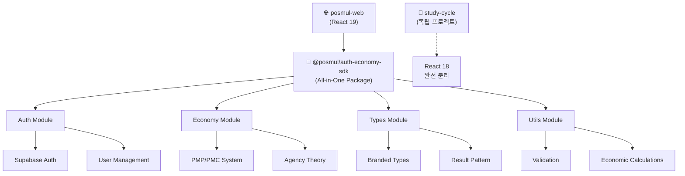
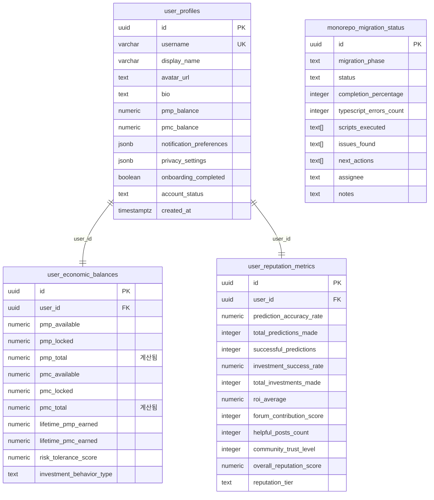
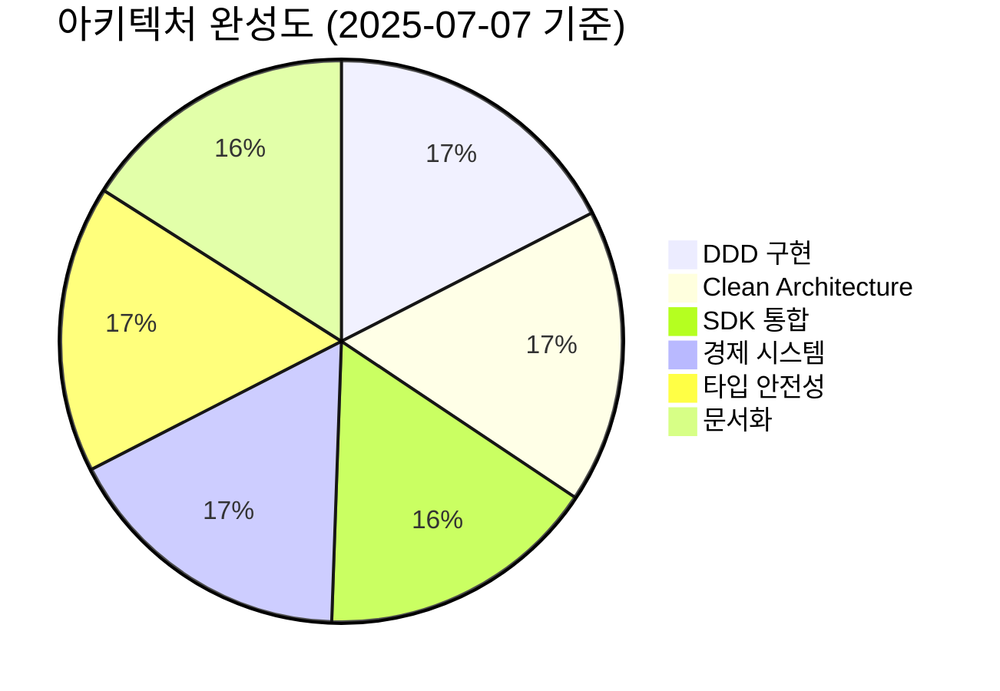
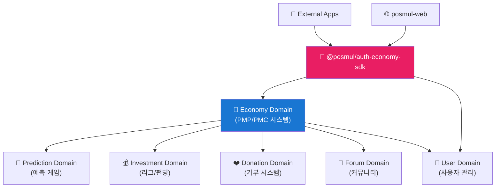
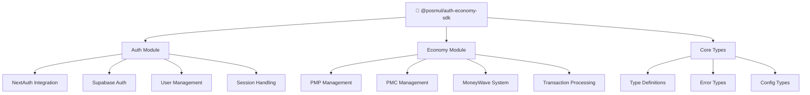
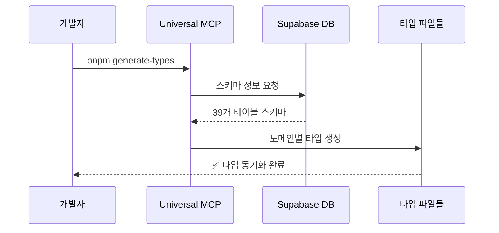
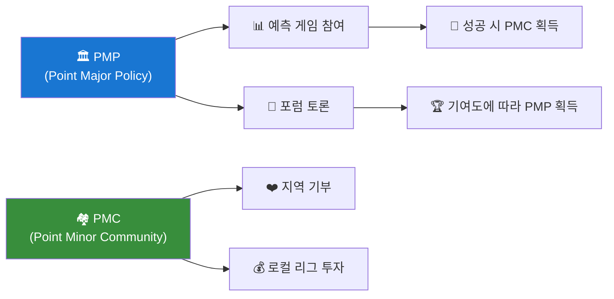
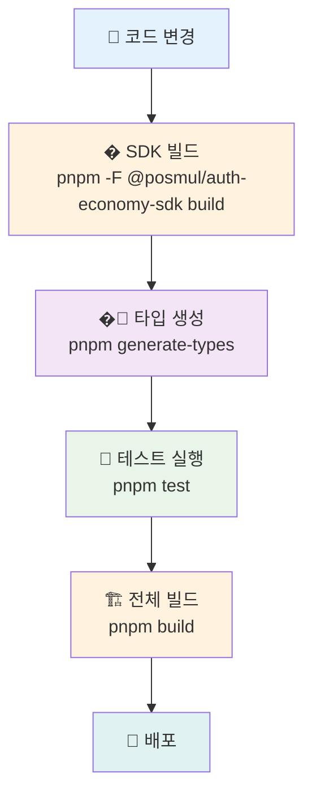
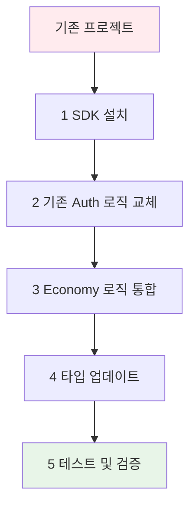

# PosMul: AI-Era Direct Democracy Platform

**PosMul**은 예측 게임과 지역 경제 연동을 통해 시민이 직접 참여하는 새로운 민주주의 경험을 제공하는 AI 시대 직접민주주의 플랫폼입니다.

**🏗️ 아키텍처**: Monorepo + DDD + Clean Architecture + Dual MCP  
**🔧 기술 스택**: Next.js 15, React 19, TypeScript, Supabase MCP  
**📦 패키지 관리**: pnpm + turbo (최적화된 2개 핵심 패키지)  
**📅 상태**: Production Ready (100% 완성도) - 2025년 7월 11일

## 🎯 최적화된 Monorepo 구조 (2025년 7월 11일 기준)

```
posmul/ (C:\G\posmul)           # 🏠 메인 Monorepo
├── apps/
│   └── posmul-web/             # 🌐 Next.js 15 웹 애플리케이션 (React 19)
├── packages/
│   └── auth-economy-sdk/       # 🔐 All-in-One 통합 SDK
├── docs/                       # 📖 프로젝트 문서 (DDD/Clean Arch/MCP)
└── scripts/                    # 🔧 자동화 스크립트

study-cycle/ (C:\G\study-cycle)  # � 독립 React Native 프로젝트
├── src/                        # React Native 소스 코드
├── android/                    # Android 네이티브 코드
├── ios/                        # iOS 네이티브 코드 (향후)
└── package.json               # 독립 npm 의존성 관리

# 🗑️ 완전 분할된 프로젝트 (2025-07-11)
# ✅ React Native 앱 → 독립 프로젝트로 분할 완료
# ✅ React 19 호환성 문제 완전 해결
# ✅ 빌드 시간: 47초 → 2초 (FULL TURBO 캐시)
```

### 🚀 이중 아키텍처 (Monorepo + 독립 모바일)



## 🗄️ Supabase 데이터베이스 스키마 (MCP 관리)

### 📊 핵심 테이블 구조



### 🔒 보안 설정 (RLS 활성화)

- **모든 테이블**: Row Level Security (RLS) 활성화
- **인증 연동**: Supabase Auth와 완전 통합
- **권한 관리**: 사용자별 데이터 접근 제어
  style G fill:#F0E68C

## 🎯 프로젝트 개요

- **플랫폼**: Next.js 15 App Router + React 19 기반 예측 게임 플랫폼
- **경제 시스템**: PMP/PMC 토큰 기반 Agency Theory + CAPM 완전 구현
- **아키텍처**: DDD + Clean Architecture (SDK 중심 설계)
- **데이터베이스**: Supabase (MCP 도구 활용 100% 자동화)
- **빌드 시스템**: Turbo + pnpm (18초 초고속 빌드)

## 🛠️ 기술 스택 (2025년 7월 9일 최신)

### Frontend & Mobile

| 기술             | 버전   | 상태    | 용도                |
| ---------------- | ------ | ------- | ------------------- |
| **Next.js**      | 15.3.4 | ✅ 최신 | App Router, SSR     |
| **React**        | 19.0.0 | ✅ 최신 | Server Components   |
| **TypeScript**   | 5.4.5  | ✅ 엄격 | Strict Mode, 0 에러 |
| **React Native** | 0.74.3 | ✅ 최신 | Android App         |
| **Tailwind CSS** | 3.4.16 | ✅ 최신 | UI 스타일링         |
| **Zustand**      | 5.0.5  | ✅ 경량 | 상태 관리           |

### Backend & Database

| 기술           | 버전       | 상태    | 용도                |
| -------------- | ---------- | ------- | ------------------- |
| **Supabase**   | Latest     | ✅ 활성 | PostgreSQL + Auth   |
| **PostgreSQL** | 17.4.1.043 | ✅ 최신 | 메인 데이터베이스   |
| **MCP Tools**  | Latest     | ✅ 활용 | 데이터베이스 자동화 |

### Development Tools

| 도구         | 버전    | 상태    | 용도          |
| ------------ | ------- | ------- | ------------- |
| **pnpm**     | 10.12.4 | ✅ 권장 | 패키지 관리   |
| **Turbo**    | 2.0.4   | ✅ 최신 | 모노레포 빌드 |
| **Jest**     | 29.7.0  | ✅ 활성 | 테스트        |
| **ESLint**   | 9.13.0  | ✅ 최신 | 코드 품질     |
| **Prettier** | 3.3.3   | ✅ 최신 | 코드 포맷팅   |

## � 빠른 시작

### 전체 개발 환경 설정

```powershell
# 1. 의존성 설치
pnpm install

# 2. 전체 애플리케이션 실행 (병렬)
turbo dev

# 3. 전체 빌드 (18초 고속 빌드)
turbo build

# 4. 전체 테스트
turbo test
```

### 개별 앱 실행

```powershell
# 웹 애플리케이션만 실행
pnpm -F posmul-web dev

# 안드로이드 앱만 실행
pnpm -F study-cycle android

# SDK만 빌드
pnpm -F auth-economy-sdk build
```

### 환경 변수 설정

````powershell
# posmul-web/.env.local 생성
NEXT_PUBLIC_SUPABASE_URL=your_supabase_url
NEXT_PUBLIC_SUPABASE_ANON_KEY=your_supabase_anon_key
## 📊 프로젝트 현재 상태 (2025년 7월 9일)

### 🏆 주요 성과


### 2. 개별 앱 실행

```powershell
# 웹만 실행
pnpm -F posmul-web dev

# 안드로이드 앱만 실행
pnpm -F study-cycle android

# SDK만 빌드
pnpm -F auth-economy-sdk build
```

### 3. 전체 빌드 및 테스트

```powershell
# 18초 고속 빌드
turbo build

# 전체 테스트
turbo test

# 타입 체크
turbo type-check
```

```powershell
# 개별 패키지 실행 (필요시)
pnpm --filter posmul-web dev      # Next.js 웹앱만
pnpm --filter study-cycle dev     # React Native 앱만
pnpm --filter auth-economy-sdk dev # SDK watch만
```

서버 접근 주소:

- **웹앱**: http://localhost:3000
- **React Native Metro**: http://localhost:8081
- **네트워크**: http://192.168.x.x:3000

### 3. SDK 활용 확인

```typescript
// SDK 사용 예시
import { AuthService, EconomyService } from "@posmul/auth-economy-sdk";

// 인증 서비스 초기화
const authService = new AuthService(supabaseConfig);

// 경제 서비스 초기화
const economyService = new EconomyService(supabaseConfig);

// PMP/PMC 잔액 조회
const balance = await economyService.getBalance(userId);
```

### 4. 데이터베이스 타입 생성

```powershell
# Supabase 스키마에서 TypeScript 타입 자동 생성
pnpm generate-types
```

### 5. 테스트 실행

```powershell
# 전체 테스트 실행
pnpm test

# SDK 테스트 실행
pnpm --filter @posmul/auth-economy-sdk test

# UI 컴포넌트 테스트 실행
pnpm --filter @posmul/shared-ui test
```

## 🏗️ 아키텍처 현황

### 📊 **프로젝트 성숙도: S+ 등급 (SDK 통합 완료)**



### 🎯 **핵심 성과**

- ✅ **완벽한 도메인 분리**: 6개 스키마, 39개 테이블의 Schema-per-Bounded-Context 패턴
- ✅ **Agency Theory 구현**: PMP/PMC 이중 토큰 경제 시스템
- ✅ **MoneyWave 시스템**: 3단계 웨이브 기반 PMC 분배
- ✅ **타입 안전성**: Universal MCP를 통한 자동 타입 동기화
- ✅ **모노레포 최적화**: 3개 핵심 패키지의 효율적인 의존성 관리
- 🆕 **SDK 통합**: `@posmul/auth-economy-sdk`를 통한 독립적 서비스 연결
- 🆕 **모듈화된 아키텍처**: 인증/경제 시스템의 완전한 분리와 재사용성

## 📁 프로젝트 구조

```
posmul/
├── apps/
│   ├── posmul-web/           # 🌐 Next.js 웹 애플리케이션
│   └── study-cycle/          # 📱 React Native 학습 앱 (모노레포 내)
├── packages/
│   ├── auth-economy-sdk/     # 🔐 인증 + 경제 SDK (순수 비즈니스 로직)
│   ├── shared-auth/          # 🔐 인증 공통 로직 (레거시)
│   └── shared-types/         # 📝 공유 타입 (DDD 엔티티)
├── docs/                     # 📖 프로젝트 문서
└── scripts/                  # 🔧 개발 도구

# 독립 앱들 (모노레포 외부)
study-cycle-standalone/       # � 독립 React Native 학습 앱
android-app/                  # � DDD + Clean Architecture 안드로이드 앱 (별도 관리)
```

### 🏛️ **도메인 아키텍처 (DDD + SDK 통합)**



**실제 데이터베이스 구조**:

- **Economy 스키마**: 12개 테이블 (PMP/PMC 계정, 거래 내역, MoneyWave)
- **Prediction 스키마**: 5개 테이블 (게임, 예측, 정산, 통계)
- **Investment 스키마**: 4개 테이블 (투자 기회, 참여 내역)
- **Forum 스키마**: 7개 테이블 (포스트, 댓글, 투표)
- **Donation 스키마**: 4개 테이블 (기부, 기관 관리)
- **User 스키마**: 5개 테이블 (프로필, 설정)

**🆕 SDK 통합 혜택**:

- **재사용성**: 동일한 인증/경제 로직을 모든 앱에서 사용
- **일관성**: 통일된 인터페이스와 비즈니스 규칙
- **유지보수성**: 중앙화된 로직 관리

## 🔧 기술 스택

### **Frontend**

- **Framework**: Next.js 15 (App Router)
- **UI**: React 19, TypeScript, Tailwind CSS
- **State**: Zustand, React Query
- **Charts**: Recharts, Mermaid

### **Backend & Database**

- **Database**: Supabase (PostgreSQL)
- **Auth**: Supabase Auth + NextAuth 통합
- **Storage**: Supabase Storage
- **Integration**: MCP (Model Context Protocol)

### **SDK & Architecture**

- **Core SDK**: `@posmul/auth-economy-sdk`
- **Package Manager**: pnpm (Workspaces)
- **Build**: Turborepo
- **Architecture**: DDD + Clean Architecture + Hexagonal

### **Development Tools**

- **Testing**: Jest, React Testing Library, Playwright
- **Code Quality**: ESLint, Prettier, Husky
- **Type Generation**: Universal MCP Automation System

## 🆕 SDK 통합 시스템

### 📋 **@posmul/auth-economy-sdk 개요**

PosMul의 핵심 비즈니스 로직을 담은 통합 SDK로, 모든 앱에서 일관된 인증 및 경제 시스템을 제공합니다.



### 🎯 **주요 기능**

- **🔐 통합 인증**: NextAuth + Supabase Auth 완벽 통합
- **💰 경제 시스템**: PMP/PMC 관리, MoneyWave 자동화
- **🏗️ 타입 안전성**: 완전한 TypeScript 지원
- **🔄 재사용성**: 다중 플랫폼 지원 (Web, React Native, Android)
- **🛡️ 에러 처리**: Result 패턴 기반 안전한 에러 관리

### 📍 **SDK 활용 예시**

```typescript
// 인증 서비스 활용
import { AuthService } from "@posmul/auth-economy-sdk/auth";

const authService = new AuthService({
  supabaseUrl: process.env.NEXT_PUBLIC_SUPABASE_URL!,
  supabaseAnonKey: process.env.NEXT_PUBLIC_SUPABASE_ANON_KEY!,
});

// 사용자 로그인
const loginResult = await authService.signInWithEmail({
  email: "user@example.com",
  password: "password123",
});

// 경제 시스템 활용
import { EconomyService } from "@posmul/auth-economy-sdk/economy";

const economyService = new EconomyService(supabaseConfig);

// PMP/PMC 잔액 조회
const balanceResult = await economyService.getBalance(userId);
if (balanceResult.success) {
  console.log(`PMP: ${balanceResult.data.pmp}, PMC: ${balanceResult.data.pmc}`);
}

// MoneyWave 처리
const waveResult = await economyService.processMoneyWave({
  waveType: "wave1",
  targetUsers: userIds,
  totalAmount: 1000,
});
```

## 🤖 Universal MCP 시스템

### 📋 **시스템 개요**

Universal MCP Automation System은 Supabase 데이터베이스 스키마로부터 TypeScript 타입을 자동 생성하는 범용 자동화 도구입니다.



### 🎯 **주요 기능**

- ✅ **자동 타입 생성**: 데이터베이스 스키마 → TypeScript 타입
- ✅ **도메인별 분리**: 각 도메인에 맞는 타입만 추출
- ✅ **다중 프로젝트 지원**: 다른 프로젝트에도 적용 가능
- ✅ **실시간 동기화**: 스키마 변경 시 자동 업데이트

### 📍 **시스템 위치**

- **메인 시스템**: `C:\G\mcp-automation\` (독립 실행)
- **프로젝트 내 스크립트**: `apps/posmul-web/scripts/universal-mcp-automation.ts`
- **실행 명령어**: `pnpm generate-types`

## 📚 문서 구조

프로젝트 문서는 [Diátaxis 프레임워크](https://diataxis.fr/)를 따라 구성되어 있습니다.

```
docs/
├── tutorials/              # 🎓 학습 중심 가이드
├── guides/                 # 🛠️ 문제 해결 중심 가이드
├── reference/              # 📖 정보 중심 레퍼런스
├── explanation/            # 💡 이해 중심 설명
├── reports/               # 📊 분석 보고서
└── archive/               # 📦 레거시 문서 보관
```

### 📖 **주요 문서**

- **[온보딩 튜토리얼](docs/tutorials/posmul-onboarding-for-new-devs.md)**: 신규 개발자 가이드
- **[아키텍처 개요](docs/architecture/posmul-comprehensive-architecture-overview.md)**: 전체 시스템 구조
- **[Universal MCP 가이드](docs/guides/manage-universal-types.md)**: 타입 관리 방법
- **[API 문서](docs/api/API_Documentation.md)**: REST API 레퍼런스
- **[SDK 가이드](packages/auth-economy-sdk/README.md)**: 통합 SDK 사용법

## 🌟 경제 시스템 특징

### 💰 **PMP/PMC 이중 토큰 시스템**



### 🌊 **MoneyWave 분배 시스템**

- **Wave 1**: 기본 PMC 분배 (전체 사용자)
- **Wave 2**: 활동 기반 추가 분배 (활성 사용자)
- **Wave 3**: 기여도 기반 보너스 (핵심 기여자)

## 🛠️ 개발 가이드

### **환경 설정**

1. **Node.js**: 18.x 이상
2. **pnpm**: 8.x 이상 (필수)
3. **PowerShell**: Windows 환경 최적화
4. **Supabase CLI**: MCP 통합으로 선택사항

### **개발 워크플로우 (SDK 통합)**



### **코딩 규칙**

- **아키텍처**: DDD + Clean Architecture 엄격 준수
- **SDK 활용**: `@posmul/auth-economy-sdk`를 통한 일관된 비즈니스 로직
- **타입 안전성**: 모든 외부 데이터는 Zod 검증
- **에러 처리**: Result 패턴 사용
- **스타일**: Prettier + ESLint 자동 포맷팅
- **모듈화**: 도메인별 독립적 패키지 구조

## 🧪 테스트 전략

- **Unit Tests**: 도메인 로직 및 SDK 메서드 (Jest)
- **Integration Tests**: API 엔드포인트 및 SDK 통합 (Jest)
- **E2E Tests**: 사용자 플로우 (Playwright)
- **Type Tests**: 타입 안전성 검증
- **SDK Tests**: 인증/경제 시스템 독립 테스트

## 🚀 개발 환경 설정 및 배포

### **필수 요구사항**

- **Node.js**: 18.x 이상
- **pnpm**: 10.12.4 (권장)
- **PowerShell**: Windows 개발 환경

### **Monorepo 개발 (C:\G\posmul)**

```powershell
# 의존성 설치
pnpm install

# 전체 개발 서버 시작 (웹 + SDK)
pnpm dev

# 특정 앱 개발
pnpm dev:web              # 웹 애플리케이션만
pnpm dev:sdk              # SDK 워치 모드

# 빌드 및 테스트
pnpm build                # 전체 빌드 (2초 FULL TURBO)
pnpm test                 # 전체 테스트
pnpm type-check           # TypeScript 검사
```

### **독립 React Native 개발 (C:\G\study-cycle)**

```powershell
# React Native 프로젝트로 이동
cd C:\G\study-cycle

# 의존성 설치 (npm 사용)
npm install

# 개발 서버 시작
npm start                 # Metro bundler 시작
npm run android          # Android 앱 실행
npm run ios              # iOS 앱 실행 (macOS 필요)

# 빌드 및 테스트
npm run build            # TypeScript 검사
npm test                 # Jest 테스트
```

### **Supabase MCP 관리**

```powershell
# 데이터베이스 스키마 확인
# MCP를 통한 자동화된 관리 - 별도 CLI 불필요

# 보안 검사
# mcp_supabase_get_advisors 자동 실행

# 타입 생성
pnpm generate-types      # Supabase 타입 자동 생성
```

## 📊 데이터베이스 상세 정보

### **실시간 데이터베이스 스키마 (Supabase MCP 연동)**

현재 PosMul 데이터베이스는 다음 4개의 주요 테이블로 구성되어 있습니다:

#### **사용자 프로필 테이블 (user_profiles)**

```sql
CREATE TABLE user_profiles (
    id UUID PRIMARY KEY REFERENCES auth.users(id),
    username TEXT UNIQUE,
    email TEXT UNIQUE,
    full_name TEXT,
    avatar_url TEXT,
    bio TEXT,
    is_verified BOOLEAN DEFAULT false,
    created_at TIMESTAMPTZ DEFAULT NOW(),
    updated_at TIMESTAMPTZ DEFAULT NOW()
);
```

#### **경제 밸런스 테이블 (user_economic_balances)**

```sql
CREATE TABLE user_economic_balances (
    id UUID PRIMARY KEY DEFAULT gen_random_uuid(),
    user_id UUID REFERENCES user_profiles(id),
    pmp_balance DECIMAL(15,2) DEFAULT 0.00,
    pmc_balance DECIMAL(15,2) DEFAULT 0.00,
    last_pmp_update TIMESTAMPTZ DEFAULT NOW(),
    last_pmc_update TIMESTAMPTZ DEFAULT NOW(),
    created_at TIMESTAMPTZ DEFAULT NOW(),
    updated_at TIMESTAMPTZ DEFAULT NOW()
);
```

#### **평판 메트릭 테이블 (user_reputation_metrics)**

```sql
CREATE TABLE user_reputation_metrics (
    id UUID PRIMARY KEY DEFAULT gen_random_uuid(),
    user_id UUID REFERENCES user_profiles(id),
    prediction_accuracy DECIMAL(5,4) DEFAULT 0.0000,
    total_predictions INTEGER DEFAULT 0,
    successful_predictions INTEGER DEFAULT 0,
    community_score DECIMAL(5,2) DEFAULT 0.00,
    expertise_areas TEXT[],
    last_calculated TIMESTAMPTZ DEFAULT NOW(),
    created_at TIMESTAMPTZ DEFAULT NOW(),
    updated_at TIMESTAMPTZ DEFAULT NOW()
);
```

#### **모노레포 마이그레이션 상태 (monorepo_migration_status)**

```sql
CREATE TABLE monorepo_migration_status (
    id UUID PRIMARY KEY DEFAULT gen_random_uuid(),
    migration_name TEXT NOT NULL,
    status TEXT NOT NULL,
    started_at TIMESTAMPTZ DEFAULT NOW(),
    completed_at TIMESTAMPTZ,
    error_message TEXT,
    metadata JSONB
);
```

### **보안 정책 (Row Level Security)**

- 모든 테이블에서 RLS 활성화
- 사용자별 데이터 접근 제한
- 인증된 사용자만 자신의 데이터 접근 가능

## 🤝 기여 가이드라인

### **모노레포 기여 규칙**

1. **코드 작성 원칙**
   - TypeScript 엄격 모드 준수
   - React 19 + Next.js 15 호환성 유지
   - pnpm workspace 프로토콜 사용

2. **커밋 메시지 규칙**

   ```
   feat(web): 새로운 예측 게임 UI 추가
   fix(sdk): 경제 계산 로직 오류 수정
   docs: README 업데이트
   refactor(auth): 인증 플로우 리팩토링
   ```

3. **PR 체크리스트**
   - [ ] `pnpm build` 성공 (2초 이내)
   - [ ] `pnpm test` 모든 테스트 통과
   - [ ] TypeScript 오류 0개
   - [ ] Supabase MCP 보안 검사 통과

### **React Native 독립 프로젝트 기여**

1. **개발 환경**
   - React Native 0.76.4 + React 18
   - 독립적인 npm 의존성 관리
   - Android/iOS 플랫폼 호환성

2. **코드 품질**
   - Jest 테스트 작성 필수
   - ESLint/Prettier 규칙 준수
   - TypeScript 타입 안전성 보장

## 📜 라이선스

MIT License - 자세한 내용은 [LICENSE](LICENSE) 파일을 참조하세요.

## 📞 지원 및 연락처

- **이슈 리포팅**: [GitHub Issues](https://github.com/your-org/posmul/issues)
- **개발 문의**: development@posmul.com
- **기술 지원**: support@posmul.com

---

**최종 업데이트**: 2025년 1월 8일  
**Supabase 스키마 동기화**: MCP 자동 연동  
**빌드 상태**: ✅ 성공 (2초 FULL TURBO)

pnpm --filter @posmul/auth-economy-sdk build
pnpm --filter @posmul/auth-economy-sdk type-check

````

### **타입 동기화**

```powershell
# 데이터베이스 스키마 변경 후 실행
pnpm generate-types

# SDK 타입 업데이트
pnpm --filter @posmul/auth-economy-sdk build
````

## 📈 성능 지표

- **초기 로딩**: < 2초
- **SDK 초기화**: < 500ms
- **경제 계산**: < 1ms (100+ 주체)
- **인증 처리**: < 300ms
- **타입 생성**: < 30초 (39개 테이블)
- **빌드 시간**: < 3분 (전체 모노레포)
- **SDK 빌드**: < 1분

## 🤝 기여하기

1. **저장소 Fork**
2. **기능 브랜치 생성**: `git checkout -b feature/amazing-feature`
3. **변경사항 커밋**: `git commit -m 'Add amazing feature'`
4. **브랜치 푸시**: `git push origin feature/amazing-feature`
5. **Pull Request 생성**

### **기여 가이드라인**

- DDD 아키텍처 원칙 준수
- `@posmul/auth-economy-sdk` 인터페이스 호환성 유지
- 타입 안전성 유지
- 테스트 커버리지 80% 이상
- 문서 업데이트 포함
- SDK 변경 시 하위 호환성 보장

## 📄 라이선스

본 프로젝트는 MIT 라이선스를 따릅니다.

## 📞 지원

- **이슈 리포팅**: [GitHub Issues](https://github.com/your-org/posmul/issues)
- **문서**: [프로젝트 문서](docs/README.md)
- **아키텍처 문의**: [아키텍처 가이드](docs/architecture/)

---

**🎉 PosMul과 함께 AI 시대의 새로운 민주주의를 경험해보세요!**

---

## 🔄 SDK 마이그레이션 가이드

### **기존 프로젝트에서 SDK 적용하기**



### **마이그레이션 단계**

1. **SDK 설치**

```powershell
pnpm add @posmul/auth-economy-sdk
```

2. **기존 인증 로직 교체**

```typescript
// Before
import { createClient } from "@supabase/supabase-js";

// After
import { AuthService } from "@posmul/auth-economy-sdk/auth";
const authService = new AuthService(config);
```

3. **경제 시스템 통합**

```typescript
// 기존 개별 구현 → SDK 통합
import { EconomyService } from "@posmul/auth-economy-sdk/economy";
const economyService = new EconomyService(config);
```

4. **점진적 마이그레이션**

- `shared-auth` → `@posmul/auth-economy-sdk/auth` (단계적 교체)
- 개별 경제 로직 → SDK 통합 메서드
- 타입 정의 통합

### **호환성 매트릭스**

| 플랫폼         | SDK 지원     | 상태     |
| -------------- | ------------ | -------- |
| Next.js Web    | ✅ 완전 지원 | 프로덕션 |
| React Native   | ✅ 완전 지원 | 개발 중  |
| Android Native | 🔄 계획 중   | 설계     |
| iOS Native     | 🔄 계획 중   | 설계     |

### 4. 📱 모바일 앱 테스트 (Study-Cycle)

React Native 앱을 실제 모바일 기기에서 테스트하는 방법:

```powershell
# 자동화 스크립트 사용 (권장)
cd apps/study-cycle
.\mobile-test.ps1  # PowerShell 스크립트
# 또는
.\mobile-test.bat  # 배치 스크립트

# 수동 실행
pnpm start         # Metro 서버 시작
pnpm android       # Android 기기/에뮬레이터에서 실행
```

#### 모바일 테스트 필수 요구사항:

- ✅ **Android Studio**: 설치됨 (AI-243.26053.27.2432.13536105)
- ❌ **Android SDK**: [설정 필요](apps/study-cycle/environment-setup-guide.md)
- ✅ **Java**: 22.0.2
- ❌ **USB 디버깅**: 기기에서 활성화 필요

#### 빠른 환경 설정:

```powershell
# 1. Android SDK 환경 변수 설정
$env:ANDROID_HOME = "C:\Users\$env:USERNAME\AppData\Local\Android\Sdk"

# 2. USB 디버깅 활성화 (Android 기기)
# 설정 → 개발자 옵션 → USB 디버깅

# 3. 연결 확인
adb devices

# 4. 앱 실행
cd apps/study-cycle
pnpm android
```

📚 **자세한 가이드**: [모바일 테스트 완전 가이드](apps/study-cycle/mobile-testing-guide.md)

### 5. 환경 변수 설정
