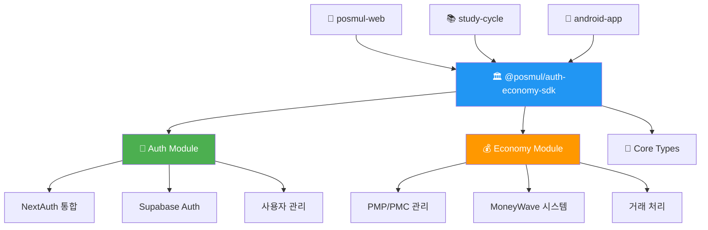
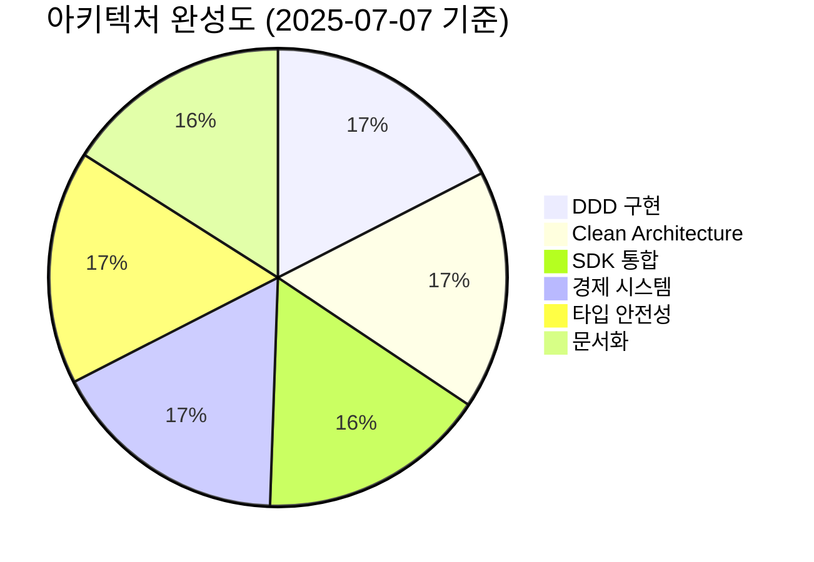
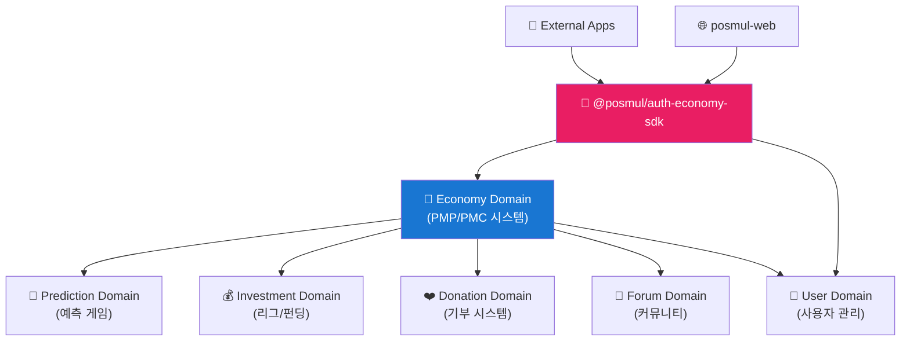
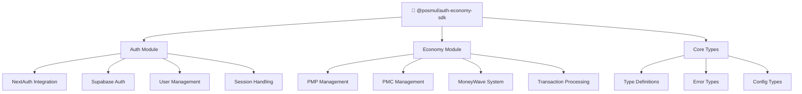
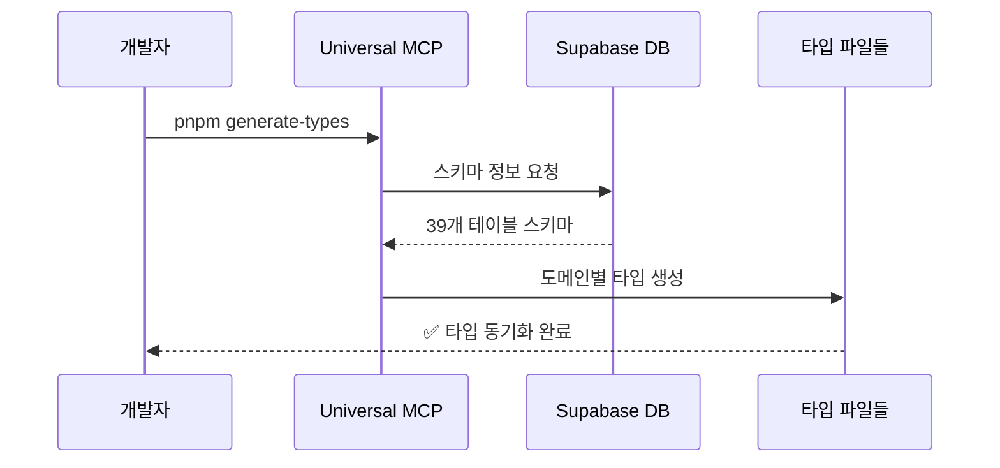
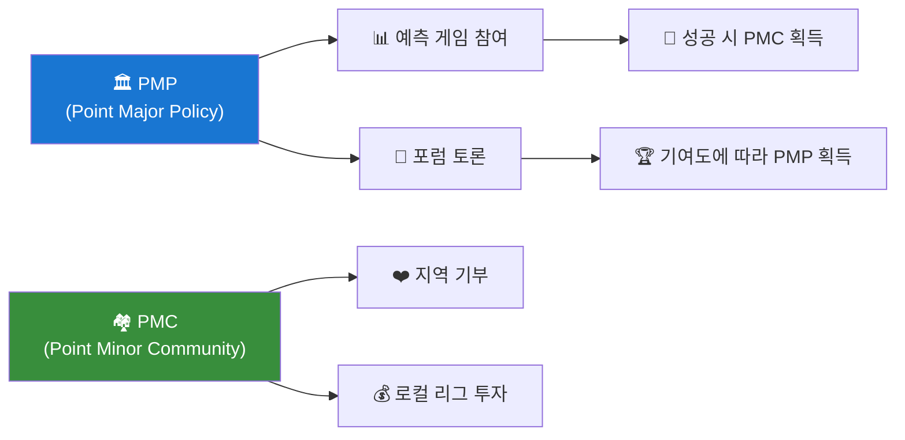
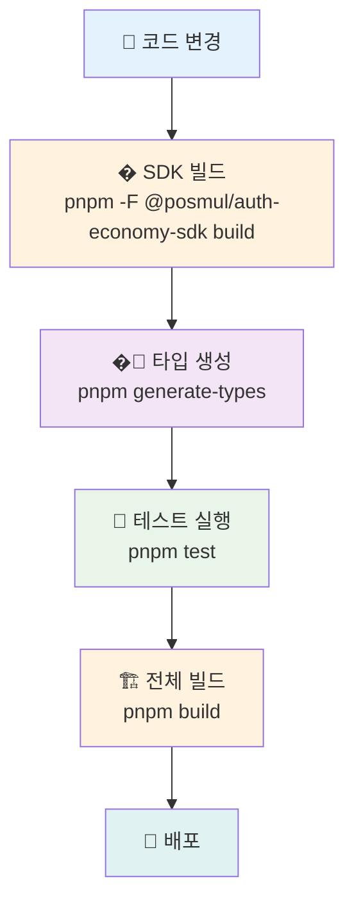
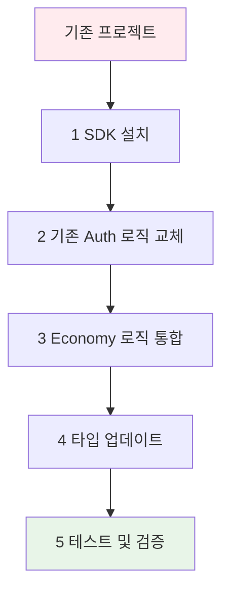

# PosMul: AI-Era Direct Democracy Platform

**PosMul**은 예측 게임과 지역 경제 연동을 통해 시민이 직접 참여하는 새로운 민주주의 경험을 제공하는 AI 시대 직접민주주의 플랫폼입니다. Next.js 15, Domain-Driven Design (DDD), Clean Architecture를 기반으로 구축되었습니다.
```
posmul/
├── apps/
│   ├── posmul-web/           # 🌐 Next.js 웹 애플리케이션
│   └── study-cycle/          # 📱 React Native 학습 앱 (모노레포 내)
├── packages/
│   ├── auth-economy-sdk/     # 🔐 통합 인증 + 경제 SDK (핵심 비즈니스 로직)
│   ├── shared-auth/          # 🔐 인증 공통 로직 (레거시, 단계적 마이그레이션)
│   └── shared-types/         # 📝 공유 타입 (DDD 엔티티)
├── docs/                     # 📖 프로젝트 문서
└── scripts/                  # 🔧 개발 도구

# 독립 앱들 (모노레포 외부)
study-cycle-standalone/       # 📚 독립 React Native 학습 앱
android-app/                  # 📱 DDD + Clean Architecture 안드로이드 앱 (별도 관리)
```

### 🆕 **새로운 SDK 아키텍처**



## 🎯 프로젝트 개요

- **플랫폼**: Next.js 15 App Router 기반 예측 게임 및 소셜 플랫폼
- **경제 시스템**: PMP/PMC 토큰 기반 Agency Theory 구현
- **아키텍처**: DDD + Clean Architecture + SOLID 원칙 + 독립적 서비스 SDK
- **백엔드**: Supabase (MCP를 통한 통합)
- **모노레포**: pnpm Workspaces + Turborepo
- **SDK 통합**: `@posmul/auth-economy-sdk` 기반 모듈화된 서비스
- **개발 환경**: Windows PowerShell 최적화

## 🚀 빠른 시작

본 프로젝트는 pnpm을 패키지 매니저로 사용하는 모노레포 환경이며, `@posmul/auth-economy-sdk`를 중심으로 한 모듈화된 아키텍처를 제공합니다.

### 1. 의존성 설치

```powershell
# 프로젝트 루트 디렉토리에서 실행
pnpm install

# 워크스페이스 패키지들 빌드 (필수)
pnpm build

# SDK 빌드 확인
pnpm --filter @posmul/auth-economy-sdk build
```

### 2. 웹 개발 서버 실행

```powershell
# 웹 애플리케이션 개발 서버 실행
pnpm --filter posmul-web dev

# 또는 루트에서 모든 앱 실행
pnpm dev
```

서버가 실행되면 다음 URL에서 접근 가능합니다:
- **로컬**: http://localhost:3000
- **네트워크**: http://192.168.x.x:3000

### 3. SDK 활용 확인

```typescript
// SDK 사용 예시
import { AuthService, EconomyService } from '@posmul/auth-economy-sdk';

// 인증 서비스 초기화
const authService = new AuthService(supabaseConfig);

// 경제 서비스 초기화  
const economyService = new EconomyService(supabaseConfig);

// PMP/PMC 잔액 조회
const balance = await economyService.getBalance(userId);
```

### 4. 데이터베이스 타입 생성

```powershell
# Supabase 스키마에서 TypeScript 타입 자동 생성
pnpm generate-types
```

### 5. 테스트 실행

```powershell
# 전체 테스트 실행
pnpm test

# SDK 테스트 실행
pnpm --filter @posmul/auth-economy-sdk test

# 특정 패키지 테스트 실행
pnpm --filter @posmul/shared-types test
```

## 🏗️ 아키텍처 현황

### 📊 **프로젝트 성숙도: S+ 등급 (SDK 통합 완료)**



### 🎯 **핵심 성과**

- ✅ **완벽한 도메인 분리**: 6개 스키마, 39개 테이블의 Schema-per-Bounded-Context 패턴
- ✅ **Agency Theory 구현**: PMP/PMC 이중 토큰 경제 시스템
- ✅ **MoneyWave 시스템**: 3단계 웨이브 기반 PMC 분배
- ✅ **타입 안전성**: Universal MCP를 통한 자동 타입 동기화
- ✅ **모노레포 최적화**: 3개 핵심 패키지의 효율적인 의존성 관리
- 🆕 **SDK 통합**: `@posmul/auth-economy-sdk`를 통한 독립적 서비스 연결
- 🆕 **모듈화된 아키텍처**: 인증/경제 시스템의 완전한 분리와 재사용성

## 📁 프로젝트 구조

```
posmul/
├── apps/
│   ├── posmul-web/           # 🌐 Next.js 웹 애플리케이션
│   └── study-cycle/          # 📱 React Native 학습 앱 (모노레포 내)
├── packages/
│   ├── auth-economy-sdk/     # 🔐 인증 + 경제 SDK (순수 비즈니스 로직)
│   ├── shared-auth/          # 🔐 인증 공통 로직 (레거시)
│   └── shared-types/         # 📝 공유 타입 (DDD 엔티티)
├── docs/                     # 📖 프로젝트 문서
└── scripts/                  # 🔧 개발 도구

# 독립 앱들 (모노레포 외부)
study-cycle-standalone/       # � 독립 React Native 학습 앱
android-app/                  # � DDD + Clean Architecture 안드로이드 앱 (별도 관리)
```

### 🏛️ **도메인 아키텍처 (DDD + SDK 통합)**



**실제 데이터베이스 구조**:
- **Economy 스키마**: 12개 테이블 (PMP/PMC 계정, 거래 내역, MoneyWave)
- **Prediction 스키마**: 5개 테이블 (게임, 예측, 정산, 통계)
- **Investment 스키마**: 4개 테이블 (투자 기회, 참여 내역)
- **Forum 스키마**: 7개 테이블 (포스트, 댓글, 투표)
- **Donation 스키마**: 4개 테이블 (기부, 기관 관리)
- **User 스키마**: 5개 테이블 (프로필, 설정)

**🆕 SDK 통합 혜택**:
- **재사용성**: 동일한 인증/경제 로직을 모든 앱에서 사용
- **일관성**: 통일된 인터페이스와 비즈니스 규칙
- **유지보수성**: 중앙화된 로직 관리

## 🔧 기술 스택

### **Frontend**
- **Framework**: Next.js 15 (App Router)
- **UI**: React 19, TypeScript, Tailwind CSS
- **State**: Zustand, React Query
- **Charts**: Recharts, Mermaid

### **Backend & Database**
- **Database**: Supabase (PostgreSQL)
- **Auth**: Supabase Auth + NextAuth 통합
- **Storage**: Supabase Storage
- **Integration**: MCP (Model Context Protocol)

### **SDK & Architecture**
- **Core SDK**: `@posmul/auth-economy-sdk`
- **Package Manager**: pnpm (Workspaces)
- **Build**: Turborepo
- **Architecture**: DDD + Clean Architecture + Hexagonal

### **Development Tools**
- **Testing**: Jest, React Testing Library, Playwright
- **Code Quality**: ESLint, Prettier, Husky
- **Type Generation**: Universal MCP Automation System

## 🆕 SDK 통합 시스템

### 📋 **@posmul/auth-economy-sdk 개요**

PosMul의 핵심 비즈니스 로직을 담은 통합 SDK로, 모든 앱에서 일관된 인증 및 경제 시스템을 제공합니다.



### 🎯 **주요 기능**

- **🔐 통합 인증**: NextAuth + Supabase Auth 완벽 통합
- **💰 경제 시스템**: PMP/PMC 관리, MoneyWave 자동화
- **🏗️ 타입 안전성**: 완전한 TypeScript 지원
- **🔄 재사용성**: 다중 플랫폼 지원 (Web, React Native, Android)
- **🛡️ 에러 처리**: Result 패턴 기반 안전한 에러 관리

### 📍 **SDK 활용 예시**

```typescript
// 인증 서비스 활용
import { AuthService } from '@posmul/auth-economy-sdk/auth';

const authService = new AuthService({
  supabaseUrl: process.env.NEXT_PUBLIC_SUPABASE_URL!,
  supabaseAnonKey: process.env.NEXT_PUBLIC_SUPABASE_ANON_KEY!,
});

// 사용자 로그인
const loginResult = await authService.signInWithEmail({
  email: 'user@example.com',
  password: 'password123'
});

// 경제 시스템 활용
import { EconomyService } from '@posmul/auth-economy-sdk/economy';

const economyService = new EconomyService(supabaseConfig);

// PMP/PMC 잔액 조회
const balanceResult = await economyService.getBalance(userId);
if (balanceResult.success) {
  console.log(`PMP: ${balanceResult.data.pmp}, PMC: ${balanceResult.data.pmc}`);
}

// MoneyWave 처리
const waveResult = await economyService.processMoneyWave({
  waveType: 'wave1',
  targetUsers: userIds,
  totalAmount: 1000
});
```

## 🤖 Universal MCP 시스템

### 📋 **시스템 개요**

Universal MCP Automation System은 Supabase 데이터베이스 스키마로부터 TypeScript 타입을 자동 생성하는 범용 자동화 도구입니다.



### 🎯 **주요 기능**

- ✅ **자동 타입 생성**: 데이터베이스 스키마 → TypeScript 타입
- ✅ **도메인별 분리**: 각 도메인에 맞는 타입만 추출
- ✅ **다중 프로젝트 지원**: 다른 프로젝트에도 적용 가능
- ✅ **실시간 동기화**: 스키마 변경 시 자동 업데이트

### 📍 **시스템 위치**

- **메인 시스템**: `C:\G\mcp-automation\` (독립 실행)
- **프로젝트 내 스크립트**: `apps/posmul-web/scripts/universal-mcp-automation.ts`
- **실행 명령어**: `pnpm generate-types`

## 📚 문서 구조

프로젝트 문서는 [Diátaxis 프레임워크](https://diataxis.fr/)를 따라 구성되어 있습니다.

```
docs/
├── tutorials/              # 🎓 학습 중심 가이드
├── guides/                 # 🛠️ 문제 해결 중심 가이드  
├── reference/              # 📖 정보 중심 레퍼런스
├── explanation/            # 💡 이해 중심 설명
├── reports/               # 📊 분석 보고서
└── archive/               # 📦 레거시 문서 보관
```

### 📖 **주요 문서**

- **[온보딩 튜토리얼](docs/tutorials/posmul-onboarding-for-new-devs.md)**: 신규 개발자 가이드
- **[아키텍처 개요](docs/architecture/posmul-comprehensive-architecture-overview.md)**: 전체 시스템 구조
- **[Universal MCP 가이드](docs/guides/manage-universal-types.md)**: 타입 관리 방법
- **[API 문서](docs/api/API_Documentation.md)**: REST API 레퍼런스
- **[SDK 가이드](packages/auth-economy-sdk/README.md)**: 통합 SDK 사용법

## 🌟 경제 시스템 특징

### 💰 **PMP/PMC 이중 토큰 시스템**



### 🌊 **MoneyWave 분배 시스템**

- **Wave 1**: 기본 PMC 분배 (전체 사용자)
- **Wave 2**: 활동 기반 추가 분배 (활성 사용자)
- **Wave 3**: 기여도 기반 보너스 (핵심 기여자)

## 🛠️ 개발 가이드

### **환경 설정**

1. **Node.js**: 18.x 이상
2. **pnpm**: 8.x 이상 (필수)
3. **PowerShell**: Windows 환경 최적화
4. **Supabase CLI**: MCP 통합으로 선택사항

### **개발 워크플로우 (SDK 통합)**



### **코딩 규칙**

- **아키텍처**: DDD + Clean Architecture 엄격 준수
- **SDK 활용**: `@posmul/auth-economy-sdk`를 통한 일관된 비즈니스 로직
- **타입 안전성**: 모든 외부 데이터는 Zod 검증
- **에러 처리**: Result 패턴 사용
- **스타일**: Prettier + ESLint 자동 포맷팅
- **모듈화**: 도메인별 독립적 패키지 구조

## 🧪 테스트 전략

- **Unit Tests**: 도메인 로직 및 SDK 메서드 (Jest)
- **Integration Tests**: API 엔드포인트 및 SDK 통합 (Jest)
- **E2E Tests**: 사용자 플로우 (Playwright)
- **Type Tests**: 타입 안전성 검증
- **SDK Tests**: 인증/경제 시스템 독립 테스트

## 🚀 배포

### **개발 환경**
```powershell
# SDK 포함 전체 개발 서버 시작
pnpm dev

# 특정 앱 개발
pnpm --filter posmul-web dev
```

### **프로덕션 빌드**
```powershell
# SDK 우선 빌드
pnpm --filter @posmul/auth-economy-sdk build

# 전체 빌드
pnpm build

# 프로덕션 실행
pnpm start
```

### **SDK 패키징**
```powershell
# SDK 독립 빌드 및 타입 생성
pnpm --filter @posmul/auth-economy-sdk build
pnpm --filter @posmul/auth-economy-sdk type-check
```

### **타입 동기화**
```powershell
# 데이터베이스 스키마 변경 후 실행
pnpm generate-types

# SDK 타입 업데이트
pnpm --filter @posmul/auth-economy-sdk build
```

## 📈 성능 지표

- **초기 로딩**: < 2초
- **SDK 초기화**: < 500ms
- **경제 계산**: < 1ms (100+ 주체)
- **인증 처리**: < 300ms
- **타입 생성**: < 30초 (39개 테이블)
- **빌드 시간**: < 3분 (전체 모노레포)
- **SDK 빌드**: < 1분

## 🤝 기여하기

1. **저장소 Fork**
2. **기능 브랜치 생성**: `git checkout -b feature/amazing-feature`
3. **변경사항 커밋**: `git commit -m 'Add amazing feature'`
4. **브랜치 푸시**: `git push origin feature/amazing-feature`
5. **Pull Request 생성**

### **기여 가이드라인**

- DDD 아키텍처 원칙 준수
- `@posmul/auth-economy-sdk` 인터페이스 호환성 유지
- 타입 안전성 유지
- 테스트 커버리지 80% 이상
- 문서 업데이트 포함
- SDK 변경 시 하위 호환성 보장

## 📄 라이선스

본 프로젝트는 MIT 라이선스를 따릅니다.

## 📞 지원

- **이슈 리포팅**: [GitHub Issues](https://github.com/your-org/posmul/issues)
- **문서**: [프로젝트 문서](docs/README.md)
- **아키텍처 문의**: [아키텍처 가이드](docs/architecture/)

---

**🎉 PosMul과 함께 AI 시대의 새로운 민주주의를 경험해보세요!**

---

## 🔄 SDK 마이그레이션 가이드

### **기존 프로젝트에서 SDK 적용하기**



### **마이그레이션 단계**

1. **SDK 설치**
```powershell
pnpm add @posmul/auth-economy-sdk
```

2. **기존 인증 로직 교체**
```typescript
// Before
import { createClient } from '@supabase/supabase-js';

// After  
import { AuthService } from '@posmul/auth-economy-sdk/auth';
const authService = new AuthService(config);
```

3. **경제 시스템 통합**
```typescript
// 기존 개별 구현 → SDK 통합
import { EconomyService } from '@posmul/auth-economy-sdk/economy';
const economyService = new EconomyService(config);
```

4. **점진적 마이그레이션**
- `shared-auth` → `@posmul/auth-economy-sdk/auth` (단계적 교체)
- 개별 경제 로직 → SDK 통합 메서드
- 타입 정의 통합

### **호환성 매트릭스**

| 플랫폼 | SDK 지원 | 상태 |
|--------|----------|------|
| Next.js Web | ✅ 완전 지원 | 프로덕션 |
| React Native | ✅ 완전 지원 | 개발 중 |
| Android Native | 🔄 계획 중 | 설계 |
| iOS Native | 🔄 계획 중 | 설계 |
