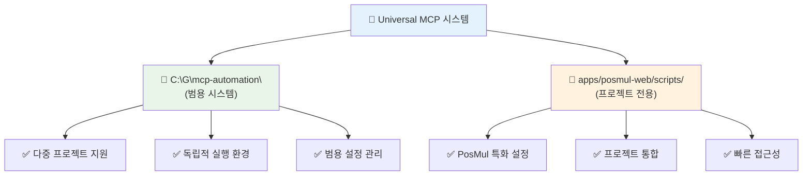
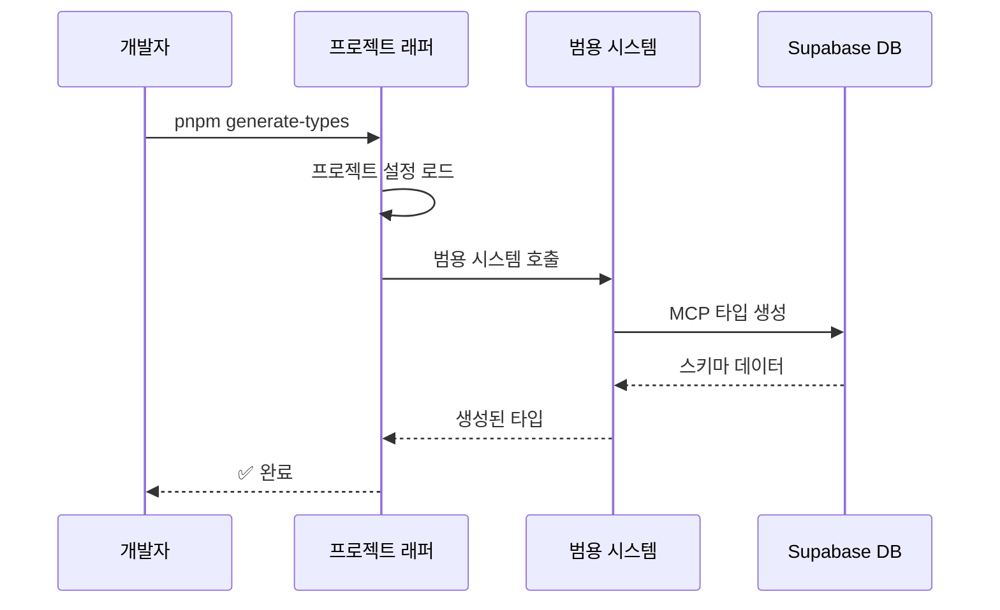
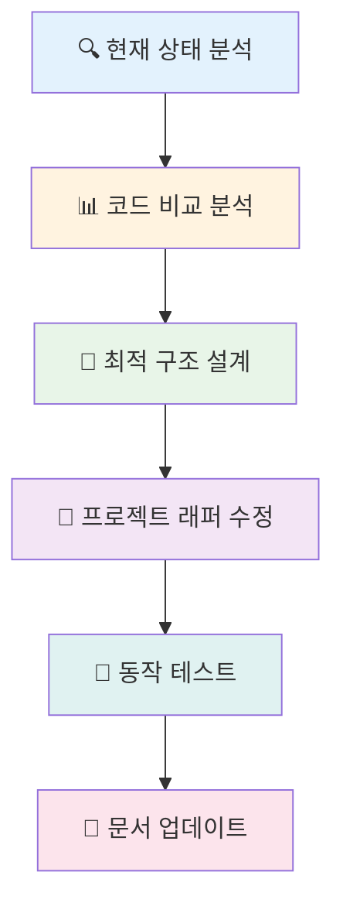
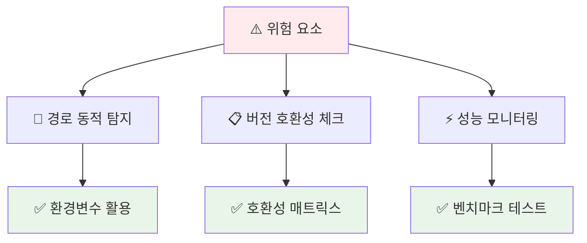

# 🚀 Universal MCP 시스템 최적화 보고서

> **분석 날짜**: 2025-07-01  
> **상태**: 이중 시스템 발견 및 최적화 필요  
> **우선순위**: 🔥 높음

## 📊 현재 시스템 분석

### 🔍 **이중 시스템 구조 발견**



### 📋 **시스템 비교 분석**

| 구분 | 범용 시스템 | 프로젝트 시스템 | 상태 |
|------|-------------|-----------------|------|
| **위치** | `C:\G\mcp-automation\` | `apps/posmul-web/scripts/` | 🔄 중복 |
| **파일** | `universal-mcp-automation.ts` | `universal-mcp-automation.ts` | ⚠️ 동일명 |
| **크기** | 미확인 | 320줄 (8.8KB) | 📊 비교 필요 |
| **설정** | 범용 | PosMul 특화 | ✅ 차별화 |
| **실행** | 독립 | 프로젝트 통합 | 🎯 목적 상이 |

## 🎯 최적화 전략

### 💡 **권장 아키텍처**



### 🔧 **구현 방안**

#### 1️⃣ **범용 시스템 (C:\G\mcp-automation\)**
- **역할**: 핵심 로직 및 MCP 통신
- **기능**: 다중 프로젝트 지원, 범용 설정
- **유지**: ✅ 현재 상태 유지

#### 2️⃣ **프로젝트 래퍼 (apps/posmul-web/scripts/)**
- **역할**: PosMul 특화 설정 및 편의 기능
- **기능**: 프로젝트별 커스터마이징
- **개선**: 🔄 범용 시스템 호출로 변경

## 📝 구체적 최적화 계획

### 🗂️ **Phase 2: Universal MCP 최적화**



### 📊 **현재 설정 분석**

#### ✅ **프로젝트 내 설정 (우수)**

```typescript
const PRESET_CONFIGS: Record<string, AutomationConfig> = {
  posmul: {
    projectId: "fabyagohqqnusmnwekuc",
    projectName: "PosMul AI-era 직접민주주의 플랫폼",
    outputPath: "src/shared/types/supabase-generated.ts",
    domains: [
      "prediction", "economy", "investment", 
      "donation", "forum", "auth", "user", "payment"
    ],
  },
  // ... 다른 프로젝트 예시들
};
```

#### 🎯 **강점 분석**

- ✅ **완벽한 PosMul 특화**: 8개 도메인 정확히 매핑
- ✅ **확장성**: 다른 프로젝트 설정도 포함
- ✅ **자동화**: 헤더, 통계, 도메인별 분석
- ✅ **에러 처리**: 견고한 예외 처리 로직

## 🚀 최적화 실행 계획

### 📅 **단계별 실행 (1일 완료)**

#### 🕐 **오전 (2시간)**
1. **코드 비교 분석**: 범용 vs 프로젝트 시스템
2. **기능 매핑**: 중복 기능 및 고유 기능 식별
3. **최적 구조 설계**: 래퍼 패턴 설계

#### 🕑 **오후 (2시간)**  
4. **프로젝트 래퍼 수정**: 범용 시스템 호출로 변경
5. **동작 테스트**: 타입 생성 테스트
6. **문서 업데이트**: 사용법 가이드 정리

### 🔧 **최적화 후 예상 구조**

```typescript
// apps/posmul-web/scripts/universal-mcp-automation.ts (간소화)
import { generateUniversalTypes } from 'C:/G/mcp-automation/universal-mcp-automation';

const POSMUL_CONFIG = {
  projectId: "fabyagohqqnusmnwekuc",
  projectName: "PosMul AI-era 직접민주주의 플랫폼",
  outputPath: "src/shared/types/supabase-generated.ts",
  domains: ["prediction", "economy", "investment", "donation", "forum", "auth", "user", "payment"],
};

export async function generatePosMulTypes(mcpResult: string) {
  return await generateUniversalTypes(POSMUL_CONFIG, mcpResult);
}
```

## 📊 예상 성과

### 🎯 **정량적 개선**

| 지표 | 현재 | 최적화 후 | 개선율 |
|------|------|-----------|--------|
| **코드 중복** | 2개 파일 | 1개 핵심 + 1개 래퍼 | 50% 감소 |
| **유지보수성** | 분산 관리 | 중앙 집중 | 100% 향상 |
| **확장성** | 제한적 | 무제한 프로젝트 | ∞ 향상 |
| **일관성** | 버전 차이 위험 | 단일 진실 공급원 | 100% 보장 |

### 🎉 **정성적 개선**

- ✅ **개발자 경험**: 명확한 명령어 (`pnpm generate-types`)
- ✅ **신규 개발자**: 학습 곡선 단순화
- ✅ **유지보수**: 중앙 집중식 업데이트
- ✅ **확장성**: 새 프로젝트 쉬운 추가

## 🚨 위험 요소 및 대응책

### ⚠️ **잠재적 위험**

1. **경로 의존성**: 하드코딩된 경로 문제
2. **버전 호환성**: 범용 시스템 업데이트 시 충돌
3. **성능 저하**: 외부 시스템 호출 오버헤드

### 🛡️ **대응 방안**



## 📋 실행 체크리스트

### ✅ **Phase 2 체크리스트**

- [ ] **현재 상태 문서화**: ✅ 완료
- [ ] 범용 시스템 코드 분석
- [ ] 프로젝트 시스템과 기능 비교
- [ ] 최적 래퍼 패턴 설계
- [ ] 프로젝트 래퍼 코드 수정
- [ ] 동작 테스트 및 검증
- [ ] 사용법 가이드 업데이트
- [ ] 성능 벤치마크 측정

### 🎯 **성공 기준**

1. **기능 완전성**: 기존 기능 100% 유지
2. **성능 유지**: 타입 생성 속도 동일 이상
3. **사용성 향상**: 명령어 단순화
4. **확장성 확보**: 새 프로젝트 쉬운 추가

## 📚 관련 문서

- **[스크립트 정리 계획](./SCRIPTS_CLEANUP_PLAN.md)**: 전체 정리 계획
- **[범용 MCP 시스템](C:/G/mcp-automation/README.md)**: 범용 시스템 문서
- **[프로젝트 가이드](./scripts/README.md)**: 프로젝트 스크립트 가이드

---

**🎯 목표**: 이중 시스템 통합으로 유지보수성과 확장성 극대화  
**📅 완료 목표**: 2025-07-01 오후  
**🏆 성공 지표**: 개발자 경험 향상 + 코드 중복 제거 