# PosMul 도메인 아키텍처 상세

> Clean Architecture + DDD 기반 구조 상세 문서 (개발자/기획자용)

---

## 📖 목차

1. [전체 아키텍처](#-전체-아키텍처)
2. [Bounded Contexts 맵](#️-bounded-contexts-맵)
3. [핵심 도메인 상세](#-핵심-도메인-상세)
4. [도메인 간 이벤트 흐름](#-도메인-간-이벤트-흐름)
5. [디렉터리 구조](#-디렉터리-구조)
6. [개발자를 위한 가이드](#-개발자를-위한-가이드)

---

## 📐 전체 아키텍처

### Clean Architecture 계층

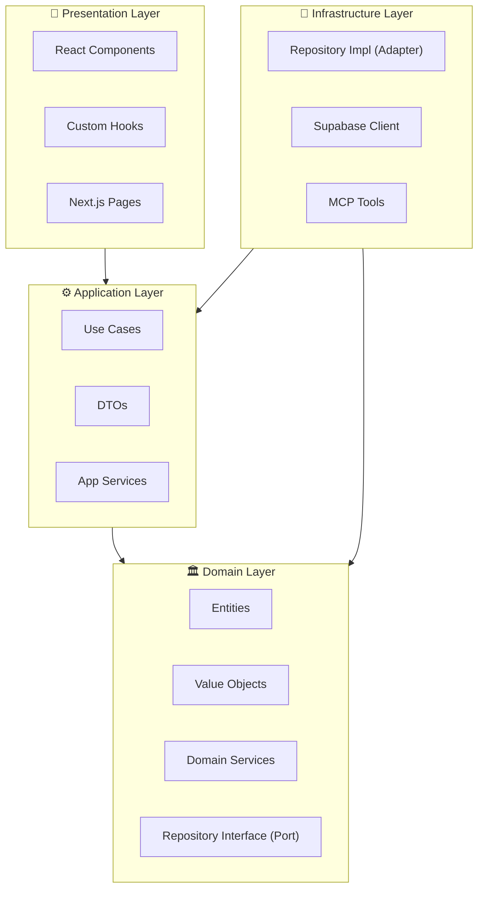

### 의존성 규칙

> [!IMPORTANT]
> **절대 원칙**: 의존성은 항상 **바깥쪽 → 안쪽**으로만 향합니다.
> 
> - Domain은 아무것도 import하지 않음 (순수 TypeScript)
> - Application은 Domain만 import
> - Infrastructure/Presentation은 Application과 Domain import

---

## 🗺️ Bounded Contexts 맵

### 재화 기준 분류

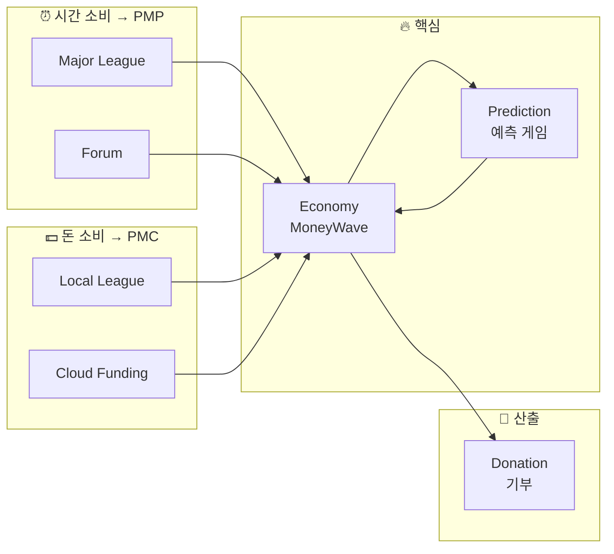

### 도메인 역할 정의

| 도메인 | 유형 | 역할 | 재화 |
|--------|------|------|------|
| **Economy** | 핵심 | MoneyWave, PMP/PMC 관리 | - |
| **Prediction** | 핵심 | 예측 게임, PMP→PMC 변환 | - |
| **Consume** | 지원 | Major/Local League, Cloud Funding | 시간+돈 |
| **Forum** | 지원 | 토론, 집단지성, Agency Score 연계 | 시간 |
| **Donation** | 지원 | 기부 실행, 투명성 | - |
| **Auth** | 일반 | 인증 | - |
| **User** | 일반 | 사용자 프로필 | - |

### Forum 분리 근거

> [!TIP]
> **Forum을 Consume에서 분리한 이유**
> 
> 1. **자체 Aggregate**: Post, Comment, Vote 등 독립 엔티티
> 2. **예측 연계**: `CreatePredictionFromForum` - 토론 → 예측 게임 생성
> 3. **Agency Score**: `socialLearning` 지표의 데이터 소스
> 4. **확장성**: 뉴스 큐레이션, AI 요약 등 향후 기능 확장

---

## 🎯 핵심 도메인 상세

### Prediction 도메인

**역할**: 예측 게임 생명주기 관리, PMP 베팅, PMC 정산

#### 엔티티 다이어그램

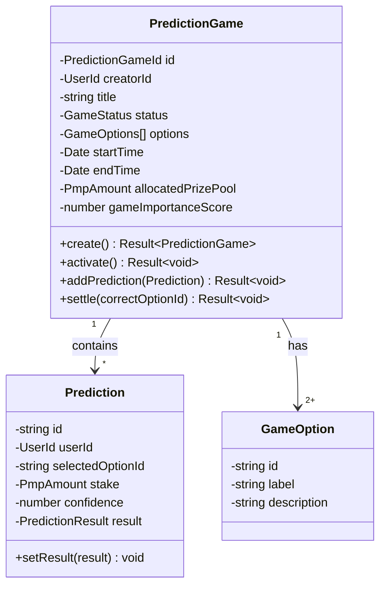

#### 상태 흐름

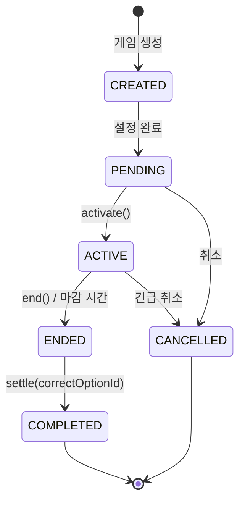

#### 파일 통계

| 계층 | 파일 수 | 주요 파일 |
|------|---------|-----------|
| domain/entities | 3 | `prediction-game.aggregate.ts` (651줄) |
| domain/value-objects | 6 | `prediction-types.ts` |
| application/use-cases | 19 | `CreatePredictionGame.ts` |
| presentation/components | 62 | `PredictionCard.tsx` |

---

### Economy 도메인

**역할**: MoneyWave 1-2-3 운영, PMP/PMC 발행 및 관리

#### 엔티티 다이어그램

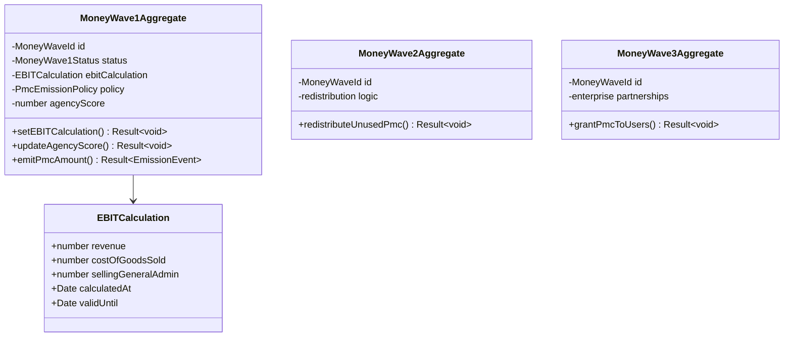

#### 파일 통계

| 계층 | 파일 수 | 주요 파일 |
|------|---------|-----------|
| domain/entities | 5 | `money-wave1.aggregate.ts` (477줄) |
| domain/value-objects | 4 | `pmp-amount.ts`, `pmc-amount.ts` |
| domain/services | 20 | `EconomicForecastingService.ts` |
| application/use-cases | 22 | `EmitPmc.ts` |

---

### Forum 도메인

**역할**: 토론 관리, PMP 보상, 예측 게임 연계, Agency Score 기여

#### 엔티티 다이어그램

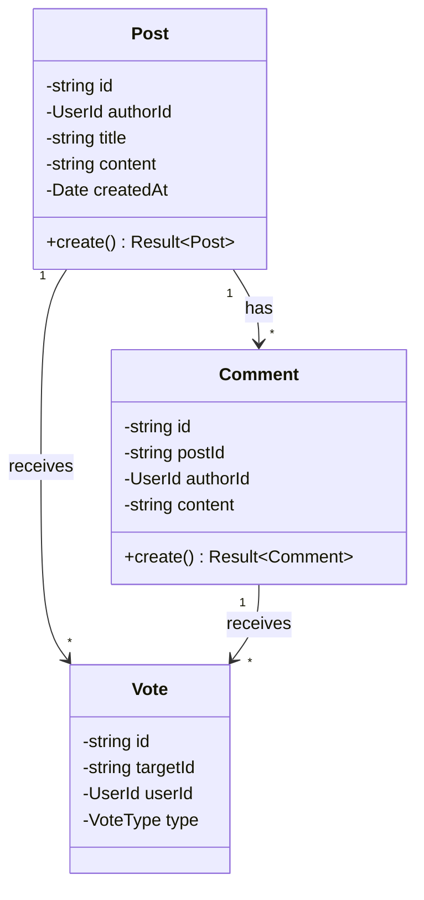

#### 주요 서비스

| 서비스 | 역할 | 연계 도메인 |
|--------|------|-------------|
| `RewardForumActivity` | 활동 → PMP 지급 | Economy |
| `CreatePredictionFromForum` | 토론 → 예측 생성 | Prediction |
| `ForumActivityLog` | 활동 로그 → Agency Score | Economy |

---

### Consume 도메인

**역할**: 광고/소비/펀딩 채널 관리

#### 서비스별 엔티티

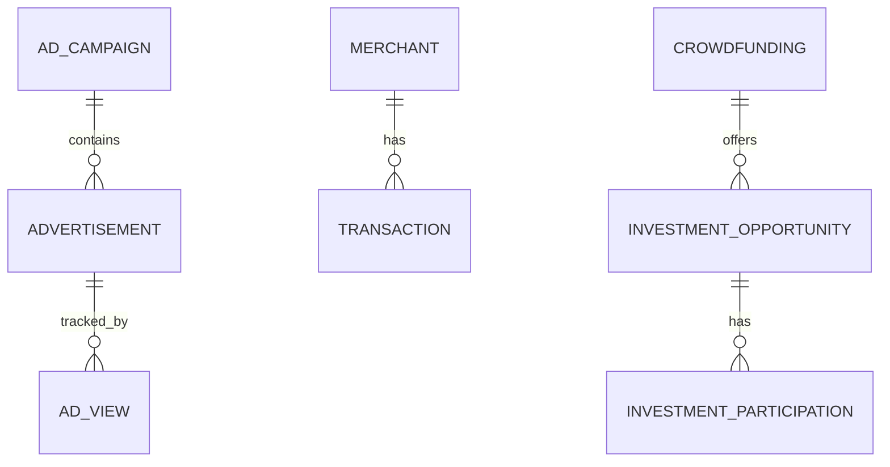

| 서비스 | 엔티티 | 재화 | 화폐 |
|--------|--------|------|------|
| Major League | AdCampaign, Advertisement, AdView | 시간 | PMP |
| Local League | Merchant | 돈 | PMC |
| Cloud Funding | Crowdfunding, InvestmentOpportunity | 돈 | PMC |

---

### Donation 도메인

**역할**: 기부 실행, 투명성 관리

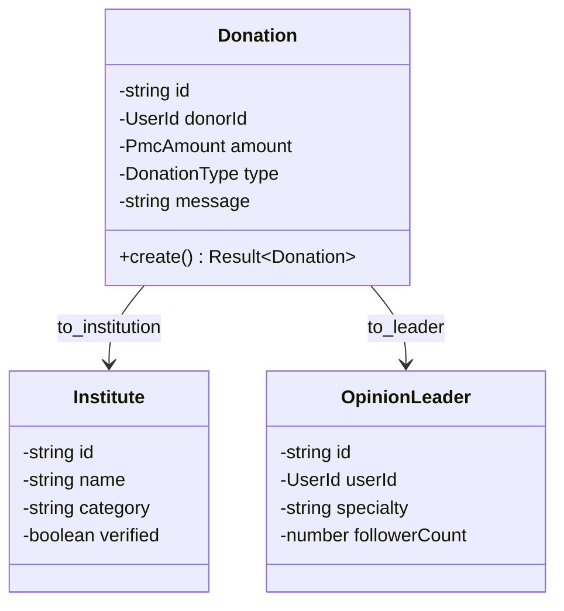

---

## 🔄 도메인 간 이벤트 흐름

### 전체 시퀀스

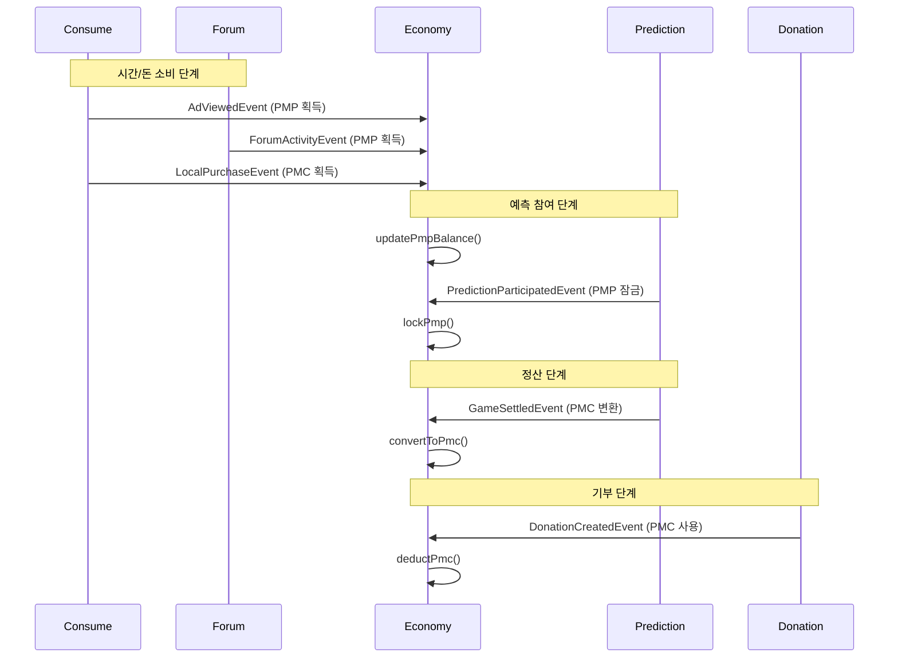

### Forum → Economy → Prediction 연계

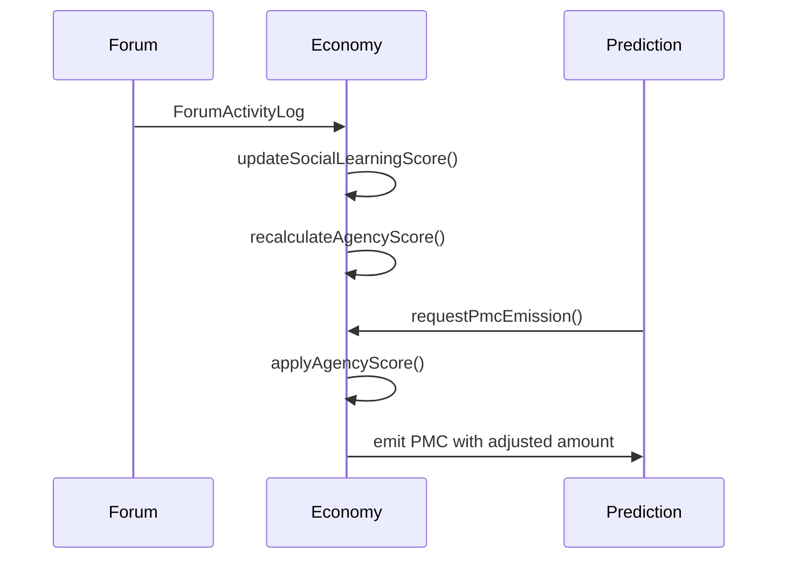

---

## 📁 디렉터리 구조

### 전체 구조

```
bounded-contexts/
├── auth/                    # 인증 (23 files)
├── consume/                 # 소비 (47 files)
│   ├── domain/
│   │   ├── entities/        # Merchant, AdCampaign, Crowdfunding...
│   │   ├── repositories/    # 9개 인터페이스
│   │   └── services/        # 4개 도메인 서비스
│   ├── application/
│   │   └── use-cases/       # 13개 유스케이스
│   ├── infrastructure/
│   └── presentation/
├── forum/                   # 포럼 - 시간 소비 (22 files)
│   ├── domain/
│   │   ├── entities/        # Post, Comment, Vote
│   │   ├── repositories/    # 1개
│   │   └── value-objects/   # 1개
│   ├── application/
│   │   └── use-cases/       # 3개
│   ├── infrastructure/
│   └── presentation/
├── prediction/              # 예측 (122 files) ⭐ 가장 큰 도메인
│   ├── domain/
│   │   ├── entities/        # PredictionGame, Prediction
│   │   ├── value-objects/   # 6개 VO
│   │   └── services/        # 2개 도메인 서비스
│   ├── application/
│   │   └── use-cases/       # 19개 유스케이스
│   ├── infrastructure/
│   └── presentation/        # 62개 컴포넌트
├── donation/                # 기부 (36 files)
│   ├── domain/
│   │   ├── entities/        # Donation, Institute, OpinionLeader
│   │   └── repositories/    # 4개 인터페이스
│   └── ...
├── economy/                 # 경제 (80 files) ⭐ 핵심 도메인
│   ├── domain/
│   │   ├── entities/        # MoneyWave1, 2, 3
│   │   ├── value-objects/   # PmpAmount, PmcAmount
│   │   └── services/        # 20개 도메인 서비스
│   └── ...
└── user/                    # 사용자 (9 files)
```

### 파일 통계

| 도메인 | 파일 수 | 엔티티 | 유스케이스 | 컴포넌트 |
|--------|---------|--------|------------|----------|
| prediction | 122 | 2 | 19 | 62 |
| economy | 80 | 5 | 22 | 4 |
| consume | 47 | 8 | 13 | 6 |
| donation | 36 | 6 | 7 | 9 |
| forum | 22 | 5 | 3 | 8 |
| auth | 23 | - | - | - |
| user | 9 | - | - | - |

---

## 👨‍💻 개발자를 위한 가이드

### 새 기능 개발 순서

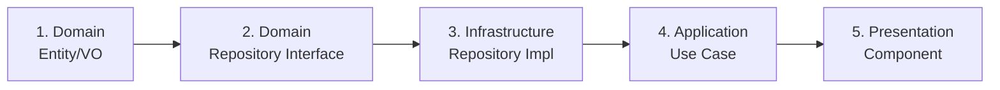

### 체크리스트

**Domain Layer**:
- [ ] Entity는 불변 (private constructor, static create)
- [ ] Value Object는 순수 함수
- [ ] Repository는 Interface만 정의
- [ ] 외부 라이브러리 import 금지

**Application Layer**:
- [ ] Use Case당 하나의 책임
- [ ] DTO로 데이터 변환
- [ ] Domain Repository Interface 주입

**Infrastructure Layer**:
- [ ] Repository Interface 구현
- [ ] Supabase 클라이언트 사용
- [ ] 에러 처리 및 로깅

**Presentation Layer**:
- [ ] Use Case Hook 사용
- [ ] 상태 관리 (Zustand)
- [ ] 컴포넌트 분리

### 새 도메인 추가 시

```powershell
# 워크플로우 참조
cat c:\G\.agent\workflows\domain-add.md
```

---

## 📚 관련 문서

- [플랫폼 개요](../business/PLATFORM_OVERVIEW.md)
- [기획-코드 분석](../business/PLANNING_VS_CODEBASE_ANALYSIS.md)
- [경제 시스템 상세](../business/ECONOMY_SYSTEM_DETAIL.md)
- [향후 로드맵](../business/FUTURE_ROADMAP.md)

---

**버전**: 2.0 | **작성일**: 2026-01-13 | **최종 수정**: Forum 도메인 상세 추가, 개발자 가이드 강화
