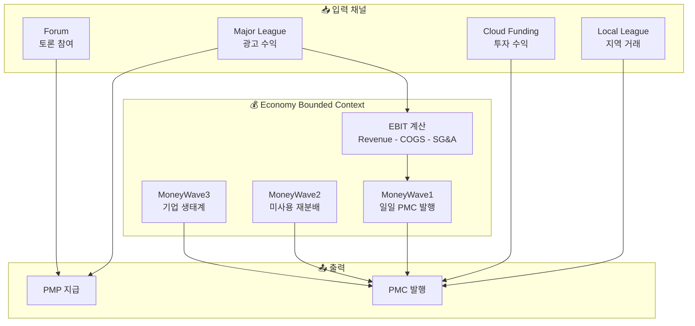
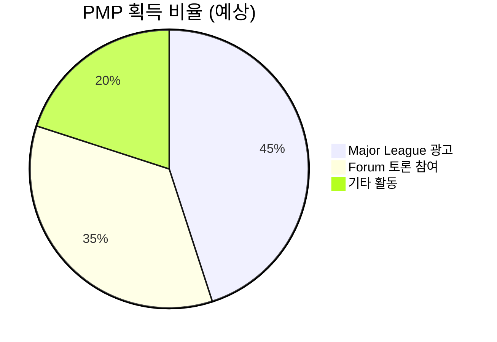
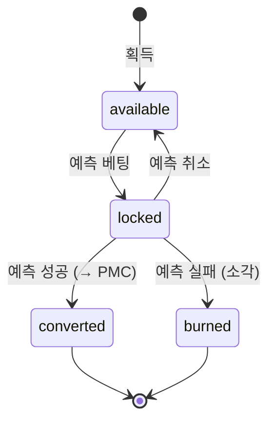
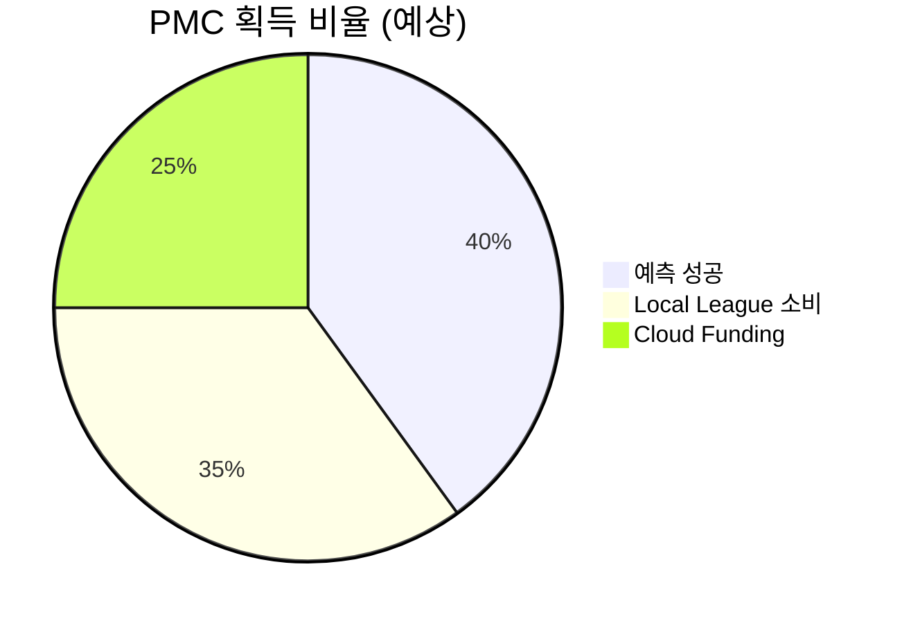
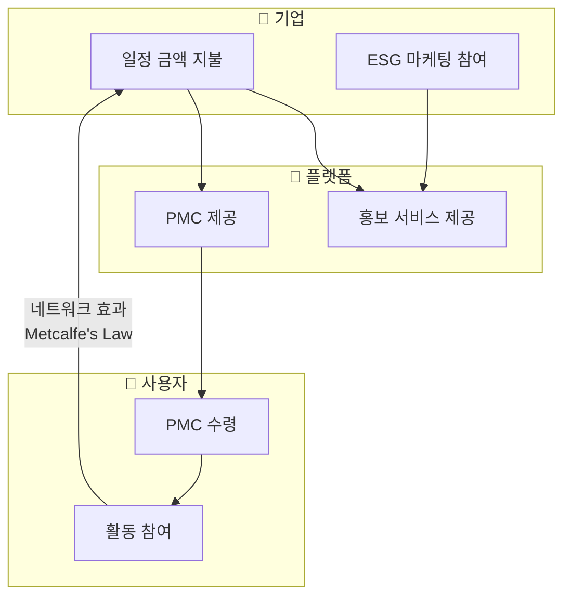

# PosMul 경제 시스템 상세 문서

> PMP/PMC 이중 화폐와 MoneyWave 메커니즘의 기술적 상세

---

## 📖 목차

1. [경제 시스템 아키텍처](#️-경제-시스템-아키텍처)
2. [PMP (Positive Multiplier Point)](#-pmp-positive-multiplier-point)
3. [PMC (Positive Multiplier Coin)](#-pmc-positive-multiplier-coin)
4. [MoneyWave 메커니즘](#-moneywave-메커니즘)
5. [경제학 이론 적용](#-경제학-이론-적용)
6. [리스크 관리](#-리스크-관리)
7. [개발자를 위한 구현 가이드](#-개발자를-위한-구현-가이드)

---

## 🏛️ 경제 시스템 아키텍처

### 전체 흐름도



### 재화-화폐 매핑

| 소비 재화 | 채널 | 획득 화폐 | 경제학적 성격 |
|-----------|------|-----------|---------------|
| **시간** | Major League, Forum | PMP | 무위험 자산 (Risk-Free) |
| **돈** | Local League, Cloud Funding | PMC | 위험 자산 (Risky Asset) |

---

## 💎 PMP (Positive Multiplier Point)

### 속성 정의

| 속성 | 값 | 경제학적 의미 |
|------|-----|---------------|
| **위험도** | 무위험 (Risk-Free) | CAPM 모델의 R_f |
| **변동성** | 없음 | 고정 가치 |
| **발행량** | 활동 기반 | 상한 없음 |
| **소각** | 예측 실패 시 | pmp_locked → 소각 |

### 획득 경로 (시간 소비)



| 채널 | 메커니즘 | 예상 비중 |
|------|----------|-----------|
| **Major League** | 광고 시청 완료 보너스 | 45% |
| **Forum** | 게시글/댓글/투표 활동 보상 | 35% |
| **기타** | 설문, 이벤트 참여 | 20% |

### 상태 전이 (State Machine)



### 코드 구현

```typescript
// 파일: economy/domain/value-objects/pmp-amount.ts
interface PmpAccountState {
  pmp_available: number;  // 사용 가능
  pmp_locked: number;     // 예측 베팅 중
}

// 획득 (시간 소비 보상)
function earnPmp(amount: number): void {
  pmp_available += amount;
}

// 베팅 (예측 참여)
function stakePmp(amount: number): void {
  pmp_available -= amount;
  pmp_locked += amount;
}

// 예측 성공 → PMC 변환
function convertToPmc(amount: number): PmcAmount {
  pmp_locked -= amount;
  return createPmcAmount(amount * conversionRate);
}

// 예측 실패 → 소각
function burnPmp(amount: number): void {
  pmp_locked -= amount;  // 영구 소각
}
```

---

## 🪙 PMC (Positive Multiplier Coin)

### 속성 정의

| 속성 | 값 | 경제학적 의미 |
|------|-----|---------------|
| **위험도** | 위험 (Risky Asset) | CAPM 모델의 β 반영 |
| **변동성** | 있음 | EBIT 연동 |
| **발행량** | EBIT 기반 | 상한 있음 |
| **사용** | 기부 전용 | 환금 불가 |

### 획득 경로



| 채널 | 메커니즘 | 예상 비중 |
|------|----------|-----------|
| **예측 성공** | PMP → PMC 변환 | 40% |
| **Local League** | 지역 소비 즉시 적립 | 35% |
| **Cloud Funding** | 투자 성과 배분 | 25% |

---

## 🌊 MoneyWave 메커니즘

### MoneyWave1: EBIT 기반 발행

**역할**: 플랫폼 수익을 기반으로 PMC를 자동 발행

**구현 파일**: `economy/domain/entities/money-wave1.aggregate.ts` (477줄)

```typescript
interface EBITCalculation {
  revenue: number;              // 매출
  costOfGoodsSold: number;      // 매출원가
  sellingGeneralAdmin: number;  // 판관비
  calculatedAt: Date;           // 계산 시점
  validUntil: Date;             // 유효 기간
}

// EBIT 계산
const ebit = revenue - costOfGoodsSold - sellingGeneralAdmin;

// 연간 순이익 추정 (세금/이자 25% 가정)
const annualNetIncome = ebit * 0.75;

// 일일 최대 발행량
const maxDailyEmission = annualNetIncome / 365;

// 시간당 발행량 (확장 예정)
const hourlyEmission = maxDailyEmission / 24;
```

**Agency Score (Jensen & Meckling 공식)**:

```typescript
// 정보 비대칭 해소 지표
agencyScore = 
  informationTransparency * 0.4 +  // 정보 투명성 (40%)
  predictionAccuracy * 0.3 +        // 예측 정확도 (30%)
  socialLearning * 0.3;             // 사회 학습 - Forum 연계 (30%)

// 실제 발행량 = 요청량 × Agency 조정 계수
actualEmission = requestedAmount * agencyScore * riskAdjustmentFactor;
```

> [!NOTE]
> **Forum과 Agency Score의 연결**
> 
> `socialLearning` 지표는 Forum 도메인의 활동 데이터를 기반으로 계산됩니다.
> 활발한 토론 → 높은 사회학습 점수 → 더 많은 PMC 발행 가능

### MoneyWave2: 미사용 재분배

**역할**: 장기 미사용 PMC를 활성 사용자에게 재분배

**구현 파일**: `economy/domain/entities/money-wave2.aggregate.ts`


**Kahneman-Tversky 손실회피 적용**:

| 경과 일수 | 조치 | 심리적 효과 |
|-----------|------|-------------|
| 7일 | 경고 알림 | 인지 환기 |
| 14일 | 손실 프레이밍 알림 | 손실 회피 유발 |
| 21일 | 최종 경고 | 긴급 사용 유도 |
| 30일 | 재분배 풀 전환 | 실제 재분배 |

### MoneyWave3: 기업 생태계

**역할**: 기업의 ESG 마케팅과 연계하여 PMC 유통

**구현 파일**: `economy/domain/entities/money-wave3.aggregate.ts` (21,178줄 - 가장 큰 도메인 파일)



---

## 📊 경제학 이론 적용

### CAPM (Capital Asset Pricing Model)

```
E[R_PMC] = R_f + β(E[R_m] - R_f)
```

| 변수 | PosMul 매핑 | 설명 |
|------|-------------|------|
| R_f | PMP 보유 수익 (0) | 무위험 수익률 |
| β | 플랫폼 리스크 계수 | 시장 대비 변동성 |
| E[R_m] | 예측 시장 기대 수익 | 전체 예측 성공률 |

### Prospect Theory (Kahneman-Tversky)

```typescript
// 가치 함수 구현
function prospectValue(x: number, reference: number): number {
  const delta = x - reference;
  const alpha = 0.88;  // 이득 민감도 계수
  const beta = 0.88;   // 손실 민감도 계수
  const lambda = 2.25; // 손실회피 계수 (실험 검증값)
  
  if (delta >= 0) {
    // 이득: v(x) = x^α
    return Math.pow(delta, alpha);
  } else {
    // 손실: v(x) = -λ(-x)^β
    return -lambda * Math.pow(-delta, beta);
  }
}
```

**적용 사례**:
- MoneyWave2의 미사용 경고 (손실 프레이밍)
- 예측 실패 시 PMP 소각 (손실 회피 심리 활용)

### Agency Theory (Jensen & Meckling, 1976)

| 개념 | PosMul 적용 |
|------|-------------|
| **Principal** | 국민/시민 |
| **Agent** | 관료/정치인 |
| **정보 비대칭 문제** | 예측 게임으로 집단지성 활용하여 해결 |
| **측정 지표** | Agency Score (0~1) |

---

## 🔒 리스크 관리

### 인플레이션 방지

```typescript
// 일일 발행 상한 강제
const DAILY_EMISSION_CAP = ebit * 0.75 / 365;

function validateEmission(requestedAmount: number): Result<void> {
  if (requestedAmount > DAILY_EMISSION_CAP) {
    return Result.failure("EMISSION_LIMIT_EXCEEDED");
  }
  return Result.success();
}
```

### 버블 방지 (Shiller CAPE 지표)

```typescript
// Cyclically Adjusted Price-to-Earnings
const cape = currentPMCValue / averageEarnings10Year;

function checkBubbleRisk(): void {
  if (cape > 25) {
    emitBubbleWarning();      // 경고 발동
    reduceEmissionRate(0.5);  // 발행률 50% 감소
  }
}
```

---

## 👨‍💻 개발자를 위한 구현 가이드

### 파일 구조

```
bounded-contexts/economy/
├── domain/
│   ├── entities/
│   │   ├── money-wave.entity.ts       # 공통 엔티티
│   │   ├── money-wave1.aggregate.ts   # EBIT 발행 (477줄)
│   │   ├── money-wave2.aggregate.ts   # 재분배 (6,171줄)
│   │   └── money-wave3.aggregate.ts   # 기업 생태계 (21,178줄)
│   ├── value-objects/
│   │   ├── pmp-amount.ts
│   │   └── pmc-amount.ts
│   └── services/                      # 20개 도메인 서비스
├── application/
│   └── use-cases/                     # 22개 유스케이스
└── infrastructure/
    └── repositories/                  # 16개 구현체
```

### 핵심 API

| 함수 | 역할 | 반환 |
|------|------|------|
| `createPmpAmount(n)` | PMP 값 객체 생성 | `PmpAmount` |
| `createPmcAmount(n)` | PMC 값 객체 생성 | `PmcAmount` |
| `unwrapPmpAmount(pmp)` | PMP 숫자 추출 | `number` |
| `unwrapPmcAmount(pmc)` | PMC 숫자 추출 | `number` |

### 의존성 주입

```typescript
// DI Container에서 사용
const moneyWave1 = MoneyWave1Aggregate.create(id, {
  emissionRate: 0.5,
  agencyScoreThreshold: 0.6,
  riskAdjustmentFactor: 1.2
});
```

---

## 📚 관련 문서

- [플랫폼 개요](./PLATFORM_OVERVIEW.md)
- [기획-코드 분석](./PLANNING_VS_CODEBASE_ANALYSIS.md)
- [향후 로드맵](./FUTURE_ROADMAP.md)
- [도메인 아키텍처 상세](../architecture/DOMAIN_ARCHITECTURE_DETAIL.md)

---

**버전**: 2.0 | **작성일**: 2026-01-13 | **최종 수정**: Forum 연계 명시, 개발자 가이드 추가
