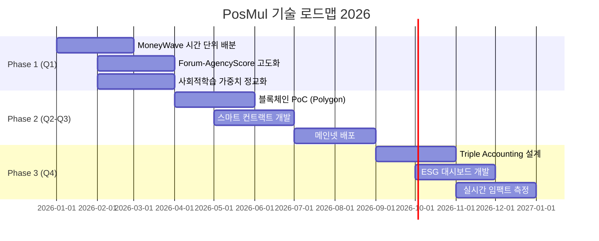
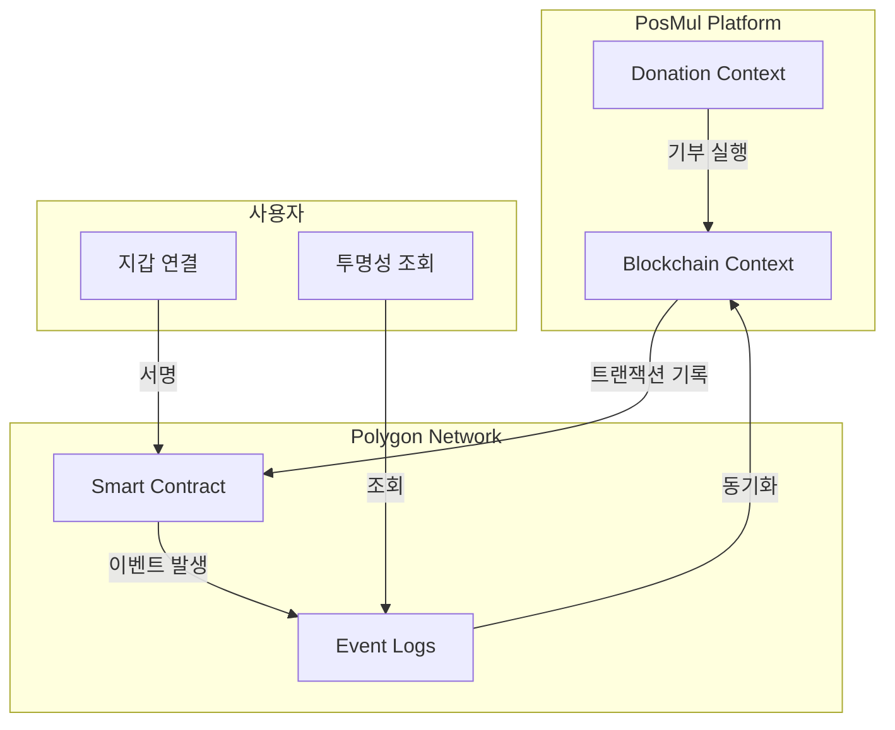
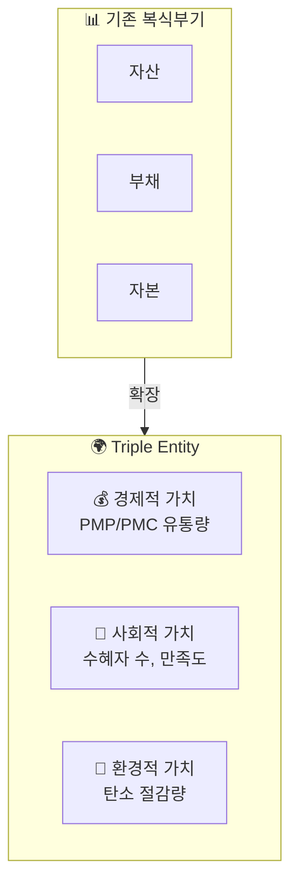
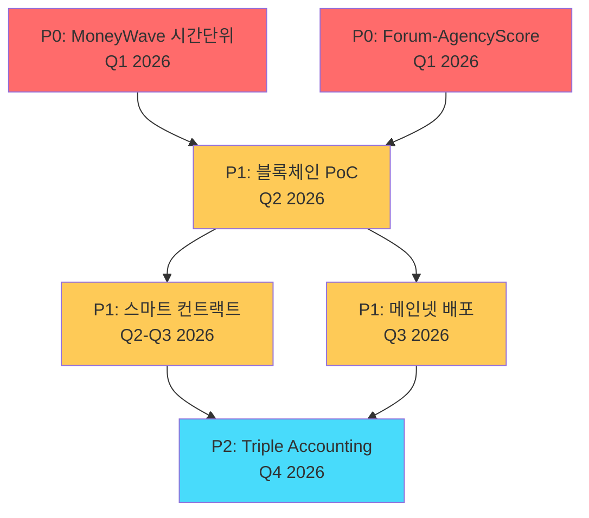

# PosMul 향후 개발 로드맵

> 블록체인 통합 및 Triple Entity Accounting 구현 계획

---

## 📖 목차

1. [로드맵 개요](#-로드맵-개요)
2. [Phase 1: 현재 시스템 고도화](#phase-1-현재-시스템-고도화-q1-2026)
3. [Phase 2: 블록체인 통합](#phase-2-블록체인-통합-q2-q3-2026)
4. [Phase 3: Triple Entity Accounting](#phase-3-triple-entity-accounting-q4-2026)
5. [우선순위 및 의존성](#-우선순위-및-의존성)
6. [마일스톤 요약](#-마일스톤-요약)

---

## 🎯 로드맵 개요

### 전체 일정



### 현재 상태 vs 목표

| 영역 | 현재 | 목표 |
|------|------|------|
| **배분 단위** | 일일 (/365) | 시간 (/24) |
| **기부 투명성** | DB 기반 추적 | 블록체인 100% 투명 |
| **가치 측정** | 경제적 가치만 | 경제+사회+환경 |
| **Forum 연계** | Agency Score 30% | 실시간 집단지성 지표 |

---

## Phase 1: 현재 시스템 고도화 (Q1 2026)

### 1.1 MoneyWave 시간 단위 배분

**현재 상태**: 일일 배분 (`annualNetIncome / 365`)  
**목표**: 시간 단위 배분 (`dailyEmission / 24`)

```typescript
// 현재 구현
const dailyEmission = annualNetIncome / 365;

// 목표 구현
const hourlyEmission = dailyEmission / 24;

// 각 예측 게임에 시간별 배분
function distributeHourly(games: PredictionGame[]): void {
  const totalWeight = games.reduce((sum, g) => sum + g.gameImportanceScore, 0);
  
  for (const game of games) {
    const allocation = hourlyEmission * (game.gameImportanceScore / totalWeight);
    game.setAllocatedPrizePool(allocation);
  }
}
```

**작업 항목**:
- [ ] 시간 단위 cron 스케줄러 구현
- [ ] 게임별 시간 가중치 분배 로직
- [ ] 실시간 배분 대시보드 UI

### 1.2 Forum-AgencyScore 연계 고도화

**현재 상태**: Forum 활동 → socialLearning 점수 (30%)  
**목표**: 실시간 집단지성 지표, 예측 정확도 예측

```typescript
// 현재
agencyScore = 
  informationTransparency * 0.4 +
  predictionAccuracy * 0.3 +
  socialLearning * 0.3;  // Forum 기반

// 목표: Forum 활동 심층 분석
interface ForumIntelligenceScore {
  discussionDepth: number;      // 토론 깊이
  diversityOfOpinions: number;  // 의견 다양성
  expertParticipation: number;  // 전문가 참여율
  consensusLevel: number;       // 합의 수준
}

socialLearning = calculateForumIntelligence(forumData);
```

**작업 항목**:
- [ ] Forum 활동 분석 알고리즘
- [ ] 전문가 식별 시스템
- [ ] 집단지성 품질 지표

### 1.3 사회적학습 가중치 정교화

**현재**: 단일 점수 (1.0 ~ 5.0)  
**목표**: 다차원 가중치 시스템

| 요소 | 비중 | 측정 방식 |
|------|------|-----------|
| **정보 투명성** | 40% | 게임 설명 품질, 출처 명시 |
| **예측 정확도** | 30% | 과거 참여자 적중률 |
| **사회 학습** | 30% | Forum 집단지성 지표 |

---

## Phase 2: 블록체인 통합 (Q2-Q3 2026)

### 2.1 목표

> **"기부의 100% 투명성 확보"**

- 모든 기부 트랜잭션 온체인 기록
- 기부금 사용처 실시간 추적
- 불변성 보장 (위변조 불가)
- 수혜자 확인 및 피드백

### 2.2 기술 선택

| 체인 | 장점 | 단점 | 적합도 |
|------|------|------|--------|
| **Polygon** | 저비용, 이더리움 호환, 검증됨 | 중앙화 우려 | ⭐⭐⭐⭐⭐ |
| Solana | 고속 처리, 저비용 | 복잡한 개발 환경 | ⭐⭐⭐ |
| Ethereum | 최고 신뢰도 | 높은 가스비 | ⭐⭐ |
| Klaytn | 한국 친화적 | 글로벌 생태계 제한 | ⭐⭐⭐⭐ |

> [!IMPORTANT]
> **권장**: Polygon (PoS)
> - 이더리움 호환으로 개발 용이
> - 가스비 0.01$ 미만
> - 충분한 탈중앙화

### 2.3 새로운 Bounded Context: `blockchain`

```
bounded-contexts/blockchain/
├── domain/
│   ├── entities/
│   │   ├── OnChainTransaction.ts
│   │   ├── SmartContractEvent.ts
│   │   └── WalletAddress.ts
│   ├── repositories/
│   │   └── IBlockchainRepository.ts
│   └── value-objects/
│       ├── TransactionHash.ts
│       └── BlockNumber.ts
├── application/
│   └── use-cases/
│       ├── RecordDonationOnChain.ts
│       ├── VerifyTransaction.ts
│       ├── GenerateTransparencyReport.ts
│       └── LinkWalletToUser.ts
└── infrastructure/
    └── adapters/
        ├── PolygonAdapter.ts
        └── EthersProvider.ts
```

### 2.4 스마트 컨트랙트 (Solidity)

```solidity
// SPDX-License-Identifier: MIT
pragma solidity ^0.8.20;

contract PosMulDonationTracker {
    struct Donation {
        address donor;
        address recipient;
        uint256 amount;
        uint256 timestamp;
        string purpose;
        DonationType donationType;
    }
    
    enum DonationType { DIRECT, INSTITUTION, OPINION_LEADER }
    
    mapping(bytes32 => Donation) public donations;
    mapping(address => bytes32[]) public donorHistory;
    mapping(address => bytes32[]) public recipientHistory;
    
    event DonationRecorded(
        bytes32 indexed id,
        address indexed donor,
        address indexed recipient,
        uint256 amount,
        DonationType donationType
    );
    
    event DonationUsed(
        bytes32 indexed donationId,
        string usageDescription,
        string proofUrl
    );
    
    function recordDonation(
        bytes32 id,
        address recipient,
        string memory purpose,
        DonationType donationType
    ) external payable {
        require(msg.value > 0, "Amount must be positive");
        
        donations[id] = Donation({
            donor: msg.sender,
            recipient: recipient,
            amount: msg.value,
            timestamp: block.timestamp,
            purpose: purpose,
            donationType: donationType
        });
        
        donorHistory[msg.sender].push(id);
        recipientHistory[recipient].push(id);
        
        emit DonationRecorded(id, msg.sender, recipient, msg.value, donationType);
    }
    
    function recordUsage(
        bytes32 donationId,
        string memory usageDescription,
        string memory proofUrl
    ) external {
        require(donations[donationId].recipient == msg.sender, "Only recipient");
        emit DonationUsed(donationId, usageDescription, proofUrl);
    }
    
    function getDonation(bytes32 id) external view returns (Donation memory) {
        return donations[id];
    }
}
```

### 2.5 통합 아키텍처



---

## Phase 3: Triple Entity Accounting (Q4 2026)

### 3.1 개념

Triple Entity Accounting은 전통적인 복식부기를 확장하여 **경제적, 사회적, 환경적** 가치를 동시에 추적합니다.



### 3.2 측정 지표

| 차원 | 지표 | 단위 | 측정 방법 |
|------|------|------|-----------|
| **경제적** | PMP/PMC 유통량 | 원화 환산 | 실시간 집계 |
| **경제적** | 기부 총액 | 원화 | 블록체인 추적 |
| **사회적** | 수혜자 수 | 명 | 기관 보고 |
| **사회적** | 수혜자 만족도 | 1-5 점 | 설문 조사 |
| **환경적** | 탄소 절감량 | CO2 톤 | ESG 파트너 연동 |
| **환경적** | 친환경 활동 참여 | 건 | 활동 로그 |

### 3.3 새로운 Bounded Context: `accounting`

```
bounded-contexts/accounting/
├── domain/
│   ├── entities/
│   │   ├── TripleEntry.ts        # 삼중 분개
│   │   ├── ImpactMetric.ts       # 임팩트 지표
│   │   ├── ESGReport.ts          # ESG 리포트
│   │   └── SocialReturn.ts       # SROI 계산
│   ├── value-objects/
│   │   ├── EconomicValue.ts
│   │   ├── SocialValue.ts
│   │   └── EnvironmentalValue.ts
│   └── repositories/
│       └── ITripleAccountingRepository.ts
├── application/
│   └── use-cases/
│       ├── RecordTripleEntry.ts
│       ├── CalculateImpact.ts
│       ├── GenerateESGReport.ts
│       └── CalculateSROI.ts      # Social Return on Investment
└── presentation/
    └── components/
        ├── ImpactDashboard.tsx   # 실시간 대시보드
        ├── ESGScoreCard.tsx      # ESG 점수 카드
        └── TripleBalanceSheet.tsx
```

### 3.4 SROI (Social Return on Investment) 계산

```typescript
interface SROICalculation {
  totalInvestment: number;        // 총 투입 (PMC 기부)
  economicReturn: number;         // 경제적 수익
  socialReturn: number;           // 사회적 가치 (화폐 환산)
  environmentalReturn: number;    // 환경적 가치 (화폐 환산)
}

function calculateSROI(data: SROICalculation): number {
  const totalReturn = 
    data.economicReturn + 
    data.socialReturn + 
    data.environmentalReturn;
  
  return totalReturn / data.totalInvestment;
}

// 목표: SROI >= 3.0 (1원 투입 → 3원 이상의 가치 창출)
```

---

## 📊 우선순위 및 의존성



### 우선순위 정의

| 우선순위 | 설명 | 해당 작업 |
|----------|------|-----------|
| **P0** | 즉시 착수 | MoneyWave 시간단위, Forum 연계 |
| **P1** | 의존성 해결 후 | 블록체인 PoC, 스마트 컨트랙트 |
| **P2** | 장기 과제 | Triple Accounting, ESG 대시보드 |

---

## 📅 마일스톤 요약

| 시점 | 마일스톤 | 산출물 | 담당 |
|------|----------|--------|------|
| **2026 Q1** | Phase 1 완료 | 시간 단위 배분, Forum 연계 고도화 | Backend |
| **2026 Q2** | 블록체인 PoC | Polygon 테스트넷 연동 | Blockchain |
| **2026 Q3** | 메인넷 배포 | 기부 투명성 시스템 | Blockchain + DevOps |
| **2026 Q4** | Triple Accounting | ESG 대시보드, SROI 측정 | Full Stack |

### 예상 리소스

| Phase | 개발자 | 기간 | 핵심 기술 |
|-------|--------|------|-----------|
| 1 | 2명 | 3개월 | TypeScript, Cron |
| 2 | 3명 | 4개월 | Solidity, Ethers.js, Polygon |
| 3 | 3명 | 4개월 | React, D3.js, ESG API |

---

## 📚 관련 문서

- [플랫폼 개요](./PLATFORM_OVERVIEW.md)
- [기획-코드 분석](./PLANNING_VS_CODEBASE_ANALYSIS.md)
- [경제 시스템 상세](./ECONOMY_SYSTEM_DETAIL.md)
- [도메인 아키텍처 상세](../architecture/DOMAIN_ARCHITECTURE_DETAIL.md)

---

**버전**: 2.0 | **작성일**: 2026-01-13 | **담당**: PosMul 개발팀 | **최종 수정**: Forum 연계 로드맵 추가
