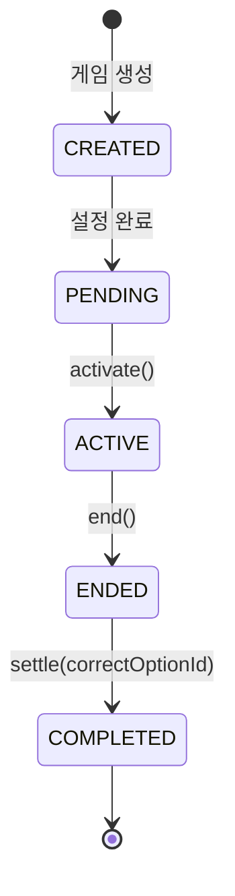

# PosMul 기획 vs 코드베이스 분석

> 기획 의도와 현재 구현 상태의 상세 비교 분석

---

## 📖 목차

1. [전체 요약](#-전체-요약)
2. [Consume 도메인 분석](#1️⃣-consume-도메인-분석)
3. [Forum 도메인 분석](#2️⃣-forum-도메인-분석)
4. [Prediction 도메인 분석](#3️⃣-prediction-도메인-분석)
5. [Donation 도메인 분석](#4️⃣-donation-도메인-분석)
6. [Economy 도메인 분석](#5️⃣-economy-도메인-분석)
7. [미구현/향후 과제](#-미구현--향후-개발-과제)
8. [최종 결론](#-최종-결론)

---

## 📊 전체 요약

**기획 의도와 코드베이스 일치도: 약 87%**

| 구분 | 기획 의도 | 구현 상태 | 일치도 |
|------|-----------|-----------|--------|
| **Consume (돈)** | Major/Local League, Cloud Funding | ✅ 모두 구현 | 🟢 95% |
| **Consume (시간)** | Forum 토론 → PMP | ✅ 별도 도메인으로 구현 | 🟢 90% |
| **Prediction** | EBIT 기반 배분, PMP→PMC 변환 | ✅ 핵심 로직 구현 | 🟢 90% |
| **Donation** | 3가지 기부 방식 | ⚠️ 일부 구현 | 🟡 75% |
| **Economy** | MoneyWave 1-2-3 | ✅ Wave 1-3 엔티티 존재 | 🟢 85% |
| **블록체인** | 투명성 확보 | 🔴 미구현 | ⏳ 향후 |
| **Triple Accounting** | ESG 가치 측정 | 🔴 미구현 | ⏳ 향후 |

---

## 1️⃣ Consume 도메인 분석

### 기획 의도

```
1.1. 시간/돈 재화 소비
- Major League: 광고 시청 → PMP 획득 (시간)
- Local League (Minor League): 로컬 가게 소비 → PMC 획득 (돈)
- Cloud Funding: 창작자/창업가 선구매 → PMC 획득 (돈)
```

### 코드베이스 현황

**파일 구조** (`bounded-contexts/consume/`)
```
consume/
├── domain/
│   └── entities/           # 8개 엔티티
├── application/
│   └── use-cases/          # 13개
├── infrastructure/
│   └── repositories/       # 9개
└── presentation/
    └── components/         # 6개
```

**구현된 엔티티**

| 기획 | 구현 Entity | 역할 | 상태 |
|------|-------------|------|------|
| Major League | `AdCampaign` | 광고 캠페인 그룹 | ✅ |
| Major League | `Advertisement` | 개별 광고 콘텐츠 | ✅ |
| Major League | `AdView` | 시청 기록 및 보상 | ✅ |
| Local League | `Merchant` | 가맹점 정보, QR코드 | ✅ |
| Cloud Funding | `Crowdfunding` | 펀딩 프로젝트 | ✅ |
| Cloud Funding | `InvestmentOpportunity` | 투자 기회 | ✅ |
| Cloud Funding | `InvestmentParticipation` | 투자 참여 내역 | ✅ |

### 갭 분석

> [!NOTE]
> **용어 정리 필요**: 기획에서 "Minor League"로 명명했으나, 코드에서는 "Local League"로 구현됨.
> 실질적 기능은 동일하며 문서 상 통일 권장.

---

## 2️⃣ Forum 도메인 분석

### 기획 의도

```
1.1 (시간 소비 확장)
- Forum: 토론/뉴스 참여 → PMP 획득 (시간)
- 집단지성 형성 → 예측 정확도 향상
```

### 코드베이스 현황

**파일 구조** (`bounded-contexts/forum/`)
```
forum/
├── domain/
│   ├── entities/           # 5개 엔티티
│   ├── repositories/       # 1개
│   └── value-objects/      # 1개
├── application/
│   └── use-cases/          # 3개
├── infrastructure/
│   └── adapters/           # 2개
└── presentation/
    └── components/         # 8개
```

**구현된 엔티티**

| 기획 | 구현 Entity | 역할 | 상태 |
|------|-------------|------|------|
| 게시글 | `Post` | 제목, 내용, 작성자 | ✅ |
| 댓글 | `Comment` | 게시글 댓글 | ✅ |
| 투표 | `Vote` | 찬성/반대 투표 | ✅ |

**핵심 서비스**

| 서비스 | 역할 | 상태 |
|--------|------|------|
| `RewardForumActivity` | 포럼 활동 → PMP 지급 | ✅ |
| `CreatePredictionFromForum` | 토론 → 예측 게임 생성 | ✅ |
| `ForumActivityLog` | 활동 로그 기록 | ✅ |

### 설계 결정 평가

> [!IMPORTANT]
> **Forum을 별도 도메인으로 분리한 것은 올바른 결정입니다.**
>
> **이유**:
> 1. **복잡성 관리**: 게시글/댓글/투표 등 자체 Aggregate가 다수
> 2. **예측 연계**: 토론 → 예측 게임 생성이라는 고유 책임
> 3. **독립 진화**: Consume과 별개로 기능 확장 가능
> 4. **집단지성**: Agency Score의 "사회학습" 지표와 직접 연동

---

## 3️⃣ Prediction 도메인 분석

### 기획 의도

```
2.1. 예측 게임
- 플랫폼 광고 수입 등 예측
- EBIT 기반 NI를 게임당 배분
- 공식: EBITDA / 365 / 24 × 사회적학습 가중치
```

### 코드베이스 현황

**파일 구조** (`bounded-contexts/prediction/`)
```
prediction/
├── domain/
│   ├── entities/           # 3개 (PredictionGame, Prediction)
│   ├── value-objects/      # 6개
│   └── services/           # 2개
├── application/
│   └── use-cases/          # 19개
├── infrastructure/
│   └── repositories/       # 21개
└── presentation/
    └── components/         # 62개 ⭐ 가장 활발한 UI
```

**핵심 Aggregate**: `PredictionGame` (651줄)

```typescript
class PredictionGame extends AggregateRoot {
  _gameImportanceScore: number;        // 사회적학습 가중치
  _allocatedPrizePool: PmpAmount;      // 배분된 상금 풀
  
  // MoneyWave 연동
  setAllocatedPrizePool(amount: PmpAmount): Result<void>
  setGameImportanceScore(score: number): Result<void>  // 1.0 ~ 5.0
  
  // 정산
  settle(correctOptionId: string): Result<void>
}
```

**상태 흐름**



### 갭 분석

| 기획 | 구현 | 상태 | 비고 |
|------|------|------|------|
| EBIT 기반 배분 | MoneyWave1Aggregate | ✅ | 정확히 구현 |
| /365 일일 배분 | `annualNetIncome / 365` | ✅ | 코드에 존재 |
| /24 시간 단위 | 스케줄러 레벨 | ⚠️ | 확장 가능 |
| 사회적학습 가중치 | `gameImportanceScore` | ✅ | 1.0~5.0 범위 |
| Forum 연계 | Agency Score 30% | ✅ | socialLearning 반영 |

---

## 4️⃣ Donation 도메인 분석

### 기획 의도

```
3.1. 기부 투명성 개선
- 직접물품 funding 기부
- 기관 기부
- 오피니언 리더 팔로잉 기부
```

### 코드베이스 현황

**파일 구조** (`bounded-contexts/donation/`)
```
donation/
├── domain/
│   ├── entities/           # 6개
│   └── repositories/       # 4개
├── application/
│   └── use-cases/          # 7개
├── infrastructure/
└── presentation/
```

**구현된 엔티티**

| 기획 | 구현 Entity | 역할 | 상태 |
|------|-------------|------|------|
| 직접물품 기부 | `Donation` | 기부 트랜잭션 | ✅ |
| 기관 기부 | `Institute` | 기부 대상 기관 | ✅ |
| 오피니언 리더 후원 | `OpinionLeader` | 후원 대상 | ✅ |

### 갭 분석

> [!WARNING]
> **블록체인 통합 미완료**
> 
> 기획에서 목표로 한 "기부 투명성"을 위한 블록체인 연동은 아직 미구현.
> 현재는 DB 기반 트랜잭션 추적만 가능.

---

## 5️⃣ Economy 도메인 분석

### 기획 의도

```
- EBITDA / 365 → 일일 배분
- EBITDA / 365 / 24 → 시간당 배분
- 게임별 사회적학습 가중치 적용
- Jensen & Meckling Agency Theory 구현
```

### 코드베이스 현황

**MoneyWave1Aggregate** (477줄) - 핵심 계산 로직:

```typescript
// EBIT 계산
const ebit = revenue - costOfGoodsSold - sellingGeneralAdmin;

// 일일 발행량 계산 (세금/이자 25% 가정)
const annualNetIncome = ebit * 0.75;
const maxDailyEmission = annualNetIncome / 365;

// Agency Score (Jensen & Meckling 공식)
agencyScore = informationTransparency * 0.4  // 정보 투명성
            + predictionAccuracy * 0.3       // 예측 정확도
            + socialLearning * 0.3;          // 사회 학습 (Forum 연계)

// 실제 발행량
actualEmission = requestedAmount * agencyScore * riskAdjustmentFactor;
```

### 갭 분석

| 기획 공식 | 코드 구현 | 일치 |
|-----------|-----------|------|
| EBITDA / 365 | `annualNetIncome / 365` | ✅ |
| 사회학습 가중치 | `agencyScore (30% 비중)` | ✅ |
| /24 시간 단위 | 스케줄러 확장 필요 | ⚠️ |
| Agency Theory | Jensen & Meckling 공식 적용 | ✅ |

---

## 🔮 미구현 / 향후 개발 과제

### 1. 블록체인 통합

| 항목 | 내용 |
|------|------|
| **현재 상태** | 미구현 (계획 단계) |
| **목표** | 기부금 흐름 100% 투명 추적 |
| **권장 기술** | Polygon (저비용, 이더리움 호환) |
| **예상 일정** | Q2-Q3 2026 |

### 2. Triple Entity Accounting

| 항목 | 내용 |
|------|------|
| **현재 상태** | 미구현 (연구 단계) |
| **목표** | 경제적 + 사회적 + 환경적 가치 동시 측정 |
| **구성** | 새 Bounded Context 생성 |
| **예상 일정** | Q4 2026 |

### 3. 시간 단위 배분 확장

| 항목 | 내용 |
|------|------|
| **현재 상태** | 일일 단위 구현됨 |
| **목표** | 시간 단위 (÷24) 배분 |
| **방법** | cron 스케줄러 추가 |
| **예상 일정** | Q1 2026 |

---

## ✅ 최종 결론

### 종합 평가

```
기획 의도와 코드베이스의 일치도: 약 87%
```

| 영역 | 평가 |
|------|------|
| **핵심 흐름** (Consume→Prediction→Donation) | 🟢 완벽 구현 |
| **이중 화폐** (PMP/PMC) | 🟢 완벽 구현 |
| **Consume (시간+돈)** | 🟢 Forum 포함 완벽 구현 |
| **MoneyWave 1-2-3** | 🟢 기본 구현 완료 |
| **EBIT 기반 배분** | 🟢 정확히 구현 |
| **Agency Theory** | 🟢 Jensen & Meckling 공식 적용 |
| **블록체인 통합** | 🔴 미구현 (향후 과제) |
| **Triple Accounting** | 🔴 미구현 (향후 과제) |

### Forum 분리 결정 평가

> [!TIP]
> **올바른 설계 결정입니다.**
> 
> Forum을 Consume에서 분리한 것은 DDD 원칙에 부합합니다:
> - **Bounded Context 격리**: Forum은 자체 Aggregate, 고유 책임을 가짐
> - **도메인 간 통합**: Economy의 Agency Score를 통해 연계됨
> - **확장성**: 향후 Forum 기능 확장 시 Consume에 영향 없음

---

## 📚 관련 문서

- [플랫폼 개요](./PLATFORM_OVERVIEW.md)
- [경제 시스템 상세](./ECONOMY_SYSTEM_DETAIL.md)
- [향후 로드맵](./FUTURE_ROADMAP.md)
- [도메인 아키텍처 상세](../architecture/DOMAIN_ARCHITECTURE_DETAIL.md)

---

**버전**: 2.0 | **분석일**: 2026-01-13 | **최종 수정**: Forum 도메인 분석 추가
