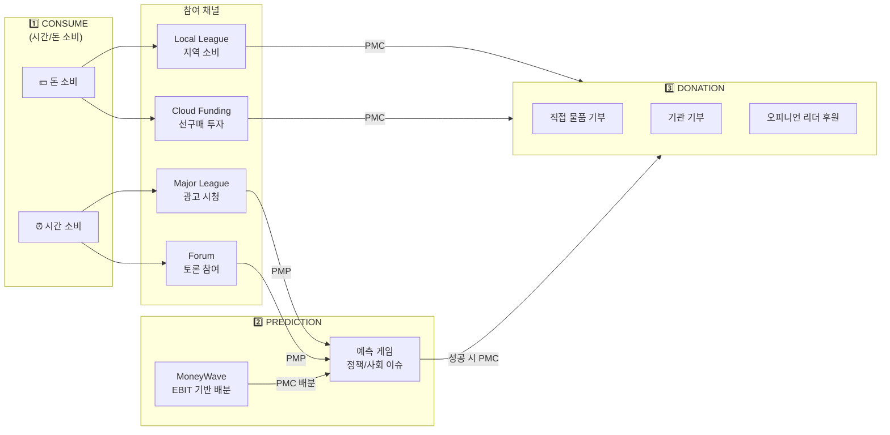
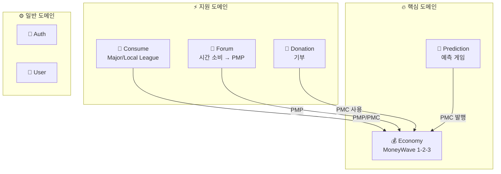
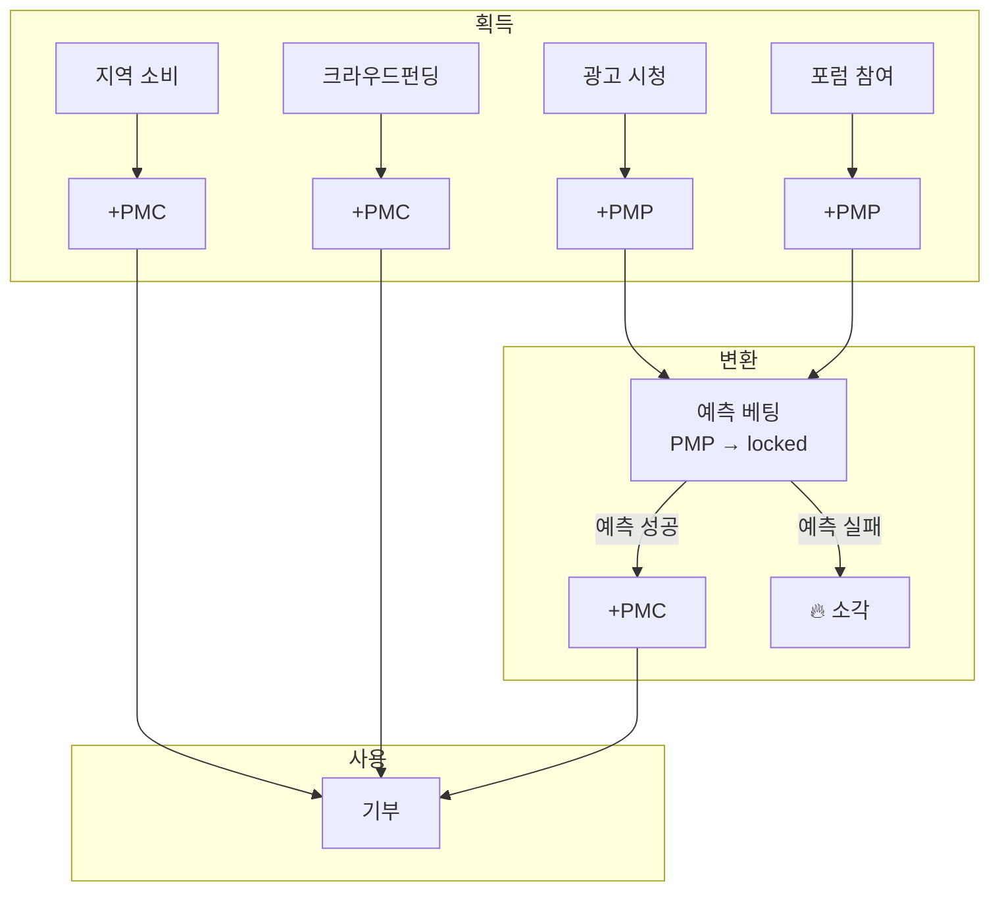

# PosMul 플랫폼 개요

> **AI 시대 직접민주주의와 ESG 가치 실현을 위한 경제 플랫폼**

---

## 📖 목차

1. [핵심 비전](#-핵심-비전)
2. [플랫폼 구조](#-플랫폼-구조)
3. [이중 화폐 시스템](#-이중-화폐-시스템)
4. [Consume 체계 상세](#-consume-체계-상세)
5. [Prediction 체계](#-prediction-체계)
6. [Donation 체계](#-donation-체계)
7. [MoneyWave 시스템](#-moneywave-시스템)
8. [경제학적 기반](#-경제학적-기반)
9. [향후 개발 과제](#-향후-개발-과제)

---

## 🎯 핵심 비전

PosMul은 **소비(Consume) → 예측(Prediction) → 기부(Donation)**의 선순환 구조를 통해 사회적 가치를 창출하는 플랫폼입니다.

### 핵심 철학

> "시간과 돈이라는 두 가지 재화를 소비하여 포인트를 획득하고, 예측을 통해 코인으로 전환하며, 이를 기부에 사용함으로써 개인의 소비가 사회적 가치로 전환된다"



---

## 🏗️ 플랫폼 구조

### 재화 구분

| 재화 유형 | 소비 채널 | 획득 화폐 | 비고 |
|-----------|-----------|-----------|------|
| **시간** | Major League, Forum | PMP | 무위험 자산 |
| **돈** | Local League, Cloud Funding | PMC | 위험 자산 |

### 도메인 구조



> [!IMPORTANT]
> **Forum을 별도 도메인으로 분리한 이유**
> 1. **복잡성 관리**: Forum은 게시글, 댓글, 투표 등 자체 엔티티가 많음
> 2. **집단지성 연계**: 예측 게임과 양방향 연동 (토론 → 예측 생성)
> 3. **독립 진화**: Consume과 별개로 기능 확장 가능

---

## 💰 이중 화폐 시스템

### PMP (Positive Multiplier Point)

| 항목 | 내용 |
|------|------|
| **성격** | 위험프리 자산 (Risk-Free Asset) |
| **획득** | Major League 광고 시청, Forum 토론 참여 |
| **사용** | 예측 게임 베팅 (투입 자본) |
| **특징** | 고정 가치, 상한 없음, 예측 실패 시 소각 |

### PMC (Positive Multiplier Coin)

| 항목 | 내용 |
|------|------|
| **성격** | 위험 자산 (Risky Asset), EBIT 연동 |
| **획득** | 예측 성공, Local League 소비, Cloud Funding |
| **사용** | 기부 (직접/기관/오피니언 리더) |
| **특징** | 변동성 있음, 기부 전용, 환금 불가 |

### 화폐 흐름도



---

## 🛒 Consume 체계 상세

### 1. 시간 소비 → PMP

#### Major League (광고 참여)
- **목적**: 기업 광고 시청을 통한 PMP 획득
- **메커니즘**: 시청 완료 보너스, 상호작용 보너스
- **엔티티**: `AdCampaign`, `Advertisement`, `AdView`

#### Forum (토론 참여)
- **목적**: 사회적 이슈 토론을 통한 집단지성 형성 및 PMP 획득
- **메커니즘**: 게시글 작성, 댓글, 투표 활동에 따른 보상
- **엔티티**: `Post`, `Comment`, `Vote`
- **연계 기능**: 토론 결과가 예측 게임 생성의 기초 자료로 활용

> [!NOTE]
> Forum은 단순 PMP 획득 채널을 넘어 **예측 시장의 정보 품질**을 높이는 역할을 합니다.
> 토론에서 형성된 집단지성이 예측 정확도를 높이고, 이는 Agency Score에 반영됩니다.

### 2. 돈 소비 → PMC

#### Local League (지역 소비)
- **목적**: 지역 소상공인과의 지속 가능한 소비
- **메커니즘**: QR 결제, 포인트 적립
- **엔티티**: `Merchant`

#### Cloud Funding (선구매 투자)
- **목적**: 창작자/창업가 지원 크라우드펀딩
- **메커니즘**: 투자 참여, 성과 배분
- **엔티티**: `Crowdfunding`, `InvestmentOpportunity`, `InvestmentParticipation`

---

## 🎯 Prediction 체계

### EBIT 기반 배분

```
일일 PMC 발행량 = (EBIT × 0.75) / 365
시간당 배분량 = 일일 발행량 / 24
게임별 배분 = 시간당 배분량 × 게임 중요도 점수
```

### 사회적학습 가중치 (Agency Score)

| 요소 | 비중 | 설명 |
|------|------|------|
| 정보 투명성 | 40% | 게임 설명 품질, 근거 자료 |
| 예측 정확도 | 30% | 과거 참여자들의 적중률 |
| 사회 학습 | 30% | Forum 토론 기반 집단지성 |

---

## 🎁 Donation 체계

| 방식 | 설명 | 특징 |
|------|------|------|
| **직접 물품 기부** | 필요 물품 직접 펀딩 | 투명한 전달 확인 |
| **기관 기부** | 검증된 기관 통한 기부 | 신뢰성 보장 |
| **오피니언 리더 후원** | 영향력자 팔로잉 기부 | 의견 반영 |

---

## 🌊 MoneyWave 시스템

| Wave | 목적 | 메커니즘 |
|------|------|----------|
| **Wave 1** | EBIT 기반 발행 | 일일 순익의 1/365 배분 |
| **Wave 2** | 미사용 재분배 | 30일 미사용 PMC 재분배 |
| **Wave 3** | 기업 생태계 | ESG 마케팅 연계 |

---

## 🧮 경제학적 기반

| 이론 | 적용 |
|------|------|
| **Agency Theory** (Jensen & Meckling) | 정보 비대칭 해소, Agency Score |
| **CAPM** | PMP(무위험)/PMC(위험) 자산 배분 |
| **Prospect Theory** (Kahneman-Tversky) | 손실 회피 기반 사용 유인 |
| **Network Economics** | Metcalfe's Law 기반 가치 증폭 |
| **공공선택이론** (Buchanan) | 직접민주주의 의사결정 |

---

## 🚀 향후 개발 과제

### 블록체인 통합 (계획: Q2-Q3 2026)
- **목표**: 기부금 흐름 100% 투명화
- **기술**: 분산 원장 기반 거래 추적 (Polygon 권장)

### Triple Entity Accounting (계획: Q4 2026)
- **목표**: 경제적 가치 + 사회적 가치 + 환경적 가치 동시 측정
- **효과**: ESG 임팩트 실시간 측정

---

## 📚 관련 문서

- [기획-코드 분석](./PLANNING_VS_CODEBASE_ANALYSIS.md)
- [경제 시스템 상세](./ECONOMY_SYSTEM_DETAIL.md)
- [향후 로드맵](./FUTURE_ROADMAP.md)
- [도메인 아키텍처 상세](../architecture/DOMAIN_ARCHITECTURE_DETAIL.md)

---

**버전**: 2.0 | **작성일**: 2026-01-13 | **최종 수정**: Forum 도메인 통합
