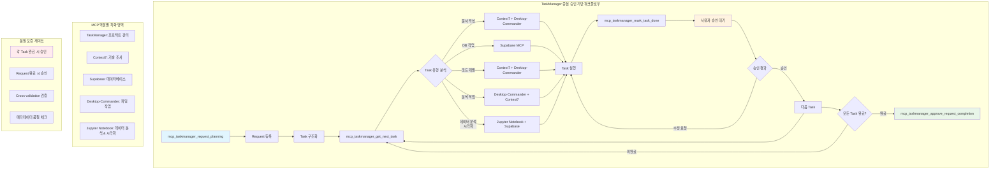
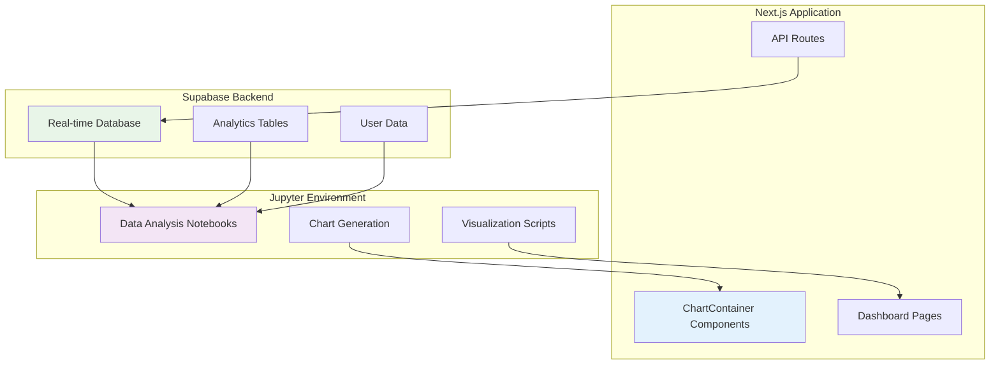
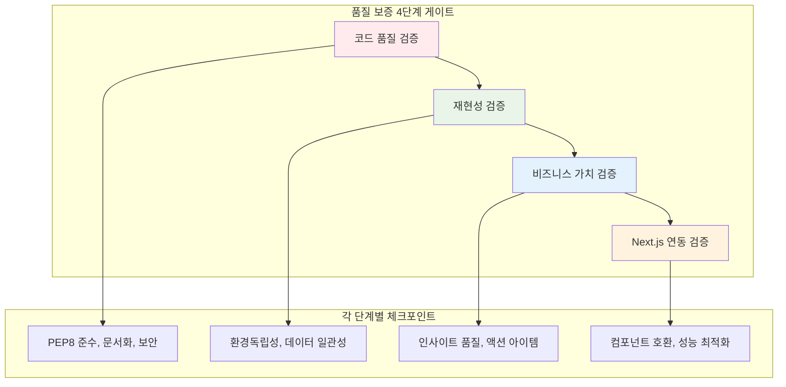
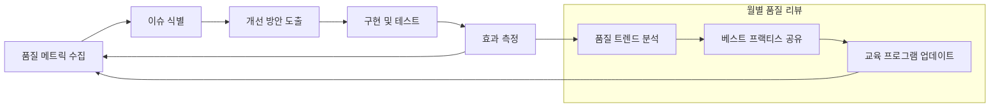

# AI Agent 통합 워크플로우 지침 v2.1.0 (Integrated AI Agent Workflow Guidelines)

## 📋 메타데이터 (Metadata)

| 항목 | 상세 정보 |
|------|-----------|
| **문서 버전** | 2.1.0 |
| **작성일** | 2025-06-16 |
| **최종 수정일** | 2025-06-19 |
| **문서 유형** | 통합 워크플로우 지침 |
| **적용 범위** | posmul-platform 프로젝트 전체 |
| **의존성** | MCP 5종 (TaskManager, Context7, Supabase, Desktop-Commander, Jupyter Notebook), Diátxis Framework, Mermaid.js |
| **인코딩** | UTF-8 |
| **환경** | Windows PowerShell |

---

## 🎯 목차 (Table of Contents)

1. [목표 및 개요](#1-목표-및-개요)
2. [MCP 활용 전략](#2-mcp-활용-전략)
3. [Jupyter Notebook 통합 전략 ⭐ NEW](#3-jupyter-notebook-통합-전략--new)
4. [문서화 표준](#4-문서화-표준)
5. [프롬프트 엔지니어링](#5-프롬프트-엔지니어링)
6. [품질 보증 체계 ⭐ NEW](#6-품질-보증-체계--new)
7. [실무 적용 가이드](#7-실무-적용-가이드)
8. [부록 및 참고자료](#8-부록-및-참고자료)

---

## 1. 목표 및 개요

### 1.1 문서 목적

본 문서는 **posmul-platform 프로젝트**에서 AI Agent와의 효율적인 협업을 위한 **통합 워크플로우 지침**입니다. 특히 **Jupyter Notebook 통합**과 **MCP 5종 체계**를 반영하여, 개발자가 AI Agent와 함께 **고품질의 예측 게임 시스템**을 구축할 수 있도록 돕습니다.

### 1.2 핵심 목표

- **🎯 작업 효율성 극대화**: TaskManager MCP 기반 승인 워크플로우
- **📊 데이터 분석 통합**: Jupyter Notebook을 활용한 인사이트 도출
- **🔗 Next.js 연동 최적화**: Supabase + Jupyter + React 컴포넌트 통합
- **✅ 품질 보증 체계**: 4단계 품질 검증 프레임워크
- **📚 문서화 표준**: Diátxis 프레임워크 적용

### 1.3 주요 변경사항 (v2.0 → v2.1)

#### ✨ **신규 추가**
- **Jupyter Notebook 통합 전략** 섹션 (전체 섹션 3)
- **품질 보증 체계** 섹션 (전체 섹션 6)
- MCP 5종 체계 (기존 4종 + Jupyter Notebook)
- Next.js + Supabase + Jupyter 아키텍처 통합

#### 🔄 **주요 업데이트**
- 모든 Mermaid 다이어그램에 Jupyter Notebook 역할 추가
- 프롬프트 엔지니어링에 Jupyter 전용 템플릿 추가
- TaskManager 기반 승인 워크플로우 강화
- Windows PowerShell 환경 최적화

---

## 2. MCP 활용 전략

### 2.1 MCP 5종 체계 및 역할 정의

#### 🎯 **TaskManager MCP**
- **주 역할**: 프로젝트 전체 생명주기 관리
- **핵심 기능**: Request-Task 구조화, 승인 게이트, 진행률 추적
- **적용 시점**: 모든 주요 프로젝트 시작 시
- **연동 대상**: 모든 MCP와 상호작용

#### 🧠 **Context7 MCP**
- **주 역할**: 최신 기술 동향 조사 및 Best Practice 연구
- **핵심 기능**: 실시간 웹 검색, 기술 문서 분석, 방법론 조사
- **적용 시점**: 새로운 기술 도입, 문제 해결 방안 모색
- **연동 대상**: Jupyter Notebook 방법론 조사

#### 🗄️ **Supabase MCP**
- **주 역할**: 데이터베이스 및 백엔드 서비스 관리
- **핵심 기능**: 스키마 설계, 데이터 조작, 실시간 구독
- **적용 시점**: 데이터 모델링, API 개발, 실시간 기능 구현
- **연동 대상**: Jupyter Notebook 데이터 소스

#### 🖥️ **Desktop-Commander MCP**
- **주 역할**: 로컬 파일 시스템 및 개발 환경 관리
- **핵심 기능**: 파일 조작, 코드 편집, 환경 설정
- **적용 시점**: 코드 생성, 파일 구조 관리, 환경 구성
- **연동 대상**: 모든 MCP의 결과물 파일 관리

#### 📊 **Jupyter Notebook MCP** ⭐ NEW
- **주 역할**: 데이터 분석, 시각화, 프로토타이핑
- **핵심 기능**: 인터랙티브 분석, 차트 생성, Next.js 연동
- **적용 시점**: 데이터 분석, 알고리즘 검증, 대시보드 개발
- **연동 대상**: Supabase(데이터), Context7(방법론), TaskManager(품질관리)

### 2.2 MCP 조합 전략



### 2.3 환경별 MCP 활용 가이드

#### Windows PowerShell 환경 최적화
```powershell
# ✅ 올바른 PowerShell 명령어 체이닝
cd C:\Dev\posmul-platform; npm install; npm run build; npm test

# ❌ 잘못된 명령어 (&&는 PowerShell 미지원)
cd C:\Dev\posmul-platform && npm install && npm run build
```

#### UTF-8 인코딩 강제 적용
- 모든 파일 생성 시 UTF-8 인코딩 명시
- 한글 문서 작성 시 인코딩 검증 필수
- 메타데이터에 인코딩 정보 포함

---

## 3. Jupyter Notebook 통합 전략 ⭐ NEW

### 3.1 Jupyter Notebook 역할 및 활용 영역

#### 📊 **데이터 분석 및 시각화**
- **posmul 예측 게임 데이터 분석**: 예측 정확도, 사용자 행동 패턴 분석
- **실시간 대시보드**: Supabase 데이터를 활용한 실시간 분석 결과 시각화
- **성과 지표 모니터링**: KPI 추적 및 트렌드 분석

#### 🔬 **프로토타이핑 및 검증**
- **알고리즘 검증**: 예측 알고리즘의 효과성 사전 검증
- **A/B 테스트 분석**: 기능 개선안의 성과 측정
- **시뮬레이션**: 다양한 시나리오 기반 예측 시뮬레이션

#### 📚 **Interactive 문서화**
- **기술 문서**: 분석 과정과 결과를 시각적으로 설명
- **교육 자료**: 팀원 교육 및 온보딩용 Interactive 가이드
- **의사결정 지원**: 데이터 기반 의사결정을 위한 분석 리포트

### 3.2 Next.js + Supabase 통합 아키텍처



### 3.3 실전 활용 시나리오

#### 📈 **시나리오 1: 예측 정확도 분석**
```python
# 1. Supabase 데이터 수집
import pandas as pd
import numpy as np
from supabase import create_client

# 예측 데이터 수집
prediction_results = supabase_client.table('predictions')\
    .select('user_id, prediction_value, actual_value, confidence_level, created_at')\
    .gte('created_at', '2024-01-01')\
    .execute()

# 2. 정확도 계산 및 분석
df = pd.DataFrame(prediction_results.data)
df['accuracy'] = np.abs(df['prediction_value'] - df['actual_value']) / df['actual_value']
df['is_accurate'] = df['accuracy'] < 0.05  # 5% 이내 정확

# 3. 시각화 (Recharts 호환 포맷)
accuracy_by_confidence = df.groupby('confidence_level').agg({
    'is_accurate': 'mean',
    'accuracy': 'mean'
}).reset_index()

chart_data = accuracy_by_confidence.to_dict('records')
```

#### 📊 **시나리오 2: 사용자 행동 패턴 분석**
```python
# 사용자별 예측 빈도 및 성향 분석
user_patterns = supabase_client.table('user_predictions_view')\
    .select('user_id, prediction_frequency, avg_confidence, success_rate')\
    .execute()

# 클러스터링을 통한 사용자 그룹 분류
from sklearn.cluster import KMeans
user_clusters = KMeans(n_clusters=4).fit_predict(user_features)

# Next.js 대시보드용 데이터 포맷
dashboard_data = {
    "userSegments": user_cluster_data,
    "chartConfig": {
        "frequency": {"label": "예측 빈도", "color": "var(--chart-1)"},
        "confidence": {"label": "평균 신뢰도", "color": "var(--chart-2)"},
        "success": {"label": "성공률", "color": "var(--chart-3)"}
    }
}
```

### 3.4 환경별 최적화 가이드

#### **Windows 환경 최적화**
```bash
# Jupyter 환경 구성 (PowerShell)
python -m venv venv
.\venv\Scripts\Activate.ps1
pip install jupyter pandas numpy matplotlib seaborn plotly
pip install supabase psycopg2-binary

# 환경 변수 설정
$env:SUPABASE_URL="your-supabase-url"
$env:SUPABASE_KEY="your-supabase-key"
```

#### **Docker 컨테이너 환경**
```dockerfile
# Jupyter + posmul 분석 환경
FROM jupyter/scipy-notebook:latest

# posmul 특화 패키지 설치
RUN pip install supabase plotly dash streamlit
RUN pip install scikit-learn tensorflow pandas-profiling

# 환경 설정
ENV SUPABASE_URL=${SUPABASE_URL}
ENV SUPABASE_KEY=${SUPABASE_KEY}

# 노트북 디렉토리 마운트
VOLUME ["/home/jovyan/posmul-notebooks"]
```

---

## 4. 문서화 표준

### 4.1 Diátxis 프레임워크 적용

posmul-platform 프로젝트의 모든 문서는 Diátxis 4가지 유형으로 분류합니다:

```mermaid
quadrantChart
    title posmul-platform 문서 분류
    x-axis 실용성 낮음 --> 실용성 높음
    y-axis 이론적 --> 실무적
    quadrant-1 학습 지향 (Tutorial)
    quadrant-2 이해 지향 (Explanation)  
    quadrant-3 문제 해결 (How-to)
    quadrant-4 정보 제공 (Reference)
    예측 시스템 튜토리얼: [0.2, 0.3]
    설치 가이드: [0.2, 0.7]
    시스템 아키텍처: [0.8, 0.3]
    API 문서: [0.8, 0.7]
```

#### 📚 Tutorial (docs/tutorials/)
- **목적**: 새로운 개발자가 posmul-platform을 시작할 수 있도록 안내
- **예시**:
  - `01-tutorial-getting-started.md`: 프로젝트 첫 시작 가이드
  - `02-tutorial-prediction-basics.md`: 예측 시스템 기본 사용법
  - `03-tutorial-jupyter-integration.md`: Jupyter Notebook 활용법

#### 🛠️ How-to (docs/how-to/)
- **목적**: 특정 문제 해결을 위한 실용적 가이드
- **예시**:
  - `how-to-setup-development-environment.md`
  - `how-to-deploy-to-production.md`
  - `how-to-create-jupyter-analysis.md`

#### 📖 Reference (docs/reference/)
- **목적**: 정확하고 완전한 기술 정보 제공
- **예시**:
  - `ref-api-endpoints.md`: API 엔드포인트 완전 목록
  - `ref-jupyter-notebook-standards.md`: Jupyter Notebook 표준
  - `ref-database-schema.md`: 데이터베이스 스키마 명세

#### 🧠 Explanation (docs/explanation/)
- **목적**: 시스템 설계 및 아키텍처 이해
- **예시**:
  - `exp-architecture-overview.md`: 시스템 전체 아키텍처
  - `exp-prediction-algorithm.md`: 예측 알고리즘 설명
  - `exp-jupyter-integration-strategy.md`: Jupyter 통합 전략

### 4.2 프로젝트별 메타데이터 표준

```yaml
---
# 📋 posmul-platform 표준 메타데이터
title: "[문서 제목]"
description: "[간단한 설명]"
version: "1.0.0"
type: "tutorial|how-to|reference|explanation"

# 📅 시간 정보
created: "YYYY-MM-DD"
updated: "YYYY-MM-DD"

# 👥 posmul-platform 팀 정보
author: "AI Agent (GitHub Copilot)"
reviewer: "[검토자]"
maintainer: "[유지보수 담당자]"

# 🏷️ 프로젝트 분류
tags:
  - "posmul-platform"
  - "prediction"
  - "jupyter-notebook"
categories:
  - "development"
  - "documentation"
audience: "beginner|intermediate|advanced"
platform: "web|api|database|jupyter|all"

# 🔧 기술 스택 (프로젝트 맞춤)
technology:
  - "Next.js"
  - "TypeScript"
  - "Supabase"
  - "Jupyter Notebook"
framework: "Next.js 14"
language: "TypeScript|Python"

# 📊 상태 정보
status: "draft|review|approved|published|archived"
priority: "high|medium|low"

# 🔄 posmul-platform 특화 필드
mcp_integration:
  - "TaskManager"
  - "Context7"
  - "Supabase"
  - "Desktop-Commander"
  - "Jupyter-Notebook"
quality_gates:
  - "code_review"
  - "technical_review"
  - "business_review"
---
```

---

## 5. 프롬프트 엔지니어링

### 5.1 개선된 4단계 워크플로우 기반 프롬프트

#### 5.1.1 구조화된 프롬프트 템플릿

```
🎯 **목표**: [작업의 구체적 목표]
📋 **맥락**: [현재 상황 및 배경 정보]

🔍 **1단계 - Analysis (분석)**:
- 요구사항: [구체적 요구사항 명시]
- 현재 상태: [기존 코드/문서 상태]
- 제약 조건: [기술적/비즈니스적 제약]

📝 **2단계 - Planning (계획)**:
- 접근 방법: [선택한 해결 접근법]
- 태스크 분해: [세부 작업 단위]
- 일정 계획: [예상 소요 시간]

🔧 **3단계 - Implementation (구현)**:
- MCP 활용: [사용할 MCP와 그 이유]
- 결과물: [원하는 결과물의 형식과 품질 기준]
- 문서화: [문서 유형 및 Diátxis 분류]

✅ **4단계 - Verification (검증)**:
- 검증 기준: [완료 기준 및 품질 체크]
- 테스트 방법: [기능/품질 검증 방법]
- 피드백 반영: [개선 사항 반영 계획]
```

### 5.2 MCP별 특화 프롬프트 패턴

#### 📊 Jupyter Notebook 생성 프롬프트

```
Jupyter Notebook을 생성해서 posmul-platform의 [분석 목적]을 달성해줘:

**1. 분석 목표 및 범위**:
- 분석 목적: [예측 정확도 분석 / 사용자 행동 패턴 / A/B 테스트 결과 등]
- 데이터 소스: [Supabase 테이블명, 기간, 필터 조건]
- 예상 결과물: [차트 유형, 인사이트, Next.js 연동 방안]

**2. 환경 설정 및 의존성**:
- Python 패키지: pandas, numpy, matplotlib, seaborn, plotly
- Supabase 연동: @supabase/supabase-js 또는 python 클라이언트
- 환경 변수: SUPABASE_URL, SUPABASE_KEY (민감정보 하드코딩 금지)

**3. 노트북 구조 (Cell 단위 설계)**:
- Cell 1: 환경 설정 및 라이브러리 임포트
- Cell 2: Supabase 연결 및 데이터 수집
- Cell 3: 데이터 전처리 및 정제
- Cell 4: 탐색적 데이터 분석 (EDA)
- Cell 5: 주요 분석 및 시각화
- Cell 6: Next.js Recharts 호환 데이터 변환
- Cell 7: 결과 해석 및 비즈니스 인사이트
- Cell 8: 다음 단계 제안 및 액션 아이템

**4. Next.js 연동 고려사항**:
- ChartContainer 컴포넌트 호환 데이터 포맷 생성
- CSS 변수 기반 차트 테마 적용
- 접근성 고려 (accessibilityLayer 활성화)
- 반응형 디자인 지원

**5. 품질 보증 요구사항**:
- 재현성: 동일한 결과 보장 (random seed 설정)
- 문서화: 각 셀의 목적과 분석 과정 명시
- 성능: 대용량 데이터 처리 시 메모리 최적화
- 보안: 환경 변수 사용, 민감 정보 마스킹
```

#### 🎯 TaskManager MCP 프롬프트

```
TaskManager MCP를 사용해서 posmul-platform 프로젝트의 [구체적 작업]을 다음과 같이 관리해줘:

**1. Request 등록 및 구조화**:
- 전체 목표: [명확한 프로젝트 목표와 배경 설명]
- 완료 기준: [구체적이고 측정 가능한 완료 조건]
- 예상 소요 시간: [전체 프로젝트 예상 시간]

**2. Task 분해 및 계획**:
- 1-4시간 단위의 독립적 작업으로 세분화
- 각 작업의 입력/출력 명시
- 의존성 관계 및 우선순위 정의
- 각 작업별 품질 기준 설정

**3. 승인 기반 품질 보증**:
- 각 작업 완료 후 사용자 승인 게이트 설정
- 품질 검증 체크리스트 적용
- 오류 발견 시 수정 루프 진입

**결과물**:
- 구조화된 Request-Task 시스템
- 승인 기반 품질 보증 체계
- 투명한 진행률 추적
- 단계별 문서화 및 결과물 관리
```

### 5.3 실제 적용 예시

#### 🎯 예시 1: 예측 정확도 분석 Notebook 생성

**실제 프롬프트:**
```
🎯 **목표**: posmul-platform의 예측 정확도를 분석하고 개선 방안을 도출하는 Jupyter Notebook 생성

📋 **맥락**:
- 프로젝트: C:\G\posmul
- 분석 대상: 최근 3개월 예측 데이터
- 환경: Windows PowerShell, Python 3.11, Supabase 연동

🔍 **1단계 - Analysis (분석)**:
- 요구사항: 예측 정확도 트렌드 분석, 사용자별/시간대별 패턴 파악
- 현재 상태: 예측 데이터는 수집되고 있으나 체계적 분석 부족
- 제약 조건: 실시간 분석 가능, Next.js 대시보드 연동 필요

📝 **2단계 - Planning (계획)**:
- 접근 방법: 탐색적 데이터 분석 + 통계적 유의성 검증
- TaskManager 연동: 복잡한 분석이므로 Request로 등록하여 단계별 관리
- 일정 계획: 데이터 수집 1시간, 분석 3시간, 시각화 2시간

🔧 **3단계 - Implementation (구현)**:
- MCP 활용 전략:
  - TaskManager: 분석 프로젝트를 체계적으로 관리
  - Supabase: 예측 데이터 직접 수집
  - Context7: 최신 정확도 분석 방법론 조사
- 결과물: prediction_accuracy_analysis.ipynb
- 문서화: 각 분석 단계별 상세 설명 및 비즈니스 해석

✅ **4단계 - Verification (검증)**:
- 재현성: 동일한 분석 결과 재현 가능
- 통계적 유의성: p-value < 0.05 기준 적용
- Next.js 연동: Recharts 호환 데이터 포맷 생성
```

### 5.4 프롬프트 품질 보증 체크리스트

#### ✅ **기본 품질 기준**
- [ ] 구체적이고 측정 가능한 목표 설정
- [ ] 4단계 워크플로우 (Analysis → Planning → Implementation → Verification) 적용
- [ ] MCP별 역할과 연동 방식 명시
- [ ] Windows PowerShell 환경 고려 (`;` 연산자 사용)
- [ ] UTF-8 인코딩 및 한글 지원 확인

#### 📊 **Jupyter Notebook 전용 기준**
- [ ] 셀 단위 구조 설계 명시
- [ ] Supabase 연동 방법 포함
- [ ] Next.js Recharts 호환 데이터 포맷 고려
- [ ] 환경 변수 사용 (하드코딩 금지)
- [ ] 재현성 보장 (random seed, 버전 명시)
- [ ] 비즈니스 인사이트 및 액션 아이템 포함

---

## 6. 품질 보증 체계 ⭐ NEW

### 6.1 Jupyter Notebook 품질 보증 프레임워크

#### 📋 **4단계 품질 검증 체계**



#### 🔍 **1단계: 코드 품질 검증**

**필수 체크리스트:**
- [ ] **PEP8 준수**: 코드 스타일 가이드 준수
- [ ] **함수/변수 명명**: 명확하고 일관된 네이밍
- [ ] **주석 및 문서화**: 각 셀의 목적과 과정 설명
- [ ] **에러 처리**: try-catch 블록 및 예외 상황 대응
- [ ] **보안 고려**: 환경변수 사용, 민감정보 하드코딩 금지
- [ ] **라이브러리 버전**: 호환성 확인된 패키지 버전 명시

#### ♻️ **2단계: 재현성 검증**

**환경 독립성 보장:**
- [ ] **환경 변수 사용**: 하드코딩된 설정값 없음
- [ ] **상대 경로 사용**: 절대 경로 사용 금지
- [ ] **Random Seed 고정**: 분석 결과 재현 가능
- [ ] **패키지 버전 고정**: requirements.txt 또는 environment.yml 제공
- [ ] **데이터 종속성**: 외부 데이터 소스 문서화

#### 💼 **3단계: 비즈니스 가치 검증**

**인사이트 품질 기준:**
- [ ] **명확한 결론**: 분석 결과에 대한 구체적 해석
- [ ] **비즈니스 임팩트**: 실무 적용 가능한 인사이트
- [ ] **액션 아이템**: 구체적이고 실행 가능한 다음 단계
- [ ] **한계점 인식**: 분석의 제약사항 및 주의사항 명시
- [ ] **의사결정 지원**: 데이터 기반 의사결정 근거 제공

#### 🔗 **4단계: Next.js 연동 검증**

**컴포넌트 호환성 검증:**
- [ ] **Recharts 호환**: ChartContainer 컴포넌트 사용 가능한 데이터 포맷
- [ ] **CSS 변수 활용**: 테마 시스템과 일관된 색상 체계
- [ ] **접근성 고려**: accessibilityLayer 활성화 가능
- [ ] **반응형 지원**: 다양한 화면 크기 대응
- [ ] **성능 최적화**: 대용량 데이터 처리 최적화

### 6.2 CI/CD 통합 품질 자동화

#### 🤖 **GitHub Actions 품질 파이프라인**

```yaml
# .github/workflows/jupyter-quality-check.yml
name: Jupyter Notebook Quality Assurance
on:
  pull_request:
    paths:
      - 'analysis/**/*.ipynb'
      - 'notebooks/**/*.ipynb'

jobs:
  quality-check:
    runs-on: ubuntu-latest
    
    steps:
      - name: Checkout Code
        uses: actions/checkout@v4
        
      - name: Setup Python
        uses: actions/setup-python@v4
        with:
          python-version: '3.11'
          
      - name: Install Dependencies
        run: |
          pip install jupyter nbconvert flake8 bandit pytest-notebook
          pip install pandas numpy matplotlib seaborn plotly
          
      - name: Code Quality Check
        run: |
          # PEP8 스타일 검사
          flake8 --select=E9,F63,F7,F82 analysis/ notebooks/
          
          # 보안 스캔
          bandit -r analysis/ notebooks/ -f json -o security-report.json
          
      - name: Reproducibility Test
        run: |
          # 노트북 실행 테스트 (3회 반복)
          for i in {1..3}; do
            jupyter nbconvert --execute --to notebook analysis/**/*.ipynb
          done
          
      - name: Generate Quality Report
        run: |
          python scripts/generate_quality_report.py
```

### 6.3 품질 개선 가이드라인

#### 🔧 **일반적인 품질 이슈 및 해결책**

**문제 1: 재현성 부족**
```python
# ❌ 문제가 있는 코드
import random
result = random.choice([1, 2, 3, 4, 5])

# ✅ 개선된 코드
import random
random.seed(42)  # 고정된 시드 사용
result = random.choice([1, 2, 3, 4, 5])
```

**문제 2: 하드코딩된 설정값**
```python
# ❌ 문제가 있는 코드
supabase_url = "https://abc123.supabase.co"
supabase_key = "your_secret_key_here"

# ✅ 개선된 코드
import os
supabase_url = os.getenv('SUPABASE_URL')
supabase_key = os.getenv('SUPABASE_KEY')
```

#### 📈 **지속적 품질 개선 프로세스**



---

## 7. 실무 적용 가이드

### 7.1 프로젝트 시작 체크리스트

#### 🚀 **새 프로젝트 시작 시**
```powershell
# 1. TaskManager로 프로젝트 등록
mcp_taskmanager_request_planning(
  originalRequest: "posmul 예측 시스템 신규 기능 개발",
  tasks: [...]
)

# 2. 개발 환경 설정 (Windows PowerShell)
cd C:\Dev\posmul-platform
python -m venv venv
.\venv\Scripts\Activate.ps1
pip install -r requirements.txt

# 3. 환경 변수 설정
$env:SUPABASE_URL="your-url"
$env:SUPABASE_KEY="your-key"

# 4. Git 브랜치 생성
git checkout -b feature/new-prediction-feature
```

#### 📊 **데이터 분석 프로젝트 시작 시**
```python
# 1. Jupyter Notebook 환경 설정
import os
import pandas as pd
import numpy as np
from supabase import create_client

# 2. 프로젝트 메타데이터 설정
ANALYSIS_CONFIG = {
    "project": "posmul-platform",
    "analysis_type": "prediction_accuracy",
    "version": "1.0.0",
    "author": "AI Agent",
    "created_date": "2025-06-19"
}

# 3. 품질 보증 체크포인트 설정
QUALITY_GATES = [
    "code_quality_check",
    "reproducibility_test", 
    "business_value_assessment",
    "nextjs_integration_test"
]
```

### 7.2 일반적인 워크플로우 패턴

#### 패턴 1: 단순 기능 개발
```
TaskManager → Context7 (조사) → Desktop-Commander (구현) → 품질 검증
```

#### 패턴 2: 데이터 분석 프로젝트
```
TaskManager → Context7 (방법론) → Jupyter (분석) → Supabase (데이터) → Next.js (시각화)
```

#### 패턴 3: 복합 시스템 개발
```
TaskManager → [Context7 + Supabase + Jupyter + Desktop-Commander] → 통합 테스트
```

### 7.3 트러블슈팅 가이드

#### 🔧 **자주 발생하는 문제들**

**문제 1: PowerShell 명령어 오류**
```powershell
# ❌ 문제: && 연산자 사용
npm install && npm start

# ✅ 해결: ; 연산자 사용
npm install; npm start
```

**문제 2: Jupyter Notebook 연동 실패**
```python
# ❌ 문제: 환경 변수 미설정
supabase = create_client("hardcoded-url", "hardcoded-key")

# ✅ 해결: 환경 변수 사용
supabase = create_client(
    os.getenv('SUPABASE_URL'),
    os.getenv('SUPABASE_KEY')
)
```

**문제 3: 한글 인코딩 깨짐**
```python
# ✅ 파일 작성 시 UTF-8 명시
with open('analysis_report.md', 'w', encoding='utf-8') as f:
    f.write('# 예측 분석 리포트\n')
```

---

## 8. 부록 및 참고자료

### 8.1 MCP API 참조

#### TaskManager MCP 주요 함수
- `mcp_taskmanager_request_planning()`: 새 프로젝트 등록
- `mcp_taskmanager_get_next_task()`: 다음 작업 조회
- `mcp_taskmanager_mark_task_done()`: 작업 완료 보고
- `mcp_taskmanager_approve_task_completion()`: 작업 승인
- `mcp_taskmanager_approve_request_completion()`: 프로젝트 완료 승인

#### Jupyter Notebook 관련 함수
- `create_new_jupyter_notebook()`: 새 노트북 생성
- `edit_notebook_file()`: 노트북 편집
- `run_notebook_cell()`: 셀 실행
- `configure_notebook()`: 노트북 환경 설정

### 8.2 코드 템플릿

#### Next.js + Jupyter 연동 템플릿
```typescript
// components/JupyterChart.tsx
import { ChartContainer } from "@/components/ui/chart"

interface JupyterChartProps {
  data: any[];
  config: Record<string, any>;
}

export function JupyterChart({ data, config }: JupyterChartProps) {
  return (
    <ChartContainer config={config}>
      {/* Jupyter에서 생성된 데이터를 Recharts로 시각화 */}
    </ChartContainer>
  );
}
```

#### Supabase 연동 템플릿
```python
# jupyter_helpers/supabase_connector.py
import os
from supabase import create_client

class SupabaseConnector:
    def __init__(self):
        self.client = create_client(
            os.getenv('SUPABASE_URL'),
            os.getenv('SUPABASE_KEY')
        )
    
    def get_predictions(self, start_date, end_date):
        return self.client.table('predictions')\
            .select('*')\
            .gte('created_at', start_date)\
            .lte('created_at', end_date)\
            .execute()
```

### 8.3 품질 보증 체크리스트

#### 📋 **프로젝트 완료 전 최종 점검**
- [ ] 모든 Task가 TaskManager에서 승인 완료
- [ ] Jupyter Notebook 4단계 품질 검증 통과
- [ ] Next.js 컴포넌트 통합 테스트 완료
- [ ] 문서화 Diátxis 표준 준수
- [ ] Windows PowerShell 환경 호환성 확인
- [ ] UTF-8 인코딩 적용 확인
- [ ] 보안 검토 완료 (환경변수 사용, 민감정보 제거)

### 8.4 버전 히스토리

| 버전 | 날짜 | 주요 변경사항 |
|------|------|---------------|
| 2.1.0 | 2025-06-19 | Jupyter Notebook 통합, 품질 보증 체계 추가, MCP 5종 체계 |
| 2.0.0 | 2025-06-16 | TaskManager MCP 중심 워크플로우, MCP 4종 체계 |
| 1.0.0 | 2025-06-01 | 초기 버전, 기본 AI Agent 협업 가이드라인 |

---

## 📞 연락처 및 지원

- **문서 관리자**: AI Agent (GitHub Copilot)
- **프로젝트**: posmul-platform
- **업데이트 주기**: 분기별 (3개월)
- **피드백**: GitHub Issues 또는 프로젝트 내 문서 개선 요청

---

**© 2025 posmul-platform Project. This document is maintained by AI Agent with human oversight.**
