# PosMul 프로젝트 상세 협업 문서

> **프로젝트**: PosMul (긍정승수) - 전세계 기부문화 투명성을 위한 AI 시대 직접민주주의 플랫폼  
> **작성일**: 2024년 12월 24일  
> **대상**: AI Agent, 외부 자문진, 협업 개발자

---

## 📋 목차

1. [프로젝트 비전](#1-프로젝트-비전)
2. [핵심 기능](#2-핵심-기능)
3. [기술 아키텍처](#3-기술-아키텍처)
4. [Git 전략](#4-git-전략)
5. [AI Agent 협업 가이드](#5-ai-agent-협업-가이드)
6. [개발 워크플로우](#6-개발-워크플로우)
7. [현재 상태 및 로드맵](#7-현재-상태-및-로드맵)

---

## 1. 프로젝트 비전

### 1.1 미션 선언문

> **"Iron Triangle(철의 삼각형)을 극복하고, 시민이 직접 예산 집행을 연습할 수 있는 플랫폼을 만든다"**

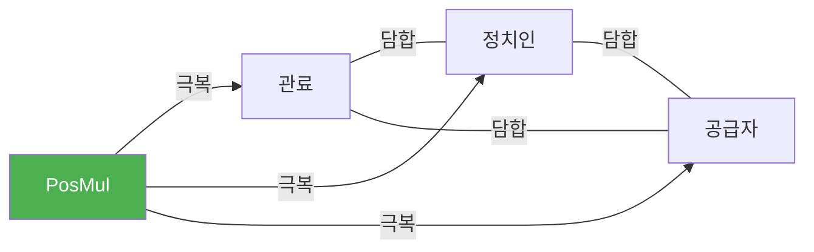

### 1.2 핵심 가치

| 가치 | 설명 | 구현 방법 |
|------|------|----------|
| 🔍 **투명성** | 모든 거래와 기부 내역 공개 | 블록체인 + 실시간 대시보드 |
| 🗳️ **참여** | 시민이 직접 의사결정에 참여 | 예측 게임 + 포럼 투표 |
| 💰 **공정성** | 경제적 보상의 공정한 분배 | MoneyWave 3단계 분배 |
| 🌍 **글로벌** | 전세계 기부문화 표준화 | SDK 기반 생태계 확장 |

### 1.3 장기 로드맵

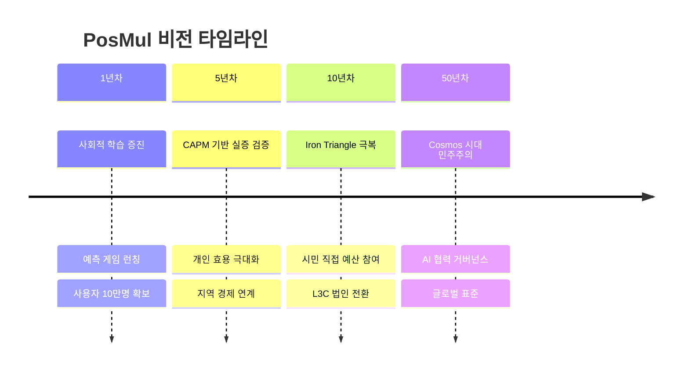

---

## 2. 핵심 기능

### 2.1 6대 모듈 구조

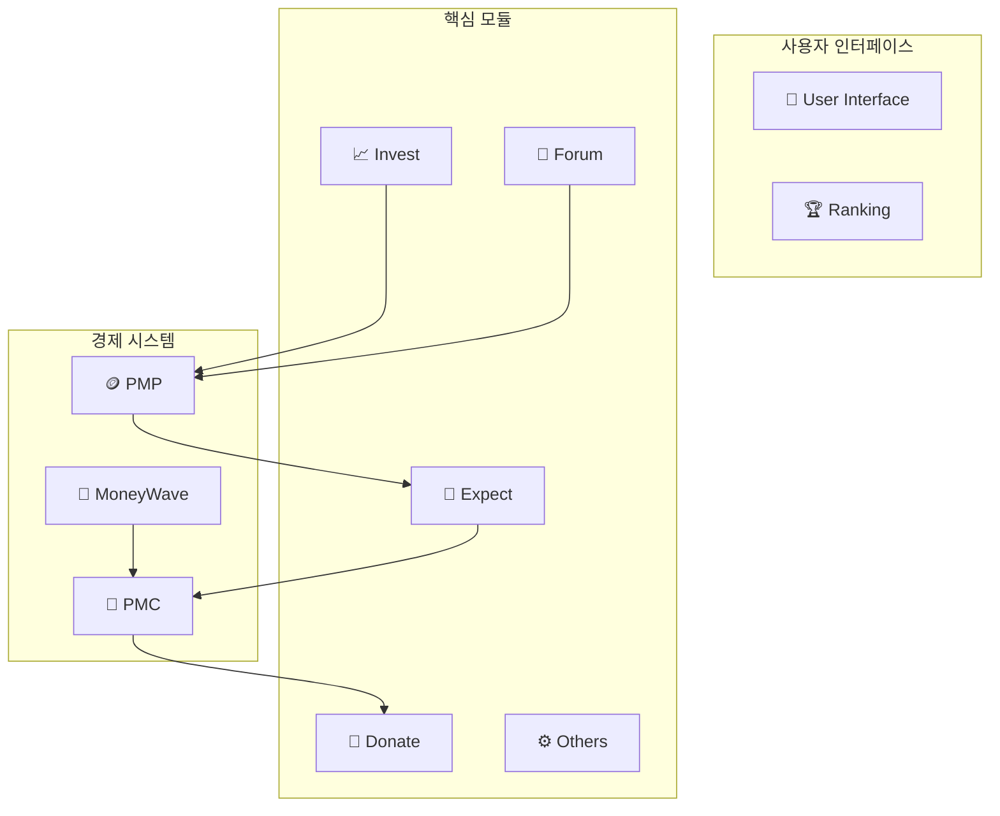

### 2.2 이중 토큰 경제 시스템

| 토큰 | 성격 | 획득 방법 | 사용처 |
|------|------|----------|--------|
| **PMP** | 위험프리 자산 | 광고시청, 포럼참여 | 예측 게임 배팅 |
| **PMC** | 위험자산 | 예측 성공, MoneyWave | 기부 전용 |

### 2.3 MoneyWave 분배 시스템

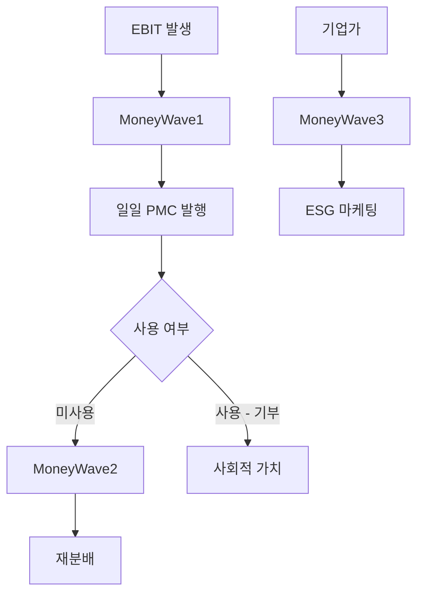

---

## 3. 기술 아키텍처

### 3.1 기술 스택

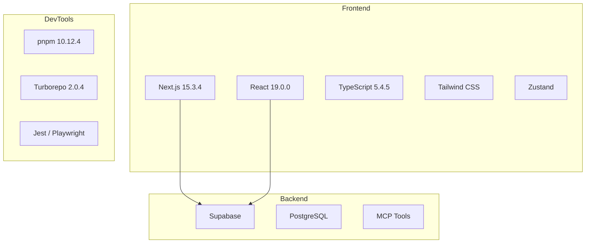

### 3.2 모노레포 구조

```
posmul/
├── 📁 apps/
│   └── posmul-web/                # 🌐 Next.js 웹 애플리케이션
│       └── src/
│           ├── app/               # App Router 페이지
│           ├── bounded-contexts/  # DDD 도메인 (11개)
│           ├── shared/            # 공유 컴포넌트/유틸
│           └── lib/               # 라이브러리 설정
├── 📁 packages/
│   └── auth-economy-sdk/          # 🔐 통합 SDK
├── 📁 docs/                       # 📖 문서화
└── 📁 scripts/                    # 🔧 자동화 스크립트
```

### 3.3 DDD Bounded Contexts (11개)

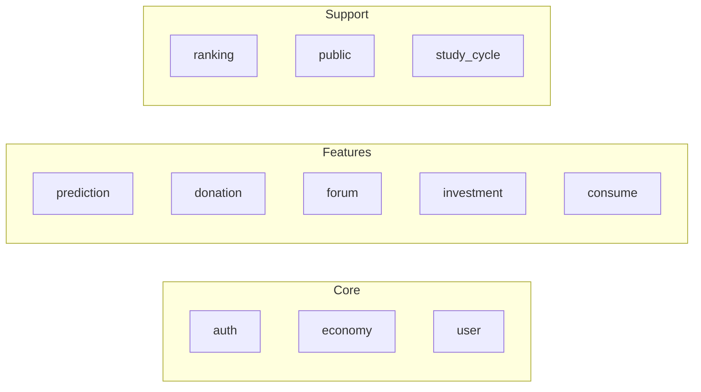

| Context | 용도 | 주요 테이블 |
|---------|------|------------|
| **auth** | 인증/인가 | users, sessions |
| **economy** | 경제 시스템 | pmp_accounts, pmc_accounts, money_wave |
| **prediction** | 예측 게임 | games, predictions, settlements |
| **donation** | 기부 시스템 | donations, institutes |
| **forum** | 커뮤니티 | posts, debates, votes |
| **user** | 사용자 관리 | profiles, reputation |

### 3.4 계층 구조 (Clean Architecture)

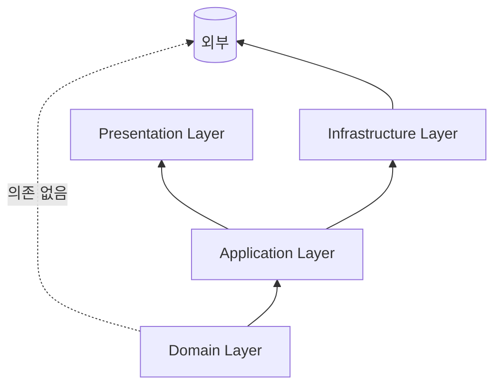

**각 계층별 책임**:
- **Domain**: 순수 비즈니스 로직 (Entity, Value Object, Repository Interface)
- **Application**: Use Cases, DTO 변환
- **Infrastructure**: Supabase, MCP 연동
- **Presentation**: React 컴포넌트, Hooks

---

## 4. Git 전략

### 4.1 브랜치 전략 (GitFlow 변형)

```mermaid
gitgraph
    commit id: "초기 커밋"
    branch develop
    checkout develop
    commit id: "개발 시작"
    branch feature/ui-dashboard
    commit id: "대시보드 UI"
    commit id: "차트 추가"
    checkout develop
    merge feature/ui-dashboard
    branch feature/pmp-system
    commit id: "PMP 로직"
    checkout develop
    merge feature/pmp-system
    checkout main
    merge develop tag: "v1.0.0"
```

### 4.2 브랜치 명명 규칙

| 브랜치 유형 | 패턴 | 예시 |
|------------|------|------|
| **기능** | `feature/[도메인]-[기능]` | `feature/economy-pmp-transfer` |
| **버그** | `fix/[이슈번호]-[설명]` | `fix/123-balance-calculation` |
| **UI** | `ui/[컴포넌트]-[작업]` | `ui/prediction-card-redesign` |
| **문서** | `docs/[문서유형]` | `docs/api-reference` |
| **핫픽스** | `hotfix/[버전]-[설명]` | `hotfix/1.0.1-auth-error` |
| **릴리즈** | `release/[버전]` | `release/1.1.0` |

### 4.3 커밋 컨벤션

```
<type>(<scope>): <subject>

<body>

<footer>
```

**Type 종류**:
| Type | 설명 | 예시 |
|------|------|------|
| `feat` | 새로운 기능 | `feat(economy): PMP 전송 로직 구현` |
| `fix` | 버그 수정 | `fix(auth): 세션 만료 처리 수정` |
| `ui` | UI 변경 | `ui(prediction): 카드 디자인 개선` |
| `refactor` | 리팩토링 | `refactor(domain): Entity 구조 개선` |
| `test` | 테스트 | `test(economy): 잔액 계산 테스트 추가` |
| `docs` | 문서 | `docs: API 레퍼런스 업데이트` |
| `chore` | 기타 | `chore: 의존성 업데이트` |

**Scope (도메인 기반)**:
```
auth, economy, prediction, donation, forum, 
user, ranking, consume, public
```

### 4.4 PR (Pull Request) 템플릿

```markdown
## 📋 변경 사항
<!-- 이 PR에서 변경된 내용 요약 -->

## 🎯 관련 이슈
<!-- Closes #123 -->

## 🧪 테스트
- [ ] 단위 테스트 통과
- [ ] 타입 체크 통과
- [ ] 빌드 성공

## 📸 스크린샷 (UI 변경 시)
<!-- Before / After 스크린샷 -->

## ✅ 체크리스트
- [ ] 코드 스타일 가이드 준수
- [ ] 문서 업데이트 (필요시)
- [ ] Breaking changes 없음
```

### 4.5 코드 리뷰 가이드

**리뷰어 체크리스트**:
1. ✅ 타입 안전성 (any 사용 금지)
2. ✅ DDD 원칙 준수 (계층 분리)
3. ✅ 테스트 커버리지
4. ✅ UI 일관성 (디자인 시스템)
5. ✅ 성능 영향

**리뷰 응답 규칙**:
- 🟢 **Approve**: 바로 머지 가능
- 🟡 **Comment**: 의견만 (블로커 아님)
- 🔴 **Request Changes**: 수정 필요

---

## 5. AI Agent 협업 가이드

### 5.1 협업 원칙

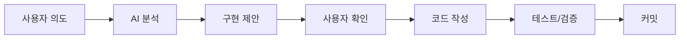

**핵심 원칙**:
1. **항상 한국어로 소통** - 코드 주석, 문서, 커밋 메시지 포함
2. **작은 단위로 작업** - 하나의 기능 = 하나의 커밋
3. **테스트 우선** - 테스트 가능한 코드 작성
4. **문서화 필수** - 변경 시 관련 문서 업데이트

### 5.2 코드 작성 규칙

**TypeScript 필수 규칙**:
```typescript
// ✅ Good - 타입 명시
function calculatePMP(amount: number): Result<PMP> {
  if (amount < 0) {
    return { success: false, error: new Error('음수 불가') };
  }
  return { success: true, data: PMP.create(amount) };
}

// ❌ Bad - any 사용 금지
function calculatePMP(amount: any): any {
  return amount * 2;
}
```

**DDD 패턴 준수**:
```typescript
// Domain Layer - 순수 로직
class PMPBalance {
  private constructor(private readonly value: number) {}
  
  static create(value: number): Result<PMPBalance> {
    if (value < 0) return failure(new InvalidAmountError());
    return success(new PMPBalance(value));
  }
  
  add(amount: number): Result<PMPBalance> {
    return PMPBalance.create(this.value + amount);
  }
}
```

### 5.3 AI Agent를 위한 컨텍스트 정보

**프로젝트 진입점**:
```powershell
# 개발 서버 시작
cd c:\G\posmul
pnpm dev

# 특정 앱만 실행
pnpm -F @posmul/posmul-web dev
```

**주요 파일 위치**:
| 파일/폴더 | 용도 |
|----------|------|
| `apps/posmul-web/src/app/` | 페이지 라우트 |
| `apps/posmul-web/src/bounded-contexts/` | 도메인 로직 |
| `apps/posmul-web/src/shared/` | 공유 컴포넌트 |
| `packages/auth-economy-sdk/` | 외부 연동 SDK |
| `docs/` | 문서 |

**MCP 도구 사용법**:
```typescript
// SQL 실행 (조회)
mcp_supabase-mcp-server_execute_sql({
  project_id: "your-project-id",
  query: "SELECT * FROM economy.pmp_accounts LIMIT 10"
});

// 마이그레이션 적용 (DDL)
mcp_supabase-mcp-server_apply_migration({
  project_id: "your-project-id",
  name: "add_new_column",
  query: "ALTER TABLE economy.pmp_accounts ADD COLUMN new_col TEXT"
});
```

### 5.4 UI/UX 작업 시 가이드

**현재 UI 우선 개발 중**:
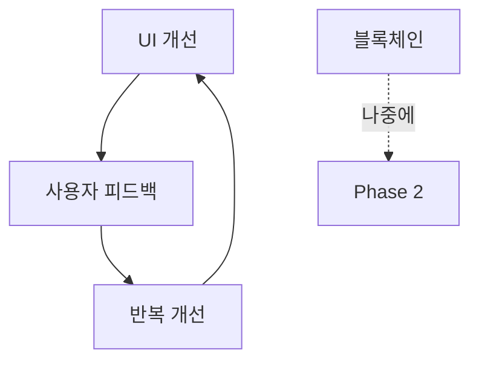

**UI 컴포넌트 위치**:
```
apps/posmul-web/src/
├── shared/
│   └── components/       # 공통 컴포넌트
├── bounded-contexts/
│   └── [domain]/
│       └── presentation/
│           └── components/  # 도메인별 컴포넌트
```

**스타일링 규칙**:
- Tailwind CSS 사용
- 컴포넌트당 하나의 책임
- 반응형 필수 (mobile-first)

---

## 6. 개발 워크플로우

### 6.1 일일 개발 흐름

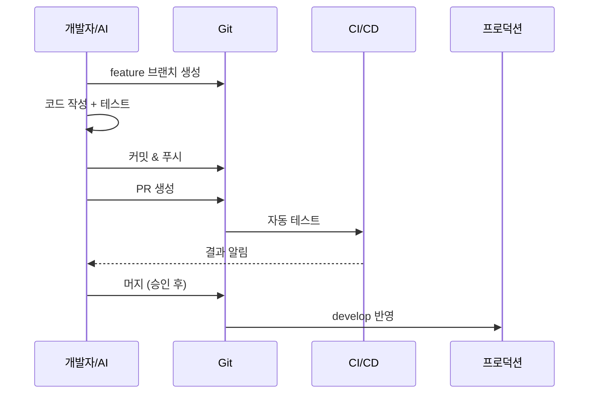

### 6.2 명령어 치트시트

```powershell
# 🚀 시작하기
pnpm install          # 의존성 설치
pnpm generate-types   # Supabase 타입 생성
turbo dev             # 개발 서버

# 🔧 빌드 & 테스트
turbo build           # 전체 빌드 (18초)
turbo test            # 테스트 실행
turbo type-check      # 타입 검사

# 💅 코드 품질
pnpm format           # Prettier 포맷팅
turbo lint --fix      # ESLint 수정

# 📦 배포
turbo build --filter=@posmul/posmul-web  # 웹앱만 빌드
```

### 6.3 환경 변수

```bash
# .env.local (필수)
NEXT_PUBLIC_SUPABASE_URL=https://xxx.supabase.co
NEXT_PUBLIC_SUPABASE_ANON_KEY=eyJ...
SUPABASE_SERVICE_ROLE_KEY=eyJ...
SUPABASE_PROJECT_ID=xxx
```

---

## 7. 현재 상태 및 로드맵

### 7.1 프로젝트 현황 (2024-12)

| 영역 | 완성도 | 상태 |
|------|--------|------|
| **DDD 아키텍처** | 95% | ✅ 안정 |
| **경제 시스템 설계** | 90% | ✅ 설계 완료 |
| **인증 시스템** | 85% | 🔧 일부 테스트 실패 |
| **예측 게임** | 80% | 🔧 UI 개선 필요 |
| **UI/UX** | 60% | 🚧 집중 개발 중 |
| **블록체인 통합** | 10% | ⏸️ 보류 (Phase 2) |

### 7.2 단기 로드맵 (4주)

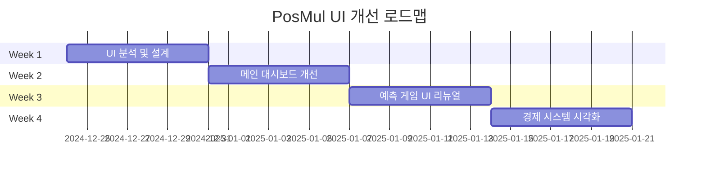

### 7.3 외부 자문 필요 영역

1. **법률 자문**
   - L3C 법인 전환 전략
   - 토큰 규제 검토

2. **경제학 자문**
   - MoneyWave 파라미터 최적화
   - 인플레이션/디플레이션 시뮬레이션

3. **UX 자문**
   - 사용자 획득 전략
   - 게이미피케이션 설계

4. **블록체인 자문** (Phase 2)
   - Hyperledger Fabric 아키텍처
   - 온체인/오프체인 동기화

---

## 📌 빠른 참조

### 주요 연락처 및 리소스

| 리소스 | 위치 |
|--------|------|
| **코드 저장소** | `c:\G\posmul` |
| **프로젝트 규칙** | `docs/PROJECT_RULES.md` |
| **아키텍처 문서** | `docs/architecture/` |
| **API 레퍼런스** | `docs/reference/api/` |

### 자주 묻는 질문

**Q: Supabase CLI를 사용해도 되나요?**  
A: ❌ 금지. 반드시 MCP 도구만 사용하세요.

**Q: any 타입을 사용해도 되나요?**  
A: ❌ 금지. 모든 타입을 명시적으로 정의하세요.

**Q: UI 변경 시 어떤 브랜치를 사용하나요?**  
A: `ui/[컴포넌트]-[작업]` 형식을 사용하세요.

---

**문서 버전**: 1.0  
**최종 업데이트**: 2024-12-24  
**다음 리뷰**: 2025-01-24
