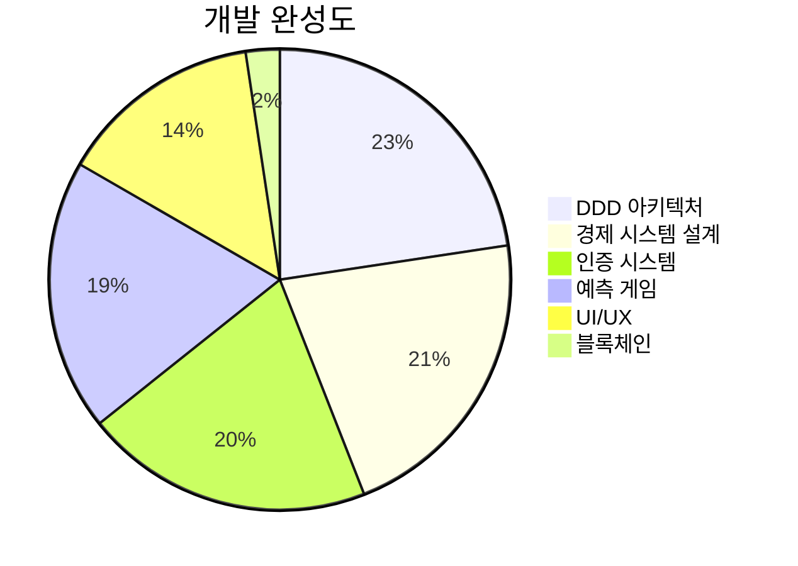

# PosMul 외부 자문용 브리핑

> **목적**: 외부 자문진에게 프로젝트 핵심 내용을 빠르게 전달  
> **대상**: 법률, 경제학, UX, 블록체인 전문가

---

## 🎯 프로젝트 한 줄 요약

> **"시민이 직접 예산 집행을 연습하는 AI 시대 직접민주주의 플랫폼"**

---

## 📊 핵심 정보

| 항목 | 내용 |
|------|------|
| **프로젝트명** | PosMul (긍정승수) |
| **목표** | 전세계 기부문화 투명성 확보 |
| **단계** | MVP 개발 중 (UI/UX 집중) |
| **기술** | Next.js 15, React 19, Supabase |
| **블록체인** | Hyperledger Fabric (계획 중) |

---

## 💡 핵심 아이디어

### 이중 토큰 시스템

```
PMP (위험프리) ──→ 예측 게임 ──→ PMC (위험자산) ──→ 기부
   ↑                                              ↓
 활동 보상                                   사회적 가치
```

| 토큰 | 유형 | 획득 | 사용 |
|------|------|------|------|
| **PMP** | 포인트 | 광고시청, 포럼 | 예측 배팅 |
| **PMC** | 코인 | 예측 성공 | 기부 전용 |

### 경제학적 근거

- **Jensen & Meckling (1976)**: Agency Theory → 정보 비대칭 해소
- **Kahneman-Tversky**: Prospect Theory → 손실 회피 활용
- **Buchanan**: Public Choice → Iron Triangle 극복

---

## 🔍 자문 필요 영역

### 1. 법률 자문

| 주제 | 질문 |
|------|------|
| **L3C 전환** | 한국에서 L3C 유사 법인 설립 가능성? |
| **토큰 규제** | PMP/PMC가 암호화폐로 분류되는지? |
| **기부 세제** | 플랫폼 기부금 세액공제 적용 방법? |

### 2. 경제학 자문

| 주제 | 질문 |
|------|------|
| **MoneyWave 파라미터** | 최적 분배 비율은? |
| **인플레이션** | PMP/PMC 가치 안정화 방법? |
| **게임 이론** | 사용자 담합 방지 메커니즘? |

### 3. UX 자문

| 주제 | 질문 |
|------|------|
| **온보딩** | 복잡한 경제 시스템 쉽게 설명 방법? |
| **게이미피케이션** | 참여 유지를 위한 핵심 요소? |
| **신뢰 구축** | 투명성을 UI로 표현하는 방법? |

### 4. 블록체인 자문 (Phase 2)

| 주제 | 질문 |
|------|------|
| **아키텍처** | Hyperledger Fabric vs 다른 체인? |
| **동기화** | 온체인/오프체인 동기화 전략? |
| **성능** | 예상 TPS와 확장 방안? |

---

## 📈 현재 진행 상황



### 단기 우선순위

1. ✅ **UI/UX 개선** (현재 진행 중)
2. ⏸️ 테스트 안정화
3. ⏸️ SDK 문서화
4. ⏸️ 블록체인 통합 (나중)

---

## 📞 추가 자료 요청

상세 정보가 필요하시면 아래 문서를 참조해주세요:

| 문서 | 경로 |
|------|------|
| 협업 가이드 | `docs/COLLABORATION_GUIDE.md` |
| 프로젝트 규칙 | `docs/PROJECT_RULES.md` |
| 경제 시스템 상세 | `bounded-contexts/economy/context.md` |
| L3C 전환 전략 | `docs/business/PosMul-Personal-Business-to-L3C-Strategy.md` |

---

**문서 버전**: 1.0 | **작성일**: 2024-12-24
