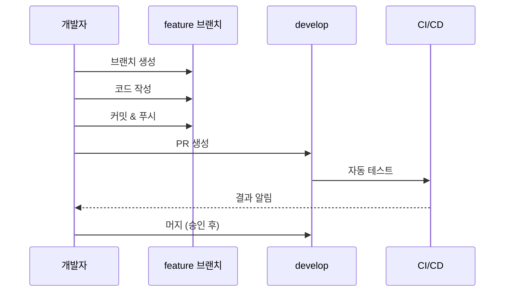

# PosMul Git 전략 가이드

> **목적**: 체계적인 버전 관리와 협업을 위한 Git 워크플로우 정의

---

## 🌳 브랜치 전략

### 핵심 브랜치

```mermaid
gitgraph
    commit id: "v1.0.0" tag: "production"
    branch develop
    commit id: "dev start"
    branch feature/ui-dashboard
    commit id: "dashboard"
    checkout develop
    merge feature/ui-dashboard
    branch feature/economy-pmp
    commit id: "pmp logic"
    checkout develop
    merge feature/economy-pmp
    checkout main
    merge develop tag: "v1.1.0"
```

| 브랜치 | 용도 | 규칙 |
|--------|------|------|
| `main` | 프로덕션 | 릴리즈 태그만 머지 |
| `develop` | 개발 통합 | feature 브랜치 머지 대상 |
| `feature/*` | 기능 개발 | develop에서 분기 |
| `fix/*` | 버그 수정 | develop에서 분기 |
| `hotfix/*` | 긴급 수정 | main에서 분기 |

---

## 📝 브랜치 명명 규칙

### 패턴

```
<type>/<scope>-<description>
```

### 예시

| 유형 | 패턴 | 예시 |
|------|------|------|
| 기능 | `feature/<domain>-<feature>` | `feature/economy-pmp-transfer` |
| UI | `ui/<component>-<action>` | `ui/prediction-card-redesign` |
| 버그 | `fix/<issue>-<description>` | `fix/123-balance-calc` |
| 핫픽스 | `hotfix/<version>-<description>` | `hotfix/1.0.1-auth-crash` |
| 문서 | `docs/<topic>` | `docs/api-reference` |
| 리팩토링 | `refactor/<scope>-<description>` | `refactor/domain-entity-cleanup` |

---

## ✍️ 커밋 컨벤션

### 형식

```
<type>(<scope>): <subject>

[optional body]

[optional footer]
```

### Type 목록

| Type | 설명 | 예시 |
|------|------|------|
| `feat` | 새 기능 | `feat(economy): PMP 잔액 조회 API` |
| `fix` | 버그 수정 | `fix(auth): 로그인 세션 오류 해결` |
| `ui` | UI 변경 | `ui(prediction): 카드 디자인 개선` |
| `refactor` | 리팩토링 | `refactor(domain): Entity 구조 개선` |
| `test` | 테스트 | `test(economy): 잔액 계산 테스트` |
| `docs` | 문서 | `docs: README 업데이트` |
| `chore` | 설정/빌드 | `chore: 의존성 업데이트` |
| `style` | 포맷팅 | `style: 코드 정리` |
| `perf` | 성능 | `perf(query): 조회 쿼리 최적화` |

### Scope (도메인)

```
auth, economy, prediction, donation, forum, 
user, ranking, consume, public
```

### 좋은 커밋 예시

```bash
# ✅ Good
feat(economy): MoneyWave1 분배 로직 구현

- EBIT 기반 일일 PMC 발행량 계산
- 활성 사용자에게 균등 분배
- 분배 이력 테이블에 기록

Closes #42

# ❌ Bad
수정
```

---

## 🔄 워크플로우

### 1. 기능 개발 플로우



### 2. 명령어

```powershell
# 브랜치 생성
git checkout develop
git pull origin develop
git checkout -b feature/economy-pmp-transfer

# 작업 후 커밋
git add .
git commit -m "feat(economy): PMP 전송 기능 구현"

# 푸시 및 PR
git push origin feature/economy-pmp-transfer
# GitHub에서 PR 생성
```

---

## 📋 PR 템플릿

```markdown
## 📋 변경 사항
<!-- 변경 내용 요약 -->

## 🎯 관련 이슈
Closes #

## 🧪 테스트 체크리스트
- [ ] `turbo test` 통과
- [ ] `turbo type-check` 통과
- [ ] `turbo build` 성공

## 📸 스크린샷 (UI 변경 시)
| Before | After |
|--------|-------|
| | |

## ✅ 리뷰어 체크리스트
- [ ] 타입 안전성 (any 금지)
- [ ] DDD 계층 분리 준수
- [ ] 테스트 커버리지
- [ ] 문서 업데이트 (필요 시)
```

---

## 🏷️ 릴리즈 전략

### 버전 규칙 (SemVer)

```
MAJOR.MINOR.PATCH
```

| 변경 유형 | 예시 | 설명 |
|----------|------|------|
| **MAJOR** | 1.0.0 → 2.0.0 | Breaking changes |
| **MINOR** | 1.0.0 → 1.1.0 | 새 기능 (호환) |
| **PATCH** | 1.0.0 → 1.0.1 | 버그 수정 |

### 릴리즈 플로우

```powershell
# 1. 릴리즈 브랜치 생성
git checkout develop
git checkout -b release/1.1.0

# 2. 버전 업데이트 & 테스트
# package.json 버전 수정
turbo build && turbo test

# 3. main에 머지
git checkout main
git merge release/1.1.0
git tag v1.1.0

# 4. develop에도 반영
git checkout develop
git merge release/1.1.0

# 5. 푸시
git push origin main develop --tags
```

---

## 🛡️ 보호 규칙

### main 브랜치

- ✅ PR 필수 (직접 푸시 금지)
- ✅ 최소 1명 승인 필요
- ✅ CI 통과 필수
- ✅ 태그 생성 시에만 머지

### develop 브랜치

- ✅ PR 필수
- ✅ CI 통과 필수
- ⚠️ 승인 없이 머지 가능 (선택)

---

**문서 버전**: 1.0 | **최종 업데이트**: 2024-12-24
