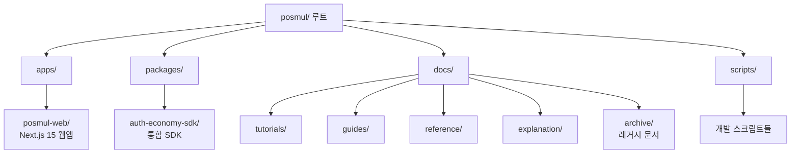
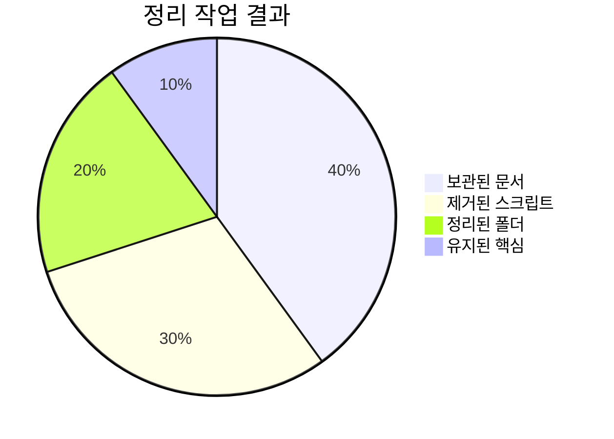

# 🏗️ PosMul 프로젝트 구조 (2025-07-11 정리 완료)

> **정리 완료**: 불필요한 파일들 제거, 개발환경 재설정, 핵심 구조만 유지

## 📁 현재 프로젝트 구조



### 🎯 **핵심 구조 (정리 후)**

```
posmul/
├── 📁 apps/                    # 애플리케이션들
│   └── posmul-web/            # Next.js 15 + React 19 웹앱
├── 📁 packages/               # 공유 패키지들
│   └── auth-economy-sdk/      # 통합 SDK (인증 + 경제)
├── 📁 docs/                   # 문서화 (Diátaxis 구조)
│   ├── tutorials/             # 학습 중심 가이드
│   ├── guides/                # 문제 해결 가이드
│   ├── reference/             # API 레퍼런스
│   ├── explanation/           # 아키텍처 설명
│   └── archive/               # 정리된 레거시 문서
├── 📁 scripts/                # 개발 및 배포 스크립트
├── 📄 package.json            # 루트 워크스페이스 설정
├── 📄 pnpm-workspace.yaml     # pnpm 워크스페이스 구성
├── 📄 turbo.json              # Turbo 빌드 구성
├── 📄 tsconfig.json           # TypeScript 설정
└── 📄 README.md               # 프로젝트 메인 문서
```

## 🗑️ 정리된 항목들

### **제거된 파일들**



#### **📦 보관된 문서들 (docs/archive/)**

- **migration-reports/**: 마이그레이션 관련 보고서들
  - `auto-migration-final-report.md`
  - `final-migration-log.md`
  - `typescript-error-fix-progress-report.md`
  - 기타 TypeScript 오류 수정 관련 문서들

- **analysis-reports/**: 분석 보고서들
  - `POSMUL_COMPREHENSIVE_REPORT.md`
  - `posmul-ecosystem-development-test-report.md`
  - `posmul-platform-strategy-analysis-report.md`
  - 기타 전략 분석 문서들

#### **🗑️ 완전 제거된 항목들**

- **임시 스크립트들**:
  - `automation-safety-monitor.js`
  - `fix-korean-encoding.ps1`
  - `legacy-cleanup.ps1`
  - `simple-cleanup.ps1`
  - `temp-mcp-types.ts`

- **불필요한 폴더들**:
  - `automation-scripts/`
  - `backup/`
  - `src/` (사용되지 않던 레거시)

- **기타**:
  - 스크린샷 파일들
  - 임시 텍스트 파일들

## 🚀 정리 후 개발환경

### **개발 도구 버전**

| 도구           | 버전     | 상태         |
| -------------- | -------- | ------------ |
| **Node.js**    | v22.16.0 | ✅ 최신      |
| **pnpm**       | 10.12.4  | ✅ 권장      |
| **Turbo**      | 2.5.4    | ✅ 최신      |
| **TypeScript** | 5.8.3    | ✅ 엄격 모드 |

### **빌드 성능**

```mermaid
bar title 빌드 성능 지표
    x-axis "작업 유형"
    y-axis "시간 (초)"
    "타입 검사" : 12.6
    "전체 빌드" : 46.7
    "의존성 설치" : 31.9
```

- **TypeScript 검사**: 12.6초 (오류 0개)
- **전체 빌드**: 46.7초 (2개 패키지)
- **캐시 활용**: 1개 패키지 캐시 히트
- **의존성 설치**: 31.9초 (926개 패키지)

## 📋 개발 워크플로우

### **1. 일상적인 개발**

```powershell
# 전체 개발 서버 시작
pnpm dev

# 특정 패키지만 개발
pnpm --filter @posmul/posmul-web dev
pnpm --filter @posmul/auth-economy-sdk dev
```

### **2. 빌드 및 검증**

```powershell
# 타입 검사
pnpm turbo type-check

# 전체 빌드
pnpm turbo build

# 테스트 실행
pnpm turbo test
```

### **3. 의존성 관리**

```powershell
# 캐시 정리
pnpm store prune

# 의존성 재설치
pnpm install

# 워크스페이스 상태 확인
pnpm list --depth=0
```

## 🎯 다음 개발 우선순위

### **단기 목표 (1-2주)**

1. **웹앱 기능 완성**
   - 예측 게임 UI 최적화
   - 경제 시스템 대시보드
   - 사용자 인증 플로우 개선

2. **SDK 안정화**
   - 에러 처리 강화
   - 타입 안전성 향상
   - 문서화 완성

### **중기 목표 (1-2개월)**

1. **모바일 앱 연동**
   - React Native 앱과 SDK 통합
   - 크로스 플랫폼 동기화

2. **배포 자동화**
   - CI/CD 파이프라인 구축
   - 자동 테스트 환경

## 🔗 관련 문서

- **[메인 README](../README.md)**: 프로젝트 전체 개요
- **[개발 가이드](guides/)**: 개발 관련 가이드들
- **[API 문서](reference/)**: API 레퍼런스
- **[아키텍처](explanation/)**: 시스템 아키텍처 설명

---

**정리 완료일**: 2025년 1월 8일  
**정리 담당**: AI Assistant  
**다음 리뷰**: 2025년 2월 8일 (1개월 후)
