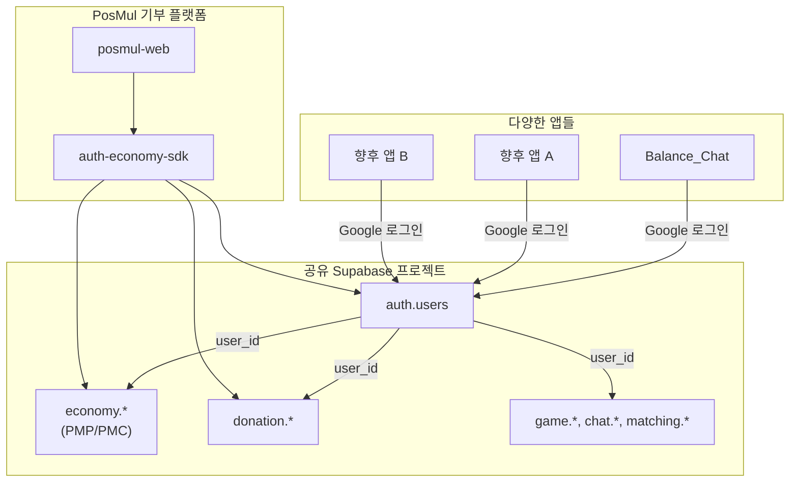
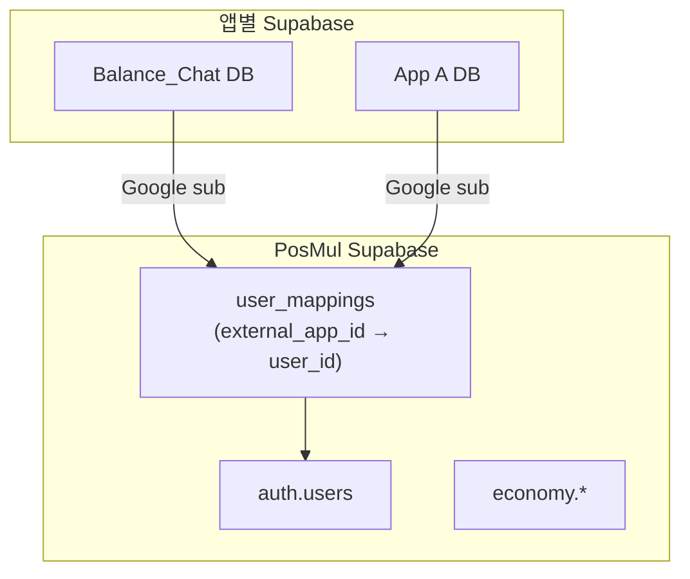
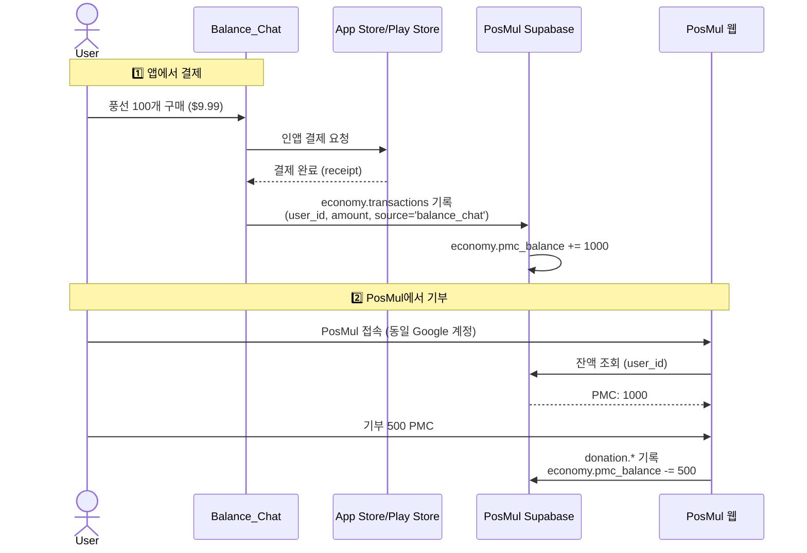

# 크로스 플랫폼 인증 및 결제-기부 연동 기술 검토 보고서

> **작성일**: 2026-01-02  
> **버전**: 1.0  
> **작성자**: Infrastructure Expert

---

## 📋 요약 (Executive Summary)

### 목표
- Balance_Chat 등 다양한 앱에서 **Google 로그인** 시 PosMul 플랫폼과 **인증 공유**
- 앱에서 **유료 결제** → PosMul에서 **기부 가능**한 시스템 구축

### 결론
**✅ 기술적으로 완전히 가능하며, 기존 `auth-economy-sdk`에 이미 핵심 기능이 구현되어 있습니다.**

---

## 1. 현재 아키텍처 분석

### 1.1 프로젝트 구조

```
c:\G\
├── posmul/                          # 기부 전용 플랫폼 (Next.js)
│   └── packages/auth-economy-sdk/   # 통합 SDK ✅
│
├── Balance_Chat/                    # 채팅 앱 (React Native)
│   └── src/infrastructure/supabase/ # Supabase 연동
│
└── [향후 앱들]/                     # 추가될 앱들
```

### 1.2 기존 SDK 기능 (이미 구현됨)

| 기능 | 메서드 | 상태 |
|------|--------|------|
| **Google OAuth 로그인** | `signInWithOAuth('google')` | ✅ 구현됨 |
| **세션 동기화** | `syncSessionAcrossApps()` | ✅ 구현됨 |
| **경제 데이터 동기화** | `syncEconomicDataAcrossApps()` | ✅ 구현됨 |
| **PMP/PMC 잔액 조회** | `getCombinedBalance()` | ✅ 구현됨 |
| **유니버설 사용자 ID** | `getUniversalUserId()` | ✅ 구현됨 |

---

## 2. 연동 아키텍처 제안

### 2.1 방안 A: 동일 Supabase 프로젝트 (⭐ 최적 권장)



**장점**:
- 한 번 로그인하면 **모든 앱에서 동일 `user_id`** 사용
- 결제/기부 연동이 **DB 트랜잭션**으로 처리 가능
- 기존 SDK 그대로 사용 가능

**단점**:
- 모든 앱이 같은 DB를 공유 (스키마로 분리)

---

### 2.2 방안 B: 별도 Supabase + ID 매핑



**장점**:
- 앱별 독립 DB 유지

**단점**:
- ID 매핑 테이블 관리 필요
- 추가 API 호출 필요

---

## 3. Google 로그인 연동 기술 상세

### 3.1 핵심 원리: Google `sub` (Subject ID)

Google OAuth 로그인 시 반환되는 `id_token`에는 **고유한 `sub` 값**이 포함됩니다:

```json
{
  "sub": "1234567890",        // ← 영구적으로 고유한 Google 사용자 ID
  "email": "user@gmail.com",
  "name": "홍길동"
}
```

**`sub` 값은 동일한 Google 계정이면 어떤 앱에서 로그인하든 항상 동일합니다.**

### 3.2 Supabase OAuth 흐름

```typescript
// Balance_Chat (React Native)
import * as Google from 'expo-auth-session/providers/google';

const [request, response, promptAsync] = Google.useIdTokenAuthRequest({
  clientId: GOOGLE_CLIENT_ID,
});

// Google 로그인 후
if (response?.params?.id_token) {
  const { data, error } = await supabase.auth.signInWithIdToken({
    provider: 'google',
    token: response.params.id_token,
    access_token: response.params.access_token,
  });
  // data.user.id → Supabase user_id (auth.users)
}
```

### 3.3 동일 사용자 보장 조건

| 조건 | 설명 |
|------|------|
| **동일 Supabase 프로젝트** | 같은 `auth.users` 테이블 사용 |
| **동일 Google OAuth Client** | 같은 앱 ID로 로그인 |
| **동일 email** | `user_unique_key = email` |

---

## 4. 결제 → 기부 연동 플로우

### 4.1 전체 플로우



### 4.2 데이터 모델 (DDD 스키마)

```sql
-- 통합 경제 계정 (PosMul Supabase)
economy.pmp_pmc_accounts (
  user_id UUID REFERENCES auth.users(id),  -- 공유 user_id
  pmp_balance BIGINT,
  pmc_balance BIGINT,
  source_app TEXT[]  -- ['posmul', 'balance_chat', ...]
);

-- 결제 기록
economy.payment_records (
  id UUID PRIMARY KEY,
  user_id UUID,
  app_source TEXT,       -- 'balance_chat', 'app_a', ...
  amount_paid DECIMAL,   -- 실제 결제 금액
  pmc_credited BIGINT,   -- 지급된 PMC
  receipt_data JSONB,    -- 앱스토어 영수증
  created_at TIMESTAMPTZ
);

-- 기부 기록
donation.donations (
  id UUID PRIMARY KEY,
  user_id UUID,
  pmc_amount BIGINT,
  target_id UUID,        -- 기부 대상
  created_at TIMESTAMPTZ
);
```

---

## 5. 구현 방안

### 5.1 Balance_Chat 연동 (1단계)

#### Step 1: Supabase 프로젝트 통합

**현재 상태**:
- Balance_Chat: `hdhmhqbifotjztjasbqm`
- PosMul: 별도 프로젝트 (확인 필요)

**옵션 1**: Balance_Chat을 PosMul Supabase로 마이그레이션
**옵션 2**: PosMul 스키마를 Balance_Chat Supabase에 추가

#### Step 2: SDK 연동

```typescript
// Balance_Chat에서 auth-economy-sdk 사용
import { createAuthEconomyClient } from '@posmul/auth-economy-sdk';

const client = createAuthEconomyClient(supabase);

// Google 로그인
await client.auth.signInWithOAuth('google', redirectUrl);

// 결제 후 PMC 적립
await client.economy.creditPmcFromPayment(userId, {
  appSource: 'balance_chat',
  amountPaid: 9.99,
  pmcCredited: 1000,
  receiptData: storeReceipt,
});

// PosMul에서 잔액 조회
const balance = await client.economy.getCombinedBalance(userId);
// → { pmp: 0, pmc: 1000 }
```

### 5.2 SDK 확장 (2단계)

`auth-economy-sdk`에 결제 연동 기능 추가:

```typescript
// packages/auth-economy-sdk/src/economy/services/payment.service.ts

export class PaymentService {
  // 인앱 결제 → PMC 적립
  async creditPmcFromPayment(
    userId: UserId, 
    payment: PaymentRecord
  ): Promise<Result<TransactionResult, EconomyError>> {
    // 1. 영수증 검증
    // 2. payment_records에 기록
    // 3. pmc_balance 증가
    // 4. 트랜잭션 반환
  }
  
  // 앱별 결제 내역 조회
  async getPaymentHistoryByApp(
    userId: UserId,
    appSource: string
  ): Promise<Result<PaymentRecord[], EconomyError>>;
}
```

---

## 6. 권장 구현 로드맵

### Phase 1: 기반 구축 (1주)

- [ ] Supabase 프로젝트 통합 결정
- [ ] `economy.payment_records` 테이블 생성
- [ ] SDK에 `PaymentService` 추가

### Phase 2: Balance_Chat 연동 (2주)

- [ ] Balance_Chat에 Google 로그인 구현
- [ ] 인앱 결제 연동 (RevenueCat 또는 직접)
- [ ] 결제 → PMC 적립 플로우 테스트

### Phase 3: PosMul 기부 연동 (1주)

- [ ] PosMul에서 "외부 앱 결제" 내역 표시
- [ ] 기부 UI에 잔액 표시
- [ ] 기부 → 잔액 차감 플로우 테스트

---

## 7. 결론 및 권장사항

### ✅ 가능 여부: **완전히 가능**

1. **Google 로그인**: Supabase `signInWithIdToken`으로 동일 `user_id` 보장
2. **기존 SDK 활용**: `auth-economy-sdk`에 이미 필요 기능 구현됨
3. **확장 가능**: 향후 앱들도 동일 패턴으로 연동 가능

### 🎯 최적 구현 방안

**방안 A (동일 Supabase 프로젝트)** 권장

- 구현 복잡도: 낮음
- 데이터 일관성: 높음
- 확장성: 우수

### 📝 다음 단계

1. PosMul의 현재 Supabase 프로젝트 ID 확인
2. 프로젝트 통합 방식 결정 (마이그레이션 vs 스키마 추가)
3. SDK `PaymentService` 확장 구현

---

**보고서 끝**
