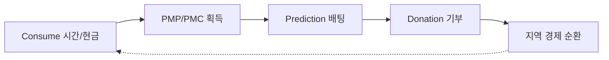

# PosMul vs 경쟁 예측 플랫폼 비교 분석 보고서

> 작성일: 2025-12-30

---

## 1. 경쟁 플랫폼 개요

| 플랫폼 | 유형 | 특징 | 규제 |
|---|---|---|---|
| **Polymarket** | 탈중앙화 | USDC(Polygon), 글로벌 접근 | 비규제 (미국 외) |
| **Kalshi** | 중앙화 | USD, CFTC 규제 | CFTC 승인 |
| **Manifold Markets** | 소셜 | 가상화폐(Mana), 무료 참여 | 비규제 |
| **Augur** | 탈중앙화 | 이더리움, DAO 운영 | 비규제 |
| **PosMul** | 하이브리드 | PMP/PMC 이중 토큰, 지역 기반 | N/A (한국) |

---

## 2. Landing Page 비교

### 2.1 경쟁사 Landing Page 특징

#### Polymarket
- **디자인**: 클린, 미니멀, 다크/라이트 모드
- **핵심 요소**: 실시간 마켓 확률, 트렌딩 이벤트
- **CTA**: "Trade Now" 중앙 배치
- **특징**: AI 요약(Perplexity 연동), 임베드 가능 위젯

#### Kalshi
- **디자인**: 전문적, 신뢰감 있는 UI
- **핵심 요소**: Yes/No 심플 포맷, 카테고리별 마켓
- **CTA**: 저진입 장벽 강조 ("$1 최소 입금")
- **특징**: 규제 준수 배지, Demo 계정 제공

### 2.2 PosMul Landing Page 현황

| 항목 | Polymarket/Kalshi | PosMul 현재 | Gap |
|---|---|---|---|
| 실시간 마켓 피드 | ✅ | ❌ | **개선 필요** |
| 확률/배당률 표시 | ✅ | ⚠️ 기본 | 시각화 강화 |
| 원클릭 참여 | ✅ | ❌ | CTA 추가 |
| 소셜 증명 | ✅ (참여자 수) | ❌ | 추가 필요 |
| 다크 모드 | ✅ | ✅ | 동등 |

### 2.3 PosMul 차별화 포인트

```
✅ 우리만의 강점:
1. PMP → PMC 전환 게임화 (Earn-to-Predict)
2. 지역 경제 연계 (Minor League)
3. 기부 통합 (Donation 도메인)
4. 포럼 연동 (커뮤니티 기반 예측)
```

---

## 3. Navigation 비교

### 3.1 경쟁사 NavBar 패턴

| 플랫폼 | 구조 | 주요 탭 | 특징 |
|---|---|---|---|
| **Polymarket** | 상단 1줄 | Markets, Portfolio, Settings | 심플, 검색 중심 |
| **Kalshi** | 상단 1줄 | Browse, Trade, Portfolio | 카테고리 드롭다운 |
| **Manifold** | 좌측 사이드바 | Home, Explore, Create | 소셜 피드 스타일 |

### 3.2 PosMul NavBar (ThreeRowNavbar)

```
Row 1: Logo | 소비 예측 기부 포럼 랭킹 기타 | Auth
Row 2: 카테고리 탭 (선택된 도메인별)
Row 3: 서브카테고리 탭
```

### 3.3 강점 vs 약점

| 관점 | 강점 | 약점 |
|---|---|---|
| **정보 접근성** | 3단 계층으로 깊은 탐색 가능 | 모바일에서 높이 차지 |
| **도메인 분리** | 명확한 Bounded Context 반영 | 도메인 간 Flow 연결 약함 |
| **시각적 정체성** | 도메인별 Tone-on-Tone | 통일된 브랜드 약함 |
| **사용자 여정** | 카테고리별 깊은 탐색 | PMP→PMC Flow 미표시 |

### 3.4 개선 권장

```
1. Row 1에 잔액 위젯 통합 (PMP/PMC)
2. 모바일: 하단 고정 탭 + 상단 검색
3. 컨텍스트 CTA 추가 (다음 단계 안내)
```

---

## 4. 경쟁 우위 전략

### 4.1 채택 가능 패턴

| 패턴 | 출처 | PosMul 적용 |
|---|---|---|
| **Yes/No 심플 포맷** | Kalshi | 예측 UI 단순화 |
| **Liquidity Rewards** | Polymarket | PMP 보상 강화 |
| **AI 마켓 요약** | Polymarket | GPT 뉴스 요약 연동 |
| **Demo 모드** | Kalshi | 튜토리얼 게임 추가 |
| **임베드 위젯** | Polymarket | 외부 공유 기능 |

### 4.2 PosMul 고유 강점



**차별점:**
1. **순환 경제 모델** - 획득 → 전환 → 사용 → 지역 기여
2. **지역 기반** - Minor League 지역 상점 연계
3. **공공 데이터 활용** - 정책/선거/경제 예측

---

## 5. 결론 및 권장사항

### 즉시 적용
1. Landing Page에 실시간 마켓 피드 추가
2. Row 1에 PMP/PMC 잔액 위젯 통합
3. Yes/No 심플 예측 UI 강화

### 중기 계획
1. AI 마켓 요약 기능 (GPT 연동)
2. 임베드 위젯 개발
3. Tutorial/Demo 모드

### 장기 비전
1. 공공데이터 기반 예측 마켓
2. 지역 경제 순환 모델 강화
3. 글로벌 확장 (다국어 지원)

---

**작성자**: AI Assistant  
**버전**: 1.0
