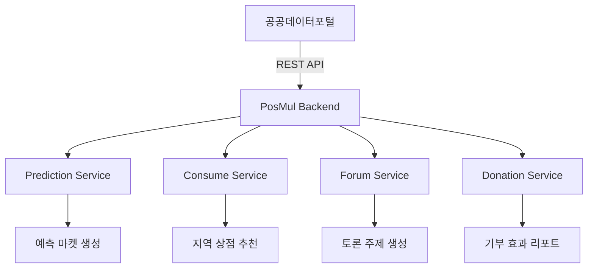

# 공공데이터 활용 방안 보고서

> PosMul 플랫폼에서 활용 가능한 한국 공공데이터 API 및 적용 방안

---

## 1. 공공데이터포털 개요

**공공데이터포털(data.go.kr)**
- 공공기관 데이터 무료 개방
- 파일 데이터 + Open API 제공
- 활용 신청 → 서비스키 발급 → API 호출

---

## 2. 도메인별 활용 가능 공공데이터

### 2.1 Prediction (예측)

| 데이터 | 제공 기관 | 활용 방안 |
|---|---|---|
| **투·개표 정보 조회** | 중앙선거관리위원회 | 선거 예측 마켓 생성 |
| **투표율 분석 데이터** | 중앙선거관리위원회 | 지역/연령별 투표율 예측 |
| **소비자물가지수 (CPI)** | 통계청/한국은행 | 물가 상승률 예측 |
| **생산자물가지수** | 한국은행 | 경제 지표 예측 |
| **수출입물가지수** | 한국은행 | 환율/교역 예측 |
| **국가별 경제현황** | 외교부 | 국제 경제 예측 |

**예측 마켓 예시:**
```
- "2025년 서울시장 재보궐선거 투표율 60% 초과?"
- "2025년 1분기 CPI 전년 대비 3% 이상?"
- "원/달러 환율 1,400원 돌파 시기?"
```

---

### 2.2 Consume (소비)

| 데이터 | 제공 기관 | 활용 방안 |
|---|---|---|
| **지역 물가 정보** | 각 지자체 | Minor League 상점 물가 비교 |
| **소상공인 통계** | 소상공인진흥공단 | 지역 상점 추천 |
| **지역화폐 현황** | 각 지자체 | 지역 소비 연계 |
| **전통시장 정보** | 중소벤처기업부 | 지역 시장 연동 |

**활용 예시:**
```
- 지역별 물가 비교 카드
- 지역 상점 인기도 표시
- 지역화폐 연동 PMC 보너스
```

---

### 2.3 Forum (포럼)

| 데이터 | 제공 기관 | 활용 방안 |
|---|---|---|
| **정책 통계** | 행정안전부 | 정책 토론 주제 제공 |
| **예산 현황** | 기획재정부 | Budget 포럼 데이터 |
| **지역 현안** | 각 지자체 | Agora 토론 주제 |
| **뉴스 분석** | 언론진흥재단 | News 섹션 팩트체크 |

**활용 예시:**
```
- 정책별 예산 시각화
- 지역 현안 자동 토론 주제 생성
- 뉴스 팩트체크 데이터 연동
```

---

### 2.4 Donation (기부)

| 데이터 | 제공 기관 | 활용 방안 |
|---|---|---|
| **기부 통계** | 국세청 | 기부 현황 시각화 |
| **고향사랑기부금** | 각 지자체 | 지역 기부 연동 |
| **복지 통계** | 보건복지부 | 기부 대상 추천 |
| **사회공헌 현황** | 기업 공개 | 기부 효과 리포트 |

**활용 예시:**
```
- 지역별 기부 현황 대시보드
- 고향사랑기부금 연계 PMC 보너스
- 기부 효과 리포트 자동 생성
```

---

## 3. 우선순위 API 목록

### 3.1 즉시 도입 (MVP)

| 순위 | API | 적용 도메인 |
|---|---|---|
| 1 | 소비자물가지수 | Prediction |
| 2 | 투표율 분석 | Prediction |
| 3 | 지역 물가 정보 | Consume |
| 4 | 고향사랑기부금 | Donation |

### 3.2 중기 계획

| 순위 | API | 적용 도메인 |
|---|---|---|
| 5 | 투·개표 정보 조회 | Prediction |
| 6 | 소상공인 통계 | Consume |
| 7 | 정책 예산 현황 | Forum |
| 8 | 복지 통계 | Donation |

---

## 4. 기술 통합 가이드

### 4.1 API 연동 아키텍처



### 4.2 데이터 갱신 주기

| 데이터 유형 | 갱신 주기 | 캐싱 전략 |
|---|---|---|
| 물가지수 | 월간 | 1일 캐시 |
| 선거 데이터 | 이벤트 발생 시 | 즉시 갱신 |
| 지역 정보 | 일간 | 1시간 캐시 |
| 기부 통계 | 월간 | 1일 캐시 |

### 4.3 Supabase Edge Function 예시

```typescript
// public-data-sync edge function
import { serve } from "jsr:@supabase/functions-js/edge-runtime.d.ts";

Deno.serve(async (req) => {
  const API_KEY = Deno.env.get("DATA_GO_KR_KEY");
  
  // 소비자물가지수 조회
  const cpiResponse = await fetch(
    `https://apis.data.go.kr/...?serviceKey=${API_KEY}`
  );
  const cpiData = await cpiResponse.json();
  
  // Supabase에 저장
  // ...
  
  return new Response(JSON.stringify({ success: true }));
});
```

---

## 5. 기대 효과

### 5.1 Prediction

- **신뢰도 향상**: 공식 데이터 기반 예측
- **다양성 확보**: 정치/경제/사회 예측 확대
- **자동화**: 데이터 기반 마켓 자동 생성

### 5.2 Consume

- **지역 경제 활성화**: 지역 상점 추천
- **정보 제공**: 물가 비교 서비스
- **신뢰성**: 공식 통계 기반

### 5.3 Forum

- **토론 활성화**: 데이터 기반 토론
- **팩트체크**: 공식 통계 연동
- **참여 유도**: 시의성 있는 주제

### 5.4 Donation

- **투명성**: 기부 효과 시각화
- **지역 연계**: 고향사랑기부금 연동
- **동기 부여**: 기부 현황 공유

---

## 6. 결론

공공데이터 활용은 PosMul의 **신뢰성, 차별성, 확장성**을 동시에 확보할 수 있는 전략입니다.

**핵심 권장사항:**
1. MVP 단계에서 **물가지수 + 투표율** 우선 도입
2. 지역 경제 데이터로 **Minor League** 강화
3. **고향사랑기부금** 연동으로 Donation 활성화

---

**작성자**: AI Assistant  
**버전**: 1.0
