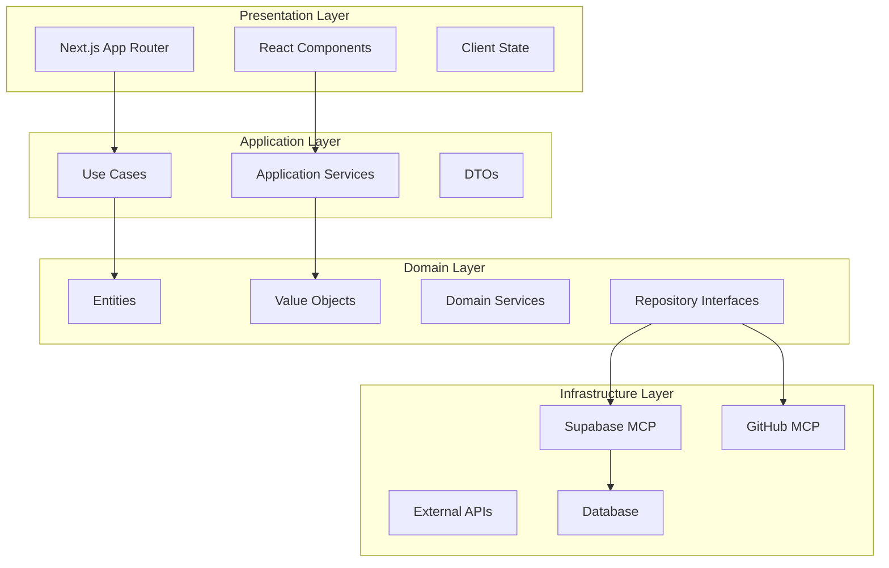

# 🏗️ Architecture Explanations

> 시스템 아키텍처의 철학과 설계 원리에 대한 깊이 있는 이해

## 📋 아키텍처 주제

### 🎯 Domain-Driven Design

- [ ] **DDD 철학과 PosMul에서의 적용**
- [ ] **Bounded Context 분리 전략**
- [ ] **Aggregate 설계 원칙**
- [ ] **Domain Events 패턴**

### 🏛️ Clean Architecture

- [ ] **계층 분리와 의존성 규칙**
- [ ] **Entity vs Value Object 선택 기준**
- [ ] **Repository 패턴의 의미**
- [ ] **Use Case 중심 설계**

### 💰 Economic System Architecture

- [ ] **PMP/PMC 이중 토큰 시스템 설계**
- [ ] **Agency Theory 구현 아키텍처**
- [ ] **Money Wave 재분배 메커니즘**
- [ ] **CAPM 모델 적용 방식**

### 🔧 MCP Integration Architecture

- [ ] **Model Context Protocol 아키텍처**
- [ ] **Supabase MCP 통합 설계**
- [ ] **GitHub MCP 워크플로우**
- [ ] **도구 간 상호 운용성**

## 🌍 시스템 전체 아키텍처

## 📖 아키텍처 설명 가이드

새로운 아키텍처 설명을 작성할 때는 다음 구조를 따르세요:

1. **배경과 맥락** - 왜 이런 설계를 했는가?
2. **핵심 원리** - 어떤 원칙을 따르는가?
3. **트레이드오프** - 어떤 선택을 했고 왜인가?
4. **실용적 영향** - 개발자에게 어떤 의미인가?
