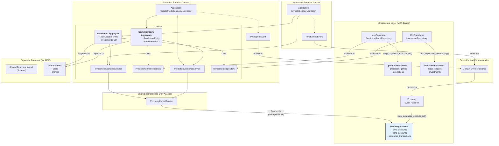
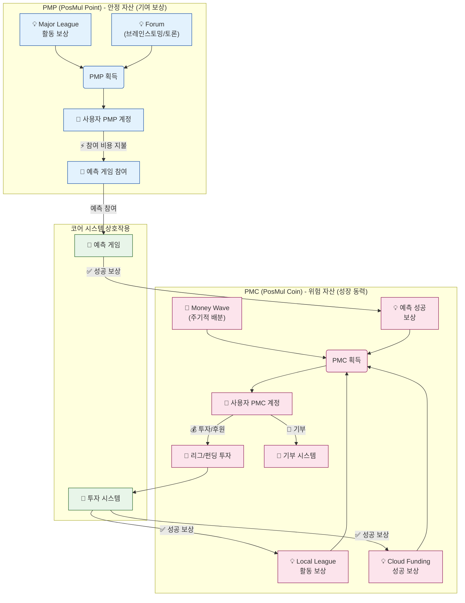
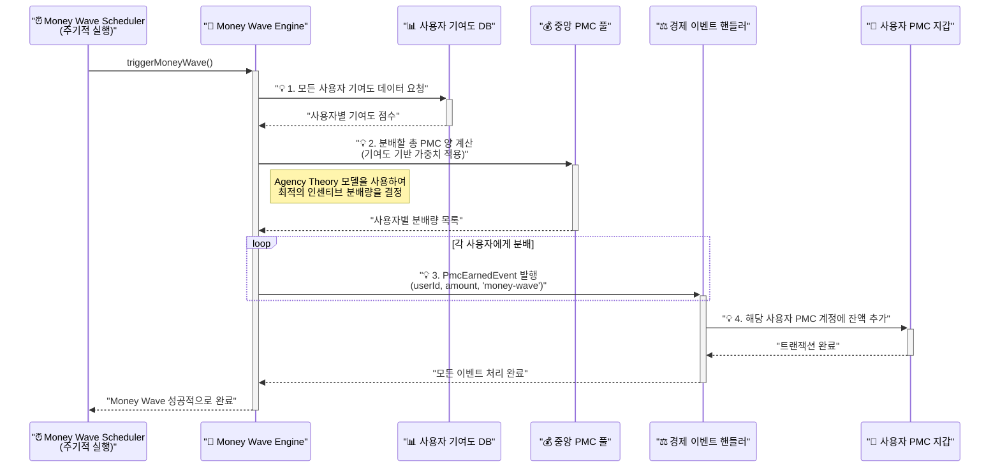

# PosMul 종합 아키텍처 오버뷰

> **"사용자부터 데이터베이스까지, DevOps부터 실시간 UI까지 - 모든 것을 연결하는 단 하나의 다이어그램"**

이 문서는 PosMul 프로젝트의 모든 기술 스택과 워크플로를 하나의 종합적인 다이어그램으로 시각화하고 설명합니다. DevOps, 프런트엔드, 백엔드의 클린 아키텍처, 인프라스트럭처, 그리고 Supabase 플랫폼이 어떻게 상호작용하여 하나의 유기적인 시스템을 구축하는지 심도 있게 분석합니다.

## 📚 목차 (Table of Contents)

- [PosMul 종합 아키텍처 오버뷰](#posmul-종합-아키텍처-오버뷰)
  - [📚 목차 (Table of Contents)](#-목차-table-of-contents)
  - [1. 전체 시스템 흐름도](#1-전체-시스템-흐름도)
  - [2. 아키텍처 상세 해설](#2-아키텍처-상세-해설)
    - [2.1. 사용자 및 DevOps 워크플로](#21-사용자-및-devops-워크플로)
    - [2.2. 프런트엔드 (Next.js 15 App Router)](#22-프런트엔드-nextjs-15-app-router)
    - [2.3. 백엔드 (Clean Architecture on Server)](#23-백엔드-clean-architecture-on-server)
    - [2.4. 인프라스트럭처 계층](#24-인프라스트럭처-계층)
    - [2.5. Supabase 플랫폼](#25-supabase-플랫폼)
  - [3. 대표적인 사용자 시나리오 흐름](#3-대표적인-사용자-시나리오-흐름)
  - [4. 경제 시스템 심층 분석: PMP/PMC와 Money Wave](#4-경제-시스템-심층-분석-pmppmc와-money-wave)
    - [4.1. PMP와 PMC의 생태계와 생명주기](#41-pmp와-pmc의-생태계와-생명주기)
    - [4.2. Money Wave 시스템 워크플로](#42-money-wave-시스템-워크플로)
  - [5. 결론](#5-결론)

---

## 1. 전체 시스템 흐름도

이 다이어그램은 PosMul 프로젝트의 모든 구성 요소를 포함하는 '빅 피처(Big Picture)'입니다. 각 레이어와 컴포넌트가 번호 순서에 따라 어떻게 상호작용하는지 보여줍니다.

---

## 2. 아키텍처 상세 해설

### 2.1. 사용자 및 DevOps 워크플로

-   **User / Developer**: 모든 상호작용의 시작점입니다. 개발자는 `GitHub MCP`를 사용하여 이슈를 생성하고, 사용자는 웹 애플리케이션에 접근합니다.
-   **GitHub MCP Tools**: 프로젝트 관리의 자동화를 담당합니다. 이슈 생성, PR 관리 등 모든 개발 생명주기가 이 도구를 통해 제어됩니다.

### 2.2. 프런트엔드 (Next.js 15 App Router)

-   **Server Components (`RSC`)**: 페이지의 초기 렌더링과 데이터 조회를 담당합니다. 서버에서 실행되어 백엔드의 `Application Layer`를 직접 호출함으로써 빠르고 SEO에 친화적인 페이지를 제공합니다.
-   **Client Components (`CC`)**: 사용자와의 상호작용(클릭, 입력 등)을 처리합니다. 상태 변경이 필요할 경우, `Server Action`을 호출하여 서버 로직을 실행합니다.
-   **Supabase Realtime Client**: 실시간 데이터 스트림을 구독합니다. 데이터베이스에 변경이 생기면 이 클라이언트가 감지하여 UI를 자동으로 업데이트함으로써 항상 최신 상태를 유지합니다.

### 2.3. 백엔드 (Clean Architecture on Server)

-   **Server Actions**: 클라이언트의 요청을 받는 진입점입니다. 복잡한 로직 없이 `Application Layer`의 유스케이스를 호출하는 역할만 수행합니다.
-   **Application Layer**: 비즈니스 로직의 오케스트레이션을 담당합니다. 특정 유스케이스(예: '예측 참여')를 실행하며, `Domain Layer`의 객체들을 조합하고 `Repository`를 통해 데이터를 저장합니다.
-   **Domain Layer**: 순수한 비즈니스 규칙과 로직의 집합체입니다. `Aggregates`, `Entities` 등이 여기에 속하며, 외부 기술에 대한 의존성이 전혀 없습니다.
-   **Shared Economy Kernel**: 모든 도메인에서 공유되는 경제 관련 데이터를 읽기 전용으로 제공합니다. PMP/PMC 잔액 조회 등의 기능을 담당합니다.
-   **Domain Event Publisher**: 도메인 상태 변경, 특히 경제 시스템의 상태 변경이 필요할 때 이벤트를 발행합니다. 이는 시스템의 다른 부분에 변경 사실을 알리는 역할을 합니다.

### 2.4. 인프라스트럭처 계층

-   **Repositories Impl**: `Domain Layer`에 정의된 `Repository Interface`의 실제 구현체입니다. `Supabase MCP` 도구를 사용하여 데이터베이스와 통신합니다.
-   **Economic Event Handlers**: `Domain Event Publisher`가 발행한 경제 관련 이벤트를 구독하여 처리합니다. 이 핸들러만이 경제 관련 테이블(`pmp_accounts` 등)을 수정할 권한을 가집니다.
-   **Supabase MCP Tools**: 모든 데이터베이스 상호작용은 이 MCP 도구를 통해 이루어집니다. 이는 보안, 일관성, 프로젝트 표준 준수를 강제하는 핵심 장치입니다.

### 2.5. Supabase 플랫폼

-   **Database**: PostgreSQL 데이터베이스로, 각 도메인별 스키마와 공유 경제 스키마로 분리되어 있습니다. 데이터 정합성과 독립성을 보장합니다.
-   **Supabase Realtime**: 데이터베이스 변경을 감지(CDC)하여 실시간으로 클라이언트에 푸시합니다.
-   **Edge Functions**: 이벤트에 의해 트리거될 수 있는 서버리스 함수입니다. 복잡한 알림 전송 등 DB 변경 이상의 로직을 수행할 때 사용됩니다.
-   **Supabase Auth**: 사용자 인증 및 권한 관리를 담당하며, 모든 도메인에서 공통적으로 사용됩니다.

---

## 3. 대표적인 사용자 시나리오 흐름

**"사용자가 100 PMP를 걸고 예측에 참여하는 시나리오"**

1.  **[1-2]** 개발자는 `GitHub MCP`로 관련 기능을 개발하고, 사용자는 브라우저에서 `Server Component`로 렌더링된 예측 게임 목록 페이지에 접근합니다.
2.  **[3]** `Server Component`는 렌더링 과정에서 `Application Service`를 호출하여 게임 목록 데이터를 가져옵니다.
3.  **[4a]** 사용자가 `Client Component`인 '참여' 버튼을 클릭합니다. `Server Action`이 호출됩니다.
4.  **[4b-5]** `Server Action`은 `PlacePredictionUseCase`라는 `Application Service`를 실행합니다.
5.  **[6]** `Application Service`는 `Shared Economy Kernel`을 통해 사용자의 PMP 잔액이 충분한지 확인합니다 (읽기 작업).
6.  **[7]** 잔액이 충분하면, `Application Service`는 `Prediction` 도메인 객체를 생성하고, `PmpSpentEvent(100)` 이벤트를 `Domain Event Publisher`에 발행합니다.
7.  **[8]** `Event Publisher`는 이 이벤트를 `Economic Event Handlers`에게 전달합니다.
8.  **[9b-10]** `Economic Event Handlers`는 `Supabase MCP`를 통해 `pmp_accounts` 테이블에서 100 PMP를 차감하고, `economic_transactions`에 거래 기록을 남깁니다 (쓰기 작업).
9.  **[9a-10]** 동시에 `Application Service`는 `Repository`를 통해 `predictions` 테이블에 사용자의 예측 내용을 저장합니다.
10. **[11a-12]** `pmp_accounts` 테이블의 변경 사항이 `Supabase Realtime`을 통해 `Realtime Client`에 푸시되고, 사용자의 잔액 UI가 자동으로 업데이트됩니다.

---

## 4. 경제 시스템 심층 분석: PMP/PMC와 Money Wave

PosMul의 핵심 차별점은 정교한 내부 경제 시스템입니다. 이 시스템은 PMP(안정 자산)와 PMC(위험 자산)라는 두 가지 재화를 통해 사용자의 참여를 유도하고, Money Wave 시스템을 통해 생태계의 성장을 촉진합니다.

### 4.1. PMP와 PMC의 생태계와 생명주기

PMP와 PMC는 획득 경로와 사용처가 명확히 구분되어 각각 다른 역할을 수행하며, 시스템 내에서 유기적으로 순환합니다.

-   **PMP (PosMul Point)**: 위험 부담 없는 활동에 대한 보상으로 지급되는 안정적인 포인트입니다. 주로 높은 수준의 지적 기여(Major League, 토론)를 통해 획득하며, 예측 게임 참여 등 시스템의 기본 활동에 사용됩니다. 이는 사용자의 꾸준한 참여를 유도하는 '기본 소득'과 같은 역할을 합니다.
-   **PMC (PosMul Coin)**: 생태계의 성장에 따라 가치가 변동될 수 있는 위험 자산입니다. 예측 성공, 투자 성공, 그리고 주기적인 'Money Wave'를 통해 분배됩니다. 사용자는 PMC를 투자나 기부에 사용하여 더 큰 수익을 기대하거나 생태계에 기여할 수 있습니다. 이는 생태계의 성장을 이끄는 핵심 '성장 동력'입니다.

### 4.2. Money Wave 시스템 워크플로

Money Wave는 생태계에 유동성을 공급하고 기여도 높은 사용자에게 보상을 분배하는 핵심적인 PMC 분배 메커니즘입니다. Agency Theory에 기반하여, 시스템 전체의 가치를 높이는 활동을 한 사용자에게 더 많은 보상이 돌아가도록 설계되었습니다.

1.  **실행 (Trigger)**: `Money Wave Scheduler`가 정해진 시간(예: 매주 월요일)에 Money Wave 프로세스를 시작합니다.
2.  **기여도 분석 (Analysis)**: `Money Wave Engine`은 모든 사용자의 활동 데이터를 분석하여 '기여도 점수'를 계산합니다. 여기에는 예측 성공률, 포럼 활동, 투자 수익률 등 다양한 지표가 포함됩니다.
3.  **분배량 결정 (Allocation)**: 중앙 PMC 풀의 자금과 사용자들의 총 기여도를 기반으로, Agency Theory 모델을 사용하여 각 사용자에게 분배할 PMC 양을 결정합니다. 이는 기여도가 높은 사용자에게 더 많은 보상이 돌아가는 구조를 만듭니다.
4.  **이벤트 발행 및 처리 (Event Handling)**: `Money Wave Engine`은 각 사용자에 대해 `PmcEarnedEvent`를 발행합니다. `경제 이벤트 핸들러`가 이 이벤트를 받아, 실제 사용자의 PMC 지갑 잔액을 업데이트하고 관련 거래 기록을 남깁니다.

이 과정을 통해 Money Wave는 단순한 화폐 분배를 넘어, 생태계가 지향하는 가치(건강한 예측, 활발한 토론, 성공적인 투자)를 창출하는 행위를 사용자에게 적극적으로 장려하는 역할을 수행합니다.

---

## 5. 결론

이 종합 아키텍처는 PosMul 프로젝트가 어떻게 현대적인 소프트웨어 공학 원칙을 통합하여 복잡성을 관리하고, 확장성과 유지보수성을 확보하는지를 명확하게 보여줍니다. 각 계층과 컴포넌트는 명확한 책임 분리 원칙(SoC)을 따르며, MCP 기반의 자동화 워크플로는 개발 생산성과 시스템 안정성을 극대화합니다. 이 구조를 통해 PosMul은 안정적인 기반 위에서 지속적으로 발전할 수 있습니다. 