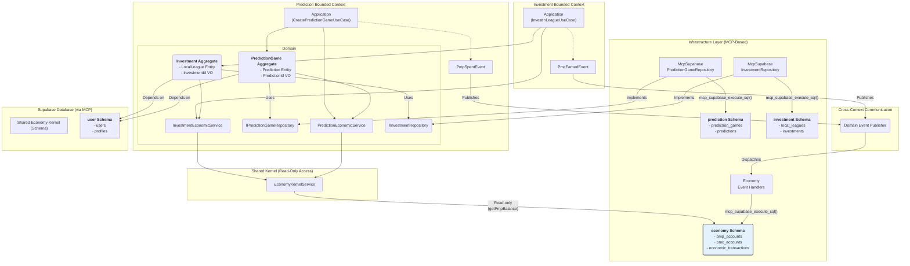
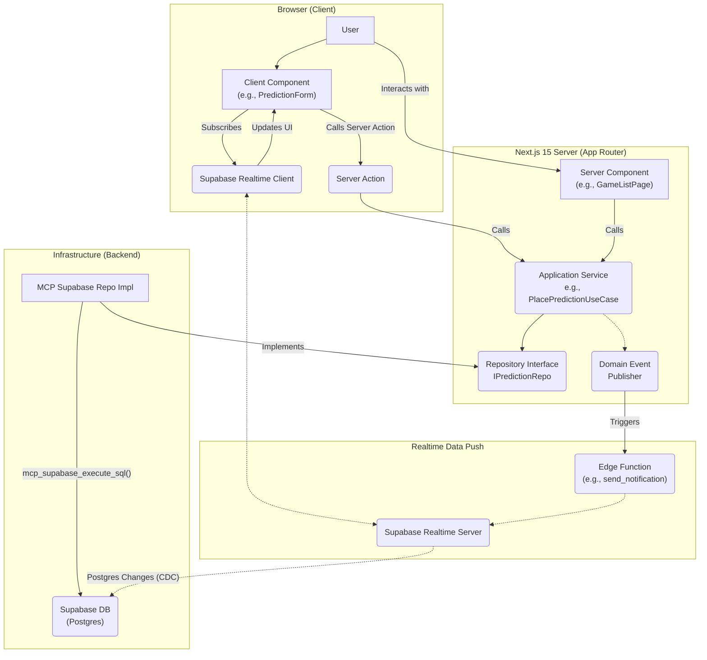
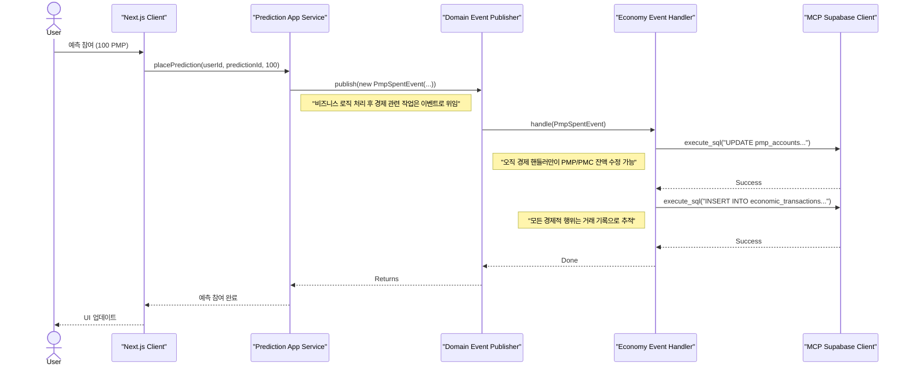
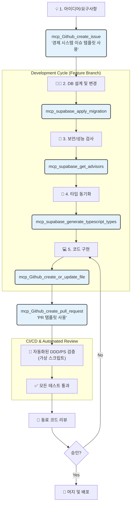

# PosMul 프로젝트 심층 아키텍처 분석

> **"DDD, 경제 커널, 실시간 데이터 흐름, MCP 자동화의 통합적 이해"**

이 문서는 PosMul 프로젝트를 구성하는 복잡한 아키텍처 구성 요소들 간의 유기적인 관계를 심도 있게 분석하고 시각화합니다. 도메인 주도 설계(DDD) 컨텍스트, 공유 경제 커널, 프런트엔드와 백엔드의 실시간 상호작용, 그리고 MCP(Model Context Protocol) 기반의 개발 워크플로가 어떻게 조화롭게 작동하는지 설명합니다.

## 📚 목차 (Table of Contents)

- [PosMul 프로젝트 심층 아키텍처 분석](#posmul-프로젝트-심층-아키텍처-분석)
  - [📚 목차 (Table of Contents)](#-목차-table-of-contents)
  - [1. 코어 아키텍처: DDD, 경제 커널, DB 통합](#1-코어-아키텍처-ddd-경제-커널-db-통합)
    - [📊 다이어그램 해설](#-다이어그램-해설)
  - [2. 프런트엔드-백엔드 상호작용 및 실시간 데이터 흐름](#2-프런트엔드-백엔드-상호작용-및-실시간-데이터-흐름)
    - [📊 다이어그램 해설](#-다이어그램-해설-1)
  - [3. 경제 시스템 및 도메인 간 트랜잭션 흐름](#3-경제-시스템-및-도메인-간-트랜잭션-흐름)
    - [📊 다이어그램 해설](#-다이어그램-해설-2)
  - [4. MCP 기반 자동화 및 DevOps 워크플로](#4-mcp-기반-자동화-및-devops-워크플로)
    - [📊 다이어그램 해설](#-다이어그램-해설-3)
  - [5. 결론](#5-결론)

---

## 1. 코어 아키텍처: DDD, 경제 커널, DB 통합

이 다이어그램은 PosMul 프로젝트의 심장부라 할 수 있는 백엔드 아키텍처의 핵심을 보여줍니다. 각 도메인이 어떻게 독립성을 유지하면서도 공유 경제 커널과 안전하게 상호작용하는지를 시각화합니다.

### 📊 다이어그램 해설

-   **독립적인 컨텍스트**: `Prediction`과 `Investment`는 각자의 도메인 로직을 가진 바운디드 컨텍스트로, 서로 직접적인 의존성이 없습니다. 이는 시스템의 복잡성을 관리하고 각 도메인의 발전을 용이하게 합니다.
-   **의존성 역전 원칙**: `Infrastructure` 레이어의 리포지토리 구현체(`McpSupabase...`)가 `Domain` 레이어의 인터페이스(`IP...Repository`)를 구현함으로써, 도메인이 인프라스트럭처에 의존하지 않는 클린 아키텍처 원칙을 준수합니다.
-   **공유 커널 (Shared Kernel)**: `economy` 스키마와 `EconomyKernelService`는 모든 컨텍스트에서 공유되는 핵심 자산입니다. 각 도메인은 이 커널을 통해 경제 관련 정보를 **읽기 전용**으로만 접근할 수 있습니다.
-   **이벤트 기반 쓰기**: 경제 상태의 변경(PMP/PMC 사용 및 획득)은 각 도메인에서 직접 DB를 수정하는 대신, `PmpSpentEvent`와 같은 도메인 이벤트를 발행하여 처리합니다. 이 이벤트는 중앙 `Economy Event Handlers`에 의해 처리되어 경제 시스템 전체의 무결성과 일관성을 보장합니다.
-   **MCP 통합**: 모든 DB 접근은 `mcp_supabase_execute_sql`과 같은 MCP 도구를 통해 이루어지며, 이는 프로젝트의 표준 개발 방식을 강제하고 보안을 강화합니다.

---

## 2. 프런트엔드-백엔드 상호작용 및 실시간 데이터 흐름

이 다이어그램은 Next.js 15 앱 라우터 기반의 프런트엔드와 백엔드 애플리케이션 서비스가 어떻게 상호작용하며, Supabase Realtime을 통해 어떻게 실시간으로 데이터가 사용자에게 전달되는지를 보여줍니다.

### 📊 다이어그램 해설

-   **컴포넌트 역할 분리**: `Server Component`는 초기 데이터 로딩을 담당하여 서버 측에서 렌더링을 완료합니다. `Client Component`는 사용자 상호작용을 처리하며, 데이터 변경이 필요할 때는 `Server Action`을 호출하여 서버의 비즈니스 로직을 실행시킵니다.
-   **실시간 데이터의 두 가지 경로**:
    1.  **DB 변경 감지 (CDC)**: 가장 일반적인 경로로, 데이터베이스의 테이블에 `INSERT`, `UPDATE`, `DELETE`가 발생하면 Supabase Realtime 서버가 이를 감지(Change Data Capture)하여 구독 중인 클라이언트에 즉시 변경 사항을 푸시합니다.
    2.  **이벤트 기반 푸시**: 단순한 DB 변경 이상의 복잡한 로직이 필요할 때 사용됩니다. 예를 들어, 특정 조건이 충족되었을 때 알림을 보내는 경우, 도메인 이벤트가 Edge Function을 트리거하고, 이 함수가 Realtime 서버를 통해 특정 클라이언트에게 맞춤형 메시지를 보낼 수 있습니다.

---

## 3. 경제 시스템 및 도메인 간 트랜잭션 흐름

다음 시퀀스 다이어그램은 사용자의 한 가지 행동이 어떻게 여러 도메인과 시스템을 거쳐 최종적으로 경제 시스템에 안전하게 기록되는지를 단계별로 보여줍니다. 이는 "이벤트를 통한 쓰기" 원칙을 명확하게 설명합니다.

### 📊 다이어그램 해설

-   **책임의 분리**: `Prediction` 애플리케이션 서비스는 예측 참여 로직에만 집중하고, 경제적 결과(PMP 차감)는 `PmpSpentEvent`라는 '사건'을 발행하는 것으로 책임을 다합니다.
-   **중앙 집중식 처리**: 발행된 이벤트는 오직 `Economy Event Handler`만이 처리합니다. 이 핸들러는 경제 시스템의 상태를 변경할 수 있는 유일한 창구 역할을 하여, 여러 도메인에서 중구난방으로 경제 데이터를 수정하는 것을 방지하고 데이터 정합성을 보장합니다.
-   **감사 추적**: 모든 경제적 상태 변경은 `economic_transactions` 테이블에 기록됩니다. 이는 시스템의 모든 돈의 흐름을 추적하고 감사할 수 있게 만드는 중요한 장치입니다.

---

## 4. MCP 기반 자동화 및 DevOps 워크플로

이 플로우차트는 PosMul 프로젝트의 "Dual MCP" (Supabase MCP + GitHub MCP) 개발 워크플로 전체를 시각화합니다. 아이디어 구상부터 배포까지 모든 단계가 어떻게 MCP 도구와 통합되어 자동화되는지를 보여줍니다.

### 📊 다이어그램 해설

-   **통합된 워크플로**: 작업 관리는 GitHub MCP로, 데이터베이스 관리는 Supabase MCP로 이루어지며 이 둘이 유기적으로 연결됩니다.
-   **자동화된 품질 관리**: DB 스키마가 변경되면(`mcp_supabase_apply_migration`), 즉시 보안 검사(`mcp_supabase_get_advisors`)와 타입 동기화(`mcp_supabase_generate_typescript_types`)가 뒤따릅니다. 이는 잠재적인 문제를 조기에 발견하고 코드와 DB의 정합성을 유지하는 핵심적인 자동화입니다.
-   **프로세스 강제**: 모든 개발 과정이 MCP 명령어를 통해 이루어지므로, 개발자는 자연스럽게 프로젝트의 표준과 규칙(예: 템플릿 사용, 보안 검사)을 따르게 됩니다. 이는 인적 실수를 줄이고 개발 생산성을 높입니다.

---

## 5. 결론

PosMul 프로젝트는 도메인 주도 설계, 클린 아키텍처, 이벤트 기반 통신, 그리고 강력한 MCP 기반 자동화라는 현대적인 소프트웨어 공학 원칙들을 유기적으로 통합하여 구축되었습니다. 이 다이어그램들이 보여주듯이, 각 구성 요소는 명확한 책임을 가지고 독립적으로 작동하면서도, 공유 커널과 이벤트 버스를 통해 전체 시스템의 일관성과 무결성을 유지합니다.

이러한 아키텍처는 복잡한 비즈니스 로직을 효과적으로 관리하고, 변화에 유연하게 대응하며, 장기적으로 유지보수 가능하고 확장성 있는 시스템을 만드는 견고한 기반이 됩니다. 

</rewritten_file>