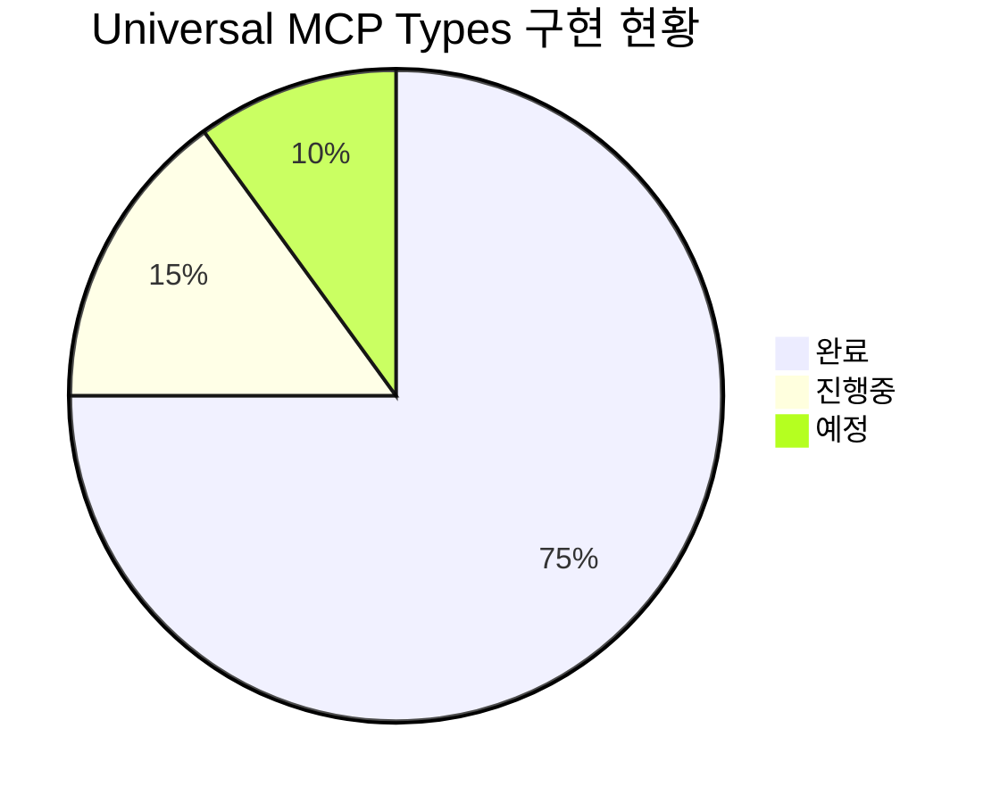
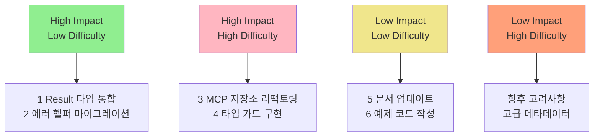
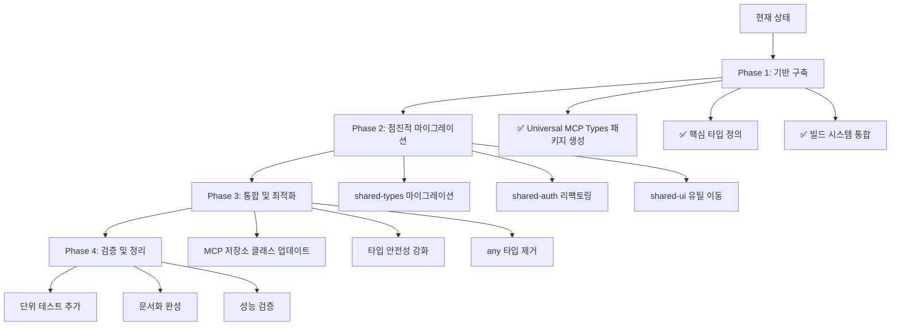
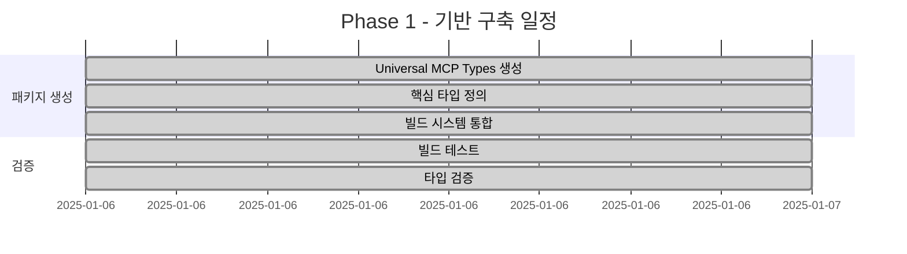
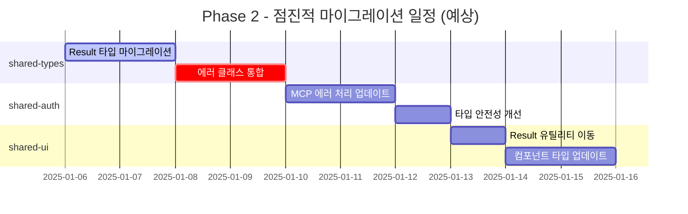
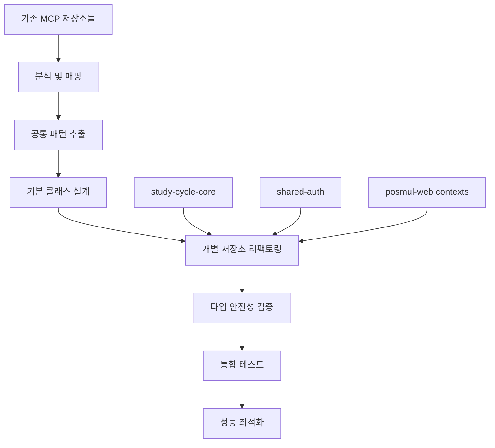
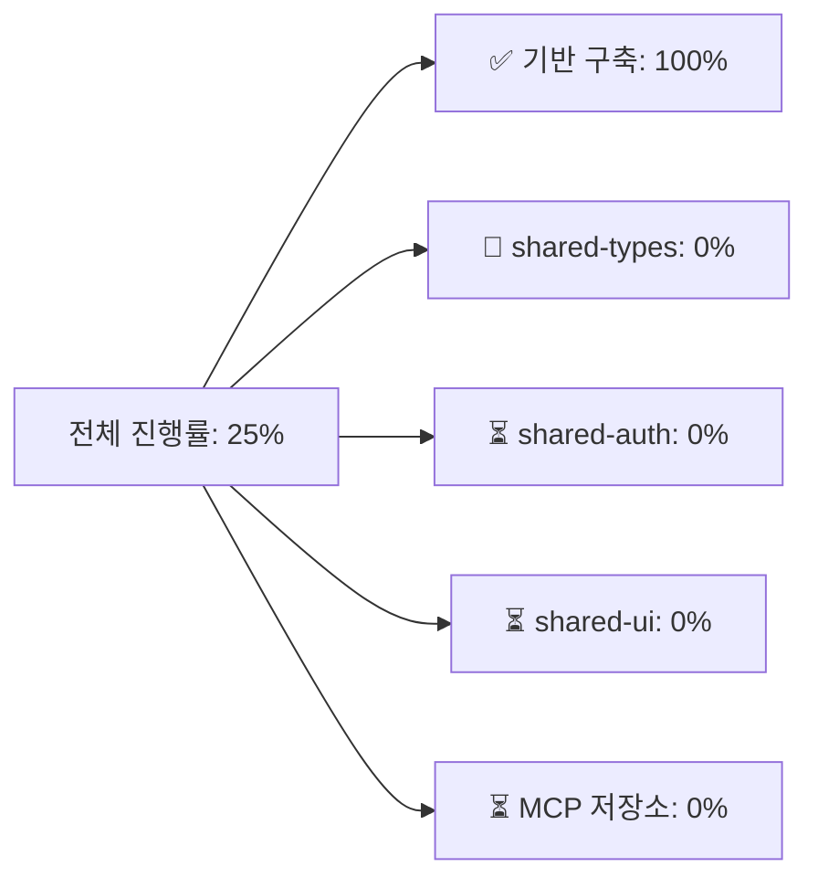
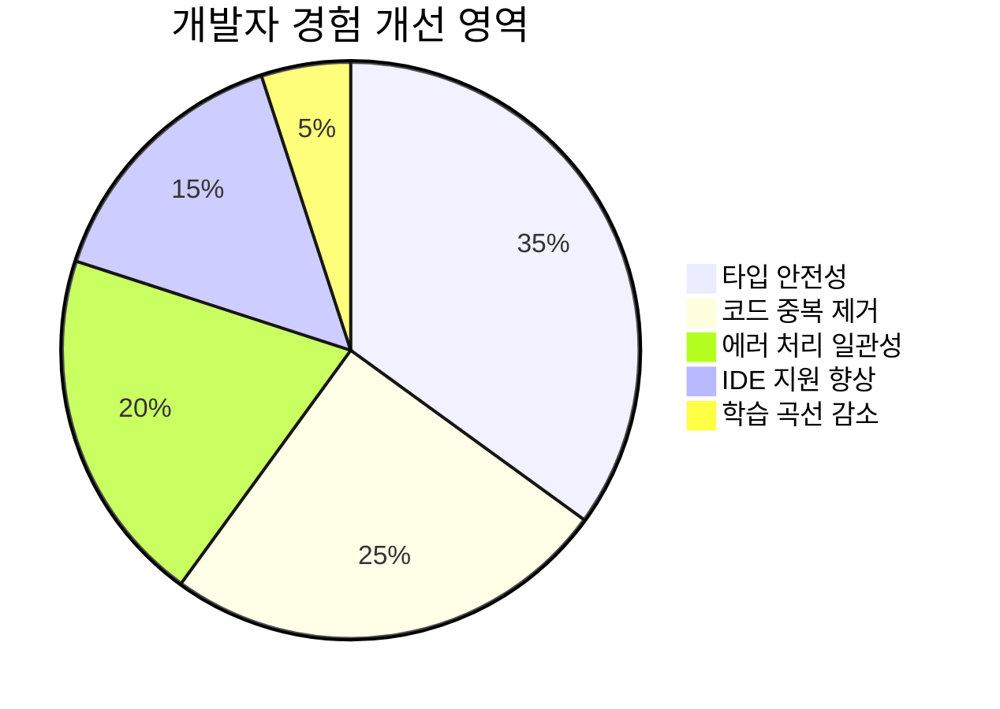
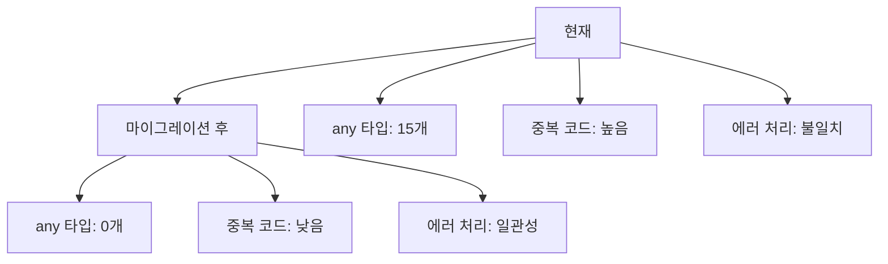

# Universal MCP 타입 시스템 마이그레이션 실행 계획

## 📊 현재 상황 및 마이그레이션 로드맵

### 현재 구현 상태



### 마이그레이션 우선순위 매트릭스



## 📈 마이그레이션 플로우



## 🎯 세부 마이그레이션 단계

### Phase 1: 기반 구축 (완료 ✅)



### Phase 2: 점진적 마이그레이션 (진행 예정)



### Phase 3: MCP 저장소 통합 (계획)



## 💻 구체적 마이그레이션 작업

### 1. shared-types 마이그레이션

**현재 문제점:**
- Result 타입이 중복 정의됨
- 에러 클래스가 분산되어 있음

**마이그레이션 계획:**

```typescript
// 기존 (shared-types/src/errors/index.ts)
export type Result<T, E = BaseError> =
  | { success: true; data: T }
  | { success: false; error: E };

// 마이그레이션 후
export { 
  UniversalResult as Result,
  success,
  failure,
  isSuccess,
  isFailure 
} from '@posmul/universal-mcp-types';
```

### 2. shared-auth 리팩토링

**현재 문제점:**
- `any` 타입 사용으로 타입 안전성 부족
- MCP 에러 처리가 불완전

**마이그레이션 계획:**

```typescript
// 기존 (any 타입 사용)
const error = (result.error as any).property;

// 마이그레이션 후
import { BaseMCPError, ErrorHelpers } from '@posmul/universal-mcp-types';

if (ErrorHelpers.isUniversalError(result.error)) {
  // 타입 안전한 에러 처리
  console.log(result.error.code);
}
```

### 3. 통합 MCP 저장소 기본 클래스

```typescript
// 새로운 기본 클래스 (universal-mcp-types)
export abstract class BaseMCPRepository<T> {
  constructor(protected projectId: string) {}
  
  protected async executeWithRetry<R>(
    operation: () => Promise<R>,
    context: MCPOperationContext
  ): Promise<UniversalResult<R, BaseMCPError>> {
    // 통합된 재시도 로직, 에러 처리, 로깅
  }
  
  abstract save(entity: T): Promise<UniversalResult<void, BaseMCPError>>;
  abstract findById(id: string): Promise<UniversalResult<T | null, BaseMCPError>>;
}
```

## 📊 마이그레이션 진행률 추적



## 🎯 기대 효과

### 개발자 경험 개선



### 코드 품질 지표



## 🚀 다음 단계 추천

### 즉시 시작 가능한 작업

1. **shared-types 마이그레이션**
   - `Result` 타입을 `universal-mcp-types`로 교체
   - 기존 코드의 호환성 유지

2. **shared-auth `any` 타입 제거**
   - 타입 가드 함수 활용
   - 명시적 타입 캐스팅으로 대체

3. **MCP 에러 처리 표준화**
   - `BaseMCPError` 클래스 활용
   - 일관된 에러 메시지 및 컨텍스트

### 중장기 계획

1. **통합 MCP 저장소 기본 클래스 개발**
2. **자동화된 타입 생성 파이프라인**
3. **Runtime 타입 검증 시스템**

---

이제 **Universal MCP 타입 시스템**이 성공적으로 구축되었습니다! 🎉

다음 중 어떤 작업부터 시작하시겠습니까?

1. **shared-types 마이그레이션** - Result 타입 통합
2. **shared-auth 리팩토링** - `any` 타입 제거
3. **MCP 저장소 기본 클래스** - 통합 저장소 패턴 구현
