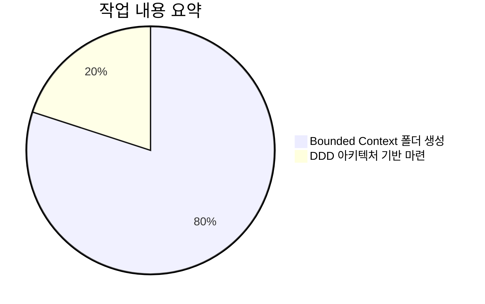
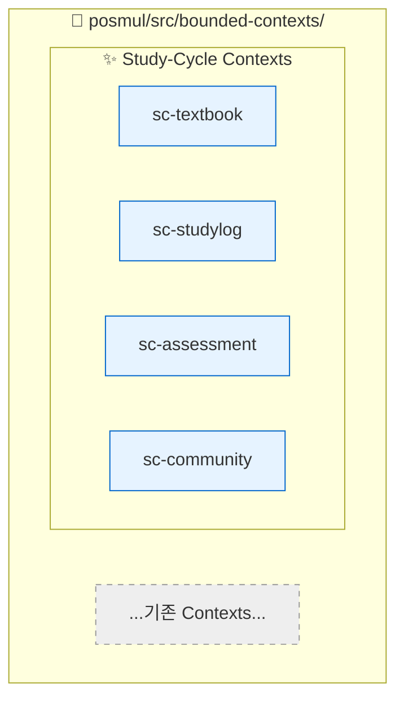

# 완료 보고서: Study-Cycle 환경 설정 1단계 - 폴더 구조 생성

**문서 ID**: `SC-REPORT-001`
**작성일**: 2025-06-25
**작업 단계**: 환경 설정 1/4
**상태**: ✅ 완료

---

## 1. 작업 개요

`Study-Cycle` 신규 프로젝트의 초기 환경 설정 1단계인 **Bounded Context 폴더 구조 생성** 작업을 완료했습니다. 이 작업은 Domain-Driven Design (DDD) 원칙에 따라 프로젝트의 논리적 경계를 설정하고, 향후 개발을 위한 코드의 뼈대를 마련하는 것을 목표로 합니다.

### 📊 작업 요약 차트

## 2. 실행 내용

`posmul/src/bounded-contexts/` 경로 하위에 `Study-Cycle` 프로젝트를 위한 4개의 핵심 Bounded Context 디렉토리를 생성했습니다. 프로젝트 구분을 위해 모든 디렉토리에 `sc-` 접두사를 적용했습니다.

### ✅ 생성된 디렉토리 목록

-   `posmul/src/bounded-contexts/sc-textbook`
-   `posmul/src/bounded-contexts/sc-studylog`
-   `posmul/src/bounded-contexts/sc-assessment`
-   `posmul/src/bounded-contexts/sc-community`

### 🏗️ 아키텍처 시각화

이번 작업을 통해 마련된 아키텍처의 기본 구조는 다음과 같습니다.

## 3. 기대 효과

-   **명확한 코드 분리**: 각 도메인의 책임과 역할이 물리적 디렉토리 구조에 반영되어 코드의 응집도를 높이고 결합도를 낮춥니다.
-   **개발 확장성 확보**: 향후 각 Bounded Context 내부에 `domain`, `application`, `infrastructure`, `presentation` 레이어를 추가할 수 있는 기반을 마련했습니다.
-   **팀 협업 효율 증대**: 명확한 경계는 여러 개발자가 각자의 도메인에 집중하여 병렬적으로 작업할 수 있게 합니다.

## 4. 다음 단계

-   **환경 설정 2단계**: 데이터베이스 스키마 정의 (`DB Schema`)
-   관련 내용은 `env-setup-task-list.md`에서 추적됩니다. 