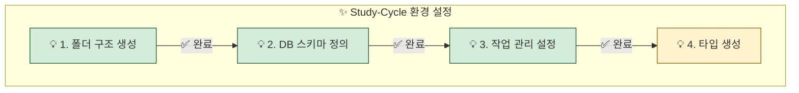
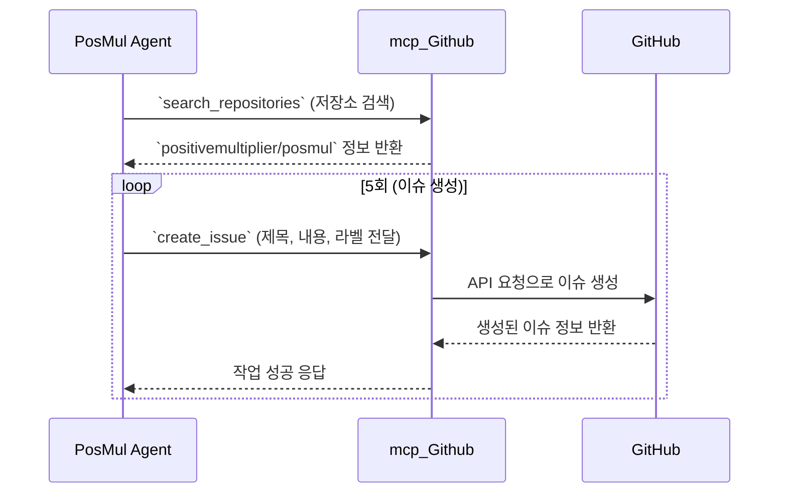

## 1. 개요 (Overview)

`Study-Cycle` Bounded Context의 초기 환경 설정 3단계, **GitHub 이슈를 통한 작업 관리 설정**이 성공적으로 완료되었습니다. `mcp_Github_create_issue` 도구를 사용하여 프로젝트 MVP 개발에 필요한 핵심 기능들을 GitHub 이슈로 등록하였으며, 이를 통해 초기 개발 백로그를 구축했습니다.

### 📊 단계별 진행 현황

## 2. 작업 상세 내용 (Task Details)

`positivemultiplier/posmul` GitHub 저장소에 `mcp_Github` 도구 모음을 사용하여 다음과 같은 5개의 초기 이슈를 생성했습니다.

### ✅ 생성된 GitHub 이슈 목록

| 이슈 번호 | 제목 (Title) | 주요 내용 | 담당 컨텍스트 | 라벨 (Labels) |
| :--- | :--- | :--- | :--- | :--- |
| **[#3]** | `[SC-Feat] 📚 Textbook Context ...` | 교재 CRUD API | `Textbook` | `feature`, `backend` |
| **[#4]** | `[SC-Feat] 📝 Assessment Context ...` | 문제/풀이 템플릿 API | `Assessment` | `feature`, `backend` |
| **[#5]** | `[SC-Feat] 🔄 StudyLog Context ...` | 학습 기록 API | `StudyLog` | `feature`, `backend` |
| **[#6]** | `[SC-Feat] 📝 Assessment Context ...` | 시험 응시/제출 API | `Assessment` | `feature`, `backend` |
| **[#7]** | `[SC-UI] 🎨 Study-Cycle 기본 ...` | 기본 레이아웃 및 UI | `(공통)` | `ui`, `frontend` |

### 🔗 관련 링크
- **전체 이슈 목록**: [Study-Cycle Issues on GitHub](https://github.com/positivemultiplier/posmul/issues?q=is%3Aissue+is%3Aopen+label%3Astudy-cycle)
- **메인 작업 관리 문서**: [001-env-setup-task-list.md](../task-reports/001-env-setup-task-list.md)

## 3. 사용된 MCP 도구 (MCP Tools Used)

이번 단계에서는 아래의 `mcp_Github` 도구들을 적극적으로 활용하여 모든 작업을 수행했습니다.

### 🛠️ 도구 사용 내역

- **`mcp_Github_search_repositories`**: GitHub 연동을 확인하고, 대상 저장소(`positivemultiplier/posmul`)를 특정하는 데 사용되었습니다.
- **`mcp_Github_create_issue`**: MVP 개발에 필요한 5개의 핵심 기능을 GitHub 이슈로 등록하는 데 사용되었습니다.

## 4. 결과 및 다음 단계 (Result and Next Steps)

### ✅ 결과
- `Study-Cycle` 프로젝트의 초기 개발 백로그가 GitHub 이슈로 성공적으로 구축되었습니다.
- 모든 개발 작업은 이제 GitHub 이슈를 중심으로 추적 및 관리될 것입니다.

### ➡️ 다음 단계
- **4단계: 타입스크립트 타입 생성**
- 설명: `mcp_supabase_generate_typescript_types` 도구를 사용하여 2단계에서 정의한 데이터베이스 스키마를 기반으로 TypeScript 타입을 자동 생성합니다.
- 목적: 프론트엔드와 백엔드 간의 데이터 모델 일관성을 확보하고, 개발 생산성을 향상시킵니다. 