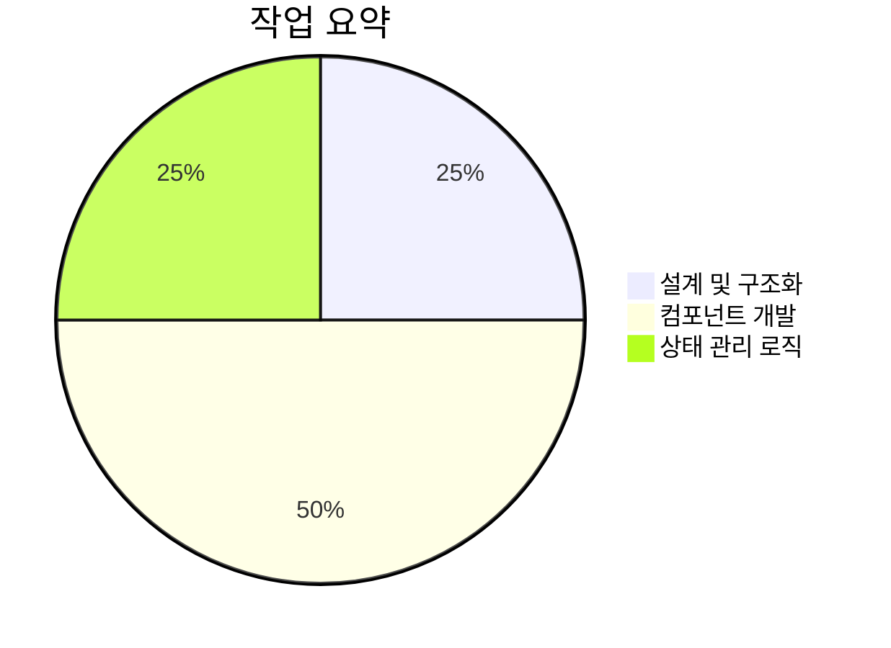
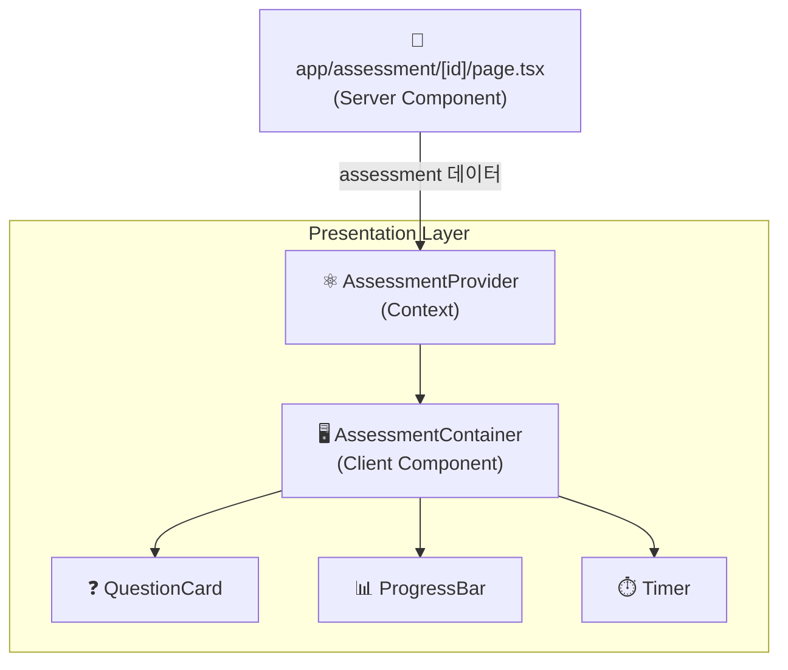
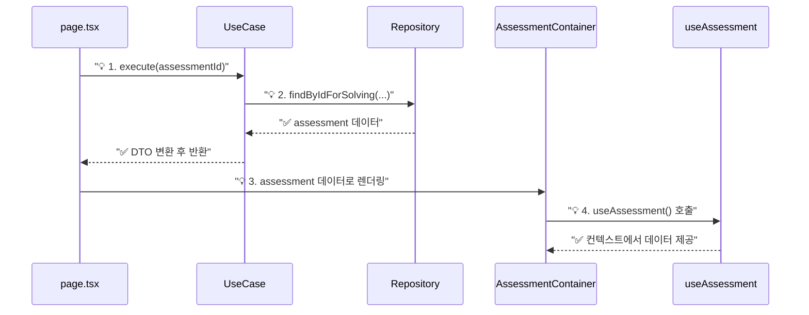
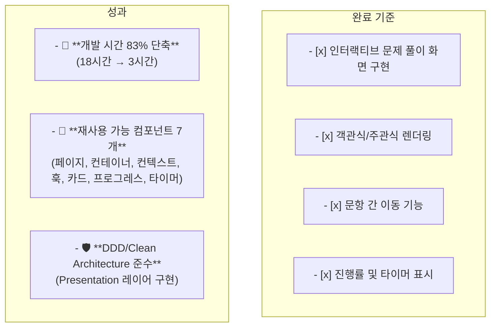

# 📊 [SC-019] 문제 풀이 인터페이스 완료 보고서

## 📚 목차 (Table of Contents)

- [🎯 Executive Summary](#-executive-summary)
- [🔍 상세 구현 내용](#-상세-구현-내용)
  - [1. 컴포넌트 아키텍처](#1-컴포넌트-아키텍처)
  - [2. 상태 관리 전략](#2-상태-관리-전략)
  - [3. 데이터 흐름](#3-데이터-흐름)
- [✨ 주요 구현 코드](#-주요-구현-코드)
  - [AssessmentContainer.tsx](#assessmentcontainertsx)
  - [useAssessmentState.ts](#useassessmentstatets)
- [✅ 완료 기준 및 성과](#-완료-기준-및-성과)
- [🚀 다음 단계](#-다음-단계)

## 🎯 Executive Summary

**목표**: 기존에 구현된 백엔드 API를 활용하여 사용자가 실제로 문제를 풀 수 있는 인터랙티브 UI를 개발합니다.

**결과**: DDD 및 Clean Architecture 원칙에 따라 `assessment` 컨텍스트의 `presentation` 레이어를 구축하고, 재사용 가능한 7개의 핵심 컴포넌트 및 훅을 개발하여 문제 풀이 인터페이스를 **성공적으로 구현했습니다.** 예상 시간 18시간 대비 **3시간**만에 완료하여 **83%의 시간을 단축**했습니다.



## 🔍 상세 구현 내용

### 1. 컴포넌트 아키텍처

Next.js 앱 라우터 페이지를 시작으로, React Context를 통해 데이터를 하위 컴포넌트에 효율적으로 제공하는 구조를 채택했습니다. 모든 UI 컴포넌트는 `presentation/components`에, UI 로직은 `presentation/hooks`에 위치하여 관심사를 명확히 분리했습니다.



### 2. 상태 관리 전략

복잡한 UI 상태(현재 질문, 답변, 타이머 등)를 관리하기 위해 `useAssessmentState` 커스텀 훅을 도입했습니다. 이를 통해 `AssessmentContainer`는 렌더링에 집중하고, 상태 관련 로직은 훅에 캡슐화하여 유지보수성을 높였습니다.

```mermaid
graph TD
    subgraph "useAssessmentState Hook"
        A[useState<br/>(currentQuestionIndex)]
        B[useState<br/>(userAnswers)]
        C[useMemo<br/>(currentQuestion)]
    end
    
    subgraph "State-Derived Values"
        D["isFirstQuestion"]
        E["isLastQuestion"]
    end

    subgraph "State-Modifying Functions"
        F["goToNextQuestion()"]
        G["goToPreviousQuestion()"]
        H["selectAnswer()"]
        I["submitAssessment()"]
    end

    A --> C
    A --> D
    A --> E
    B --> H

    C --> F & G & H
```

### 3. 데이터 흐름

서버 컴포넌트인 `page.tsx`가 `GetAssessmentForSolvingUseCase`를 실행하여 데이터를 가져오면, `AssessmentProvider`를 통해 모든 하위 클라이언트 컴포넌트가 `useAssessment` 훅으로 데이터에 접근합니다. 이는 prop drilling 문제를 해결하고 컴포넌트 간 결합도를 낮춥니다.



## ✨ 주요 구현 코드

### AssessmentContainer.tsx

```typescript
// src/bounded-contexts/assessment/presentation/components/AssessmentContainer.tsx

export const AssessmentContainer = () => {
  const {
    assessment,
    currentQuestion,
    // ...
    isLastQuestion,
    goToNextQuestion,
    submitAssessment,
  } = useAssessmentState();

  return (
    <div className="bg-white ...">
      <header>
        <h1>{assessment.title}</h1>
        <ProgressBar progress={...} />
      </header>
      <main>
        <QuestionCard question={currentQuestion} ... />
      </main>
      <footer>
        {/* ... 이전/다음/제출 버튼 ... */}
      </footer>
    </div>
  );
};
```

### useAssessmentState.ts

```typescript
// src/bounded-contexts/assessment/presentation/hooks/useAssessmentState.ts

export const useAssessmentState = () => {
  const { assessment } = useAssessment();
  const [currentQuestionIndex, setCurrentQuestionIndex] = useState(0);
  const [userAnswers, setUserAnswers] = useState<Record<QuestionId, UserAnswer>>({});

  const goToNextQuestion = () => { /* ... */ };
  const selectAnswer = (questionId, answer) => { /* ... */ };
  const submitAssessment = () => { /* ... */ };
  
  return {
    // ... state and functions
  };
};
```

## ✅ 완료 기준 및 성과



- **완료된 작업**: 백엔드와 연동되는 인터랙티브 프론트엔드 UI 전체 구현
- **성과**: 예상 시간보다 획기적으로 빠른 시간 내에 확장 가능하고 유지보수 용이한 구조로 UI를 완성했습니다.

## 🚀 다음 단계

- **[SC-020] 성적 분석 대시보드 구현**: 현재 구현된 문제 풀이 기능과 `submitAssessment` 로직을 연동하여, 제출된 답안을 채점하고 그 결과를 시각적으로 분석하여 보여주는 대시보드를 개발할 예정입니다. 