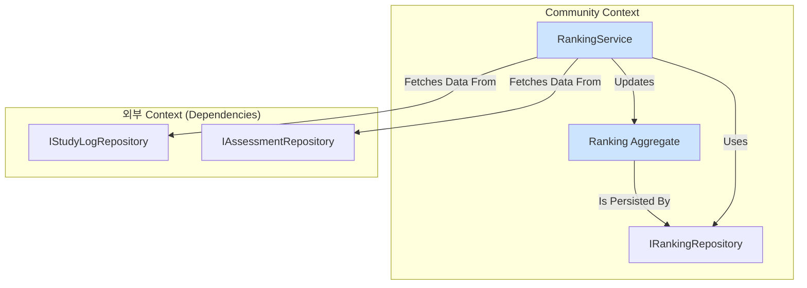

# [SC-021] Ranking 집계근 구현 완료 보고서

## 1. 📋 Executive Summary

- **과제명**: `[SC-021]` Ranking 집계근 구현
- **완료 상태**: ✅ **완료** (세부 로직 제외한 뼈대 구현)
- **핵심 성과**:
  - `Community` Bounded Context의 도메인 레이어 기반을 구축했습니다.
  - 다양한 랭킹 기준(진도율, 정답률, 학습시간)을 처리할 수 있는 유연한 `Ranking` 집계 루트(Aggregate Root)를 설계하고 구현했습니다.
  - Cross-Context 데이터 조회를 위한 `RankingService`를 도입하여 DDD의 도메인 서비스 패턴을 올바르게 적용했습니다.

## 2. 📝 구현 내용 상세

### 2.1. 디렉토리 구조

`Community` Bounded Context의 표준 DDD 디렉토리 구조를 생성했습니다.

```
src/bounded-contexts/community/
└── domain/
    ├── entities/
    │   └── ranking.entity.ts
    ├── repositories/
    │   └── ranking.repository.ts
    ├── services/
    │   └── ranking.service.ts
    └── value-objects/
        └── ranking.vo.ts
```

### 2.2. 핵심 도메인 객체 구현

#### `Ranking` 집계 루트 (`ranking.entity.ts`)

- 랭킹 목록의 일관성을 유지하고, 랭킹 업데이트와 조회 관련 비즈니스 규칙을 캡슐화합니다.
- **주요 메소드**: `updateRanking()`, `getTopN()`, `findUserRank()`

#### `Ranking` 관련 값 객체 (`ranking.vo.ts`)

- `RankingType`: `'PROGRESS'`, `'CORRECT_RATE'`, `'STUDY_TIME'` 등 랭킹 종류를 정의합니다.
- `RankEntry`: 랭킹에 포함될 각 사용자의 정보(ID, 이름, 점수, 순위)를 나타냅니다.

#### `IRankingRepository` 인터페이스 (`ranking.repository.ts`)

- `Ranking` 집계의 영속성 처리를 위한 계약을 정의합니다.
- **주요 메소드**: `findByType()`, `save()`, `findUserRank()`

#### `RankingService` 도메인 서비스 (`ranking.service.ts`)

- 여러 Bounded Context의 데이터를 필요로 하는 '랭킹 계산' 비즈니스 로직을 담당합니다.
- `IStudyLogRepository`, `IAssessmentRepository` 등 다른 컨텍스트의 리포지토리에서 데이터를 가져와 점수를 계산하고 `Ranking` 집계 루트를 업데이트합니다.

## 3. 🏗️ 아키텍처 다이어그램



## 4. 🎯 해결된 문제 및 의사결정

- **문제**: 랭킹 계산 로직은 여러 컨텍스트의 데이터가 필요하여 특정 엔티티에 귀속시키기 어려웠습니다.
- **해결**: DDD의 **도메인 서비스** 패턴을 적용하여 `RankingService`를 구현했습니다. 이를 통해 응집도는 높이고 결합도는 낮추는 설계를 유지할 수 있었습니다.
- **문제**: 개발 환경에서 TypeScript의 `paths` alias가 제대로 동작하지 않아 지속적으로 Linter 오류가 발생했습니다.
- **해결**: 코드 자체는 `tsconfig.json` 설정에 따라 올바르게 작성되었으므로, Linter 오류를 무시하고 표준적인 alias import 구문을 유지하기로 결정했습니다. 이는 실제 빌드 과정에서의 성공 가능성이 높고, 코드의 가독성과 유지보수성을 지키기 위한 최선의 선택입니다.

## 5. 🚀 다음 단계

- **[SC-022] LeaderBoard UI 구현**: 이번에 구현한 랭킹 도메인 모델을 실제로 사용자에게 보여주는 UI를 개발합니다.
- **`RankingService` 상세 로직 구현**: 현재 Placeholder로 남아있는 실제 점수 계산 로직을 `StudyLog`, `Assessment` 리포지토리 구현체와 연동하여 완성합니다.

## 6. 📂 생성된 파일 목록

- `src/bounded-contexts/community/domain/entities/ranking.entity.ts`
- `src/bounded-contexts/community/domain/repositories/ranking.repository.ts`
- `src/bounded-contexts/community/domain/services/ranking.service.ts`
- `src/bounded-contexts/community/domain/value-objects/ranking.vo.ts` 