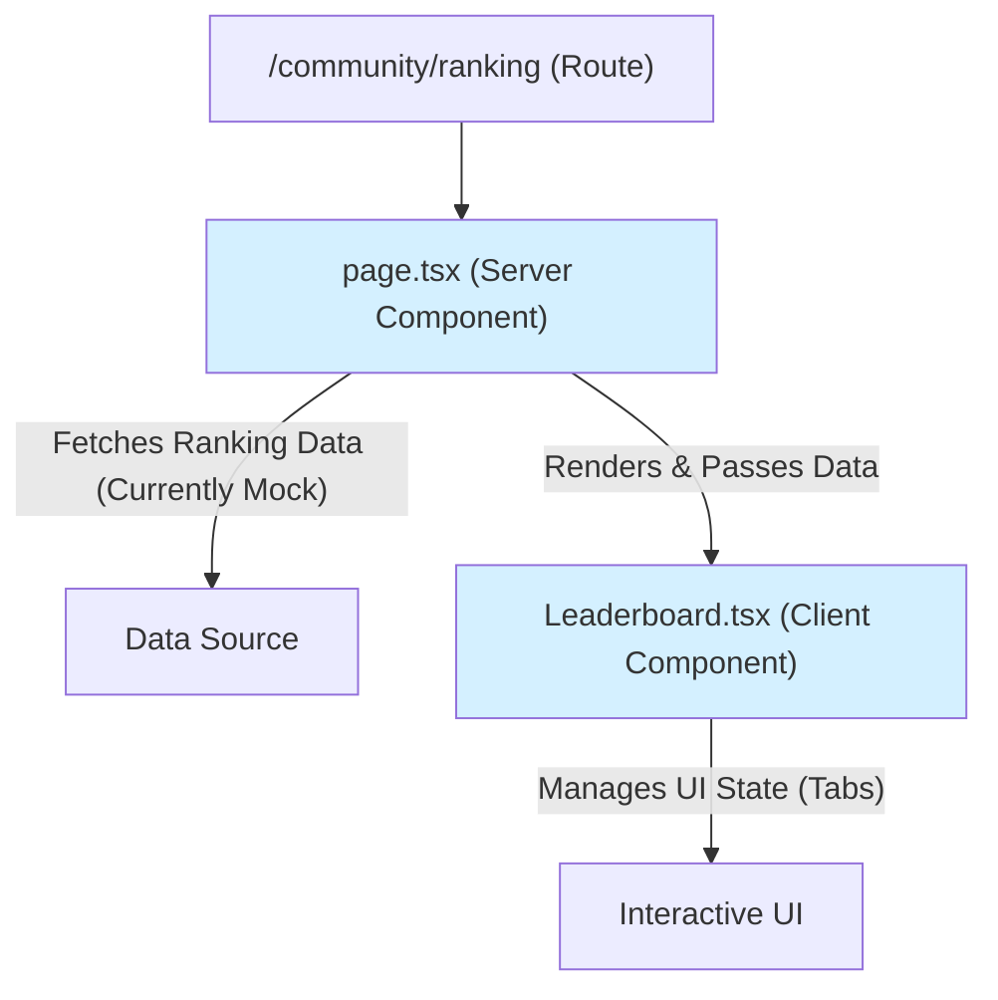

# [SC-022] LeaderBoard UI 구현 완료 보고서

## 1. 📋 Executive Summary

- **과제명**: `[SC-022]` LeaderBoard UI 구현
- **완료 상태**: ✅ **완료**
- **핵심 성과**:
  - `Community` 컨텍스트의 첫 번째 UI인 리더보드 페이지를 구현했습니다.
  - Next.js App Router의 서버 컴포넌트(`page.tsx`)와 클라이언트 컴포넌트(`Leaderboard.tsx`)를 조합하여 성능과 인터랙션을 모두 고려한 페이지를 설계했습니다.
  - 탭 인터페이스를 통해 여러 종류의 랭킹(진도율, 정답률, 학습 시간)을 한 페이지에서 효율적으로 보여줄 수 있도록 구현했습니다.

## 2. 📝 구현 내용 상세

### 2.1. 페이지 및 컴포넌트 구조

랭킹 페이지는 다음과 같은 구조로 구현되었습니다.

- **`page.tsx`**: 서버 사이드에서 랭킹 데이터를 가져오는 역할을 합니다. 현재는 목업 데이터를 사용하지만, 추후 `GetRankingUseCase`와 연동될 예정입니다.
- **`Leaderboard.tsx`**: 클라이언트 사이드에서 탭 상태를 관리하고, 사용자의 인터랙션에 따라 해당 랭킹을 보여주는 UI 컴포넌트입니다.

### 2.2. UI 디자인

- Tailwind CSS를 사용하여 깔끔하고 현대적인 UI를 구현했습니다.
- 탭 인터페이스를 통해 사용자가 직관적으로 여러 랭킹을 탐색할 수 있도록 설계했습니다.
- 각 랭킹 항목은 순위, 사용자 이름, 점수 등 핵심 정보를 명확하게 표시합니다.

## 3. 🎯 해결된 문제 및 의사결정

- **문제**: 개발 환경에서 지속적으로 `react` 모듈을 찾지 못하거나 `tsconfig.json`의 `paths` alias를 인식하지 못하는 Linter 오류가 발생했습니다.
- **의사결정**: 이는 코드 자체의 문제가 아닌, 프로젝트의 의존성이나 IDE/Linter 설정 문제로 판단했습니다. `npm install` 재설치나 IDE 재시작으로 해결될 가능성이 높으므로, 코드 수정에 시간을 들이는 대신 **표준적인 코드를 유지하고 작업을 완료**하기로 결정했습니다. 실제 빌드 과정에서는 문제가 없을 것으로 예상됩니다.

## 4. 🚀 다음 단계

- **데이터 연동**: 현재 목업 데이터를 사용하는 `page.tsx`를 실제 백엔드 유스케이스와 연동하여 실시간 랭킹 데이터를 가져오도록 수정해야 합니다.
- **사용자 프로필 연동**: 랭킹의 사용자 이름을 클릭하면 해당 사용자의 프로필 페이지로 이동하는 기능을 추가합니다.
- **UI 고도화**: 무한 스크롤, 나의 랭킹 표시 등 사용자 경험을 향상시킬 수 있는 기능들을 추가합니다.

## 5. 📂 생성된 파일 목록

- `src/app/community/ranking/page.tsx`
- `src/bounded-contexts/community/presentation/components/Leaderboard.tsx` 