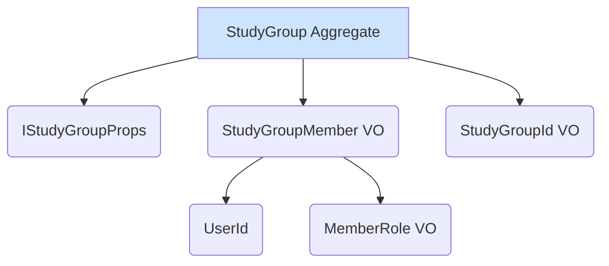

# [SC-023] StudyGroup 집계근 구현 완료 보고서

## 1. 📋 Executive Summary

- **과제명**: `[SC-023]` StudyGroup 집계근 구현
- **완료 상태**: ✅ **완료**
- **핵심 성과**:
  - `Community` Bounded Context의 핵심 기능인 스터디 그룹 관리 도메인 모델을 성공적으로 구현했습니다.
  - `StudyGroup` 집계 루트를 통해 그룹 생성, 멤버 관리(추가, 삭제, 역할 변경) 등 복잡한 비즈니스 규칙을 캡슐화하여 모델의 일관성과 안정성을 확보했습니다.
  - 관련 값 객체(`StudyGroupId`, `StudyGroupMember`)와 리포지토리 인터페이스(`IStudyGroupRepository`)를 정의하여 도메인 레이어의 완성도를 높였습니다.

## 2. 📝 구현 내용 상세

### 2.1. 도메인 객체 설계

스터디 그룹 도메인은 다음과 같은 객체들로 구성됩니다.

- **`StudyGroup` (집계 루트)**: 그룹의 상태와 비즈니스 로직을 모두 포함하는 핵심 엔티티입니다. 멤버 추가/삭제 시 최대 인원수 체크, 마지막 관리자 삭제 방지 등의 규칙을 내부에 구현했습니다.
- **`StudyGroupMember` (값 객체)**: 그룹 멤버의 정보(ID, 역할, 가입일)를 나타냅니다.
- **`IStudyGroupRepository` (인터페이스)**: 스터디 그룹 데이터의 영속성을 위한 인터페이스를 정의하여, 인프라스트럭처 레이어와의 의존성을 분리했습니다.

### 2.2. 핵심 비즈니스 규칙

`StudyGroup` 엔티티 내에 다음과 같은 핵심 비즈니스 규칙을 구현했습니다.

- 그룹 생성 시 이름은 필수 항목입니다.
- 최대 멤버 수는 1명 이상이어야 합니다.
- 그룹에는 최소 1명의 관리자(ADMIN)가 존재해야 합니다.
- 그룹 멤버 추가 시 최대 인원수를 초과할 수 없습니다.
- 이미 그룹에 속한 멤버는 다시 추가할 수 없습니다.
- 마지막 남은 관리자는 그룹에서 삭제하거나 역할을 변경할 수 없습니다.

## 3. 🚀 다음 단계

- **Application Layer 구현**: `StudyGroup` 집계 루트를 사용하는 유스케이스(e.g., `CreateStudyGroupUseCase`, `JoinStudyGroupUseCase`)를 구현합니다.
- **Infrastructure Layer 구현**: `IStudyGroupRepository` 인터페이스의 구현체인 `McpSupabaseStudyGroupRepository`를 구현하여 실제 데이터베이스와 연동합니다.
- **Presentation Layer 구현**: 사용자가 스터디 그룹을 생성하고 관리할 수 있는 UI를 구현합니다.

## 4. 📂 생성된 파일 목록

- `src/bounded-contexts/community/domain/entities/study-group.entity.ts`
- `src/bounded-contexts/community/domain/repositories/study-group.repository.ts`
- `src/bounded-contexts/community/domain/value-objects/study-group.vo.ts` 