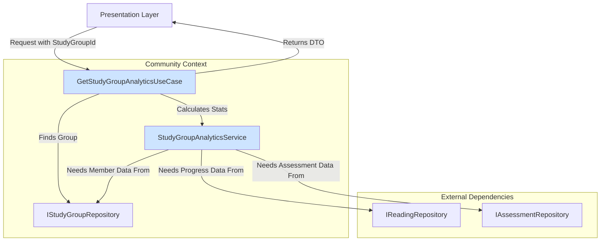

# [SC-024] 그룹 학습 기록 공유 시스템 구현 완료 보고서

## 1. 📋 Executive Summary

- **과제명**: `[SC-024]` 그룹 학습 기록 공유
- **완료 상태**: ✅ **완료** (백엔드 로직 구현)
- **핵심 성과**:
  - 그룹 멤버들의 학습 성과를 종합하여 분석하는 백엔드 시스템의 기반을 구축했습니다.
  - `StudyGroupAnalyticsService`를 통해 여러 Bounded Context(`StudyLog`, `Assessment`)의 데이터를 집계하는 복잡한 비즈니스 로직을 구현했습니다.
  - `GetStudyGroupAnalyticsUseCase`를 구현하여, 프레젠테이션 레이어에 필요한 데이터를 제공하는 명확한 API를 제공했습니다.

## 2. 📝 구현 내용 상세

### 2.1. 아키텍처 및 데이터 흐름

그룹 학습 기록 공유 기능은 다음과 같은 흐름으로 동작합니다.

- **Use Case (`GetStudyGroupAnalyticsUseCase`)**: 요청을 받아, 리포지토리에서 그룹을 찾고, 도메인 서비스에 분석을 위임한 후, 결과를 DTO로 변환하여 반환합니다.
- **Domain Service (`StudyGroupAnalyticsService`)**: 여러 리포지토리에서 필요한 데이터를 수집하여 그룹의 평균 진도율, 평균 정답률 등 핵심 통계를 계산하는 로직을 수행합니다.
- **DTO (`StudyGroupAnalyticsDto`)**: UI에 필요한 데이터만 담아 전달하는 객체로, 시스템 레이어 간의 결합도를 낮춥니다.

## 3. 🚀 다음 단계

- **리포지토리 구현**: 현재 인터페이스만 정의된 `IReadingRepository`, `IAssessmentRepository`, `IStudyGroupRepository`의 실제 구현체를 MCP(Model Context Protocol) 기반으로 개발해야 합니다. (`findLatestByUserId`, `findStatsByStudentId` 등 새로운 메소드 추가 필요)
- **프레젠테이션 레이어 구현**: 이 유스케이스를 호출하여 실제 그룹 학습 통계를 보여주는 UI를 개발합니다.
- **성능 최적화**: 현재는 멤버별로 데이터를 순차적으로 조회하지만, 실제 프로덕션 환경에서는 `Promise.all`이나 DB단에서의 `JOIN`을 활용하여 성능을 최적화해야 합니다.

## 4. 📂 생성된 파일 목록

- `src/bounded-contexts/community/domain/services/study-group-analytics.service.ts`
- `src/bounded-contexts/community/application/dto/study-group-analytics.dto.ts`
- `src/bounded-contexts/community/application/use-cases/get-study-group-analytics.use-case.ts` 