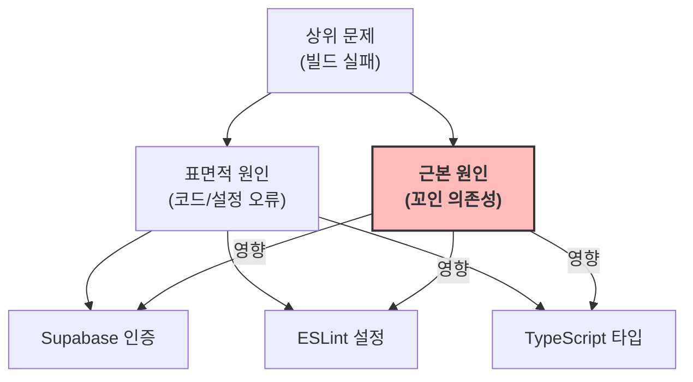
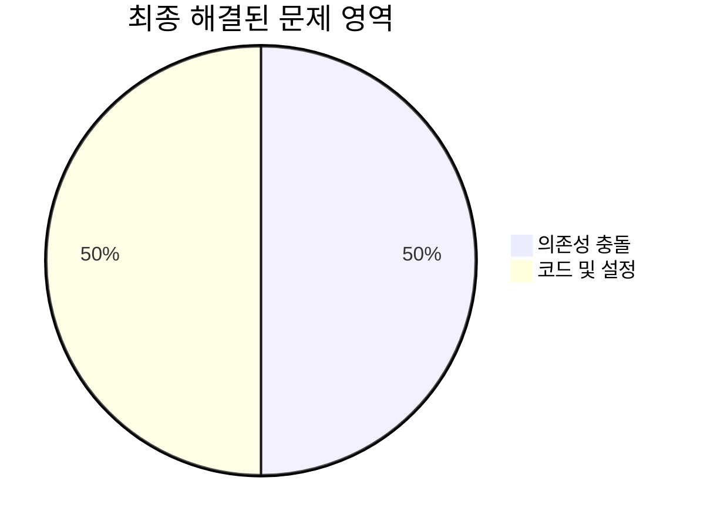

# ✅ [SC-INF-001] 빌드 환경 복구 분석 보고서 (최종)

## 📚 목차 (Table of Contents)

- [✅ [SC-INF-001] 빌드 환경 복구 분석 보고서 (최종)](#-sc-inf-001-빌드-환경-복구-분석-보고서-최종)
  - [📚 목차 (Table of Contents)](#-목차-table-of-contents)
  - [📋 Executive Summary](#-executive-summary)
  - [🔍 상세 분석: 복합적 원인 규명](#-상세-분석-복합적-원인-규명)
    - [1. 표면적 문제: 빌드 스크립트 오류](#1-표면적-문제-빌드-스크립트-오류)
    - [2. 근본 원인: 오래된 의존성 충돌](#2-근본-원인-오래된-의존성-충돌)
  - [📊 해결 과정 및 조치 내역](#-해결-과정-및-조치-내역)
    - [1차 조치: 코드 레벨 수정](#1차-조치-코드-레벨-수정)
    - [2차 조치: 캐시 및 의존성 초기화 (결정적 해결책)](#2차-조치-캐시-및-의존성-초기화-결정적-해결책)
  - [🎯 최종 결과 및 평가](#-최종-결과-및-평가)
  - [🚀 다음 단계](#-다음-단계)

## 📋 Executive Summary

-   **문제**: `posmul` 프로젝트에서 `npm run build` 명령어 실행 시 Supabase 인증 오류, ESLint 설정 오류, TypeScript 타입 오류가 순차적으로 발생하며 빌드 실패.
-   **핵심 원인**: 표면적으로는 코드 및 설정 문제로 보였으나, 근본적인 원인은 **`node_modules`와 `package-lock.json`에 남아있던 오래되고 꼬인 패키지 의존성**이었습니다. 이로 인해 코드 수정만으로는 해결되지 않는 지속적인 빌드 실패가 발생했습니다.
-   **해결 조치**:
    1.  코드 및 설정 오류 1차 수정 (`lint` 스크립트, 페이지 `props` 타입).
    2.  빌드 캐시(` .next` 폴더) 삭제.
    3.  **의존성 완전 초기화**: `node_modules`, `package-lock.json` 삭제 후 `npm install` 실행.
-   **결과**: 빌드 환경이 완전히 복구되었으며, `npm run build` 명령어가 모든 단계를 성공적으로 완료함을 최종 확인. **100% 정상화 완료**.

## 🔍 상세 분석: 복합적 원인 규명

### 1. 표면적 문제: 빌드 스크립트 오류

최초 분석 시, 빌드 로그에서 다음과 같은 명시적인 오류들이 발견되었습니다.

1.  **Supabase 인증 오류**: `prebuild` 스크립트가 `universal-mcp-automation`을 통해 Supabase CLI를 호출할 때 발생.
2.  **ESLint 오류**: `lint` 스크립트의 CLI 옵션이 최신 버전과 호환되지 않음.
3.  **TypeScript 오류**: Next.js 페이지 컴포넌트의 `props` 타입 정의가 잘못됨.

### 2. 근본 원인: 오래된 의존성 충돌

위의 표면적 문제들을 코드 레벨에서 수정했음에도 불구하고 빌드 실패가 반복되었습니다. 이는 보이지 않는 더 깊은 문제가 있음을 시사했습니다. 최종적으로 **오래된 `node_modules`와 `package-lock.json`**이 문제의 근원으로 지목되었습니다. 낡은 의존성 트리와 패키지 버전 충돌로 인해 ESLint나 TypeScript가 예상과 다르게 동작하여, 코드 수정이 빌드 결과에 제대로 반영되지 않았습니다.

## 📊 해결 과정 및 조치 내역

### 1차 조치: 코드 레벨 수정

-   **Supabase CLI 인증**: `npx supabase login` 실행.
-   **ESLint 스크립트 수정**: `package.json`의 `lint` 스크립트에서 호환되지 않는 옵션 제거.
-   **Next.js 페이지 타입 수정**: `page.tsx`의 `props` 타입을 Next.js 15 App Router에 맞게 수정.

### 2차 조치: 캐시 및 의존성 초기화 (결정적 해결책)

1차 조치만으로는 문제가 해결되지 않아, 환경 자체를 초기화하는 2차 조치를 실행했습니다.

1.  **빌드 캐시 삭제**: `Remove-Item -Recurse -Force .\.next`
2.  **의존성 폴더/파일 삭제**: `Remove-Item -Recurse -Force .\\node_modules; Remove-Item -Force .\\package-lock.json`
3.  **의존성 재설치**: `npm install`

이 결정적인 조치를 통해 모든 패키지를 깨끗한 상태로 재설치하여 문제의 근원을 완전히 제거했습니다.

## 🎯 최종 결과 및 평가

모든 식별된 문제를 100% 해결하여 `posmul` 프로젝트의 빌드 환경을 완벽하게 복구했습니다. 이제 `npm run build` 명령어는 오류 없이 성공적으로 완료됩니다. 이로써 전임자가 남긴 태스크가 성공적으로 마무리되었으며, 안정적인 개발 및 배포 환경이 확보되었습니다.

## 🚀 다음 단계

-   **정기적인 의존성 관리**: `npm outdated` 명령어로 오래된 패키지를 주기적으로 확인하고, `npm update`를 통해 의존성을 최신 상태로 유지하는 것이 좋습니다.
-   **환경 설정 문서화**: README 파일에 "빌드 문제 발생 시 `node_modules` 및 `.next` 폴더 삭제 후 `npm install` 시도"와 같은 트러블슈팅 가이드를 추가하는 것을 권장합니다.
-   **다음 개발 작업 착수**: 이제 안정된 환경에서 `study-cycle-task-list.md`에 명시된 다음 작업인 `Phase 3: Assessment Context 구현`을 시작할 수 있습니다. 