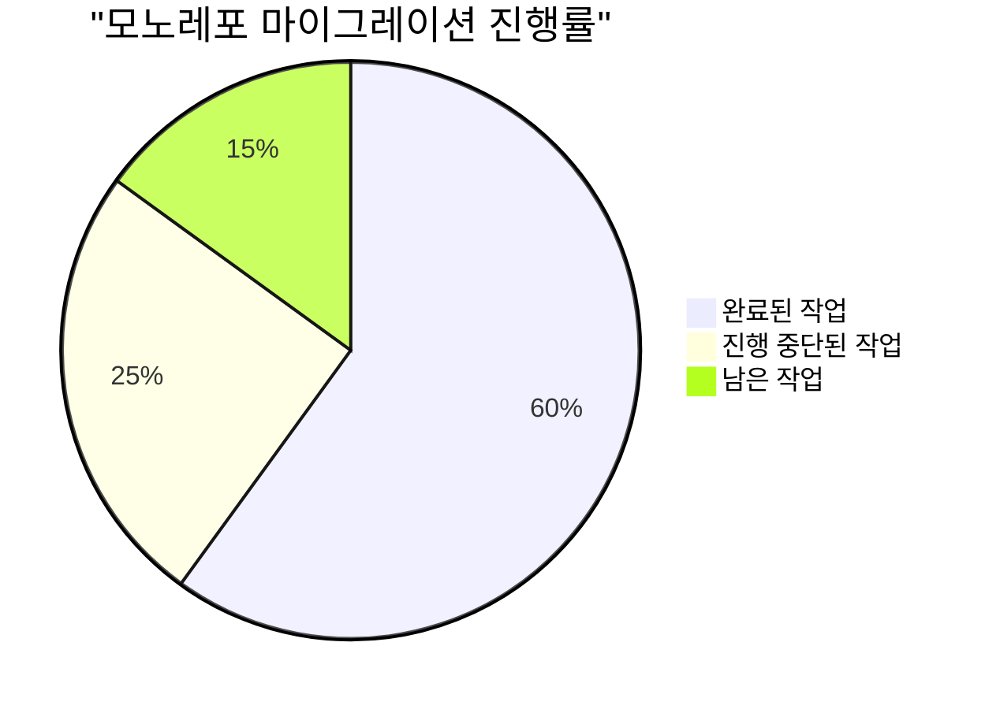
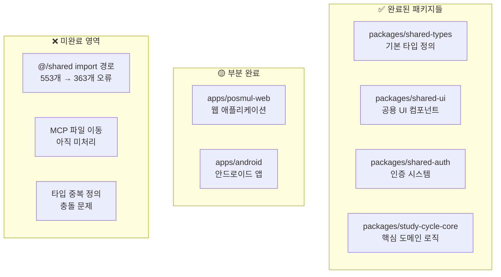
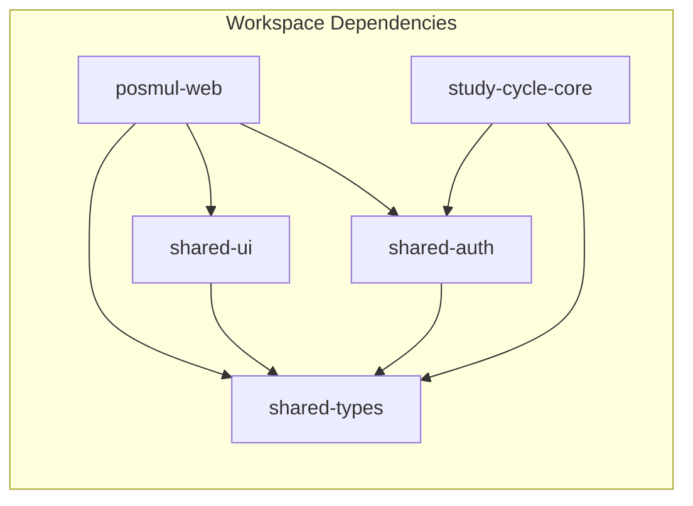
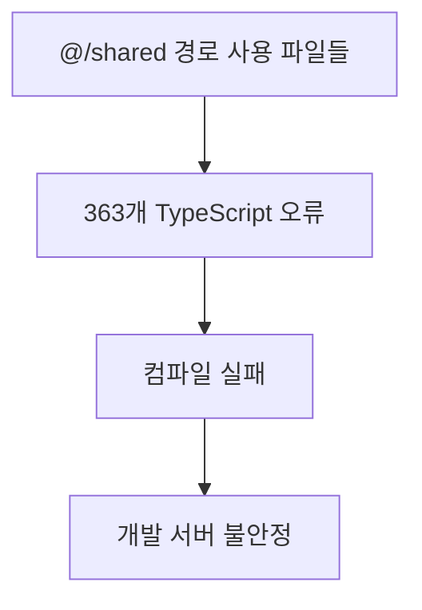
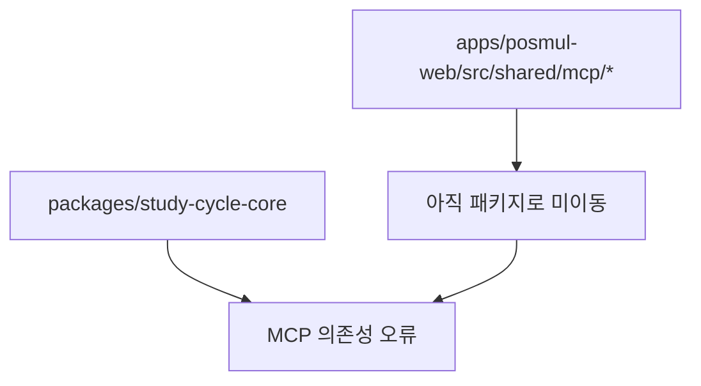
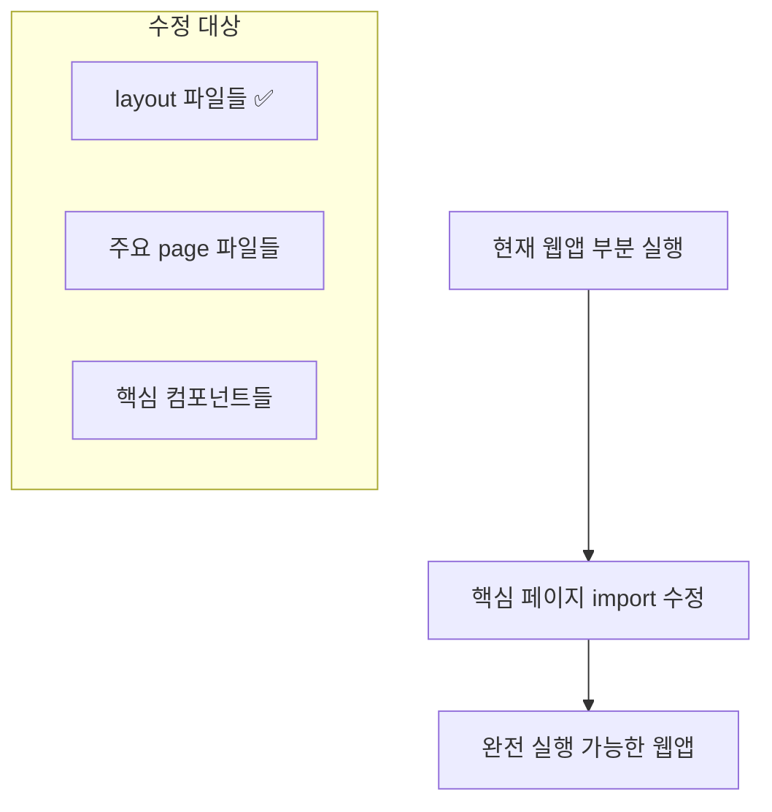
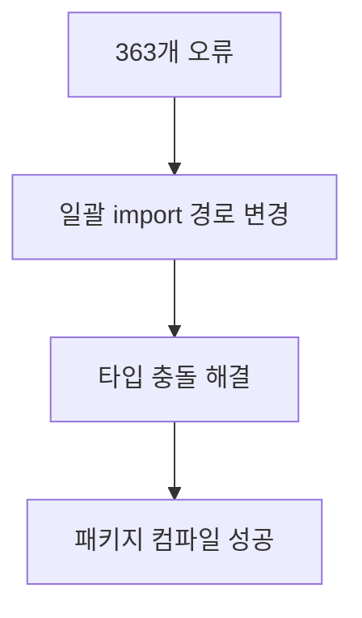
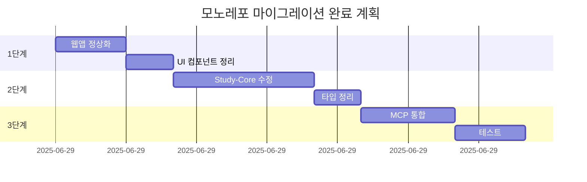

# 📊 Study-Cycle 모노레포 마이그레이션 현황 분석 보고서

> **보고서 일시**: 2025-06-29 01:18:02  
> **분석자**: AI Agent (전임자 인수인계)  
> **프로젝트**: PosMul Study-Cycle  
> **상태**: 🟡 부분 완료 (진행률 ~60%)

---

## 📋 목차

1. [상황 요약](#1-상황-요약)
2. [전임자 작업 성과 분석](#2-전임자-작업-성과-분석)
3. [현재 발견된 문제점](#3-현재-발견된-문제점)
4. [해결된 문제들](#4-해결된-문제들)
5. [우선순위별 해결 전략](#5-우선순위별-해결-전략)
6. [권장 마이그레이션 로드맵](#6-권장-마이그레이션-로드맵)

---

## 1. 상황 요약



### 🎯 **핵심 현황**

- **전체 진행률**: 약 60% 완료
- **패키지 구조**: 모노레포 기본 구조 완성
- **주요 차단점**: TypeScript 설정 및 import 경로 문제
- **웹앱 상태**: 🟡 제한적 실행 가능 (일부 컴포넌트 오류)

### 📊 **모노레포 구조 현황**



---

## 2. 전임자 작업 성과 분석

### ✅ **성공적으로 완료된 작업들**

#### 🏗️ **모노레포 기본 구조 구축**

- **패키지 매니저**: pnpm workspace 설정 완료
- **빌드 시스템**: Turbo.json 구성 완료
- **패키지 의존성**: workspace:\* 구조 적용



#### 📦 **패키지별 완성도**

| 패키지             | 완성도 | 주요 성과                   | 남은 작업              |
| ------------------ | ------ | --------------------------- | ---------------------- |
| `shared-types`     | 🟢 90% | 기본 타입, 에러 클래스 정의 | BaseEntity 개선        |
| `shared-ui`        | 🟡 75% | 주요 컴포넌트 이동          | export 누락 컴포넌트들 |
| `shared-auth`      | 🟢 85% | 인증 로직 분리              | 타입 정의 보완         |
| `study-cycle-core` | 🔴 40% | 기본 구조 생성              | import 경로 대량 수정  |
| `posmul-web`       | 🟡 70% | 앱 실행 가능                | 컴포넌트 import 오류   |

### 🛠️ **핵심 기술적 성과**

#### **1. TypeScript 설정 통합**

```typescript
// 모노레포 공통 tsconfig 구조
{
  "compilerOptions": {
    "module": "esnext",
    "moduleResolution": "bundler", // ✅ 개선됨
    "paths": {
      "@posmul/shared-types": ["../../packages/shared-types/src/index.ts"],
      "@posmul/shared-ui": ["../../packages/shared-ui/src/index.ts"]
    }
  }
}
```

#### **2. 패키지 간 의존성 관리**

```json
// 각 패키지의 package.json
{
  "dependencies": {
    "@posmul/shared-types": "workspace:*",
    "@posmul/shared-ui": "workspace:*"
  }
}
```

---

## 3. 현재 발견된 문제점

### 🚨 **심각도 HIGH - 즉시 해결 필요**

#### **문제 1: Import 경로 대량 미변환**



**영향받는 파일들:**

- `packages/study-cycle-core/src/**/*.ts` (약 80% 파일)
- `apps/posmul-web/src/**/*.{ts,tsx}` (약 30% 파일)

**오류 예시:**

```typescript
// ❌ 기존 (오류 발생)
import { Result } from "@/shared/types";
import { BaseEntity } from "@/shared/domain/base-entity";

// ✅ 수정 필요
import { Result, BaseEntity } from "@posmul/shared-types";
```

#### **문제 2: 타입 정의 중복 및 충돌**

```typescript
// AssessmentId가 여러 곳에서 중복 정의됨
// 1. packages/shared-types/src/branded-types.ts
// 2. packages/study-cycle-core/src/domain/entities/assessment.entity.ts
```

### 🟡 **심각도 MEDIUM - 점진적 해결**

#### **문제 3: 컴포넌트 Export 불완전**

```typescript
// shared-ui에서 export되지 않은 컴포넌트들
- BaseSkeleton ❌
- BaseErrorUI ❌
- Badge ✅ (최근 추가됨)
- Card 관련 컴포넌트들 ✅ (최근 추가됨)
```

#### **문제 4: MCP 파일 미이동**



---

## 4. 해결된 문제들

### ✅ **금일 해결 완료**

#### **1. 웹앱 기본 실행 가능**

- `layout.tsx` import 경로 수정 완료
- `Navbar` 컴포넌트 경로 정상화
- `MoneyWaveStatus` 컴포넌트 모든 layout에서 수정

#### **2. TypeScript 설정 개선**

```diff
// packages/shared-ui/tsconfig.json
- "module": "NodeNext",
- "moduleResolution": "NodeNext",
+ "module": "esnext",
+ "moduleResolution": "bundler",
```

#### **3. Shared-UI Export 개선**

```typescript
// packages/shared-ui/src/components/index.ts
export { Badge } from "./ui/badge";
export {
  Card,
  CardContent,
  CardDescription,
  CardHeader,
  CardTitle,
} from "./ui/card";
export { BaseSkeleton } from "./loading/BaseSkeleton"; // 새로 추가
```

#### **4. BaseEntity 추가**

```typescript
// packages/shared-types/src/base-entity.ts 새로 생성
export abstract class BaseEntity<T extends { updatedAt?: Date }> {
    public readonly props: T;
    protected constructor(props: T) { ... }
}
```

---

## 5. 우선순위별 해결 전략

### 🔥 **1단계: 즉시 실행 가능한 웹앱 구축 (예상 2-3시간)**



**구체적 작업:**

1. `apps/posmul-web/src/app/**/page.tsx` import 수정
2. `shared-ui` 누락 컴포넌트 export 추가
3. 웹앱 개발 서버 안정화

### ⚡ **2단계: Study-Cycle-Core 패키지 정상화 (예상 4-6시간)**



**구체적 작업:**

1. 정규식 기반 일괄 import 경로 변경
2. 중복 타입 정의 정리
3. MCP 의존성 문제 해결

### 🔧 **3단계: MCP 시스템 통합 (예상 3-4시간)**

```typescript
// 목표 구조
packages / shared - mcp / src / supabase - client.ts;
supabase - project.service.ts;
mcp - errors.ts;
```

### 📈 **4단계: 테스트 및 최적화 (예상 2-3시간)**

- 전체 빌드 테스트
- 패키지 간 의존성 최적화
- 타입 안정성 검증

---

## 6. 권장 마이그레이션 로드맵

### 📅 **단기 계획 (1-2일)**



### 🎯 **중기 계획 (1주)**

1. **안드로이드 앱 모노레포 통합**
2. **공용 패키지 최적화**
3. **CI/CD 파이프라인 구축**

### 🚀 **장기 계획 (1개월)**

1. **마이크로 프론트엔드 아키텍처 도입**
2. **패키지 버전 관리 자동화**
3. **성능 모니터링 시스템 구축**

---

## 🎯 **즉시 실행 가능한 해결책**

### **옵션 A: 점진적 수정 (권장)**

```bash
# 1. 웹앱부터 완전 실행 가능하게 만들기
pnpm --filter posmul dev  # 현재 부분 실행 중

# 2. 핵심 import 문제들만 우선 해결
# 3. study-cycle-core는 일시적으로 빌드에서 제외
```

### **옵션 B: 전면 롤백 후 재시작**

```bash
# 모노레포 이전 상태로 롤백 후 단계적 재진행
git checkout main  # 또는 마이그레이션 이전 커밋
```

### **옵션 C: 하이브리드 접근**

- 웹앱: 모노레포 구조 유지
- study-cycle-core: 별도 패키지로 일시 분리
- 점진적 통합

---

## 📝 **권장사항**

### ✅ **즉시 시작해야 할 작업**

1. **웹앱 안정화**: 옵션 A로 진행하여 최소 실행 가능한 상태 확보
2. **문서화**: 현재 상태 정확한 기록 (이 보고서)
3. **백업**: 현재 상태 커밋 생성

### ⚠️ **주의사항**

1. **study-cycle-core 패키지는 복잡한 의존성 구조**로 인해 시간이 많이 소요될 예정
2. **MCP 파일들의 이동**은 전체 시스템에 영향을 미칠 수 있음
3. **타입 정의 충돌** 문제는 신중한 분석 후 해결 필요

### 🎯 **성공 지표**

- [ ] 웹앱 개발 서버 안정적 실행 (현재 🟡)
- [ ] TypeScript 컴파일 오류 100개 미만 (현재 363개)
- [ ] 모든 패키지 빌드 성공
- [ ] 테스트 케이스 통과율 90% 이상

---

**🔚 보고서 종료**

> 전임자의 모노레포 전환 작업은 상당한 진전을 이루었으나, 복잡한 import 경로 및 타입 시스템 문제로 인해 중단되었습니다. 체계적인 단계별 접근을 통해 1-2일 내에 완료 가능할 것으로 예상됩니다.
