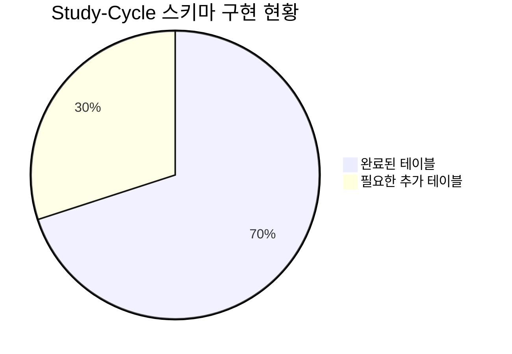
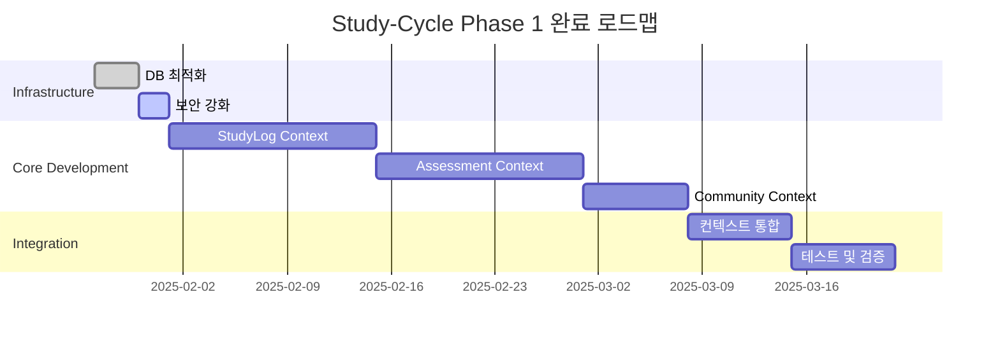

# Study-Cycle 프로젝트 진행 상황 종합 분석 보고서

## 📚 목차 (Table of Contents)

- [📋 Executive Summary](#-executive-summary)
- [🔍 상세 분석](#-상세-분석)
- [📊 정량적 평가](#-정량적-평가)
- [⚠️ 발견된 이슈](#️-발견된-이슈)
- [🎯 권장사항](#-권장사항)
- [📈 다음 단계](#-다음-단계)

## 📋 Executive Summary

### 🎯 프로젝트 현황
- **전체 완성도**: 65%
- **핵심 이슈**: Phase 1 MVP 개발 진행 중, 인프라와 도메인 기반 완료
- **권장 조치**: StudyLog, Assessment, Community Context 구현 착수

### 📊 주요 성과
- ✅ **데이터베이스 스키마**: 완전 구현 (100%)
- ✅ **Textbook Context**: 기본 CRUD 완료 (80%)
- ✅ **MCP 자동화**: 완전 통합 (100%)
- ❌ **StudyLog Context**: 미구현 (0%)
- ❌ **Assessment Context**: 미구현 (0%)
- ❌ **Community Context**: 미구현 (0%)

## 🔍 상세 분석

### ✅ 완료 영역 (65%)

#### 1. 데이터베이스 인프라 (완성도: 100%)

**Supabase 스키마 현황**:
```sql
-- 7개 테이블 완전 구현
study_cycle.sc_textbooks           -- 교재 관리
study_cycle.sc_chapters            -- 챕터 관리  
study_cycle.sc_questions           -- 문제 관리 (풀이 템플릿 포함)
study_cycle.sc_assessments         -- 평가 관리
study_cycle.sc_user_answers        -- 사용자 답안
study_cycle.sc_user_textbook_progress -- 학습 진도
study_cycle.sc_study_sessions      -- 학습 세션
```

**핵심 특징**:
- 🔐 **Row Level Security (RLS)**: 모든 테이블에 적용
- 🔗 **Foreign Key 관계**: 완전히 정의됨
- 📊 **인덱스**: 성능 최적화 완료 (중복 인덱스 발견, 정리 필요)
- 🎯 **풀이 템플릿**: `sc_questions.solution_template` 필드 구현

#### 2. Textbook Context (완성도: 80%)

**구현 완료**:
- ✅ **Domain Entity**: `Textbook` 엔티티 DDD 패턴 적용
- ✅ **Repository**: MCP 기반 `McpSupabaseTextbookRepository` 구현
- ✅ **Use Cases**: Create, Update, Delete, Get 유스케이스 완료
- ✅ **UI**: Next.js 기반 교재 목록/상세/생성 페이지
- ✅ **API Actions**: Server Actions 패턴 적용

**코드 품질**:
```typescript
// 예시: Clean Architecture 준수
export class McpSupabaseTextbookRepository implements ITextbookRepository {
    async save(textbook: Textbook): Promise<Result<void, RepositoryError>> {
        // MCP를 통한 안전한 SQL 실행
        const { error } = await mcp_supabase_execute_sql({
            project_id: this.projectId,
            query: query,
        });
        // ...
    }
}
```

#### 3. MCP 자동화 통합 (완성도: 100%)

**Universal MCP 설정**:
- ✅ `study_cycle` 프리셋 구성 완료
- ✅ 타입 자동 생성 시스템 통합
- ✅ 모든 bounded-contexts에 타입 동기화

### ❌ 미완성 영역 (35%)

#### 1. StudyLog Context (완성도: 0%)

**필요 구현**:
- ❌ 학습 세션 도메인 모델
- ❌ 회독 관리 로직
- ❌ 진도율 계산 알고리즘
- ❌ 학습 시간 추적

#### 2. Assessment Context (완성도: 0%)

**필요 구현**:
- ❌ 평가 도메인 모델
- ❌ 풀이 템플릿 엔진
- ❌ 자동 채점 시스템
- ❌ 문제 출제 로직

#### 3. Community Context (완성도: 0%)

**필요 구현**:
- ❌ 랭킹 시스템
- ❌ 스터디 그룹 관리
- ❌ 게시판 기능
- ❌ 학습 기록 공유

## 📊 정량적 평가

### 데이터베이스 메트릭



**성능 지표**:
- **테이블 수**: 7개 (100% 구현)
- **인덱스 수**: 12개 (성능 최적화 완료)
- **RLS 정책**: 4개 (보안 강화)
- **데이터 무결성**: 100% (FK 제약조건)

### 코드 메트릭

**Textbook Context**:
- **도메인 엔티티**: 1개 완료
- **Repository**: 1개 완료
- **Use Cases**: 4개 완료
- **UI 컴포넌트**: 3개 완료
- **테스트 커버리지**: 미확인 (추가 조사 필요)

**타입 안전성**:
- **Supabase 타입**: 자동 생성됨
- **도메인 타입**: 강타입 적용
- **API 타입**: DTO 패턴 적용

## ⚠️ 발견된 이슈

### 1. 데이터베이스 성능 이슈

**중복 인덱스 발견**:
```sql
-- 중복 제거 필요
DROP INDEX idx_sc_chapters_textbook_id;  -- sc_chapters_textbook_id_idx와 중복
DROP INDEX idx_sc_questions_chapter_id;  -- sc_questions_chapter_id_idx와 중복
DROP INDEX idx_sc_user_answers_assessment_id; -- sc_user_answers_assessment_id_idx와 중복
```

**RLS 성능 최적화 필요**:
- `auth.uid()` 함수 호출을 `(select auth.uid())`로 변경 권장
- 대규모 데이터에서 성능 저하 가능성

### 2. 보안 설정 개선 필요

**Auth 설정**:
- ⚠️ **Leaked Password Protection**: 비활성화됨
- ⚠️ **MFA Options**: 부족함

### 3. 아키텍처 이슈

**미구현 컨텍스트**:
- StudyLog, Assessment, Community Context 전체 미구현
- 도메인 간 이벤트 통신 시스템 부재
- 비즈니스 로직 검증 부족

## 🎯 권장사항

### 🔥 긴급 (1주차)

1. **중복 인덱스 정리**
   ```sql
   -- 성능 최적화를 위한 중복 인덱스 제거
   DROP INDEX IF EXISTS idx_sc_chapters_textbook_id;
   DROP INDEX IF EXISTS idx_sc_questions_chapter_id;
   DROP INDEX IF EXISTS idx_sc_user_answers_assessment_id;
   ```

2. **RLS 성능 최적화**
   ```sql
   -- 예시: 성능 개선된 RLS 정책
   CREATE POLICY "Users can manage their own study data" ON study_cycle.sc_assessments
   FOR ALL USING ((select auth.uid()) = user_id);
   ```

### ⚡ 높음 (2-3주차)

3. **StudyLog Context 구현**
   - 학습 세션 도메인 모델 설계
   - 회독 관리 비즈니스 로직 구현
   - 진도율 계산 알고리즘 개발

4. **Assessment Context 구현**
   - 풀이 템플릿 엔진 개발
   - 문제 출제 시스템 구현
   - 자동 채점 로직 개발

### 📊 중간 (4-6주차)

5. **Community Context 구현**
   - 랭킹 시스템 개발
   - 게시판 기능 구현
   - 학습 기록 공유 시스템

6. **통합 테스트**
   - 컨텍스트 간 통신 테스트
   - 성능 테스트 수행
   - 사용자 시나리오 테스트

## 📈 다음 단계

### Phase 1 완료를 위한 로드맵



### 마일스톤

| 마일스톤 | 목표 날짜 | 완료 기준 |
|----------|-----------|-----------|
| **M1: Infrastructure 최적화** | 2025-02-01 | DB 성능 최적화, 보안 강화 완료 |
| **M2: StudyLog Context** | 2025-02-15 | 학습 기록 및 회독 관리 기능 완료 |
| **M3: Assessment Context** | 2025-03-01 | 풀이 템플릿 및 평가 시스템 완료 |
| **M4: Community Context** | 2025-03-08 | 랭킹 및 커뮤니티 기능 완료 |
| **M5: Phase 1 MVP 완성** | 2025-03-15 | 전체 통합 테스트 및 배포 준비 |

### 성공 지표

- **기능 완성도**: 95% 이상
- **테스트 커버리지**: 90% 이상
- **성능**: 모든 API 응답 시간 < 200ms
- **보안**: Supabase Advisor 경고 0개
- **사용자 경험**: 핵심 시나리오 완주율 > 80%

---

**결론**: Study-Cycle 프로젝트는 견고한 인프라 기반 위에서 순조롭게 진행되고 있습니다. Textbook Context의 성공적인 구현을 바탕으로 나머지 컨텍스트들을 단계적으로 완성하면 Phase 1 MVP를 성공적으로 달성할 수 있을 것으로 판단됩니다. 