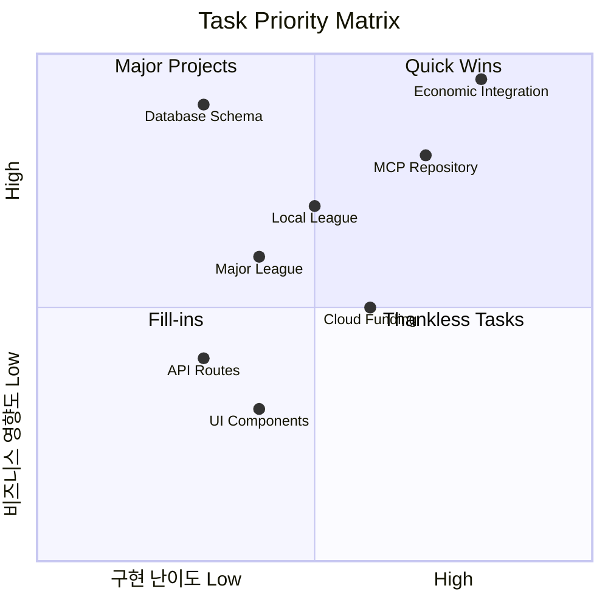
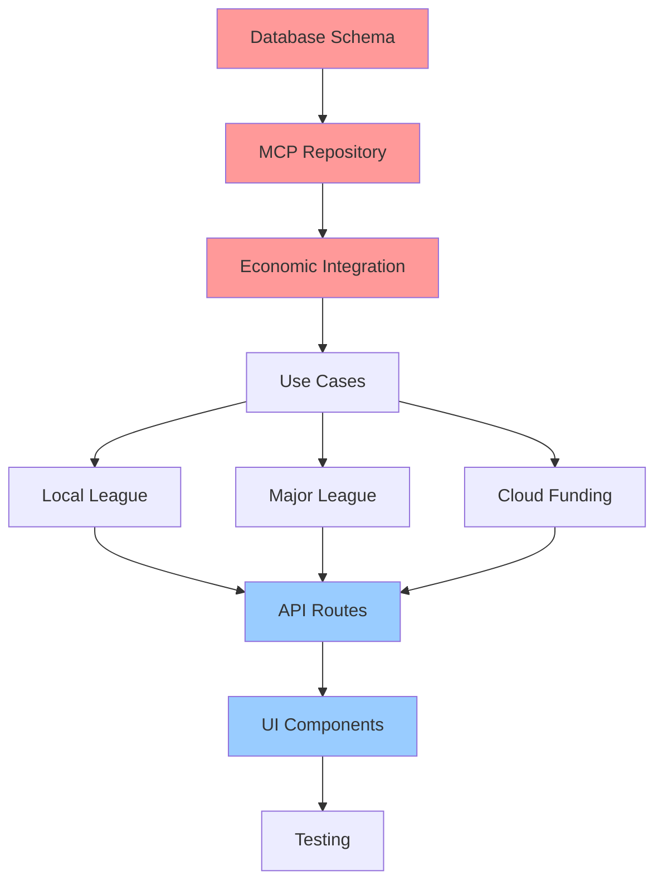
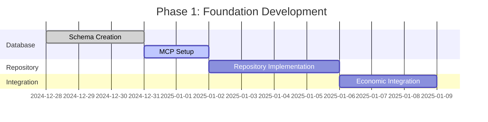
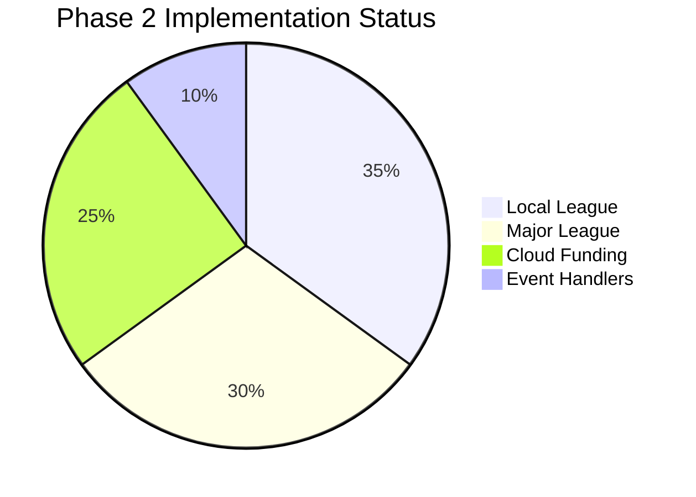
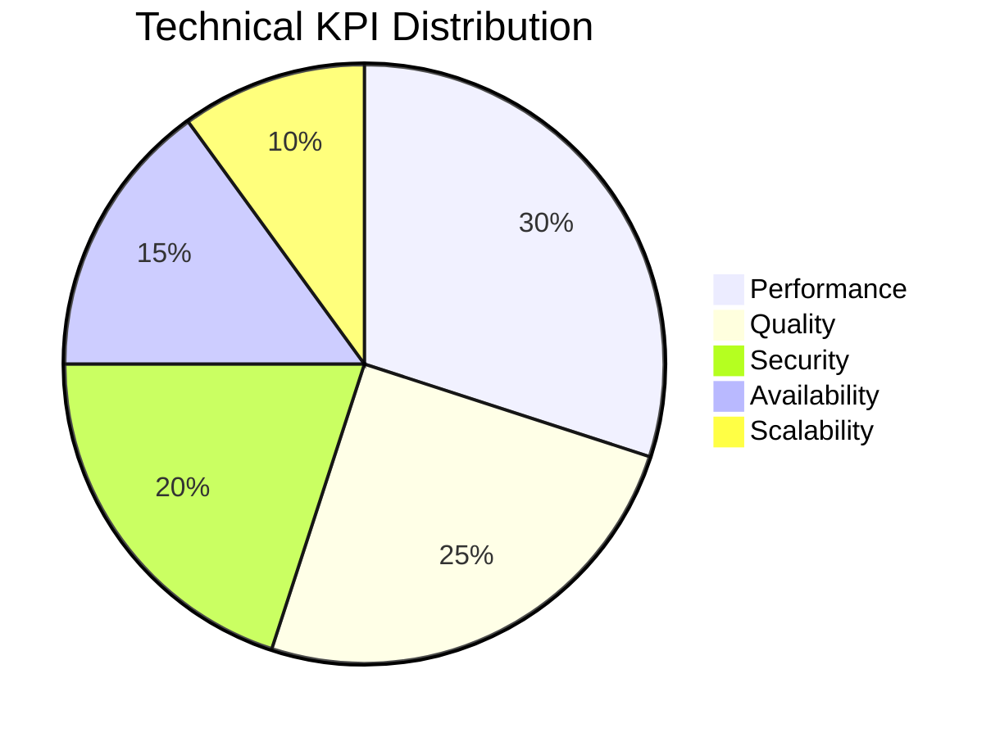
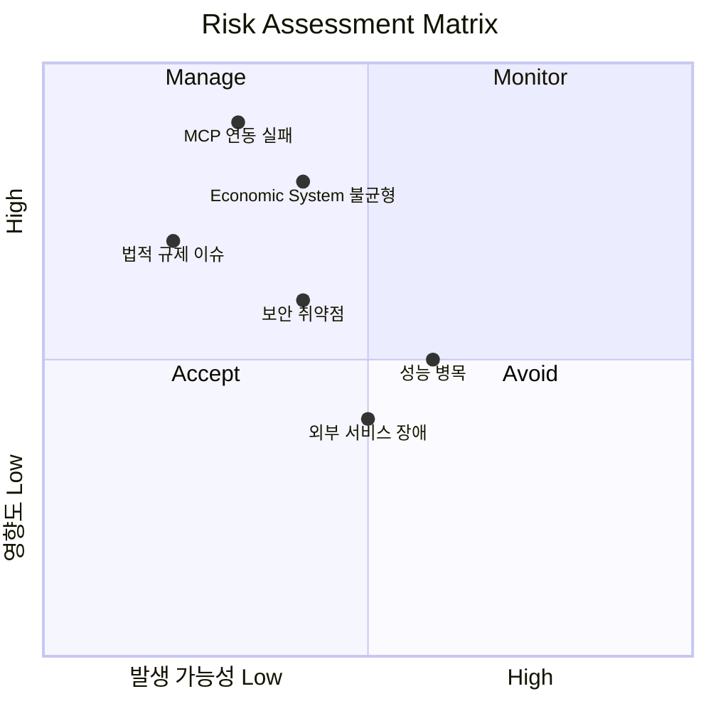
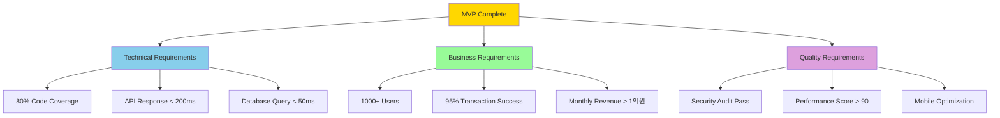

# Investment 도메인 구현 Task List (INV-001)

## 📋 Task Overview

**프로젝트**: Investment 도메인 구체적 구현  
**기간**: 8주 (2024-12-28 ~ 2025-02-28)  
**담당자**: 개발팀  
**우선순위**: High (Critical Path)

### 📊 Task 우선순위 매트릭스



### 🔄 Task Dependencies Graph



---

## 🗓️ Week 1-2: Foundation Phase

### 📅 Phase 1 타임라인



### Task 1.1: Database Schema & MCP Setup ⚡ Critical

**담당자**: Backend Developer | **기간**: 3일

```sql
✅ Action Items:
□ 1.1.1 merchants 테이블 생성 (상점 정보)
□ 1.1.2 advertisements 테이블 생성 (광고 정보)
□ 1.1.3 crowdfunding_projects 테이블 생성
□ 1.1.4 investment_transactions 테이블 생성
□ 1.1.5 reward_calculations 테이블 생성
□ 1.1.6 qr_codes 테이블 생성
□ 1.1.7 reviews 테이블 생성
□ 1.1.8 인덱스 및 제약조건 설정
□ 1.1.9 RLS 정책 적용
```

### Task 1.2: MCP Repository 구현 ⚡ Critical

**담당자**: Backend Developer | **기간**: 4일

```typescript
✅ Action Items:
□ 1.2.1 MCPMerchantRepository 완전 구현
  - save, findById, findByLocation, findByCategory
  - updateStatus, generateQRCode, findByOwner
□ 1.2.2 MCPAdvertisementRepository 완전 구현
□ 1.2.3 MCPCrowdFundingRepository 완전 구현
□ 1.2.4 MCPInvestmentRepository 완전 구현
□ 1.2.5 MCPRewardRepository 완전 구현
□ 1.2.6 에러 핸들링 & 트랜잭션 처리
□ 1.2.7 단위 테스트 작성 (80% 커버리지)
```

### Task 1.3: Economic System Integration ⚡ Critical

**담당자**: Backend Developer | **기간**: 3일

```typescript
✅ Action Items:
□ 1.3.1 InvestmentEconomicService 구현
  - calculatePMPReward(activity_type, amount)
  - calculatePMCReward(investment_type, success_rate)
□ 1.3.2 Economic Kernel 연동
□ 1.3.3 Domain Event 발행 로직 구현
□ 1.3.4 Agency Theory 적용 (PMP→PMC 전환)
□ 1.3.5 CAPM 위험-수익 계산 엔진
□ 1.3.6 성능 테스트 (1000 TPS)
```

---

## 🗓️ Week 3-4: Core Features Phase

### 📊 Phase 2 구현 현황



### Task 2.1: Local League Use Cases 🔥 High Priority

**담당자**: Backend Developer | **기간**: 5일

```typescript
✅ Local League 완전 구현:
□ 2.1.1 CreateMerchantUseCase 개선
  - 지오코딩 API 연동
  - 사업자 등록번호 검증
□ 2.1.2 ProcessPaymentUseCase 구현
  - QR 코드 검증 로직
  - 결제 처리 로직
  - PMP/PMC 보상 계산 (1% PMC 기본)
□ 2.1.3 CalculateRewardUseCase 구현
  - 기본 보상율: 1% PMC
  - 이벤트 보상율: 2% PMC
  - 구독자 보너스 계산
□ 2.1.4 GenerateQRCodeUseCase 구현
  - 동적 QR 코드 생성
  - 보안 해시 + 만료 시간
□ 2.1.5 ActivateEventUseCase 구현
□ 2.1.6 SubmitReviewUseCase 구현
□ 2.1.7 단위 테스트 작성 완료
```

### Task 2.2: Major League Use Cases 🔥 High Priority

**담당자**: Backend Developer | **기간**: 4일

```typescript
✅ Major League 완전 구현:
□ 2.2.1 CreateAdvertisementUseCase 구현
□ 2.2.2 ViewAdvertisementUseCase 구현
  - 시청 시간 추적 (1분당 10PMP)
  - 완전 시청 보너스 (1.5배)
□ 2.2.3 SubmitFeedbackUseCase 구현
  - 별점 평가 PMC 적립
  - 설문조사 참여 100PMC
□ 2.2.4 TrackViewingTimeUseCase 구현
  - 실시간 시청 시간 추적
  - 재시청 방지 로직
□ 2.2.5 CalculateAdRewardUseCase 구현
□ 2.2.6 부정 행위 방지 로직 구현
□ 2.2.7 단위 테스트 작성 완료
```

### Task 2.3: Cloud Funding Use Cases 🔥 High Priority

**담당자**: Backend Developer | **기간**: 5일

```typescript
✅ Cloud Funding 완전 구현:
□ 2.3.1 CreateProjectUseCase 구현
□ 2.3.2 InvestInProjectUseCase 구현
  - 최소 투자액 1000원 검증
  - 결제 처리 로직
□ 2.3.3 TrackProjectProgressUseCase 구현
□ 2.3.4 CalculateReturnsUseCase 구현
  - 투자 수익률: 1만원당 100PMC
□ 2.3.5 ProcessProjectCompletionUseCase 구현
□ 2.3.6 실시간 현황 업데이트 로직
□ 2.3.7 단위 테스트 작성 완료
```

### Task 2.4: Event Handlers 구현 🔥 High Priority

**담당자**: Backend Developer | **기간**: 3일

```typescript
✅ 모든 도메인 이벤트 처리:
□ 2.4.1 MerchantEventHandlers 구현
□ 2.4.2 AdvertisementEventHandlers 구현
□ 2.4.3 CrowdFundingEventHandlers 구현
□ 2.4.4 RewardEventHandlers 구현
□ 2.4.5 CrossDomainEventHandlers 구현
□ 2.4.6 이벤트 순서 보장 로직
□ 2.4.7 실패 시 재시도 로직
```

---

## 🗓️ Week 5-6: Integration Phase

### Task 3.1: External Services Integration 🟡 Medium Priority

**담당자**: Backend Developer | **기간**: 4일

```typescript
✅ 외부 서비스 완전 연동:
□ 3.1.1 PaymentService 구현 (카드, 계좌이체, 간편결제)
□ 3.1.2 QRCodeService 구현 (동적 생성, 암호화)
□ 3.1.3 RefundService 구현 (환불 처리)
□ 3.1.4 SecurityService 구현 (PCI DSS 준수)
□ 3.1.5 LocationService 구현 (지오코딩)
□ 3.1.6 MapService 구현 (지도 API)
□ 3.1.7 NotificationService 구현 (푸시, 이메일, SMS)
```

### Task 3.2: API Routes 구현 🟡 High Priority

**담당자**: Backend Developer | **기간**: 5일

```typescript
✅ REST API 완전 구현:
□ 3.2.1 Local League API
  - POST /api/investment/merchants
  - GET /api/investment/merchants
  - GET /api/investment/merchants/:id
  - POST /api/investment/merchants/:id/qr
  - POST /api/investment/payments
  - POST /api/investment/reviews
□ 3.2.2 Major League API
  - POST /api/investment/advertisements
  - GET /api/investment/advertisements
  - POST /api/investment/advertisements/:id/view
  - POST /api/investment/advertisements/:id/feedback
□ 3.2.3 Cloud Funding API
  - POST /api/investment/projects
  - GET /api/investment/projects
  - POST /api/investment/projects/:id/invest
  - GET /api/investment/projects/:id/progress
□ 3.2.4 Common API
  - GET /api/investment/rewards
  - GET /api/investment/transactions
  - GET /api/investment/statistics
□ 3.2.5 OpenAPI 3.0 명세 작성
□ 3.2.6 인증/권한 검증 구현
```

### Task 3.3: Real-time Updates 구현 🟡 Medium Priority

**담당자**: Backend Developer | **기간**: 3일

```typescript
✅ 실시간 업데이트 시스템:
□ 3.3.1 WebSocket 연결 관리
  - 실시간 펀딩 현황
  - 실시간 결제 완료 알림
  - 실시간 보상 지급 알림
□ 3.3.2 Server-Sent Events 구현
□ 3.3.3 Redis 캐싱 전략 구현
□ 3.3.4 성능 최적화 (1000명 동시 접속)
```

---

## 🗓️ Week 7-8: User Experience Phase

### Task 4.1: Frontend Components 구현 🟡 High Priority

**담당자**: Frontend Developer | **기간**: 4일

```tsx
✅ Local League UI:
□ 4.1.1 MerchantRegistrationForm
  - 상점 정보 입력 폼
  - 위치 선택 맵
  - 영업시간 설정
□ 4.1.2 MerchantList
  - 상점 목록 + 필터링
  - 지도뷰/리스트뷰 전환
  - 무한 스크롤
□ 4.1.3 MerchantDetail
  - 상점 정보 + QR 코드
  - 리뷰 목록
□ 4.1.4 PaymentModal
  - 결제 수단 선택
  - QR 코드 스캔
□ 4.1.5 RewardDisplay
  - 적립 포인트 표시
```

### Task 4.2: Major League UI 구현 🟡 High Priority

**담당자**: Frontend Developer | **기간**: 3일

```tsx
✅ Major League UI:
□ 4.2.1 AdvertisementPlayer
  - 비디오 플레이어
  - 시청 시간 추적
  - 일시정지 방지
□ 4.2.2 AdvertisementList
  - 광고 목록 + 필터링
  - 개인화 추천
□ 4.2.3 FeedbackForm
  - 별점 평가 + 댓글
  - 설문조사 참여
□ 4.2.4 ViewingProgress
  - 시청 진행률 표시
  - 보상 예상 금액
```

### Task 4.3: Cloud Funding UI 구현 🟡 High Priority

**담당자**: Frontend Developer | **기간**: 4일

```tsx
✅ Cloud Funding UI:
□ 4.3.1 ProjectCreationForm
  - 프로젝트 정보 입력
  - 이미지/비디오 업로드
□ 4.3.2 ProjectList
  - 프로젝트 목록 + 필터링
  - 진행률 표시
□ 4.3.3 ProjectDetail
  - 프로젝트 상세 정보
  - 실시간 펀딩 현황
□ 4.3.4 InvestmentModal
  - 투자 금액 입력
  - 결제 처리
□ 4.3.5 ProgressDashboard
  - 실시간 현황 대시보드
```

### Task 4.4: Mobile Optimization 🟡 Medium Priority

**담당자**: Frontend Developer | **기간**: 3일

```tsx
✅ 모바일 최적화:
□ 4.4.1 Responsive Design (모바일 퍼스트)
□ 4.4.2 PWA 기능 구현
□ 4.4.3 Performance 최적화
□ 4.4.4 Native 기능 연동 (카메라, GPS, 생체인증)
□ 4.4.5 모바일 성능 점수 90점 달성
```

---

## 🗓️ Week 7-8: Testing & QA Phase

### Task 5.1: Testing 구현 🟡 High Priority

**담당자**: Backend + Frontend Developer | **기간**: 3일

```typescript
✅ 완전한 테스트 커버리지:
□ 5.1.1 Unit Tests (80% 커버리지)
  - Domain Layer 테스트
  - Application Layer 테스트
  - Infrastructure Layer 테스트
  - Frontend Component 테스트
□ 5.1.2 Integration Tests
  - API 통합 테스트
  - Database 통합 테스트
  - 외부 서비스 테스트
□ 5.1.3 End-to-End Tests
  - 전체 사용자 플로우 테스트
  - 크로스 브라우저 테스트
□ 5.1.4 Performance Tests
  - 부하 테스트 (1000 TPS)
  - 메모리 누수 테스트
```

### Task 5.2: Monitoring & Analytics 🟡 Medium Priority

**담당자**: DevOps Engineer | **기간**: 2일

```typescript
✅ 모니터링 시스템:
□ 5.2.1 Application Monitoring (응답시간, 에러율)
□ 5.2.2 Database Monitoring (쿼리 성능)
□ 5.2.3 Business Monitoring (거래량, 보상 지급)
□ 5.2.4 실시간 대시보드 구축
□ 5.2.5 알림 시스템 구축
```

---

## 🎯 Success Metrics & Deliverables

### 📊 Technical KPIs



#### 🎯 달성 목표

```
✅ 달성 목표:
□ Code Coverage: 80% 이상
□ API Response Time: 200ms 이하
□ Database Query Performance: 50ms 이하
□ Error Rate: 0.1% 이하
□ Uptime: 99.9% 이상
```

### 💰 Business KPIs

```
✅ 비즈니스 성과:
□ User Registration: 월 1,000명 이상
□ Transaction Success Rate: 95% 이상
□ User Satisfaction: 4.5/5.0 이상
□ Revenue Generation: 월 1억원 이상
□ Merchant Onboarding: 주 100개 이상
```

### 🚀 Quality KPIs

```
✅ 품질 지표:
□ Security Audit: 100% 이슈 해결
□ Performance Audit: 90점 이상
□ Accessibility: WCAG 2.1 AA 준수
□ Mobile Optimization: PWA 점수 100점
```

---

## 🚨 Risk Management

### ⚠️ Critical Risks & Mitigation



#### 🔴 High Risk Issues

```
🔴 High Risk:
□ MCP 연동 실패 → 백업 데이터 접근 계층 준비
□ Economic System 불균형 → 점진적 배포 + 실시간 모니터링
□ 법적 규제 이슈 → 법무팀 사전 검토

🟡 Medium Risk:
□ 성능 병목 → 부하 테스트 + 스케일링 계획
□ 외부 서비스 장애 → Circuit Breaker 패턴
□ 보안 취약점 → 지속적 보안 감사
```

---

## 📝 Next Actions

### ⚡ This Week (즉시 실행)

```
□ Task 1.1 시작: Database Schema 설계
□ Task 1.2 준비: MCP 연동 환경 구축
□ 개발 환경 설정 완료
```

### 🎯 Next 2 Weeks (단기 목표)

```
□ Foundation Phase 완료 (Tasks 1.x)
□ Core Features 개발 시작 (Tasks 2.x)
□ 첫 번째 프로토타입 완성
```

### 🚀 Long-term (2개월 비전)

```
□ 완전한 Investment 도메인 구현
□ 타 도메인과의 완전 연동
□ 프로덕션 배포 준비 완료
```

---

**📅 다음 회의**: 2024-12-30 (월) 오전 10시  
**📋 안건**: Phase 1 착수 + 역할 분담  
**📝 준비사항**: 개발 환경 설정 완료

---

## 🎉 MVP 완성 체크리스트

### 📋 완성 기준 시각화



### ✅ 최종 검증 체크리스트

```
🔥 Critical Path (모든 항목 필수):
□ Database Schema 완료 및 테스트
□ MCP Repository 구현 및 테스트
□ Economic System 완전 연동
□ 3개 핵심 Use Case 구현 (Local/Major/Cloud)
□ API Routes 완료 및 테스트
□ 핵심 UI Components 구현
□ 보안 정책 및 RLS 적용
□ 성능 최적화 완료

⚡ High Priority (80% 이상 완료):
□ External Services 연동
□ Real-time Updates 구현
□ 완전한 테스트 커버리지
□ 모니터링 시스템 구축
□ 오류 처리 및 복구 로직
□ 모바일 최적화
□ 사용자 피드백 시스템
□ 성능 모니터링 대시보드

🎯 Success Metrics (모든 지표 달성):
□ 기술적 성능 지표 달성
□ 비즈니스 성과 지표 달성
□ 품질 지표 달성
□ 위험 요소 모두 해결
```

---

> **💡 Note**: 이 Task List는 실제 개발 가이드로 사용하며, 각 Task 완료 시 체크박스를 체크하여 진행률을 추적하세요.
