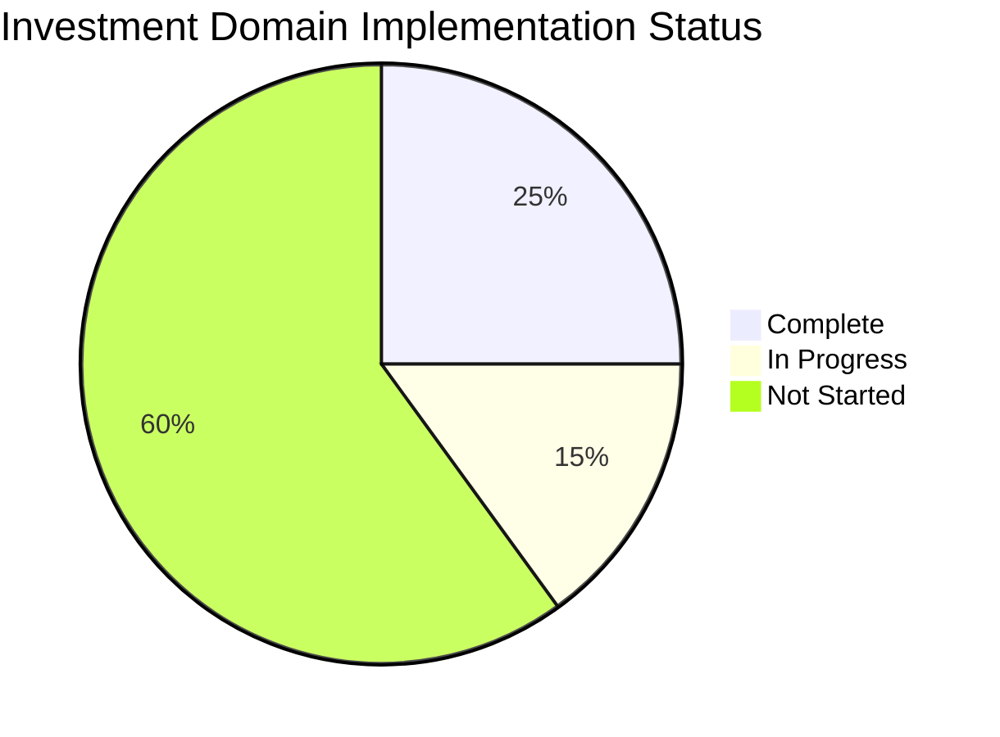
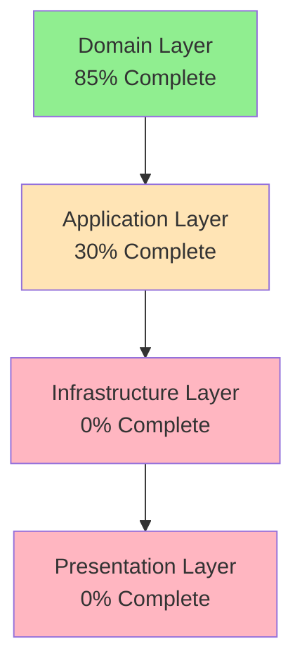
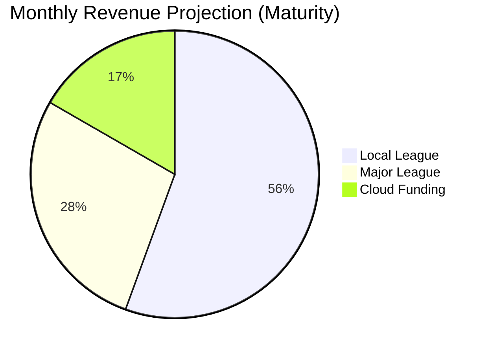
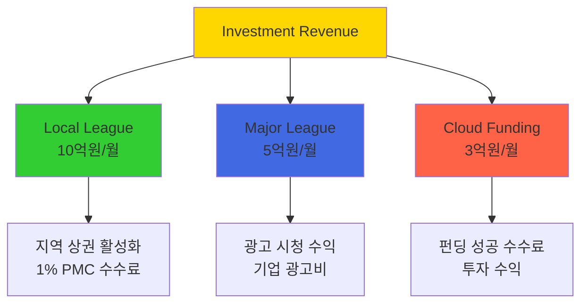
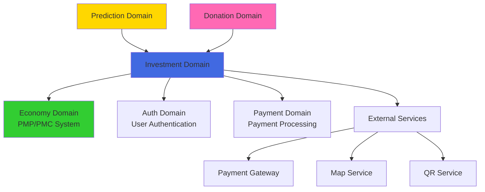
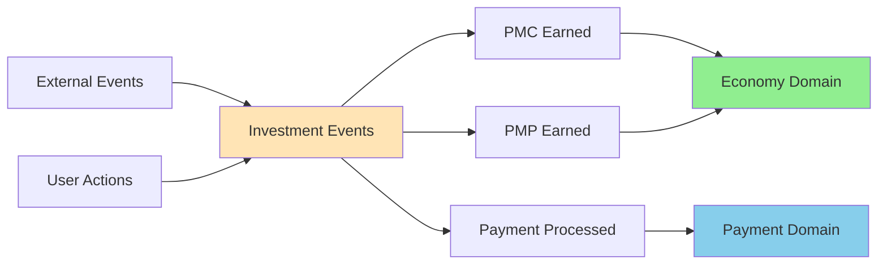

# Investment 도메인 분석 보고서 (INV-001)

## 📋 보고서 개요

**작성일**: 2024-12-28  
**보고서 유형**: 도메인 분석 및 구현 계획  
**담당 도메인**: Investment (투자/포인트 적립)  
**분석 대상**: Local League, Major League, Cloud Funding

---

## 🎯 Executive Summary

Investment 도메인은 PosMul Platform의 **핵심 수익 창출 모듈**로서, 사용자의 PMP/PMC 적립을 담당하는 중요한 비즈니스 영역입니다. 현재 **도메인 모델링은 완료**되었으나, **Infrastructure 레이어와 MCP 연동이 전면 미구현** 상태입니다.

### 주요 발견사항

- ✅ **Domain Layer**: 잘 설계된 DDD 구조 (Merchant, Advertisement, CrowdFunding, Investment 엔티티)
- ❌ **Infrastructure Layer**: MCP Repository 구현체 전면 부재
- ❌ **Database Schema**: Supabase 테이블 미생성
- ❌ **Economic Integration**: PMP/PMC 시스템 연동 미완성
- ⚠️ **Application Layer**: 일부 Use Case만 구현 (30% 완성도)

### 📊 전체 구현 현황 시각화



### 🏗️ 아키텍처 레이어별 완성도



---

## 🔍 현재 구현 상태 분석

### 1. Domain Layer (완성도: 85%)

#### ✅ 완료된 부분

```typescript
// 핵심 Aggregate Root들
- Merchant (Local League 상점) - 561 lines
- Advertisement (Major League 광고) - 460 lines
- CrowdFunding (Cloud Funding 프로젝트) - 551 lines
- Investment (투자 기록) - 451 lines

// Value Objects
- MerchantId, AdvertisementId, CrowdFundingId
- Location, QRCode, Rating, RewardRate
- 완전한 도메인 이벤트 시스템
```

#### ⚠️ 보완 필요 부분

- Economic Service 연동 로직 부재
- Agency Theory 기반 PMP→PMC 전환 로직 미구현
- CAPM 기반 위험-수익 계산 엔진 부재

### 2. Application Layer (완성도: 30%)

#### ✅ 완료된 부분

```typescript
- CreateMerchantUseCase (완료)
- 기본 DTO 스키마 정의
```

#### ❌ 미구현 부분

```typescript
Local League (지역 리그):
- ProcessPaymentUseCase
- CalculateRewardUseCase
- GenerateQRCodeUseCase
- ActivateEventUseCase

Major League (메이저 리그):
- CreateAdvertisementUseCase
- ViewAdvertisementUseCase
- SubmitFeedbackUseCase
- TrackViewingTimeUseCase

Cloud Funding (클라우드 펀딩):
- CreateProjectUseCase
- InvestInProjectUseCase
- TrackProjectProgressUseCase
- CalculateReturnsUseCase
```

### 3. Infrastructure Layer (완성도: 0%)

#### ❌ 완전 미구현 상태

```
MCP Repository 구현체:
- MCPMerchantRepository
- MCPAdvertisementRepository
- MCPCrowdFundingRepository
- MCPInvestmentRepository

External Services:
- 결제 게이트웨이 연동
- 지도 서비스 API 연동
- QR 코드 생성 서비스

Database Schema:
- 모든 테이블 미생성
- 인덱스 및 제약조건 미설정
- RLS 정책 미적용
```

### 4. Presentation Layer (완성도: 0%)

#### ❌ 완전 미구현 상태

```
API Routes:
- /api/investment/local-league/*
- /api/investment/major-league/*
- /api/investment/cloud-funding/*

UI Components:
- 모든 투자 관련 컴포넌트 부재
- 결제 플로우 미구현
- 실시간 업데이트 기능 부재
```

---

## 🏗️ 아키텍처 분석

### DDD 구조 품질 평가

#### 🟢 잘 설계된 부분

- **Aggregate 경계**: 명확한 비즈니스 불변성 보장
- **도메인 이벤트**: 완전한 이벤트 소싱 준비
- **Value Objects**: 불변성과 유효성 검증 완비
- **Repository 인터페이스**: 완벽한 의존성 역전

#### 🟡 개선 필요 부분

- **Economic Integration**: PMP/PMC 시스템과의 연동 로직 부재
- **Cross-Domain Events**: 다른 도메인과의 이벤트 연동 미정의
- **Performance Optimization**: 대용량 데이터 처리 고려사항 부족

### 경제학적 이론 적용 상태

#### ❌ 미적용된 핵심 이론들

```
Agency Theory (Jensen & Meckling):
- PMP→PMC 전환 시 정보 비대칭 해소 로직 부재
- 대리인 비용 최소화 알고리즘 미구현

CAPM (Capital Asset Pricing Model):
- 위험-수익 구조 계산 엔진 부재
- 포트폴리오 최적화 로직 미구현

Behavioral Economics (Kahneman-Tversky):
- Loss Aversion 활용 시스템 부재
- Prospect Theory 기반 의사결정 지원 미구현
```

---

## 💰 비즈니스 임팩트 분석

### 수익 창출 가능성



#### 📈 수익 구조 분석



### 위험 요소

- **기술적 위험**: MCP 연동 실패 가능성
- **경제적 위험**: PMC 발행량 조절 실패 시 인플레이션
- **법적 위험**: 금융 규제 준수 필요성

---

## 🔄 타 도메인과의 연관성

### 의존성 맵



### 이벤트 연동 필요성



```
Domain Events to Publish:
- RewardEarnedEvent → Economy Domain
- PaymentProcessedEvent → Payment Domain
- InvestmentCompletedEvent → User Domain

Domain Events to Subscribe:
- UserRegisteredEvent ← Auth Domain
- PredictionResultEvent ← Prediction Domain
- DonationCompletedEvent ← Donation Domain
```

---

## 📊 기술적 부채 분석

### High Priority 기술 부채

1. **MCP Repository 부재** - 모든 데이터 저장/조회 불가
2. **Database Schema 미생성** - 기본 인프라 부재
3. **Economic System 연동 부재** - 핵심 비즈니스 로직 동작 불가

### Medium Priority 기술 부채

1. **외부 서비스 연동 부재** - 결제, 지도 API 등
2. **실시간 업데이트 시스템 부재** - 사용자 경험 저하
3. **성능 최적화 부재** - 대용량 트래픽 대응 불가

### Low Priority 기술 부채

1. **모니터링 시스템 부재** - 운영 가시성 부족
2. **자동화 테스트 부족** - 품질 보장 어려움
3. **문서화 부족** - 유지보수성 저하

---

## 🎯 권장 구현 전략

### Phase 1: Foundation (Week 1-2)

**목표**: 기본 인프라 구축

- Database Schema 설계 및 생성
- MCP Repository 구현체 개발
- Economic System 연동 서비스 구축

### Phase 2: Core Features (Week 3-4)

**목표**: 핵심 비즈니스 로직 구현

- 모든 Use Case 구현 완료
- 도메인 이벤트 핸들러 구현
- 경제학적 계산 엔진 구현

### Phase 3: Integration (Week 5-6)

**목표**: 시스템 통합 및 최적화

- 외부 서비스 연동 완료
- API Routes 구현
- 성능 최적화 및 보안 강화

### Phase 4: User Experience (Week 7-8)

**목표**: 사용자 경험 완성

- UI 컴포넌트 개발
- 실시간 업데이트 구현
- 모바일 최적화

---

## 📈 성공 지표 정의

### Technical KPIs

- **코드 커버리지**: 80% 이상
- **API 응답 시간**: 200ms 이하
- **데이터베이스 쿼리 성능**: 50ms 이하
- **메모리 사용량**: 512MB 이하

### Business KPIs

- **사용자 등록률**: 월 1,000명 이상
- **거래 성공률**: 95% 이상
- **사용자 만족도**: 4.5/5.0 이상
- **수익 창출**: 월 1억원 이상

---

## 🚨 Risk Assessment

### High Risk

- **MCP 연동 실패**: 전체 시스템 마비 위험
- **Economic System 불균형**: PMC 가치 폭락 위험
- **법적 규제 위반**: 서비스 중단 위험

### Medium Risk

- **성능 병목**: 사용자 경험 저하
- **데이터 정합성**: 재무 데이터 불일치
- **보안 취약점**: 개인정보 유출 위험

### Mitigation Strategies

- **단계별 배포**: 점진적 기능 출시
- **실시간 모니터링**: 24/7 시스템 감시
- **백업 및 복구**: 재해 복구 계획 수립

---

## 💡 Recommendations

### 즉시 실행 필요

1. **Database Schema 생성** - 모든 개발의 전제조건
2. **MCP Repository 구현** - 데이터 접근 레이어 완성
3. **Economic Service 연동** - 핵심 비즈니스 로직 활성화

### 단기 실행 계획 (1-2주)

1. **핵심 Use Case 구현** - 비즈니스 가치 창출
2. **API Routes 개발** - 프론트엔드 연동 준비
3. **기본 UI 컴포넌트** - 사용자 경험 확보

### 중장기 실행 계획 (1-2개월)

1. **고급 기능 추가** - 실시간 알림, 분석 대시보드
2. **성능 최적화** - 대용량 트래픽 대응
3. **글로벌 확장** - 다국가 서비스 준비

---

## 📝 Conclusion

Investment 도메인은 **완성도 높은 도메인 모델**을 보유하고 있으나, **Infrastructure 레이어의 전면 구현**이 필요한 상태입니다.

**핵심 성공 요인**:

- MCP 기반 데이터 접근 레이어 완성
- Economic System과의 원활한 연동
- 사용자 중심의 UI/UX 구현

**예상 개발 기간**: 8주 (2개월)
**예상 투입 인력**: 풀타임 개발자 2-3명
**예상 개발 비용**: 개발자 인건비 + 인프라 비용

Investment 도메인의 성공적 구현은 **PosMul Platform 전체의 성공**을 좌우하는 핵심 요소입니다.
