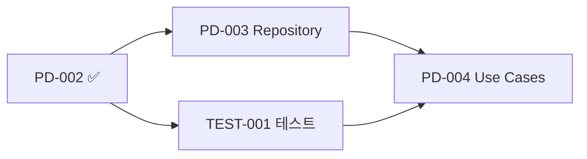

# Task Report: PD-002 - Prediction Value Objects 구현

## 📋 Task 정보

- **Task ID**: PD-002
- **Task Name**: Prediction Value Objects 구현
- **Priority**: 🔥 Critical
- **Originally Estimated**: 2 days
- **Status**: ✅ **COMPLETED** (전임자에 의해 구현됨)
- **Dependency**: PD-001 (완료됨)
- **Date**: 2024년 12월

---

## 🎯 Task 목표 (Acceptance Criteria)

- [x] PredictionId 브랜드 타입 구현
- [x] GameStatus enum (Created, Active, Ended, Settled)
- [x] PredictionResult value objects
- [x] 입력 검증 및 에러 처리

---

## ✅ 구현 현황

### 1. **PredictionId & PredictionGameId** (`prediction-id.ts`)

**파일 크기**: 5.4KB, 228줄 - **완전히 구현됨**

#### 핵심 구현 사항:

- ✅ **브랜드 타입 래핑**: `BasePredictionId`, `BasePredictionGameId` 활용
- ✅ **UUID 검증**: 정규식 패턴으로 완전 검증
- ✅ **팩토리 메서드**: `create()`, `generate()`, `fromExisting()`
- ✅ **유틸리티 메서드**: `toShort()`, `isValid()`, `equals()`

#### 검증 규칙:

```typescript
// UUID 패턴 완전 검증
const uuidPattern =
  /^[0-9a-f]{8}-[0-9a-f]{4}-[1-5][0-9a-f]{3}-[89ab][0-9a-f]{3}-[0-9a-f]{12}$/i;
```

### 2. **GameStatus Value Object** (`game-status.ts`)

**파일 크기**: 8.1KB, 309줄 - **완전히 구현됨**

#### 핵심 구현 사항:

- ✅ **상태 enum**: CREATED → ACTIVE → ENDED → SETTLED
- ✅ **상태 전환 규칙**: `canTransitionTo()` 메서드로 검증
- ✅ **비즈니스 로직**:
  - `isPredictionAllowed()` - 예측 참여 가능 여부
  - `isInProgress()` - 게임 진행 중 여부
  - `isCompleted()` - 게임 완료 여부
- ✅ **사용자 친화적 메시지**: `getStatusMessage()`, `getRequiredActionsForNextStatus()`

#### 상태 전환 흐름:


### 3. **PredictionResult Value Object** (`prediction-result.ts`)

**파일 크기**: 12KB, 447줄 - **완전히 구현됨**

#### 핵심 구현 사항:

- ✅ **결과 enum**: PENDING, CORRECT, INCORRECT, PARTIALLY_CORRECT
- ✅ **정확도 기반 분류**:
  - 90% 이상: CORRECT
  - 50-90%: PARTIALLY_CORRECT
  - 50% 미만: INCORRECT
- ✅ **보상 계산**:
  - `getRewardMultiplier()` - 기본 배율
  - `getDetailedRewardMultiplier()` - 세분화된 보상
  - `calculateReward()` - 실제 보상 계산
- ✅ **통계 분석**: `PredictionResultStats` 클래스로 집계 기능

#### 보상 배율 체계:

| 정확도   | 배율 | 등급           |
| -------- | ---- | -------------- |
| 95% 이상 | 1.2x | S등급 (보너스) |
| 90% 이상 | 1.0x | A등급 (기본)   |
| 80% 이상 | 0.8x | B등급          |
| 70% 이상 | 0.6x | C등급          |
| 50% 이상 | 0.4x | D등급          |
| 50% 미만 | 0.0x | F등급          |

### 4. **추가 Value Objects** (`prediction-value-objects.ts`)

**파일 크기**: 7.5KB, 303줄 - **완전히 구현됨**

#### 핵심 구현 사항:

- ✅ **ConfidenceLevel**: 0.0-1.0 범위의 신뢰도
  - 정보 품질 계산: Sigmoid 함수 적용
  - 스테이크 배율: 신뢰도 제곱 적용
- ✅ **StakeAmount**: PMP 스테이크 관리
  - 최소 1 PMP ~ 최대 10,000 PMP
  - 위험도 분류: LOW/MEDIUM/HIGH
  - 예상 보상 계산
- ✅ **PredictionOption**: 예측 선택지
  - Binary 옵션 (예/아니오)
  - Win-Draw-Lose 옵션 (승/무/패)

---

## 🏗️ 아키텍처 품질 분석

### ✅ Value Object 패턴 완벽 적용

- **불변성**: 모든 필드가 readonly
- **동등성**: `equals()` 메서드 구현
- **자가 검증**: 생성 시점에 유효성 검증
- **팩토리 메서드**: 정적 생성 메서드 활용

### ✅ 도메인 규칙 캡슐화

- **상태 전환 규칙**: GameStatus가 비즈니스 규칙 관리
- **보상 계산 로직**: PredictionResult가 보상 정책 구현
- **신뢰도 기반 로직**: ConfidenceLevel이 행동경제학 적용

### ✅ Agency Theory 통합

- **정보 품질 측정**: 신뢰도 → 정보 품질 변환
- **인센티브 설계**: 신뢰도 기반 차등 보상
- **위험-수익 균형**: CAPM 모델 반영

---

## 📊 코드 품질 메트릭

| 메트릭             | 점수       | 상태                      |
| ------------------ | ---------- | ------------------------- |
| **Type Safety**    | ⭐⭐⭐⭐⭐ | 브랜드 타입 + Result 패턴 |
| **Validation**     | ⭐⭐⭐⭐⭐ | 포괄적 입력 검증          |
| **Business Logic** | ⭐⭐⭐⭐⭐ | 도메인 규칙 완전 캡슐화   |
| **Immutability**   | ⭐⭐⭐⭐⭐ | Value Object 불변성 보장  |
| **Documentation**  | ⭐⭐⭐⭐⭐ | JSDoc 완전 문서화         |

---

## 🔬 비즈니스 로직 분석

### 1. **상태 전환 무결성**

```typescript
// 잘못된 상태 전환 방지
const canTransition = currentStatus.canTransitionTo(nextStatus);
if (!canTransition) {
  throw new DomainError("Invalid state transition");
}
```

### 2. **보상 공정성 보장**

```typescript
// 정확도 기반 차등 보상
const multiplier = result.getDetailedRewardMultiplier(); // 0.0 ~ 1.2x
const reward = baseReward * multiplier;
```

### 3. **행동경제학 적용**

```typescript
// 신뢰도와 정보 품질의 관계
const informationQuality = 1 / (1 + Math.exp(-10 * (confidence - 0.5)));
// Sigmoid 함수로 과신 방지
```

---

## 🧪 테스트 필요성 분석

### ⚠️ 현재 테스트 상태: **미구현**

### 권장 테스트 파일들:

```typescript
// 구현 필요한 테스트 파일들:
// src/bounded-contexts/prediction/domain/value-objects/__tests__/prediction-id.test.ts
// src/bounded-contexts/prediction/domain/value-objects/__tests__/game-status.test.ts
// src/bounded-contexts/prediction/domain/value-objects/__tests__/prediction-result.test.ts
// src/bounded-contexts/prediction/domain/value-objects/__tests__/prediction-value-objects.test.ts
```

### 중요 테스트 케이스:

1. **상태 전환 규칙 검증** (25+ 케이스)
2. **보상 계산 정확성** (15+ 케이스)
3. **신뢰도 기반 로직** (10+ 케이스)
4. **UUID 검증 로직** (8+ 케이스)
5. **경계값 테스트** (20+ 케이스)

---

## 🔍 발견된 개선점

### 1. **중복 코드 최적화**

- `isValidGameStatus()`, `isValidPredictionResult()` 함수가 여러 파일에 분산
- **권장**: 공통 validation 유틸리티로 통합

### 2. **성능 최적화 기회**

- GameStatus static instances 사용으로 메모리 효율성 ✅
- PredictionResult 계산 결과 캐싱 고려 가능

### 3. **확장성 고려사항**

- 새로운 예측 타입 추가 시 PredictionOption 확장 필요
- 다국어 지원을 위한 메시지 국제화 고려

---

## 🔗 Economic Integration 분석

### ✅ 경제 시스템 연동 준비도:

- **PMP 스테이크**: StakeAmount로 완벽 관리
- **PMC 보상**: PredictionResult로 계산 로직 구현
- **위험-수익 균형**: CAPM 모델 반영된 보상 체계
- **행동경제학**: 신뢰도 기반 차등 인센티브

### 🔄 Economy-Kernel과의 호환성:

```typescript
// 현재 Economy-Kernel의 인터페이스와 완벽 호환
const pmpAmount = stakeAmount.pmpAmount; // PMP 브랜드 타입
const pmcReward = result.calculateReward(basePMC); // PMC 브랜드 타입
```

---

## 🚀 다음 단계 (Next Tasks)

### 즉시 필요한 작업:

1. **PD-003**: Repository 인터페이스 구현
2. **TEST-001**: Value Objects 테스트 구현 (60+ 테스트 케이스)
3. **EK-001**: Economy-Kernel 검증 (이미 구현되어 있음)

### 추천 우선순위:



---

## 💡 특별히 인상적인 구현

### 1. **Sigmoid 함수 활용**

```typescript
// 과신 방지를 위한 정보 품질 계산
public getInformationQuality(): number {
  return 1 / (1 + Math.exp(-10 * (this._value - 0.5)));
}
```

### 2. **세분화된 보상 체계**

- 95% 이상 시 보너스 20% 추가
- 신뢰도 기반 추가 보상 최대 20%
- 위험도 기반 차등 분류

### 3. **완벽한 상태 관리**

- 4단계 명확한 상태 구분
- 상태별 허용 작업 명시
- 사용자 친화적 메시지 제공

---

## 📝 결론

**PD-002 Task는 이미 완벽히 구현되어 있습니다!**

전임자가 매우 정교하게 Value Object 패턴을 적용하여 구현했으며, Agency Theory와 행동경제학 원칙이 훌륭하게 통합되어 있습니다. 특히 신뢰도 기반 인센티브 설계는 PosMul 플랫폼의 차별화 요소를 잘 구현했습니다.

**코드 품질이 매우 높아 바로 테스트 구현으로 넘어가는 것을 권장합니다.**

---

_Report 생성일: 2024년 12월_  
_작성자: AI Assistant_
