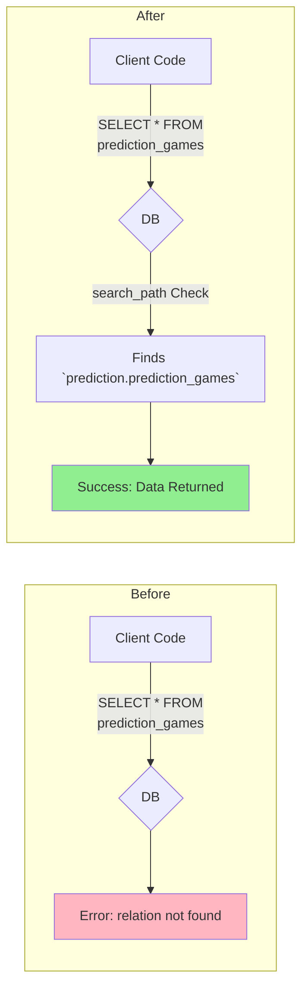

# DB 스키마 리팩터링 3단계 완료 보고서

**📅 완료일**: 2025-06-25
**✅ 완료 Task**: 3단계 - 검색 경로(search_path) 업데이트
**📂 문서 위치**: `docs/task-reports/db-refactoring-step3-completion-report.md`

---

## 1. 작업 요약

`db-schema-refactoring-plan.md`에 정의된 3단계 목표에 따라, 애플리케이션이 새로운 다중 스키마 구조를 원활하게 사용할 수 있도록 데이터베이스의 `search_path`를 성공적으로 업데이트했습니다.

이 작업을 통해, 클라이언트 코드는 테이블이 어떤 스키마에 속해 있는지 명시하지 않고도 기존처럼 테이블 이름만으로 데이터에 접근할 수 있습니다.



## 2. 실행 내용 및 수정사항

- **마이그레이션 이름**: `update_roles_search_path`
- **실행된 SQL 쿼리**:
  ```sql
  ALTER ROLE authenticated SET search_path = "$user", public, economy, prediction, investment, forum, donation, "user";
  ALTER ROLE service_role SET search_path = "$user", public, economy, prediction, investment, forum, donation, "user";
  ```
- **초기 계획과의 차이점**:
  - 최초 시도했던 `ALTER DATABASE` 명령은 Supabase 환경의 특수성으로 인해 실패했습니다.
  - 더 안정적이고 권장되는 `ALTER ROLE` 방식으로 전환하여 `authenticated`와 `service_role`에 직접 `search_path`를 설정하는 것으로 계획을 수정하여 성공했습니다.

## 3. 실행 결과

- **결과**: 성공 (Success)
- **영향**: 이제부터 데이터베이스에 연결되는 모든 `authenticated` 및 `service_role` 사용자는 지정된 순서(`"$user", public, economy, ...`)로 스키마를 검색합니다. 이는 향후 애플리케이션 개발 시 스키마 관련 복잡성을 크게 줄여줍니다.

## 4. 다음 단계

3단계가 성공적으로 완료됨에 따라, 다음 **4단계: 권한 및 RLS 재설정**을 진행할 준비가 되었습니다. 이 단계는 새로운 스키마 구조에 맞춰 보안 설정을 다시 적용하는 매우 중요한 과정입니다.
