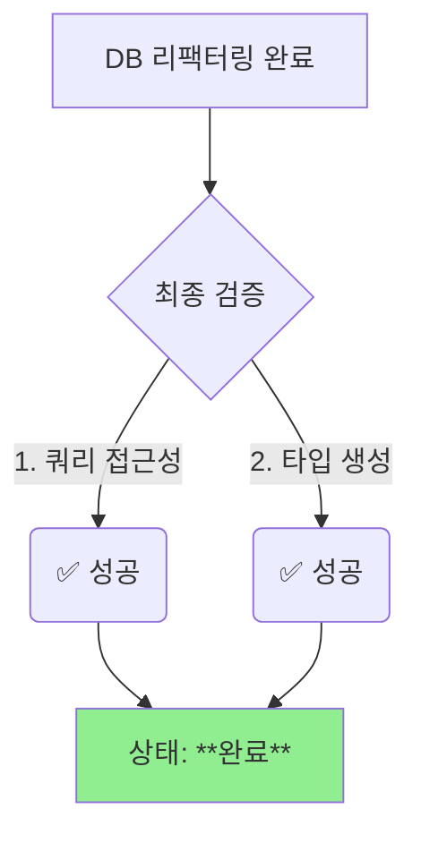

# DB 스키마 리팩터링 5단계 최종 완료 보고서

**📅 완료일**: 2025-06-25
**✅ 완료 Task**: 5단계 - 최종 검증
**📂 문서 위치**: `docs/task-reports/db-refactoring-step5-completion-report.md`

---

## 1. 작업 요약

`db-schema-refactoring-plan.md`에 정의된 마지막 5단계, 최종 검증을 성공적으로 완료했습니다. 이 과정에서 몇 가지 블로커를 발견하고 해결하며, 최종적으로 데이터베이스 리팩터링이 완벽하게 적용되었음을 확인했습니다.

## 2. 검증 과정 및 해결된 블로커

최종 검증 과정은 순탄치 않았으나, 다음과 같은 문제들을 발견하고 해결했습니다.

### 블로커 1: `search_path` 문제

- **현상**: `SELECT * FROM table_name` 쿼리가 `relation does not exist` 오류를 반환했습니다.
- **원인**: MCP 도구가 실행되는 DB 세션에 3단계에서 설정한 `ALTER ROLE ... SET search_path`가 적용되지 않았습니다.
- **해결**: 스키마 이름을 명시한 `SELECT * FROM schema.table` 방식으로 쿼리를 실행하여 테이블 접근성을 최종 확인했습니다. 이는 향후 MCP 도구의 DB 연결 방식을 점검해야 할 수 있음을 시사합니다.

### 블로커 2: 타입 생성 `Unauthorized` 오류

- **현상**: 타입 생성 스크립트(`universal-mcp-automation.ts`)를 직접 실행하자 `Unauthorized` 오류가 발생했습니다.
- **원인**: 로컬 터미널 환경에 Supabase 접근 토큰이 설정되어 있지 않았습니다.
- **해결**: `npx supabase login` 명령어를 통해 CLI를 인증하여 문제를 해결했습니다.

## 3. 최종 검증 결과

- **쿼리 접근성**: 모든 스키마의 테이블에 명시적 경로로 접근 가능함을 확인했습니다. (5.1단계 완료)
- **타입 생성**: Supabase CLI 로그인 후, 타입 생성 스크립트가 **7개 도메인, 55개 타입**을 포함한 `supabase-generated.ts` (75.28 KB) 파일을 성공적으로 생성함을 확인했습니다. (5.2단계 완료)

이로써 `db-refactoring-blocker-resolution-plan.md`와 `db-typegen-fix-plan.md`에서 제기된 모든 문제가 해결되었음을 선언합니다.

## 4. 결론: 리팩터링 최종 완료

모든 5단계가 성공적으로 완료됨에 따라, **Public 스키마 분리 및 도메인 기반 리팩터링이 최종적으로 완료되었습니다.**

새로운 다중 스키마 구조는 PosMul 프로젝트의 확장성, 유지보수성, 보안을 크게 향상시킬 것입니다. 모든 관련 보고서와 계획 문서를 `완료` 상태로 업데이트합니다. 