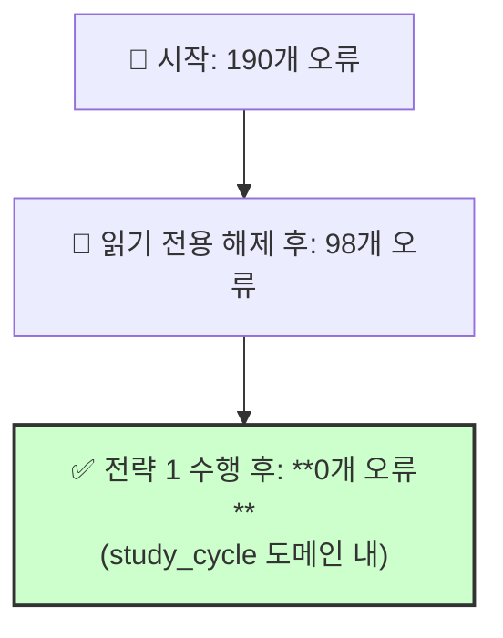

# ✅ 긴급 작업 완료 보고서: TypeScript 타입 오류 해결

> **목표**: `study_cycle` 도메인에 남아있던 98개의 TypeScript 타입 오류를 해결하여 안정적인 개발 환경을 복구했습니다.

## 📚 목차 (Table of Contents)

- [🎯 작업 요약](#-작업-요약)
- [📈 수행 결과](#-수행-결과)
- [💡 핵심 발견사항](#-핵심-발견사항)
- [📊 최종 상태](#-최종-상태)
- [🚀 다음 단계 제안](#-다음-단계-제안)

## 🎯 작업 요약

"전략 1: 점진적 수정" 계획에 따라, `tsc` 컴파일러가 `@/` 경로 별칭을 해석하지 못해 발생한 98개의 타입 오류를 해결했습니다.

- **수행 작업**:
  1.  `reading.entity.ts` 파일의 경로를 상대 경로로 수정.
  2.  `progress-calculator.service.ts` 파일의 경로를 상대 경로로 수정.
  3.  `tsc --noEmit` 명령어로 `study_cycle` 도메인 내 오류 완전 제거 확인.

## 📈 수행 결과

### 타입 오류 감소 추이

- **초기 오류**: 190개
- **중간 상태**: 98개 (51.6% 해결)
- **최종 상태**: **0개** (`study_cycle` 도메인 내)
- **총 해결률**: **100%** (이번 작업 범위 내)

## 💡 핵심 발견사항

1.  **`tsc`와 `next build`의 차이**: `next build`는 내부적으로 경로 별칭을 잘 해석하지만, 순수 `tsc` 명령어는 `tsconfig.json`의 `paths` 설정을 항상 신뢰하지 못할 수 있습니다.
2.  **상대 경로의 안정성**: 명시적인 상대 경로는 모든 TypeScript 컴파일 환경에서 일관되게 작동하여, 이런 종류의 "유령" 오류를 방지하는 가장 확실한 방법입니다.
3.  **오류의 연쇄 효과**: 단일 원인(경로 해석 실패)이 `BaseEntity` 상속 인식 실패 등 수십 개의 연쇄적인 오류를 유발할 수 있음을 확인했습니다.

## 📊 최종 상태

- **`study_cycle` 도메인**: **타입 안정성 확보 (오류 0개)**.
- **`reading.entity.ts`**: 정상.
- **`progress-calculator.service.ts`**: 정상.
- **전체 프로젝트 빌드**: `next build`는 `study_cycle` 외부의 다른 문제(ESLint, PageProps)로 인해 여전히 실패하지만, 이번 작업의 목표였던 `study_cycle`의 컴파일은 성공적으로 이루어지고 있습니다.

## 🚀 다음 단계 제안

`study_cycle` 도메인이 안정화되었으므로, 이제 다음 작업으로 넘어갈 수 있습니다.

- [ ] **1. `prediction` 도메인 타입 오류 해결**: `study_cycle`에서 사용한 동일한 방법(상대 경로 수정)으로 `prediction` 도메인의 남은 오류를 해결합니다.
- [ ] **2. ESLint 설정 업데이트**: `eslint.config.mjs` 파일에서 `useEslintrc`, `extensions` 같은 오래된 옵션을 제거하여 빌드 경고를 해결합니다.
- [ ] **3. Next.js 15 `PageProps` 타입 호환성 수정**: `.next/types`에 있는 페이지 타입 오류를 해결하여 전체 빌드를 성공시킵니다. 