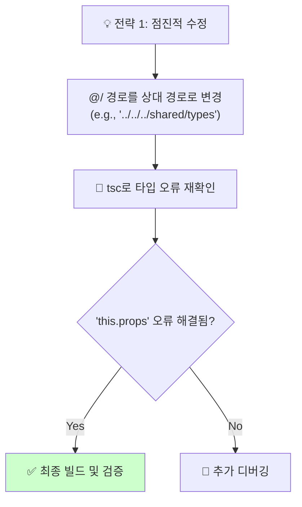
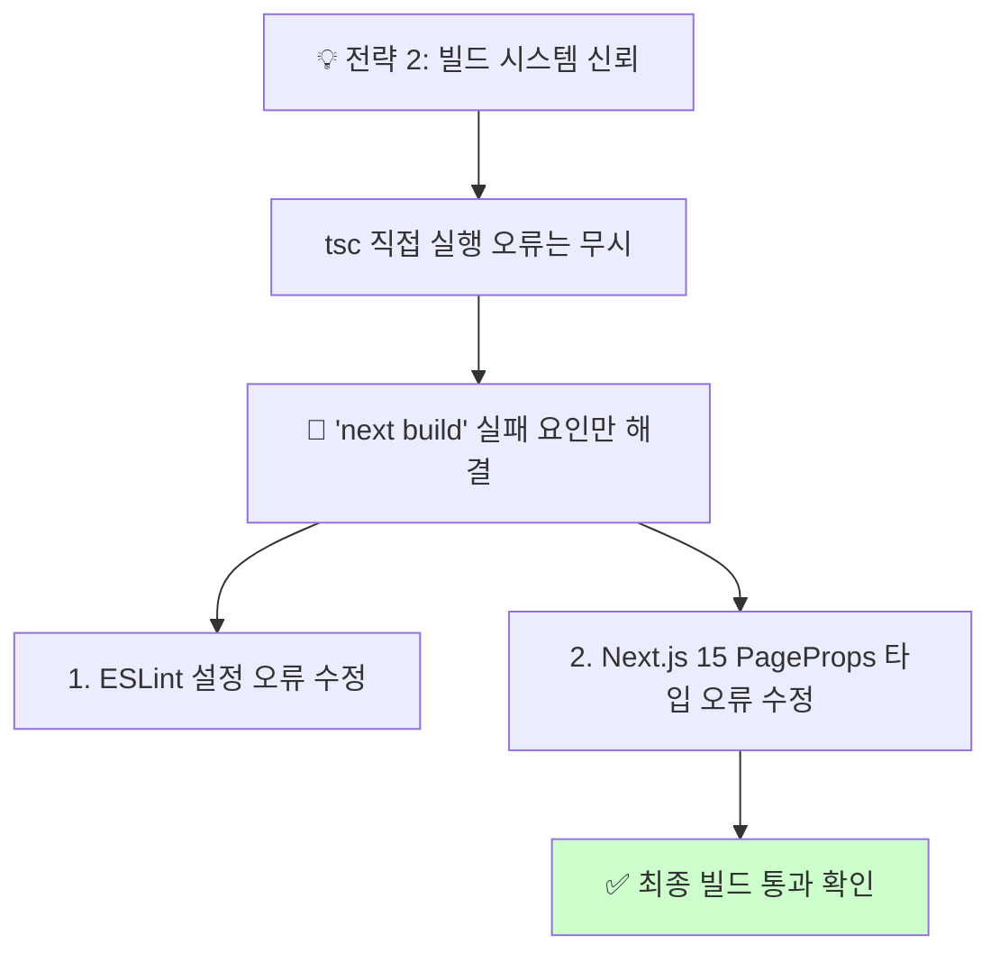
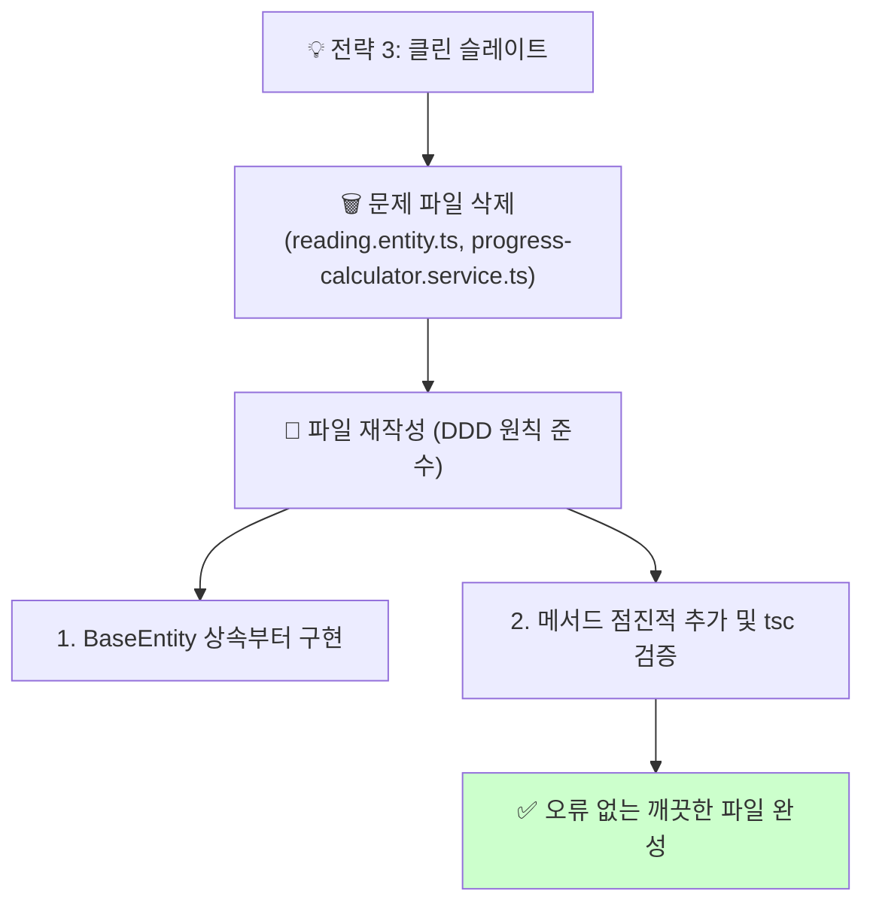

# 🚨 긴급 작업 목록: 최종 TypeScript 타입 오류 해결

> **목표**: 현재 `study_cycle` 도메인에 남아있는 98개의 TypeScript 타입 오류를 완전히 해결하여, 안정적인 빌드 및 개발 환경을 구축합니다.

## 📚 목차 (Table of Contents)

- [🎯 문제 요약](#-문제-요약)
- [💡 해결 전략 제안](#-해결-전략-제안)
  - [전략 1: 점진적 수정 (권장)](#전략-1-점진적-수정-권장)
  - [전략 2: 빌드 시스템 신뢰](#전략-2-빌드-시스템-신뢰)
  - [전략 3: 클린 슬레이트](#전략-3-클린-슬레이트)
- [📊 전략 비교](#-전략-비교)
- [✅ 다음 단계](#-다음-단계)

## 🎯 문제 요약

`npm run build` 과정에서 실제 컴파일은 성공했지만, `tsc`를 직접 실행하면 98개의 오류가 발생합니다.

- **핵심 원인 1**: `@/` 경로 별칭(alias)이 `tsc`에서 해결되지 않음.
- **핵심 원인 2**: 위 문제의 여파로, `BaseEntity` 상속이 제대로 인식되지 않아 `this.props` 접근 오류 발생.

## 💡 해결 전략 제안

다음 세 가지 해결 전략 중 하나를 선택하여 진행할 수 있습니다.

### 전략 1: 점진적 수정 (Incremental Fix) - **(권장)**

**개요**: 가장 안정적이고 확실한 방법입니다. `tsc`가 명확히 인지할 수 있도록, 문제가 되는 `@/` 경로 별칭을 상대 경로로 직접 수정하여 근본 원인을 제거합니다.

- **장점**:
  - 오류의 근본 원인을 직접 해결합니다.
  - `tsc`와 `next build` 모두에서 일관된 결과를 보장합니다.
  - 부작용이 가장 적고 예측 가능성이 높습니다.
- **단점**:
  - 다소 수작업이 필요할 수 있습니다.
- **예상 시간**: 30-45분

#### 📋 작업 목록

- [ ] **1. 경로 분석**: `tsconfig.json`의 `paths`와 `baseUrl` 설정을 최종 확인합니다.
- [ ] **2. 상대 경로 변환**: `reading.entity.ts` 및 `progress-calculator.service.ts`의 모든 `@/` import를 상대 경로로 수정합니다.
- [ ] **3. 타입 재검증**: `npx tsc --noEmit --skipLibCheck` 명령어로 오류가 사라졌는지 확인합니다.
- [ ] **4. 빌드 확인**: `npm run build`로 전체 프로젝트가 이상 없이 빌드되는지 최종 검증합니다.

### 전략 2: 빌드 시스템 신뢰 (Build System Trust)

**개요**: `next build`가 이미 컴파일에 성공했다는 사실에 주목합니다. `tsc` 직접 실행 시의 오류는 무시하고, `next build` 과정에서 발생하는 호환성 오류만 해결하는 실용적인 접근법입니다.

- **장점**:
  - 가장 빠르고 실용적인 해결책이 될 수 있습니다.
  - 실제 배포 환경과 동일한 `next build`를 기준으로 문제를 해결합니다.
- **단점**:
  - `tsc`를 통한 개별 파일 타입 체크가 계속 실패하여 개발 중 혼란을 줄 수 있습니다.
  - 근본적인 경로 해석 문제가 남아있을 수 있습니다.
- **예상 시간**: 20-30분

#### 📋 작업 목록

- [ ] **1. ESLint 설정 수정**: `eslint.config.mjs` (또는 관련 파일)에서 `useEslintrc`, `extensions` 등 오래된 옵션을 제거/수정합니다.
- [ ] **2. PageProps 타입 수정**: `app/study-cycle/textbooks/[id]/page.ts` 파일에서 Next.js 15가 요구하는 `PageProps` 타입으로 수정합니다.
- [ ] **3. 빌드 성공 확인**: `npm run build` 명령어가 모든 단계를 성공적으로 통과하는지 확인합니다.
- [ ] **4. CI/CD 파이프라인 신뢰**: 로컬 `tsc` 체크 대신 CI/CD 파이프라인의 빌드 검증을 신뢰하는 정책을 채택합니다.

### 전략 3: 클린 슬레이트 (Clean Slate)

**개요**: 가장 급진적이지만 가장 깨끗한 방법입니다. 문제가 된 파일들이 Universal MCP라는 외부 요인에 의해 생성되었으므로, 이 파일들을 삭제하고 프로젝트의 순수 DDD 원칙에 따라 처음부터 다시 작성합니다.

- **장점**:
  - 잠재적인 모든 레거시 문제를 완전히 제거합니다.
  - 100% 프로젝트 표준을 준수하는 코드를 보장합니다.
- **단점**:
  - 가장 시간이 많이 소요됩니다.
  - 기존에 구현된 복잡한 비즈니스 로직을 정확하게 재구현해야 하는 부담이 있습니다.
- **예상 시간**: 60-90분

#### 📋 작업 목록

- [ ] **1. 파일 백업 및 삭제**: `reading.entity.ts`와 `progress-calculator.service.ts`를 백업 후 삭제합니다.
- [ ] **2. `reading.entity.ts` 재작성**:
    - [ ] `BaseEntity`를 상속하는 기본 클래스 구조 생성.
    - [ ] `IReadingProps` 인터페이스 정의.
    - [ ] `create` 팩토리 메서드부터 점진적으로 구현하며 `tsc`로 계속 확인.
- [ ] **3. `progress-calculator.service.ts` 재작성**:
    - [ ] 서비스 클래스 및 메서드 재구현.
- [ ] **4. 최종 검증**: `npx tsc --noEmit`와 `npm run build`를 통해 완벽히 오류가 없는지 확인합니다.

## 📊 전략 비교

| 기준 | 전략 1 (점진적 수정) | 전략 2 (빌드 시스템 신뢰) | 전략 3 (클린 슬레이트) |
| :--- | :--- | :--- | :--- |
| **안정성** | **높음** | 중간 | 매우 높음 |
| **작업 속도** | 중간 | **빠름** | 느림 |
| **근본 해결** | **높음** | 낮음 | **매우 높음** |
| **권장 상황** | 대부분의 경우 | 빠른 해결이 필요할 때 | 다른 방법 실패 시 |

## ✅ 다음 단계

위 세 가지 전략을 검토하시고, 어떤 방법으로 진행할지 알려주세요. **개인적으로는 가장 안정적이고 근본적인 해결책인 [전략 1]을 가장 추천합니다.** 