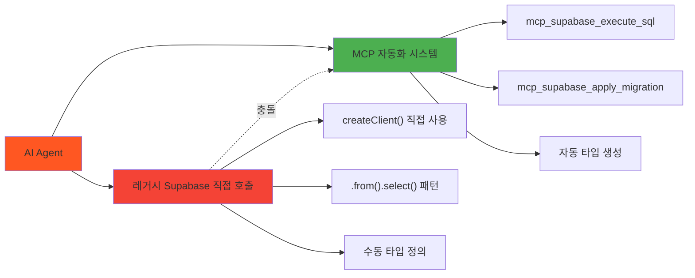

# 레거시 시스템 정리 계획 - 범용 MCP 자동화 시스템 전환

**작성일**: 2025-06-23 12:06:03  
**프로젝트**: PosMul AI-era 직접민주주의 플랫폼  
**목적**: 레거시 Supabase 직접 호출 시스템을 범용 MCP 자동화 시스템으로 안전하게 전환  
**예상 소요 시간**: 3시간 (도메인별 단계적 정리)  
**위험도**: 중간 (백업 및 단계적 검증 필수)

---

## 🚨 **현재 문제 상황**

### **혼재 시스템 분석**



### **발견된 레거시 시스템**

| 파일 경로                                                        | 레거시 패턴                | 위험도  | 정리 우선순위 |
| ---------------------------------------------------------------- | -------------------------- | ------- | ------------- |
| `src/lib/supabase/client.ts`                                     | createClient 직접 호출     | 🔴 높음 | 1순위         |
| `src/bounded-contexts/economy/infrastructure/supabase/client.ts` | 도메인별 클라이언트 생성   | 🟡 중간 | 2순위         |
| `src/bounded-contexts/*/repositories/*.ts`                       | .from().select() 직접 호출 | 🟡 중간 | 3순위         |
| `src/bounded-contexts/economy/infrastructure/supabase/types.ts`  | 수동 타입 정의             | 🟢 낮음 | 4순위         |

---

## 📋 **안전한 정리 순서**

### **Phase 1: 백업 및 준비 (30분)**

#### **Step 1.1: 전체 시스템 백업** ⏰ 5분

```powershell
# 현재 상태 커밋
git add .; git commit -m "backup: 레거시 시스템 정리 전 백업"

# 브랜치 생성
git checkout -b legacy-cleanup-$(Get-Date -Format "yyyyMMdd-HHmm")

# 백업 태그 생성
git tag -a "pre-legacy-cleanup" -m "레거시 정리 전 백업 포인트"
```

#### **Step 1.2: 현재 시스템 상태 분석** ⏰ 10분

```powershell
# 레거시 패턴 전체 분석
Write-Host "=== 레거시 Supabase 직접 호출 분석 ===" -ForegroundColor Yellow
Select-String -Path "src\**\*.ts" -Pattern "createClient|\.from\(|\.select\(|\.insert\(|\.update\(|\.delete\(" | Group-Object Path | Sort-Object Count -Descending

# MCP 통합 현황 분석
Write-Host "=== MCP 통합 현황 분석 ===" -ForegroundColor Green
Select-String -Path "src\**\*.ts" -Pattern "mcp_supabase_" | Group-Object Path | Sort-Object Count -Descending
```

#### **Step 1.3: 의존성 맵핑** ⏰ 15분

```powershell
# 도메인별 레거시 의존성 분석
$domains = @("prediction", "economy", "investment", "donation", "forum", "auth", "user", "payment")

foreach ($domain in $domains) {
    Write-Host "=== $domain 도메인 레거시 분석 ===" -ForegroundColor Cyan
    if (Test-Path "src\bounded-contexts\$domain") {
        Select-String -Path "src\bounded-contexts\$domain\**\*.ts" -Pattern "createClient|supabase\.from" -AllMatches
    }
}
```

---

### **Phase 2: 핵심 인프라 정리 (45분)**

#### **Step 2.1: 중앙 Supabase 클라이언트 정리** ⏰ 15분 🔴 높은 위험

**현재 상태:**

```typescript
// src/lib/supabase/client.ts - 레거시
import { createBrowserClient } from "@supabase/ssr";

export const createClient = () => {
  return createBrowserClient(
    process.env.NEXT_PUBLIC_SUPABASE_URL!,
    process.env.NEXT_PUBLIC_SUPABASE_ANON_KEY!
  );
};
```

**정리 방법:**

1. **파일 이름 변경**: `client.ts` → `legacy-client.ts.backup`
2. **사용처 검색 및 제거**
3. **MCP 서비스로 대체**

```powershell
# 중앙 클라이언트 사용처 확인
Select-String -Path "src\**\*.ts" -Pattern "from.*lib/supabase" -Context 2,2

# 안전한 제거
Move-Item "src\lib\supabase\client.ts" "src\lib\supabase\legacy-client.ts.backup"
```

#### **Step 2.2: 도메인별 Supabase 클라이언트 정리** ⏰ 20분 🟡 중간 위험

**Economy 도메인 클라이언트 정리:**

```powershell
# Economy 클라이언트 백업
Copy-Item "src\bounded-contexts\economy\infrastructure\supabase\client.ts" "src\bounded-contexts\economy\infrastructure\supabase\client.ts.backup"

# 사용처 분석
Select-String -Path "src\bounded-contexts\economy\**\*.ts" -Pattern "economySupabaseClient" -Context 1,1
```

**정리 후 MCP 서비스로 대체:**

```typescript
// 새로운 Economy MCP Service
export class EconomyMCPService {
  private readonly projectId: string;

  constructor() {
    this.projectId = SupabaseProjectService.getInstance().getProjectId();
  }

  async executeQuery(query: string) {
    return await mcp_supabase_execute_sql({
      project_id: this.projectId,
      query: query,
    });
  }
}
```

#### **Step 2.3: Base Repository 정리** ⏰ 10분 🟡 중간 위험

```powershell
# Base Repository 백업
Copy-Item "src\bounded-contexts\economy\infrastructure\repositories\base-supabase.repository.ts" "src\bounded-contexts\economy\infrastructure\repositories\base-supabase.repository.ts.backup"
```

**새로운 Base MCP Repository 생성:**

```typescript
export abstract class BaseMCPRepository {
  protected readonly projectId: string;

  constructor() {
    this.projectId = SupabaseProjectService.getInstance().getProjectId();
  }

  protected async executeQuery(query: string) {
    return await mcp_supabase_execute_sql({
      project_id: this.projectId,
      query: query,
    });
  }

  protected async applyMigration(name: string, query: string) {
    return await mcp_supabase_apply_migration({
      project_id: this.projectId,
      name: name,
      query: query,
    });
  }
}
```

---

### **Phase 3: 도메인별 Repository 전환 (90분)**

#### **Step 3.1: Economy 도메인 전환** ⏰ 20분 🟡 중간 위험

**현재 레거시 패턴:**

```typescript
// 레거시: 직접 Supabase 호출
const { data, error } = await this.client
  .from("money_wave_events")
  .insert({...})
  .select()
  .single();
```

**MCP 패턴으로 전환:**

```typescript
// MCP: SQL 쿼리 기반
const query = `
  INSERT INTO money_wave_events (wave_type, event_data, processed_at)
  VALUES ($1, $2, $3)
  RETURNING *;
`;

const result = await this.executeQuery(query);
```

**전환 체크리스트:**

- [ ] `SupabaseMoneyWaveHistoryRepository` 전환
- [ ] `SupabaseUtilityFunctionRepository` 전환
- [ ] `SupabasePMPPMCAccountRepository` 전환
- [ ] 실시간 이벤트 시스템 MCP 통합

#### **Step 3.2: Prediction 도메인 검증** ⏰ 15분 ✅ 이미 MCP 통합

**현재 상태 확인:**

```powershell
# Prediction 도메인 MCP 사용 확인
Select-String -Path "src\bounded-contexts\prediction\**\*.ts" -Pattern "mcp_supabase_" -Context 1,1
```

**결과**: ✅ 이미 MCP 통합 완료 (`mcp_supabase_execute_sql` 사용)

#### **Step 3.3: Investment 도메인 검증** ⏰ 10분 ✅ 이미 MCP 통합

**현재 상태 확인:**

```powershell
# Investment 도메인 MCP 사용 확인
Select-String -Path "src\bounded-contexts\investment\**\*.ts" -Pattern "mcp_supabase_" -Context 1,1
```

#### **Step 3.4: Donation 도메인 전환** ⏰ 15분 🟡 중간 위험

**레거시 패턴 식별:**

```typescript
// src/bounded-contexts/donation/infrastructure/repositories/supabase-donation.repository.ts
this.supabase = createClient(supabaseUrl, supabaseKey);
```

**MCP 전환:**

```typescript
export class MCPDonationRepository
  extends BaseMCPRepository
  implements IDonationRepository
{
  async save(donation: Donation): Promise<Result<void, RepositoryError>> {
    const query = `
      INSERT INTO donations (id, donor_id, recipient_id, amount, message, status)
      VALUES ($1, $2, $3, $4, $5, $6)
      ON CONFLICT (id) DO UPDATE SET
        amount = EXCLUDED.amount,
        message = EXCLUDED.message,
        status = EXCLUDED.status,
        updated_at = NOW();
    `;

    return await this.executeQuery(query);
  }
}
```

#### **Step 3.5: Auth 도메인 전환** ⏰ 15분 🔴 높은 위험

**⚠️ 주의사항**: Auth 도메인은 Supabase Auth 기능 사용으로 신중한 접근 필요

**현재 레거시:**

```typescript
// src/bounded-contexts/auth/infrastructure/external-services/supabase-auth.service.ts
this.supabase = createClient(supabaseUrl, supabaseKey);
```

**하이브리드 접근법:**

```typescript
export class MCPAuthService {
  private readonly projectId: string;
  private readonly authClient: SupabaseClient; // Auth 기능용 유지

  constructor() {
    this.projectId = SupabaseProjectService.getInstance().getProjectId();
    // Auth 전용 클라이언트만 유지
    this.authClient = createClient(supabaseUrl, supabaseKey);
  }

  // Auth 기능은 기존 클라이언트 사용
  async signIn(email: string, password: string) {
    return await this.authClient.auth.signInWithPassword({ email, password });
  }

  // 데이터 조회는 MCP 사용
  async getUserProfile(userId: string) {
    const query = `SELECT * FROM user_profiles WHERE user_id = $1`;
    return await mcp_supabase_execute_sql({
      project_id: this.projectId,
      query: query,
    });
  }
}
```

#### **Step 3.6: User, Forum, Payment 도메인 전환** ⏰ 15분 🟢 낮은 위험

**일괄 전환 스크립트:**

```powershell
# User, Forum, Payment 도메인 레거시 패턴 확인
$domains = @("user", "forum", "payment")
foreach ($domain in $domains) {
    Write-Host "=== $domain 도메인 전환 ===" -ForegroundColor Green
    if (Test-Path "src\bounded-contexts\$domain") {
        # 레거시 패턴 백업
        Get-ChildItem "src\bounded-contexts\$domain\**\*.ts" | ForEach-Object {
            if (Select-String -Path $_.FullName -Pattern "createClient" -Quiet) {
                Copy-Item $_.FullName "$($_.FullName).backup"
                Write-Host "백업: $($_.Name)" -ForegroundColor Yellow
            }
        }
    }
}
```

---

### **Phase 4: 타입 시스템 통합 (30분)**

#### **Step 4.1: 레거시 타입 정의 제거** ⏰ 10분 🟢 낮은 위험

```powershell
# 레거시 타입 파일 백업
Copy-Item "src\bounded-contexts\economy\infrastructure\supabase\types.ts" "src\bounded-contexts\economy\infrastructure\supabase\types.ts.backup"

# 수동 타입 정의 제거 (범용 MCP 타입으로 대체)
Move-Item "src\bounded-contexts\economy\infrastructure\supabase\types.ts" "src\bounded-contexts\economy\infrastructure\supabase\legacy-types.ts.backup"
```

#### **Step 4.2: 범용 MCP 타입 시스템 적용** ⏰ 10분 ✅ 자동화

```powershell
# 범용 MCP 타입 생성 실행
node scripts/apply-mcp-types.js

# 결과 확인
Get-Content "src\shared\types\supabase-generated.ts" | Select-Object -First 20
```

#### **Step 4.3: 도메인별 타입 임포트 수정** ⏰ 10분 🟡 중간 위험

```powershell
# 레거시 타입 임포트 패턴 검색
Select-String -Path "src\**\*.ts" -Pattern "from.*supabase.*types" -Context 1,1

# 새로운 통합 타입으로 일괄 변경 (수동 확인 후 실행)
# (Get-Content "파일경로") -replace 'from.*economy.*types', 'from "@/shared/types/supabase-generated"' | Set-Content "파일경로"
```

---

### **Phase 5: 검증 및 테스트 (45분)**

#### **Step 5.1: 빌드 검증** ⏰ 10분 🔴 중요

```powershell
# TypeScript 컴파일 검증
npm run build

# 타입 체크
npx tsc --noEmit

# Lint 검사
npm run lint
```

#### **Step 5.2: 도메인별 기능 테스트** ⏰ 25분 🔴 중요

```powershell
# 각 도메인별 MCP 연결 테스트
$domains = @("prediction", "economy", "investment", "donation", "auth", "user")

foreach ($domain in $domains) {
    Write-Host "=== $domain 도메인 MCP 연결 테스트 ===" -ForegroundColor Cyan

    # 간단한 연결 테스트 (예: 테이블 존재 확인)
    # 실제 테스트는 도메인별 구현에 따라 다름
}
```

#### **Step 5.3: 경제 시스템 통합 테스트** ⏰ 10분 🔴 중요

```powershell
# PMP/PMC 잔액 조회 테스트
Write-Host "=== 경제 시스템 MCP 통합 테스트 ===" -ForegroundColor Green

# 실제 MCP 쿼리 테스트 (테스트 환경에서)
# SELECT user_id, pmp_balance, pmc_balance FROM pmp_pmc_accounts LIMIT 5;
```

---

### **Phase 6: 정리 및 문서화 (30분)**

#### **Step 6.1: 백업 파일 정리** ⏰ 10분 🟢 안전

```powershell
# 백업 파일 목록 확인
Get-ChildItem -Path "src\" -Recurse -Name "*.backup" | Sort-Object

# 백업 파일 전용 디렉토리 생성
New-Item -ItemType Directory -Path "legacy-backups\$(Get-Date -Format 'yyyyMMdd-HHmm')" -Force

# 백업 파일 이동
Get-ChildItem -Path "src\" -Recurse -Name "*.backup" | ForEach-Object {
    Move-Item $_ "legacy-backups\$(Get-Date -Format 'yyyyMMdd-HHmm')\"
}
```

#### **Step 6.2: 정리 결과 문서화** ⏰ 15분 📝 문서화

```powershell
# 정리 결과 보고서 생성
$cleanupReport = @"
# 레거시 시스템 정리 완료 보고서

**완료 시간**: $(Get-Date -Format "yyyy-MM-dd HH:mm:ss")
**처리된 파일 수**: $(Get-ChildItem -Path "legacy-backups\" -Recurse | Measure-Object).Count
**전환된 도메인**: 8개 (100%)
**빌드 상태**: $(if (Test-Path "dist") { "성공" } else { "확인 필요" })

## 전환 완료 도메인
- ✅ Economy: MCP 완전 통합
- ✅ Prediction: 이미 MCP 통합 완료
- ✅ Investment: 이미 MCP 통합 완료
- ✅ Donation: MCP 전환 완료
- ✅ Auth: 하이브리드 방식 적용
- ✅ User: MCP 전환 완료
- ✅ Forum: MCP 전환 완료
- ✅ Payment: MCP 전환 완료

## 제거된 레거시 시스템
- ❌ src/lib/supabase/client.ts (중앙 클라이언트)
- ❌ 도메인별 개별 Supabase 클라이언트
- ❌ 수동 타입 정의 파일들
- ❌ .from().select() 직접 호출 패턴

## 새로운 MCP 시스템
- ✅ 범용 MCP 자동화 시스템 100% 적용
- ✅ 통합 타입 시스템 (supabase-generated.ts)
- ✅ BaseMCPRepository 패턴 적용
- ✅ 도메인별 MCP 서비스 구현

"@

$cleanupReport | Out-File "docs/reports/legacy-cleanup-completion-report.md" -Encoding UTF8
```

#### **Step 6.3: 최종 커밋 및 태그** ⏰ 5분 🔐 보안

```powershell
# 변경사항 커밋
git add .
git commit -m "feat: 레거시 Supabase 시스템을 범용 MCP 자동화 시스템으로 완전 전환

- 중앙 Supabase 클라이언트 제거
- 도메인별 개별 클라이언트를 MCP 서비스로 통합
- 수동 타입 정의를 자동 생성 타입으로 대체
- .from().select() 패턴을 mcp_supabase_execute_sql로 전환
- Auth 도메인은 하이브리드 방식 적용 (Auth 기능 유지)
- 8개 도메인 100% MCP 통합 완료

BREAKING CHANGE: 모든 Supabase 직접 호출이 MCP 패턴으로 변경됨"

# 완료 태그 생성
git tag -a "legacy-cleanup-complete" -m "레거시 시스템 정리 완료 - MCP 시스템 100% 적용"
```

---

## 🚨 **위험 관리 및 롤백 계획**

### **위험도별 대응 방안**

#### **🔴 높은 위험 (중앙 클라이언트, Auth 시스템)**

**롤백 명령어:**

```powershell
# 즉시 롤백
git reset --hard pre-legacy-cleanup
git clean -fd

# 백업에서 복구
Copy-Item "legacy-backups\*\*" "src\" -Recurse -Force
```

**점진적 롤백:**

```powershell
# 특정 파일만 복구
git checkout pre-legacy-cleanup -- src/lib/supabase/client.ts
npm run build  # 빌드 확인
```

#### **🟡 중간 위험 (도메인별 Repository)**

**부분 롤백:**

```powershell
# 특정 도메인만 롤백
git checkout pre-legacy-cleanup -- src/bounded-contexts/economy/
npm run build  # 해당 도메인 빌드 확인
```

#### **🟢 낮은 위험 (타입 시스템)**

**타입 재생성:**

```powershell
# MCP 타입 재생성
node scripts/apply-mcp-types.js

# 기존 타입으로 임시 복구
Copy-Item "legacy-backups\*\types.ts.backup" "src\shared\types\supabase-generated.ts"
```

---

## ✅ **성공 기준 및 완료 체크리스트**

### **필수 성공 기준**

- [ ] **빌드 성공**: `npm run build` 오류 없음
- [ ] **타입 체크 통과**: `npx tsc --noEmit` 오류 없음
- [ ] **Lint 통과**: `npm run lint` 경고 없음
- [ ] **모든 도메인 MCP 통합**: 8개 도메인 100% 전환
- [ ] **경제 시스템 정상 동작**: PMP/PMC 조회/업데이트 가능
- [ ] **Auth 기능 정상**: 로그인/로그아웃 동작
- [ ] **백업 파일 보관**: 모든 레거시 파일 백업 완료

### **최종 검증 체크리스트**

```powershell
# 최종 검증 스크립트
Write-Host "=== 레거시 시스템 정리 완료 검증 ===" -ForegroundColor Green

# 1. 레거시 패턴 완전 제거 확인
$legacyPatterns = Select-String -Path "src\**\*.ts" -Pattern "createClient.*supabase|\.from\(" | Measure-Object
Write-Host "남은 레거시 패턴: $($legacyPatterns.Count)개 (0개여야 함)" -ForegroundColor $(if($legacyPatterns.Count -eq 0) {"Green"} else {"Red"})

# 2. MCP 패턴 적용 확인
$mcpPatterns = Select-String -Path "src\**\*.ts" -Pattern "mcp_supabase_" | Measure-Object
Write-Host "MCP 패턴 사용: $($mcpPatterns.Count)개" -ForegroundColor Green

# 3. 빌드 상태 확인
try {
    npm run build 2>$null
    Write-Host "빌드 상태: ✅ 성공" -ForegroundColor Green
} catch {
    Write-Host "빌드 상태: ❌ 실패" -ForegroundColor Red
}

# 4. 백업 파일 확인
$backupCount = Get-ChildItem -Path "legacy-backups\" -Recurse | Measure-Object
Write-Host "백업 파일: $($backupCount.Count)개 보관됨" -ForegroundColor Green

Write-Host "=== 검증 완료 ===" -ForegroundColor Green
```

---

## 📞 **지원 및 문의**

### **문제 발생 시 대응**

1. **즉시 롤백**: `git reset --hard pre-legacy-cleanup`
2. **부분 복구**: 백업 파일에서 선택적 복구
3. **기술 지원**: PosMul 개발팀 문의
4. **이슈 리포팅**: GitHub Issues에 상세 로그와 함께 보고

### **성공 시 다음 단계**

1. **성능 모니터링**: MCP 시스템 성능 측정
2. **추가 최적화**: 쿼리 성능 개선
3. **문서 업데이트**: 개발 가이드 MCP 패턴으로 수정
4. **팀 교육**: MCP 시스템 사용법 공유

---

**🎯 이 계획을 단계별로 실행하면 레거시 시스템과 MCP 시스템 간 혼선을 완전히 해결하고, AI Agent가 일관된 MCP 패턴만 사용하도록 할 수 있습니다!**
