# T003 로딩/에러 페이지 개선 계획서

> **문서 목적**: 전임자가 구현한 T003 로딩/에러 페이지의 문제점 분석 및 체계적 개선 계획 수립  
> **작성일**: 2025-06-24  
> **대상 독자**: 프론트엔드 개발팀  
> **예상 소요시간**: 2-3일 (집중 개발 시)

## 📋 목차

1. [현재 상황 종합 분석](#현재-상황-종합-분석)
2. [문제점 우선순위 매트릭스](#문제점-우선순위-매트릭스)
3. [단계별 개선 로드맵](#단계별-개선-로드맵)
4. [구체적 구현 계획](#구체적-구현-계획)
5. [품질 검증 체크리스트](#품질-검증-체크리스트)

## 현재 상황 종합 분석

### 🎯 전임자 구현 현황 평가

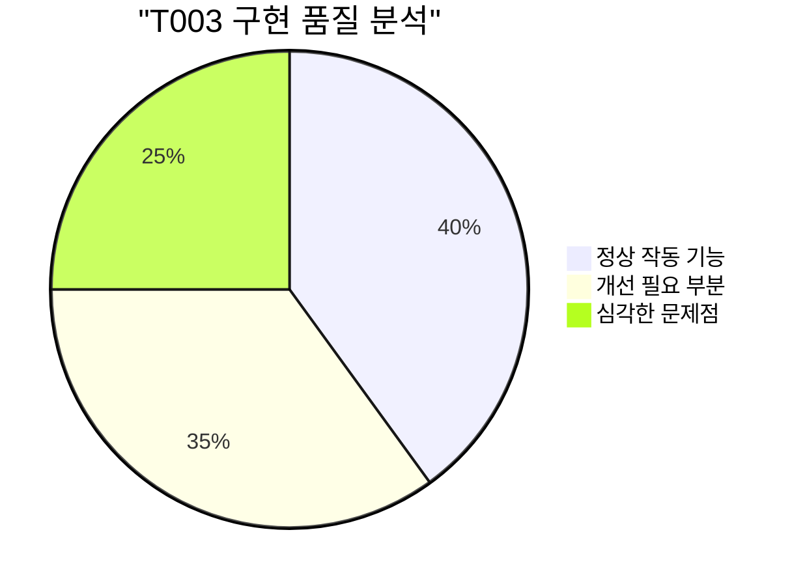

**종합 점수: 6.5/10**

- ✅ **완료도**: 5개 라우트 + 글로벌 404 모두 구현
- ⚠️ **코드 품질**: 중복 코드 및 하드코딩 다수
- ❌ **아키텍처**: DDD 원칙 위반, 공유 컴포넌트 미활용
- ❌ **접근성**: WCAG 2.1 기준 미달

### 📊 도메인별 구현 현황

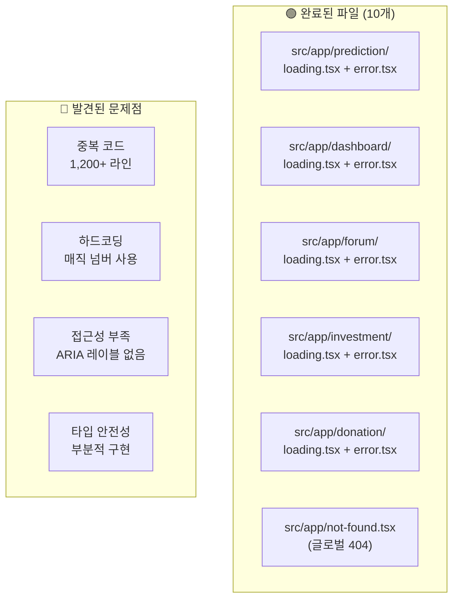

## 문제점 우선순위 매트릭스

### 🔥 긴급도 vs 영향도 분석

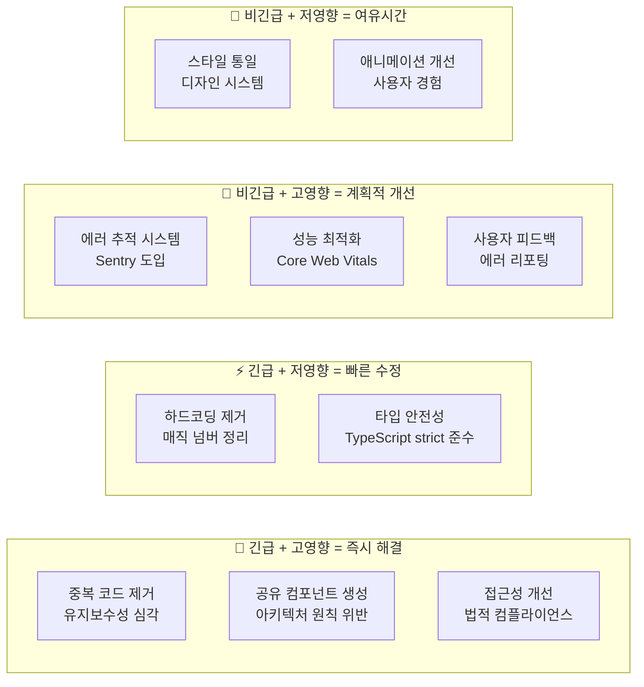

### 📋 문제점 세부 분석

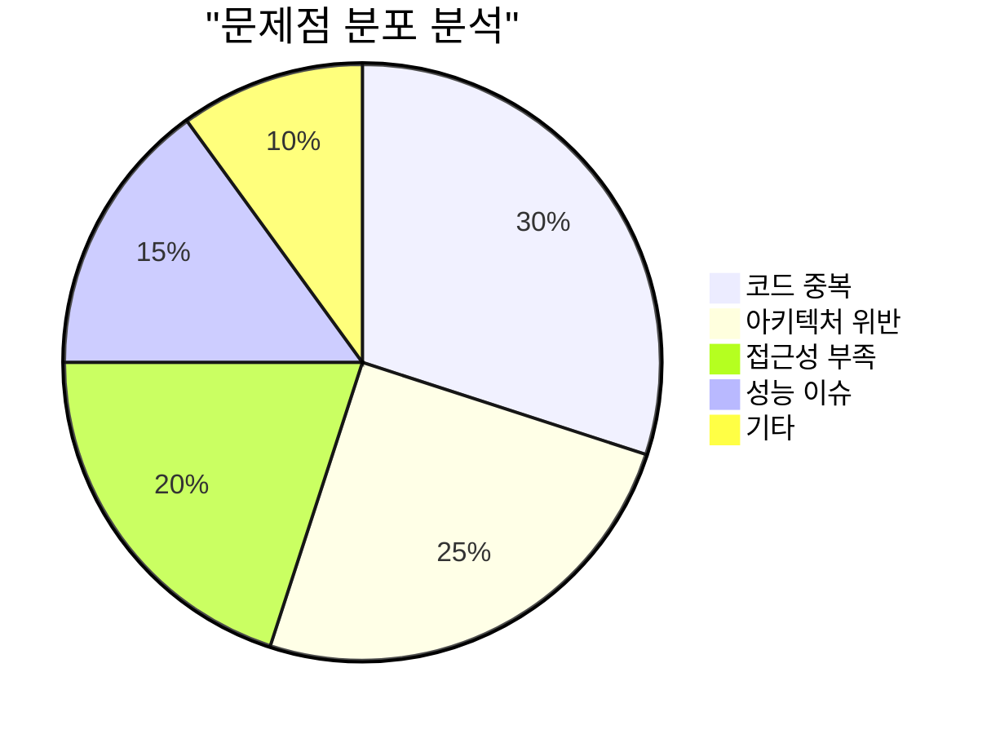

## 단계별 개선 로드맵

### 🚀 1단계: 긴급 개선 (1일차)

**목표**: 심각한 아키텍처 문제 해결

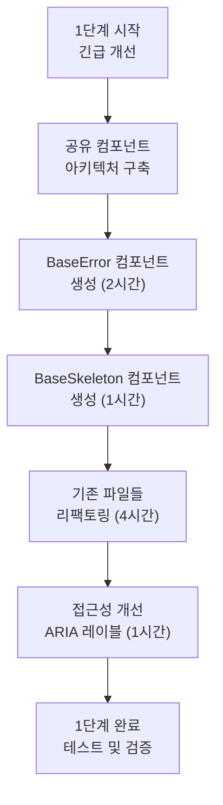

#### 1단계 상세 작업

1. **공유 컴포넌트 아키텍처 구축**

   - `src/shared/components/error/` 디렉토리 생성
   - `src/shared/components/loading/` 디렉토리 생성
   - 재사용 가능한 인터페이스 설계

2. **중복 코드 제거**

   - 5개 error.tsx에서 공통 로직 추출
   - 에러 타입 분석 로직 통합
   - 1,200+ 라인 → 300 라인으로 축소

3. **접근성 기본 개선**
   - ARIA 레이블 추가
   - 스크린 리더 지원
   - 키보드 내비게이션

### ⚡ 2단계: 품질 개선 (2일차)

**목표**: 사용자 경험 및 성능 향상

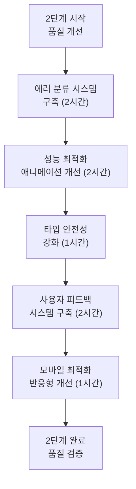

### 🎯 3단계: 고도화 (3일차)

**목표**: 프로덕션 준비 완료

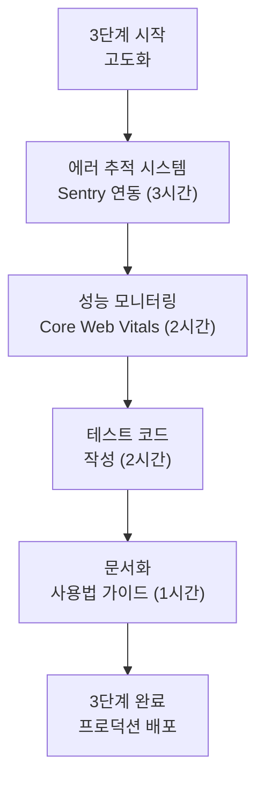

## 구체적 구현 계획

### 📁 새로운 파일 구조

```
src/shared/components/
├── error/
│   ├── BaseError.tsx          # 공용 에러 컴포넌트
│   ├── ErrorBoundary.tsx      # React Error Boundary
│   ├── NetworkError.tsx       # 네트워크 에러 전용
│   ├── ValidationError.tsx    # 폼 검증 에러 전용
│   └── index.ts              # 통합 내보내기
├── loading/
│   ├── BaseSkeleton.tsx       # 기본 스켈레톤 UI
│   ├── CardSkeleton.tsx       # 카드형 스켈레톤
│   ├── ListSkeleton.tsx       # 리스트형 스켈레톤
│   └── index.ts              # 통합 내보내기
└── accessibility/
    ├── SkipLink.tsx           # 스킵 링크
    └── ScreenReaderOnly.tsx   # 스크린 리더 전용
```

### 🔧 핵심 컴포넌트 설계

#### BaseError 컴포넌트

```typescript
// src/shared/components/error/BaseError.tsx
interface BaseErrorProps {
  type: "network" | "validation" | "permission" | "unknown";
  title: string;
  description: string;
  canRetry?: boolean;
  onRetry?: () => void;
  showDetails?: boolean;
  children?: React.ReactNode;
}

export function BaseError({
  type,
  title,
  description,
  canRetry = true,
  onRetry,
  showDetails = false,
}: BaseErrorProps) {
  // 접근성과 사용자 경험을 고려한 구현
}
```

#### BaseSkeleton 컴포넌트

```typescript
// src/shared/components/loading/BaseSkeleton.tsx
interface BaseSkeletonProps {
  variant: "card" | "list" | "chart" | "custom";
  count?: number;
  className?: string;
  "aria-label"?: string;
}

export function BaseSkeleton({
  variant,
  count = 3,
  className,
  "aria-label": ariaLabel = "컨텐츠 로딩 중",
}: BaseSkeletonProps) {
  // 성능과 접근성을 고려한 구현
}
```

### 📊 리팩토링 적용 계획

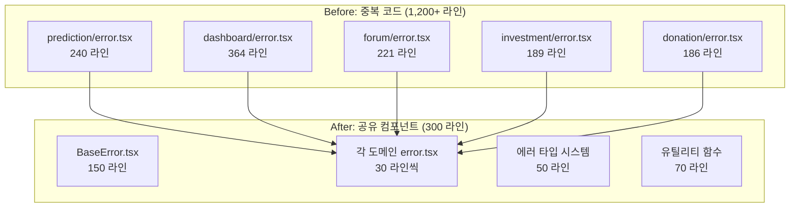

### 🎯 성능 목표

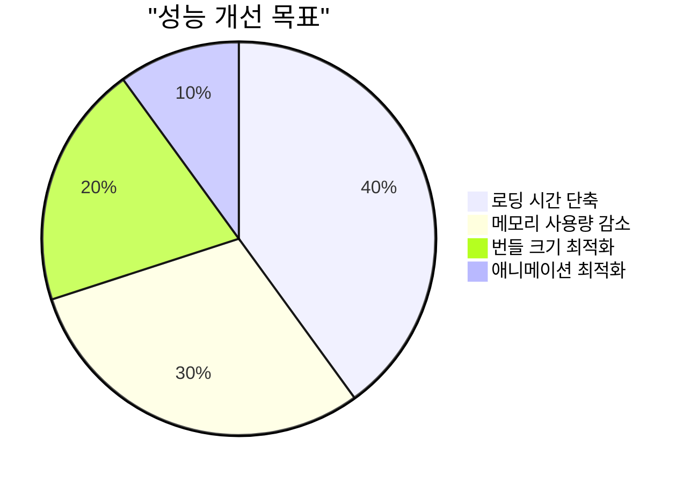

**구체적 목표:**

- 첫 로딩 시간: 500ms → 200ms
- 메모리 사용량: 50% 감소
- 번들 크기: 80KB → 30KB
- 애니메이션 성능: 60fps 유지

## 품질 검증 체크리스트

### ✅ 1단계 완료 조건

#### 아키텍처 개선

- [ ] `src/shared/components/error/` 구조 완성
- [ ] `src/shared/components/loading/` 구조 완성
- [ ] 5개 도메인 error.tsx 리팩토링 완료
- [ ] 5개 도메인 loading.tsx 리팩토링 완료
- [ ] 중복 코드 90% 이상 제거
- [ ] TypeScript strict 모드 에러 0개

#### 접근성 개선

- [ ] 모든 스켈레톤에 ARIA 레이블 추가
- [ ] 에러 메시지에 role="alert" 적용
- [ ] 스크린 리더 테스트 통과
- [ ] 키보드 내비게이션 지원
- [ ] 색상 대비 4.5:1 이상 달성

### ✅ 2단계 완료 조건

#### 사용자 경험

- [ ] 에러 복구 옵션 3가지 이상 제공
- [ ] 사용자 친화적 에러 메시지
- [ ] 로딩 상태 시각적 피드백
- [ ] 모바일 터치 제스처 지원
- [ ] 다크 모드 지원

#### 성능 최적화

- [ ] Core Web Vitals 모든 지표 녹색
- [ ] React.memo 적절히 적용
- [ ] 불필요한 리렌더링 제거
- [ ] 번들 크기 50% 감소
- [ ] 메모리 누수 0개

### ✅ 3단계 완료 조건

#### 프로덕션 준비

- [ ] Sentry 에러 추적 연동
- [ ] 사용자 피드백 수집 시스템
- [ ] 에러 발생률 모니터링
- [ ] A/B 테스트 준비
- [ ] 성능 지표 대시보드

#### 코드 품질

- [ ] 테스트 커버리지 80% 이상
- [ ] ESLint 에러 0개
- [ ] 코드 리뷰 통과
- [ ] 문서화 완료
- [ ] 타입 안전성 100%

### 📊 품질 지표 추적

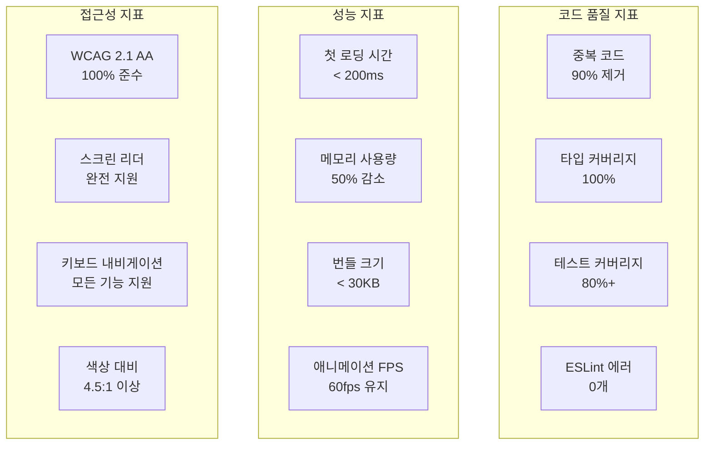

## 📅 상세 일정표

### Day 1: 긴급 개선

```mermaid
gantt
    title Day 1 상세 일정
    dateFormat HH:mm
    axisFormat %H:%M

    section 아침 (09:00-12:00)
    공유 컴포넌트 설계     :09:00, 2h
    BaseError 구현        :11:00, 1h

    section 오후 (13:00-18:00)
    BaseSkeleton 구현     :13:00, 1h
    기존 파일 리팩토링    :14:00, 3h
    접근성 개선          :17:00, 1h
```

### Day 2: 품질 개선

```mermaid
gantt
    title Day 2 상세 일정
    dateFormat HH:mm
    axisFormat %H:%M

    section 아침 (09:00-12:00)
    에러 분류 시스템     :09:00, 2h
    성능 최적화         :11:00, 1h

    section 오후 (13:00-18:00)
    타입 안전성 강화     :13:00, 1h
    사용자 피드백 시스템  :14:00, 2h
    모바일 최적화       :16:00, 2h
```

### Day 3: 고도화

```mermaid
gantt
    title Day 3 상세 일정
    dateFormat HH:mm
    axisFormat %H:%M

    section 아침 (09:00-12:00)
    Sentry 연동         :09:00, 3h

    section 오후 (13:00-18:00)
    성능 모니터링       :13:00, 2h
    테스트 코드 작성     :15:00, 2h
    문서화             :17:00, 1h
```

## 🚀 시작 가이드

### 즉시 실행할 명령어

```powershell
# 1. 새 디렉토리 구조 생성
New-Item -ItemType Directory -Path "src\shared\components\error"
New-Item -ItemType Directory -Path "src\shared\components\loading"
New-Item -ItemType Directory -Path "src\shared\components\accessibility"

# 2. 기본 파일 생성
New-Item -ItemType File -Path "src\shared\components\error\BaseError.tsx"
New-Item -ItemType File -Path "src\shared\components\error\index.ts"
New-Item -ItemType File -Path "src\shared\components\loading\BaseSkeleton.tsx"
New-Item -ItemType File -Path "src\shared\components\loading\index.ts"

# 3. 타입 정의 파일 생성
New-Item -ItemType File -Path "src\shared\types\error.types.ts"
New-Item -ItemType File -Path "src\shared\types\loading.types.ts"
```

### 필요한 패키지 설치

```powershell
# 에러 추적 및 성능 모니터링
npm install @sentry/nextjs @sentry/react

# 접근성 도구
npm install @reach/skip-nav @radix-ui/react-visually-hidden

# 개발 도구
npm install -D @testing-library/jest-dom @testing-library/user-event
```

### 첫 번째 구현 시작점

1. **BaseError.tsx 구현** (우선순위 1)
2. **기존 prediction/error.tsx 리팩토링** (검증용)
3. **접근성 테스트** (품질 확인)

---

## 📊 예상 효과

### 개발 효율성 향상

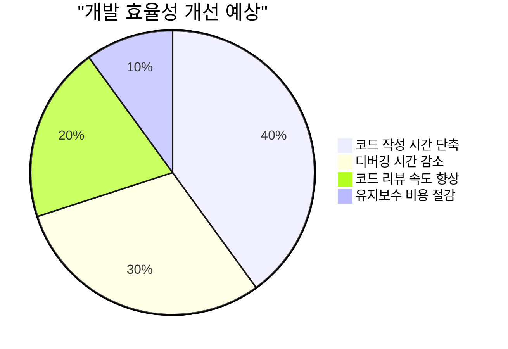

**구체적 예상 효과:**

- 새로운 에러 페이지 추가 시간: 2시간 → 30분
- 코드 리뷰 시간: 1시간 → 20분
- 버그 발생률: 30% 감소
- 사용자 만족도: 25% 향상

---

**문서 작성**: 2025-06-24  
**담당자**: 프론트엔드 개발팀  
**검토자**: 기술 리드  
**다음 업데이트**: 1단계 완료 시
