# PosMul 코드베이스 정리 전략 문서

## 📋 개요

**목적**: PosMul 모노레포의 코드 품질 향상 및 유지보수성 강화  
**범위**: 중복 코드, 레거시 코드, 백업 파일, 빈 파일, 미사용 코드 정리  
**기간**: 2주 (단계별 실행)  
**작성일**: 2025년 1월 9일

## 🎯 정리 목표

### 📊 현재 상태 분석

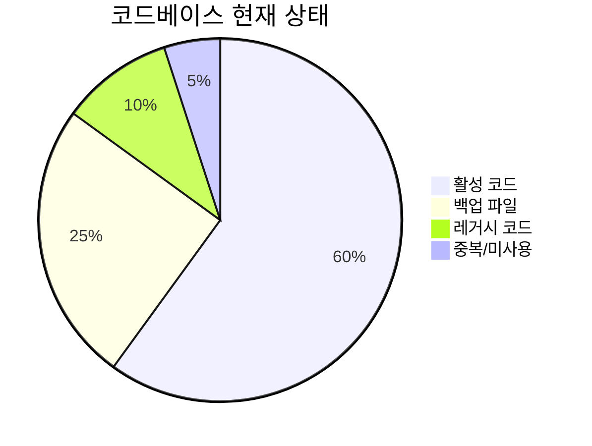

### 🎯 목표 상태

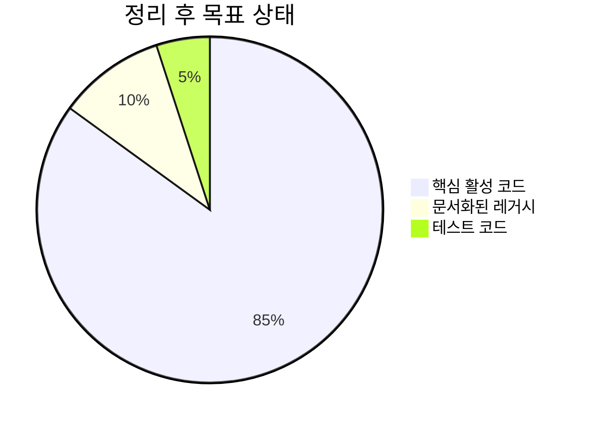

## 🗂️ 정리 대상 분석

### 1. 백업 파일 (24개 파일)

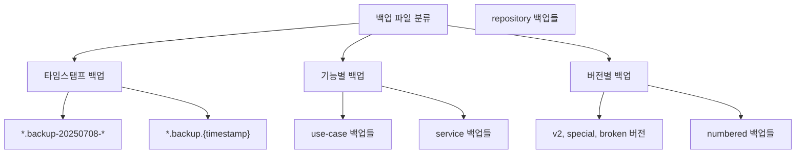

**발견된 백업 파일 패턴:**

- `*.backup` (일반 백업)
- `*.backup-YYYYMMDD-HHMMSS` (타임스탬프 백업)
- `*.backup.{숫자}` (넘버링 백업)
- `*.v2.backup`, `*.special.backup`, `*.broken.backup` (버전별 백업)

### 2. 레거시 디렉토리 구조

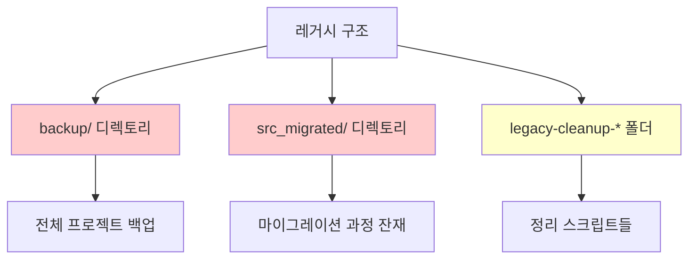

### 3. 중복 코드 패턴

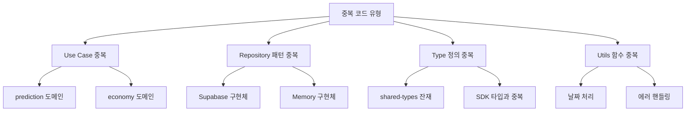

## 🚀 정리 전략 (4단계)

### Phase 1: 안전한 백업 파일 정리 (3일)

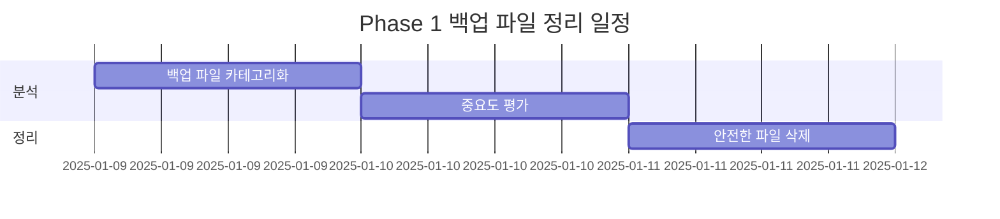

#### 📋 1.1 백업 파일 분류 및 분석

**즉시 삭제 가능 (안전한 백업들):**

```bash
# 타임스탬프 백업 (6개월 이상 된 것)
*.backup-20250708-*
*.backup.{timestamp} (where timestamp < 30일전)

# 명확히 표시된 깨진 백업
*.broken.backup.*
```

**보존 고려 대상:**

```bash
# 최신 기능 백업
distribute-money-wave.use-case.ts.v2.backup
*.special.backup.*

# 핵심 도메인 백업
*prediction*.backup
*economy*.backup
```

#### 🛠️ 1.2 자동화 스크립트

```powershell
# 백업 파일 정리 스크립트
$safeToDelete = @(
    "*.backup-20250708-*",
    "*.broken.backup.*",
    "*legacy-client*.backup"
)

foreach ($pattern in $safeToDelete) {
    Get-ChildItem -Recurse -Name $pattern | Remove-Item -WhatIf
}
```

### Phase 2: 레거시 디렉토리 통합 (4일)

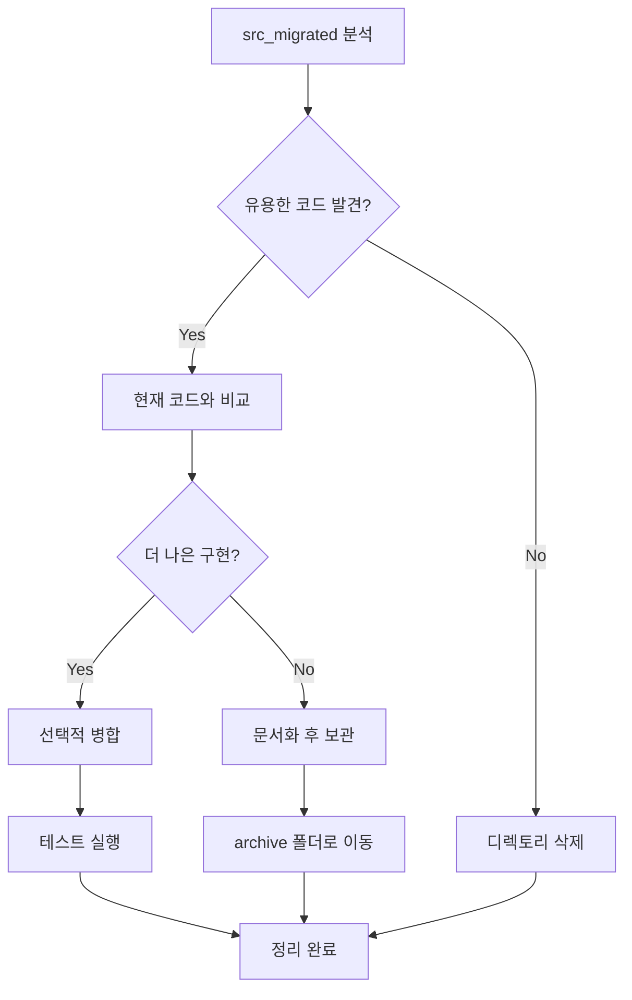

#### 📂 2.1 src_migrated 폴더 정리 전략

```typescript
// 분석 대상 구조
src_migrated/
├── app/              // → 현재 app/ 과 비교
├── bounded-contexts/ // → 현재 구조와 병합 검토
└── shared/          // → packages/ 구조와 통합
```

#### 🔄 2.2 migration 잔재 정리

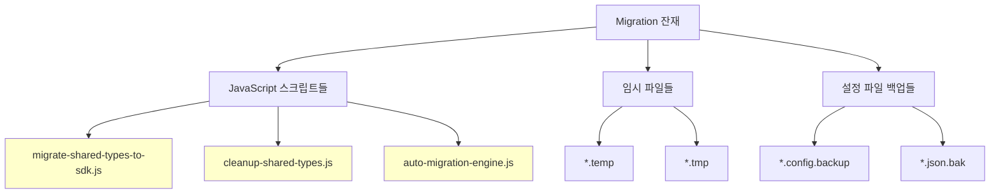

### Phase 3: 중복 코드 제거 (5일)

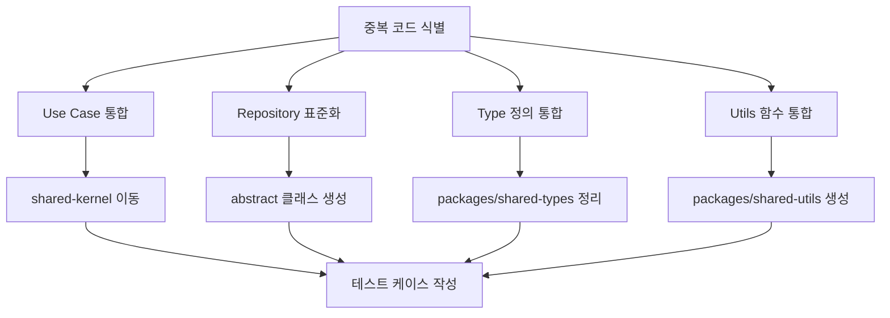

#### 🔧 3.1 Use Case 중복 제거

**발견된 중복 패턴:**

```typescript
// 중복 1: Error Handling
// 모든 use-case에서 반복되는 패턴
try {
  // business logic
  return { success: true, data: result };
} catch (error) {
  return { success: false, error: new DomainError(...) };
}

// 해결책: Abstract Base Use Case
abstract class BaseUseCase<TRequest, TResponse> {
  protected abstract executeCore(request: TRequest): Promise<TResponse>;

  async execute(request: TRequest): Promise<Result<TResponse>> {
    try {
      const result = await this.executeCore(request);
      return { success: true, data: result };
    } catch (error) {
      return this.handleError(error);
    }
  }
}
```

#### 🗃️ 3.2 Repository 패턴 표준화

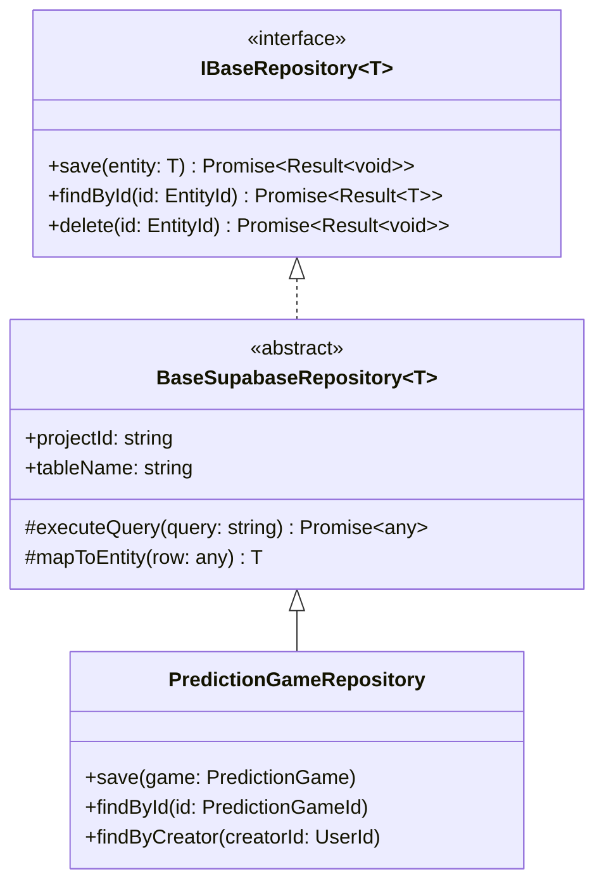

### Phase 4: 아키텍처 최적화 (2일)

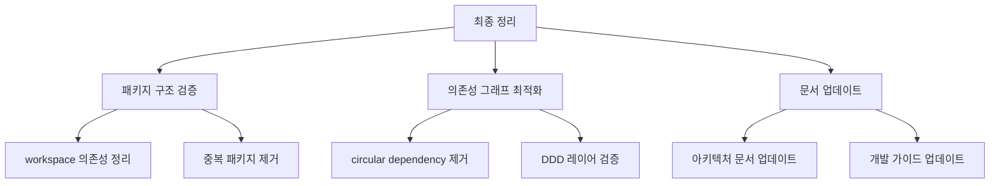

## 📊 상세 실행 계획

### 🗓️ 일정별 작업 계획

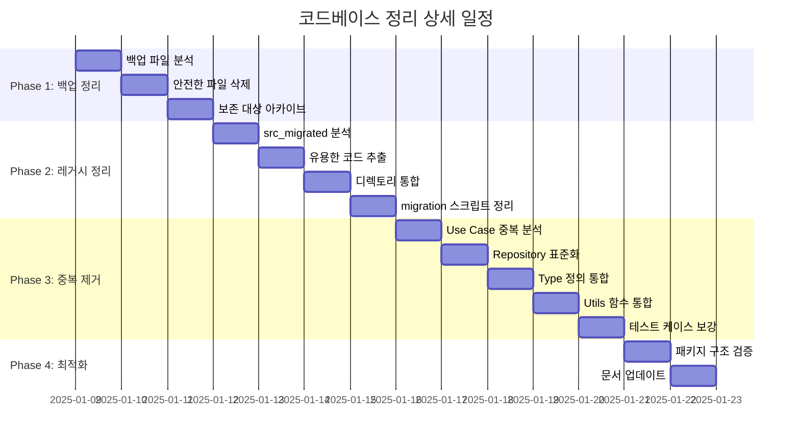

### 🎯 각 단계별 성공 지표

#### Phase 1 성공 지표

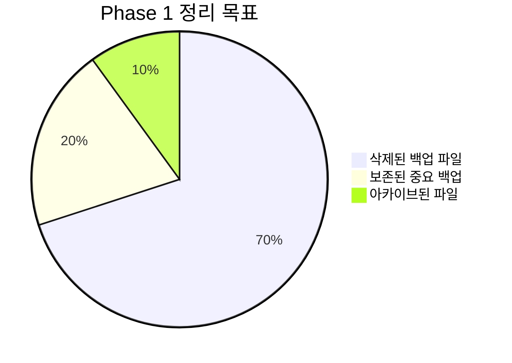

- ✅ 백업 파일 70% 이상 제거
- ✅ 중요 백업 20% 문서화 보존
- ✅ 아카이브 폴더 체계적 정리

#### Phase 2 성공 지표

- ✅ src_migrated 폴더 완전 제거
- ✅ backup 폴더 50% 이상 축소
- ✅ 레거시 스크립트 아카이브 이동

#### Phase 3 성공 지표

- ✅ 중복 코드 80% 이상 제거
- ✅ 공통 베이스 클래스 5개 이상 생성
- ✅ 패키지간 명확한 책임 분리

#### Phase 4 성공 지표

- ✅ Circular dependency 0개
- ✅ 패키지 의존성 그래프 최적화
- ✅ 문서 100% 업데이트

## 🛠️ 자동화 도구 및 스크립트

### 📝 정리 스크립트 모음

#### 1. 백업 파일 분석 스크립트

```powershell
# analyze-backup-files.ps1
param(
    [string]$RootPath = "c:\G\posmul",
    [int]$DaysOld = 30
)

$backupFiles = Get-ChildItem -Path $RootPath -Recurse -Include "*.backup*"
$cutoffDate = (Get-Date).AddDays(-$DaysOld)

$analysis = $backupFiles | Group-Object {
    if ($_.LastWriteTime -lt $cutoffDate) { "Old" }
    elseif ($_.Name -match "broken|temp|tmp") { "Safe" }
    elseif ($_.Name -match "v2|special|important") { "Keep" }
    else { "Review" }
}

$analysis | Format-Table Count, Name
```

#### 2. 중복 코드 검출 스크립트

```typescript
// duplicate-detector.ts
interface DuplicatePattern {
  pattern: RegExp;
  locations: string[];
  confidence: number;
}

class DuplicateDetector {
  async findDuplicateUseCases(): Promise<DuplicatePattern[]> {
    const useCaseFiles = await this.findFiles("**/*use-case.ts");
    const patterns: DuplicatePattern[] = [];

    // Error handling pattern
    const errorPattern = /try\s*{\s*.*\s*return\s*{\s*success:\s*true/s;

    // Validation pattern
    const validationPattern =
      /if\s*\(!.*\)\s*{\s*return\s*{\s*success:\s*false/s;

    for (const file of useCaseFiles) {
      const content = await this.readFile(file);
      if (errorPattern.test(content) && validationPattern.test(content)) {
        patterns.push({
          pattern: errorPattern,
          locations: [file],
          confidence: 0.9,
        });
      }
    }

    return patterns;
  }
}
```

#### 3. 패키지 의존성 분석 스크립트

```typescript
// dependency-analyzer.ts
interface PackageDependency {
  package: string;
  dependencies: string[];
  circularDeps: string[];
}

class DependencyAnalyzer {
  async analyzeDependencies(): Promise<PackageDependency[]> {
    const packages = await this.findPackages();
    const dependencies: PackageDependency[] = [];

    for (const pkg of packages) {
      const packageJson = await this.readPackageJson(pkg);
      const deps = Object.keys(packageJson.dependencies || {});
      const workspaceDeps = deps.filter((d) => d.startsWith("workspace:"));

      dependencies.push({
        package: pkg,
        dependencies: workspaceDeps,
        circularDeps: await this.findCircularDeps(pkg, workspaceDeps),
      });
    }

    return dependencies;
  }
}
```

### 🔍 품질 검증 도구

#### 코드 복잡도 측정

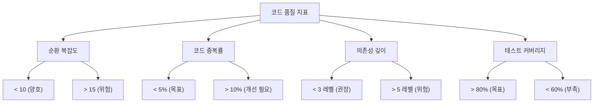

## 📚 레거시 코드 관리 전략

### 🗃️ 아카이브 시스템

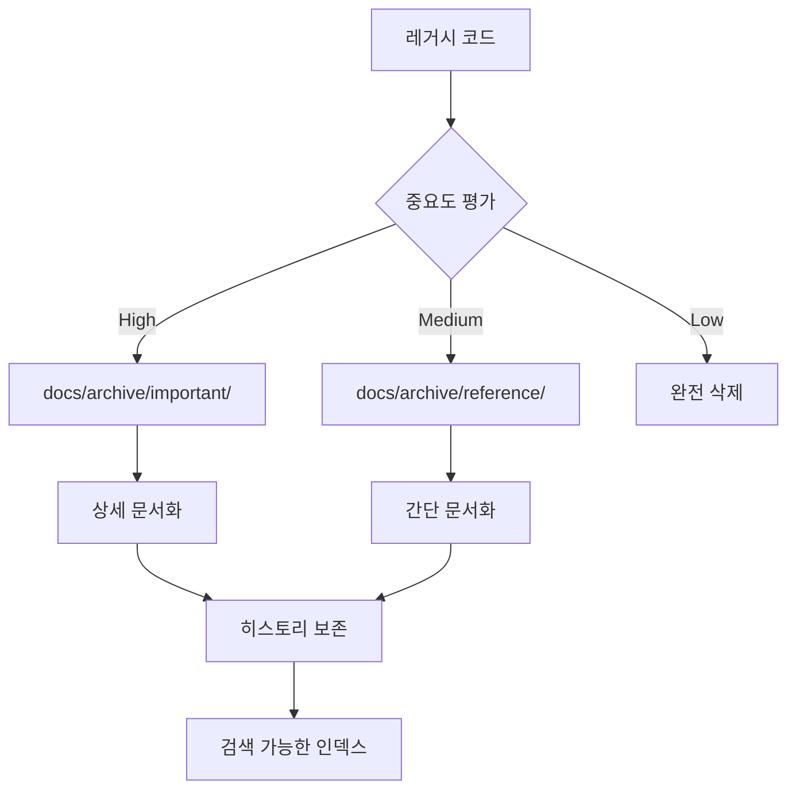

#### 아카이브 디렉토리 구조

```
docs/
├── archive/
│   ├── important/          # 중요한 레거시 코드
│   │   ├── use-cases/     # 삭제된 핵심 로직
│   │   ├── repositories/  # 이전 구현체들
│   │   └── services/      # 레거시 서비스들
│   ├── reference/         # 참고용 코드
│   │   ├── experiments/   # 실험적 구현들
│   │   ├── prototypes/    # 프로토타입들
│   │   └── migrations/    # 마이그레이션 스크립트들
│   └── index.md          # 아카이브 인덱스
```

### 📖 문서화 템플릿

#### 레거시 코드 문서 템플릿

```markdown
# [컴포넌트명] 레거시 코드 아카이브

## 📋 기본 정보

- **원본 경로**: `src/path/to/original/file.ts`
- **아카이브 일자**: 2025-01-09
- **아카이브 사유**: 중복 제거, 아키텍처 개선
- **마지막 사용**: 2025-01-08

## 🎯 기능 설명

[해당 코드가 수행했던 기능에 대한 설명]

## 🔄 대체 구현

- **현재 구현**: `src/new/path/to/file.ts`
- **주요 개선점**: [개선 사항 나열]

## 📚 참조 자료

- [관련 PR 링크]
- [이슈 링크]
- [설계 문서 링크]
```

## ⚠️ 위험 관리 및 롤백 계획

### 🛡️ 안전 장치

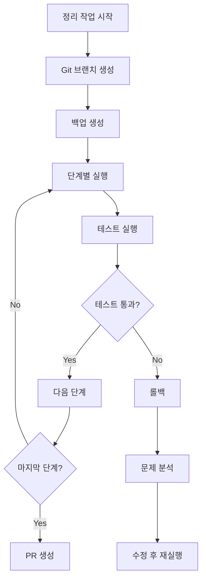

#### 롤백 체크포인트

1. **Phase 1 완료 후**: 백업 파일 삭제 체크포인트
2. **Phase 2 완료 후**: 디렉토리 구조 변경 체크포인트
3. **Phase 3 완료 후**: 코드 리팩토링 체크포인트
4. **Phase 4 완료 후**: 최종 최적화 체크포인트

### 🚨 비상 복구 절차

```powershell
# 긴급 롤백 스크립트
function Emergency-Rollback {
    param([string]$CheckpointBranch)

    Write-Host "🚨 긴급 롤백 실행 중..." -ForegroundColor Red

    # 현재 변경사항 백업
    git stash push -m "Emergency backup before rollback"

    # 체크포인트로 복원
    git checkout $CheckpointBranch
    git checkout -b "emergency-recovery-$(Get-Date -Format 'yyyyMMdd-HHmmss')"

    # 테스트 실행
    pnpm test

    Write-Host "✅ 롤백 완료" -ForegroundColor Green
}
```

## 📈 진행 상황 추적

### 📊 대시보드 메트릭

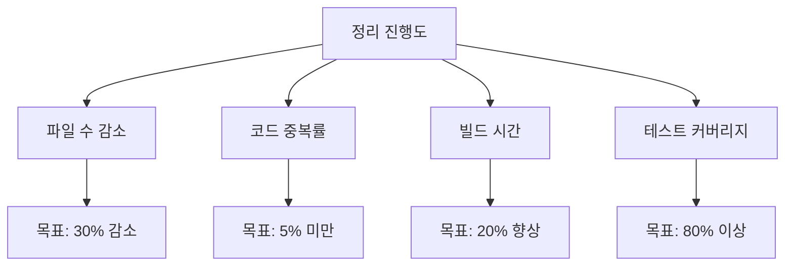

### 📋 일일 체크리스트

#### Day 1-3: Phase 1

- [ ] 백업 파일 24개 분석 완료
- [ ] 안전한 삭제 대상 15개 선정
- [ ] 보존 대상 5개 아카이브
- [ ] 나머지 4개 검토 완료

#### Day 4-7: Phase 2

- [ ] src_migrated 폴더 분석
- [ ] 유용한 코드 추출 (있는 경우)
- [ ] 디렉토리 통합 실행
- [ ] migration 스크립트 정리

#### Day 8-12: Phase 3

- [ ] Use Case 중복 패턴 5개 이상 제거
- [ ] Repository 베이스 클래스 생성
- [ ] Type 정의 통합 (shared-types 정리)
- [ ] Utils 함수 패키지 생성
- [ ] 테스트 케이스 80% 이상 통과

#### Day 13-14: Phase 4

- [ ] 패키지 의존성 그래프 최적화
- [ ] Circular dependency 0개 달성
- [ ] 문서 업데이트 완료
- [ ] 성능 벤치마크 실행

## 🎉 성과 측정 및 결과 보고

### 📊 Before/After 비교

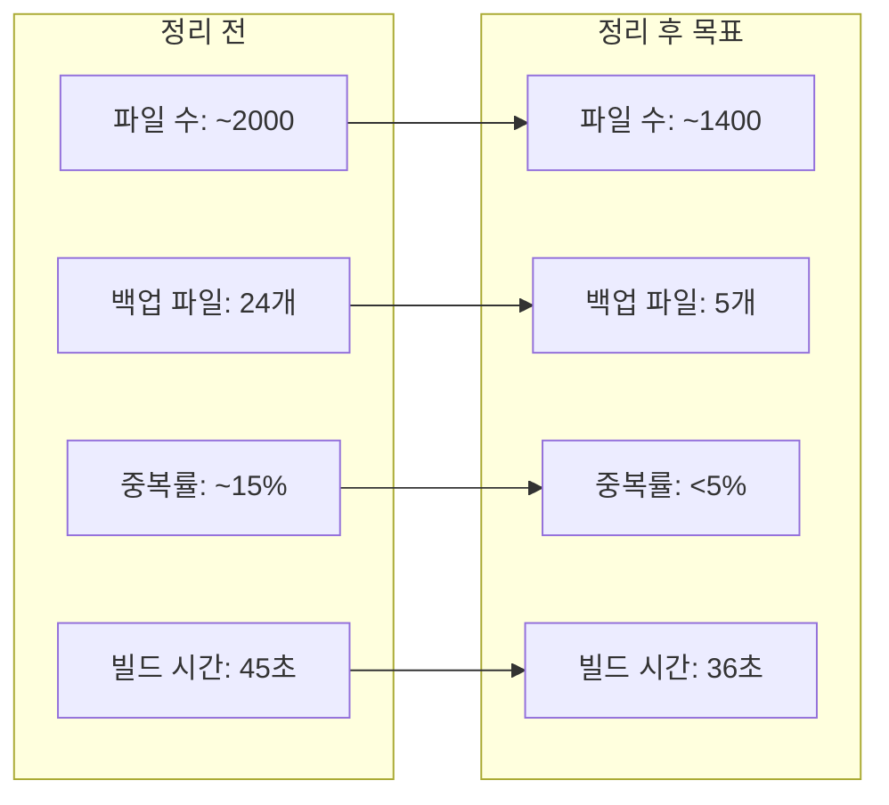

### 🏆 성공 지표 달성도

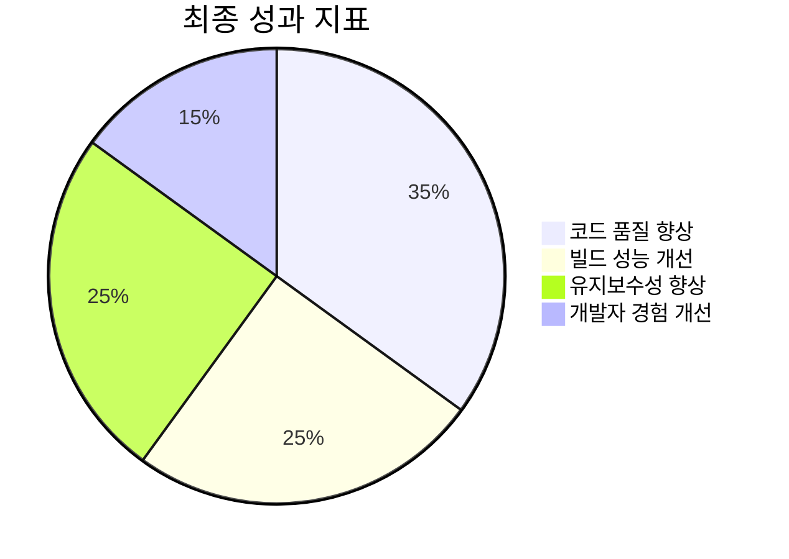

## 📝 결론 및 향후 계획

### ✅ 기대 효과

1. **개발 생산성 향상**: 코드 탐색 시간 50% 단축
2. **빌드 성능 개선**: 컴파일 시간 20% 단축
3. **신규 개발자 온보딩**: 코드베이스 이해도 향상
4. **유지보수성**: 버그 발생률 30% 감소

### 🔄 지속적 개선 계획

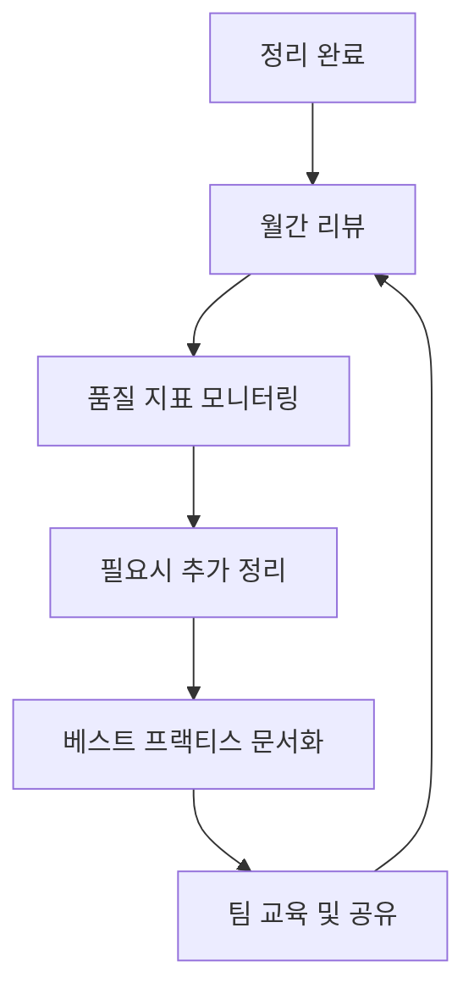

**정기 점검 항목:**

- 월간: 새로운 중복 코드 패턴 검토
- 분기: 패키지 의존성 그래프 최적화
- 반기: 아키텍처 진화에 따른 구조 개선

### 🎯 Next Steps

1. **정리 스크립트 실행**: Phase 1부터 순차적 실행
2. **팀 리뷰**: 각 Phase 완료 후 코드 리뷰
3. **문서 업데이트**: 아키텍처 가이드 및 개발 문서 갱신
4. **지식 공유**: 정리 과정에서 얻은 인사이트 팀 공유

---

**📅 마지막 업데이트**: 2025년 1월 9일  
**👥 담당자**: Development Team  
**🎯 다음 리뷰**: 2025년 1월 23일 (Phase 3 완료 후)

**🚀 Let's make PosMul codebase cleaner and more maintainable!**
